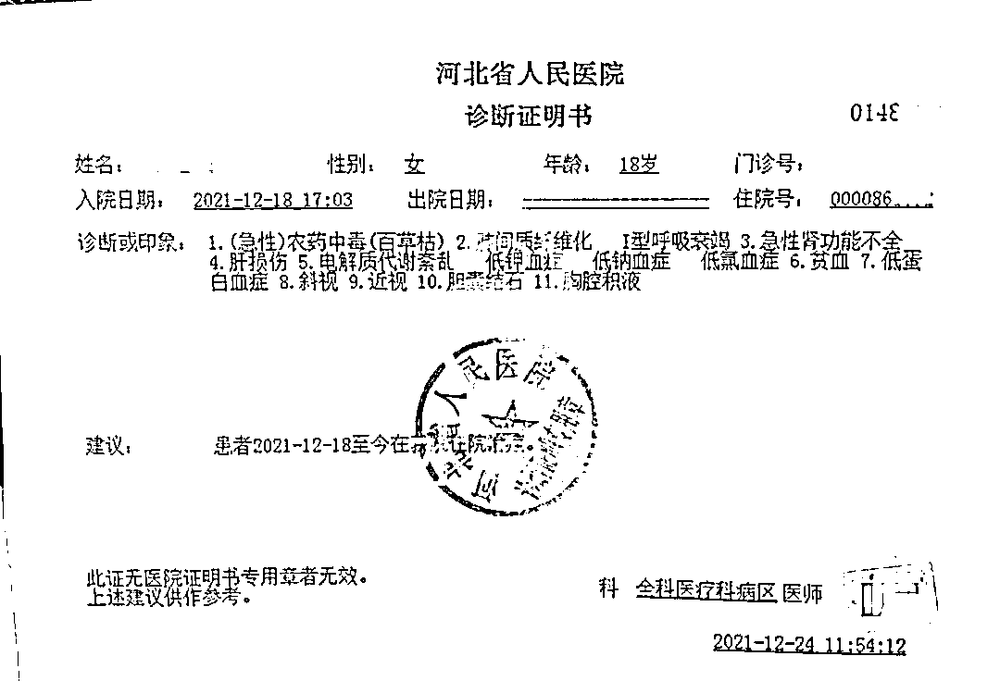
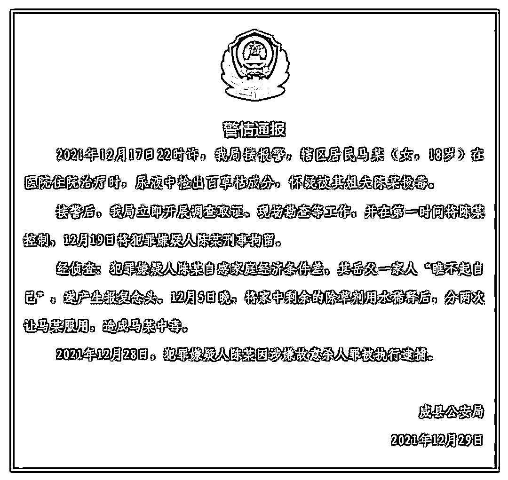
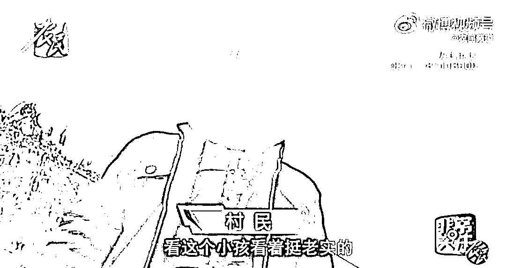
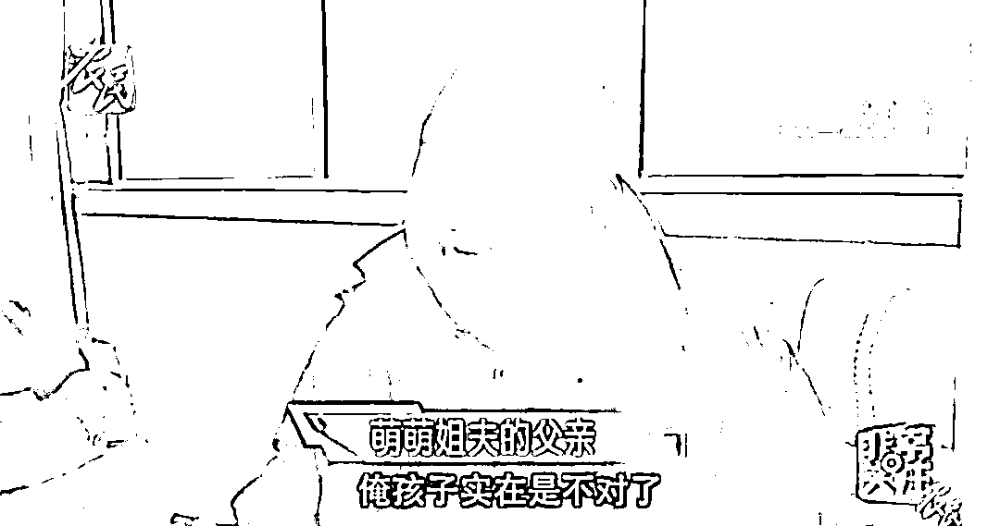
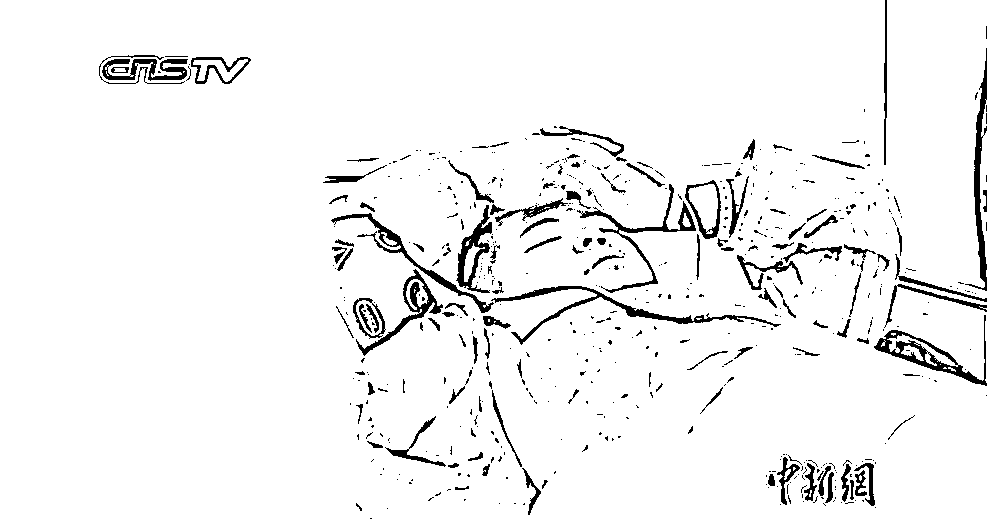
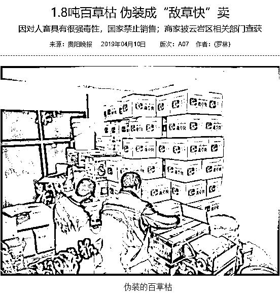
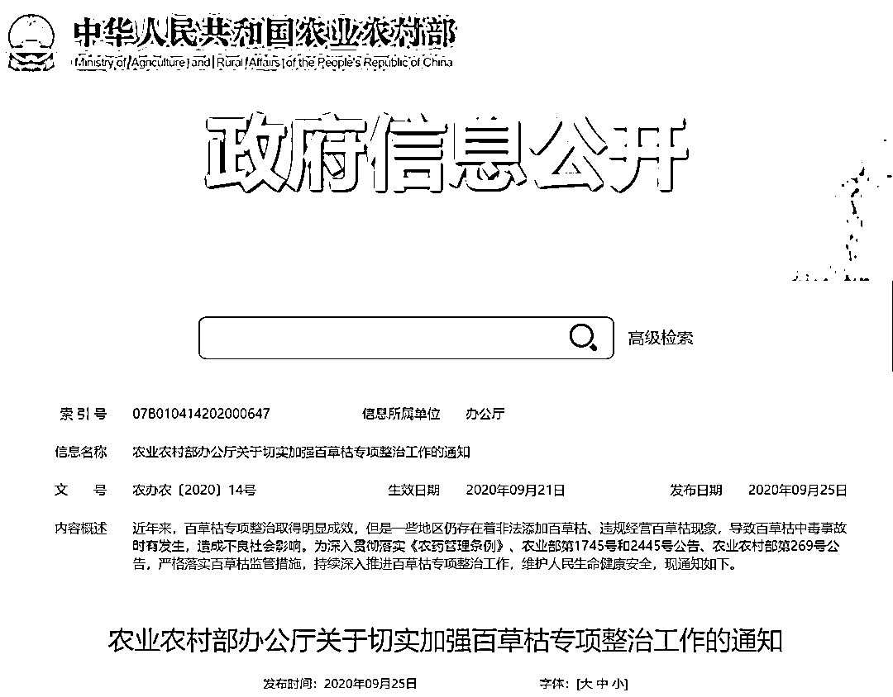

# 被姐夫投毒百草枯女孩病情恶化，肺移植要 100 万！

> 原文：[`mp.weixin.qq.com/s?__biz=MzIyMDYwMTk0Mw==&mid=2247527108&idx=4&sn=27e5ebe5c739568e1969c336c3c99b71&chksm=97cba1fca0bc28ea3fc9d51b23f0840d956fa482e054f30b32ef3d4404eeb6684fdf3dd2a1c9&scene=27#wechat_redirect`](http://mp.weixin.qq.com/s?__biz=MzIyMDYwMTk0Mw==&mid=2247527108&idx=4&sn=27e5ebe5c739568e1969c336c3c99b71&chksm=97cba1fca0bc28ea3fc9d51b23f0840d956fa482e054f30b32ef3d4404eeb6684fdf3dd2a1c9&scene=27#wechat_redirect)

图源：女孩父亲马东涛

目前，萌萌病情严重恶化需要进行肺移植手术，家人说，“无论怎样，家人都不会放弃孩子。”

近日，河北邢台威县 18 岁女孩萌萌被姐夫投毒百草枯事件，引发网友关注。 

百草枯最早是在实验室中作为一种氧化化学反应的指示剂，一次口服 5～15 毫升就足以致死。

据河北电视台农民频道消息，萌萌在先后喝下自己姐夫递上的两杯感冒药之后，出现严重中毒症状。事后，这两杯所谓的感冒药，被警方确认是经过稀释的剧毒农药百草枯。

诊断书。图片来源：水滴筹 

**医院诊断书显示，萌萌正面临肺间质纤维化、呼吸衰竭、急性肾功能不全、肝损伤等症状。** 

1 月 3 日下午，萌萌的妈妈用手机拍下了女儿的最新状况。视频显示，躺在病床上的萌萌十分消瘦，脸色苍白，鼻腔内插着氧气管，靠氧气艰难地维持着呼吸。妈妈问她情况好些没有，她无法言语，只能以摇头示意。**“难受。”这是在近 3 分钟的时间里，萌萌艰难说出的仅有的两个字。**

**病情恶化需肺移植 家人正筹款**

1 月 3 日，萌萌婶婶郭女士称，目前萌萌病情严重恶化需要进行肺移植手术，治疗费用巨大，家人正在想办法筹款，**“无论怎样，家人都不会放弃孩子。”**

萌萌的父亲马东涛表示，萌萌肺移植费用需 100 万元。家里已经用尽了全力，现在只能在水滴筹上向网友发出善心筹款，希望大家能救救孩子。“需要的钱太多了，家里能借的都借了，看着孩子躺在那里，咱心疼孩子，可真的没地方弄那么多钱了。”他哭着说。

[`v.qq.com/iframe/preview.html?width=500&height=375&auto=0&vid=r3316rpb6wl`](https://v.qq.com/iframe/preview.html?width=500&height=375&auto=0&vid=r3316rpb6wl)

视频来源：极目新闻

****警方通报：****

****姐夫因“家人瞧不起自己”产生报复念头****

2021 年 12 月 29 日，河北邢台威县公安局发布警情通报称：2021 年 12 月 17 日 22 时许，我局接报警，辖区居民马某（女，18 岁）在医院住院治疗时，尿液中检出百草枯成分，怀疑被其姐夫陈某投毒。

12 月 19 日，警方将犯罪嫌疑人陈某刑事拘留。经侦查：**犯罪嫌疑人陈某自感家庭经济条件差，其岳父一家人“瞧不起自己”，遂产生报复念头。**12 月 5 日晚，将家中剩余的除草剂用水稀释后，分两次让马某服用，造成马某中毒。2021 年 12 月 28 日，犯罪嫌疑人陈某因涉嫌故意杀人罪被执行逮捕。

******嫌疑人父亲痛哭：他性格内向 ******

**在犯罪嫌疑人陈某所在的村子，**村民们介绍，陈某平时性格内向，发生这样的恶性事件，**大家**都非常诧异。****

****

**视频截图。来源：河北电视台农民频道** 

**在接受采访时，嫌疑人父亲痛哭，“俺孩子实在是不对了。他是个内向孩子，平时赚的钱回来都给媳妇了。有啥事跟我说，就不会发生这样的事了。社会上的好心人，救救人家萌萌吧。”**

****

**视频截图。来源：河北电视台农民频道**

******境内已禁售，百草枯从何而来？******

**近年来，百草枯中毒事件多次出现在公众视野。**

**2018 年 7 月 31 日晚，曾因一张照片走红网络的“杀鱼弟”因被父母教育后自觉委屈，一时冲动喝下百草枯。8 月 27 日，经过 28 天的治疗，他康复出院。**

****

**2019 年 4 月 10 日，贵州晚报报道，当地查获 1.8 吨百草枯，伪装成“敌草快”在售卖。**

****

**2021 年 10 月 16 日，女主播“罗小猫猫子”在直播过程中遭到网友起哄，喝下百草枯自杀，最终抢救无效身亡。**

**......**

**事实上，国家已不止一次针对“百草枯”发出禁令。**

**2017 年 6 月 29 日 ，农业部发布对十二届全国人大五次会议第 3326 号建议的答复，其中提到，不再批准百草枯产品登记。**自 2016 年 7 月 1 日起，停止百草枯水剂在国内销售和使用。****

**2020 年 9 月 25 日，农业农村部办公厅发布《关于切实加强百草枯专项整治工作的通知》。**

****

**通知规定，具有百草枯母药生产许可和仅供境外使用农药登记的百草枯母药生产企业，才能生产百草枯产品。而根据农业农村部第 269 号公告，**百草枯母药生产企业生产的百草枯产品只能用于出口，不得在境内销售。****

**在严格的管控之下，部分不良厂商仍然将百草枯水剂混入其他农药，甚至换商标、包装继续销售。**

**那么，如不慎误服农药该怎么办？**

**医生提醒：妥善保管家里的农药，不要与生活用品放在一起；不要用饮料瓶等容器盛放药物，以免误服；**一旦误服农药，要第一时间拨打急救电话，尽快就医，最晚不得超过 6 小时。一旦药物进入肠道，被吸收将带来更大的危险**；就医时，出示相关药瓶、药样，以便医生确定农药类型及成分，对症医治。**

**来源：中国新闻网（cns2012）综合农业部网站、中国新闻周刊、河北电视台农民频道、威县公安、央视网快看、极目新闻、触电新闻**

****

**← 向右滑动与灰产圈互动交流 →**

****