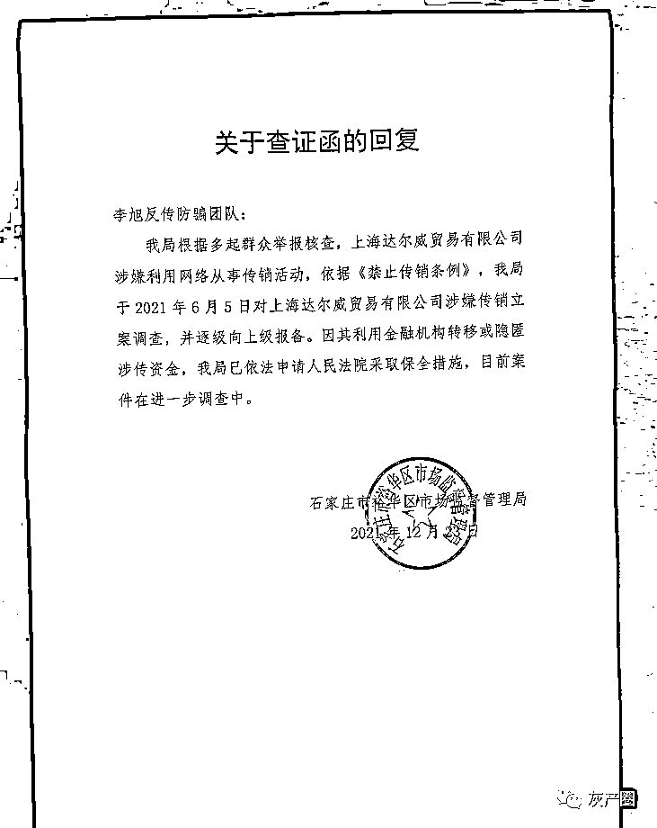
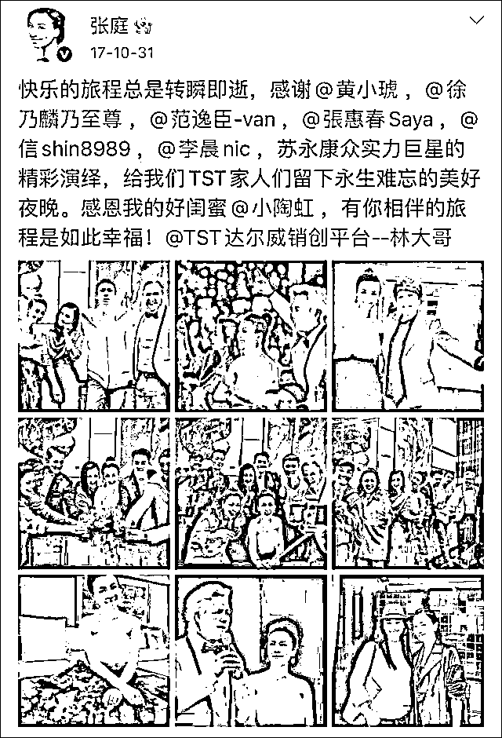
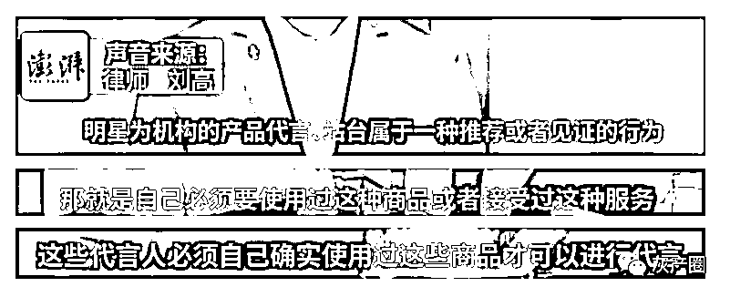
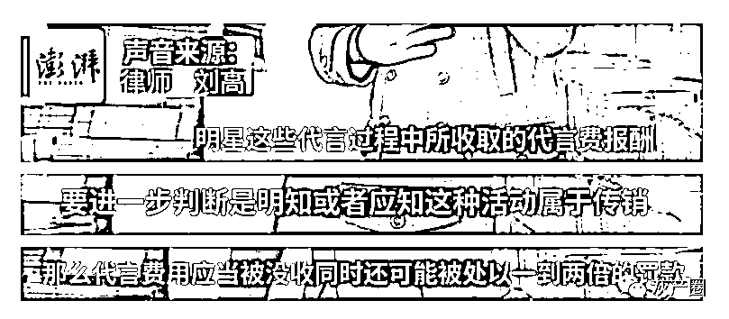

# 林志玲陶虹等曾为涉嫌传销的公司站台，律师：有人存在违法的重大嫌疑！

> 原文：[`mp.weixin.qq.com/s?__biz=MzIyMDYwMTk0Mw==&mid=2247527108&idx=5&sn=9fbbf3578ad8df9f083649bc979166a8&chksm=97cba1fca0bc28ea0be9732b5b4fa7bcde7146e0bb81a4e6ef4daf1cb7939374f001f732cf94&scene=27#wechat_redirect`](http://mp.weixin.qq.com/s?__biz=MzIyMDYwMTk0Mw==&mid=2247527108&idx=5&sn=9fbbf3578ad8df9f083649bc979166a8&chksm=97cba1fca0bc28ea0be9732b5b4fa7bcde7146e0bb81a4e6ef4daf1cb7939374f001f732cf94&scene=27#wechat_redirect)

日前，大量群众举报称

“TST 庭秘密”涉嫌传销

**裕华区市监局查证后**

**判定其母公司****上海达尔威涉嫌传销**

**该公司由张庭、林瑞阳夫妇成立**

**旗下微商品牌“TST 庭秘密”** 

**曾因烂脸、传销备受争议** 

**却始终高歌猛进** 

**此次被查后不少网友拍手叫好**

 **[`mp.weixin.qq.com/mp/readtemplate?t=pages/video_player_tmpl&action=mpvideo&auto=0&vid=wxv_2208994759120076801`](https://mp.weixin.qq.com/mp/readtemplate?t=pages/video_player_tmpl&action=mpvideo&auto=0&vid=wxv_2208994759120076801)** 

**澎湃新闻记者：闫海龙 编辑：王福艳 素材来源：相关人士 责任编辑：蒋格伟 校对：刘威**

**澎湃新闻此前报道**

**“李旭反传防骗团队”微信公号发文称**

**已接到石家庄市裕华区市监局**

**关于查证函的回复**

**回复称**

**根据多起群众举报核查**

**2021 年 6 月 5 日** 

**该局对上海达尔威涉嫌传销立案调查**

**并逐级向上级报备**

**还补充**

**因上海达尔威利用金融机构**

**转移或隐匿涉传销资金**

**该局已依法申请人民法院**

**采取保全措施**

**目前案件在进一步调查中**

**图片来源：“李旭反传防骗团队”微信公众号**

**“李旭反传防骗团队”表示**

**据前述市监局相关人员透露**

**此次被冻结的资金高达 6 亿元**

**(分两次冻结**

**主体公司 3 亿元和某代理、**

**团队长冻结 3 亿元)**

****

**记者查阅该公司官方抖音发现**

**在过去几年**

**包括陶虹、林志玲、明道、蒋依依**

**海泉、方大同、何洁等**

**在内的多个明星曾为该品牌站台**

**他们是否需要承担法律责任呢**

****

**北京京师律师事务所熊超律师表示**

**首先要明确明星在宣传过程中**

**所做出的一系列行为的性质**

**具体到本案中**

**“陶虹作为公司股东**

**身份相对特殊**

**不可能不参与经营公司日常业务**

**也不可能不向这个公司的业务**

**提供相应的便利条件**

**所以**陶虹本人存在违法的重大嫌疑**。”**

****

**律师刘高对澎湃新闻表示**

**明星如果为商品做推介** 

**必须了解所推荐商品的性能** 

**并亲自试用**

****

**并补充道** 

**若该公司涉嫌传销属实** 

**需要进一步判断站台明星**

**是否明知或者应知** 

****如果能够证明明知或应知****

****那么代言费用应被没收****

****同时可能被处以一到两倍罚款****

****

**来源：澎湃新闻******

**← 向右滑动与灰产圈互动交流 →**

****