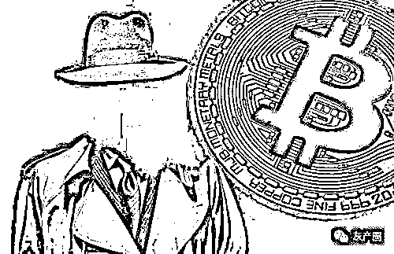
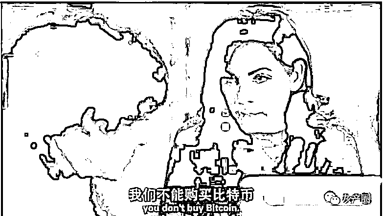
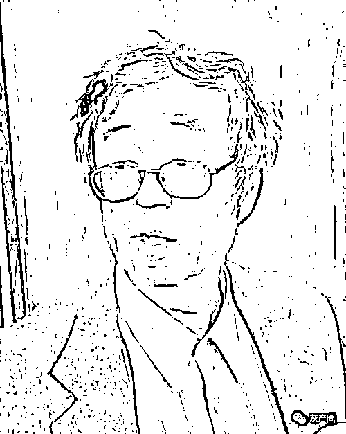
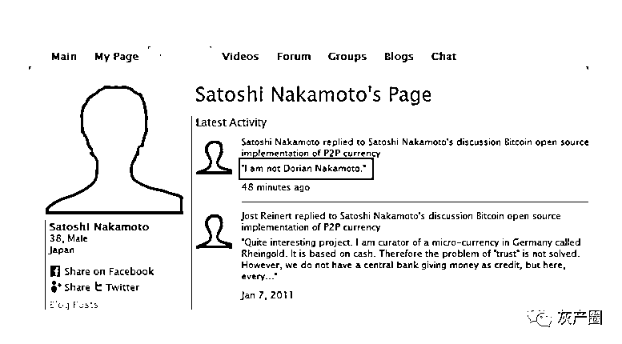
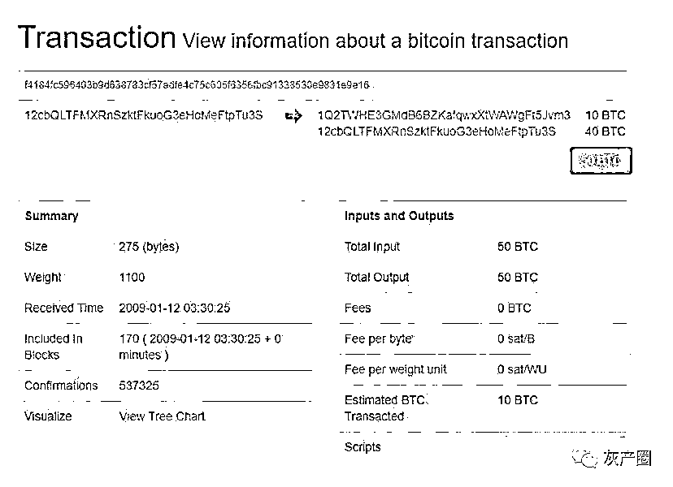
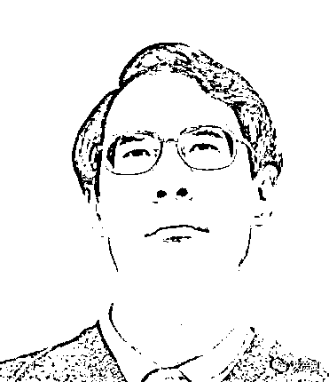
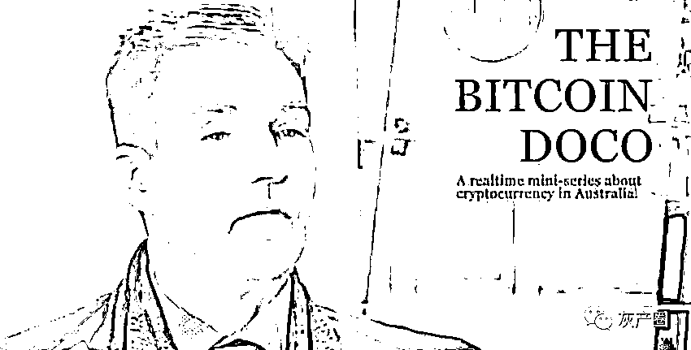
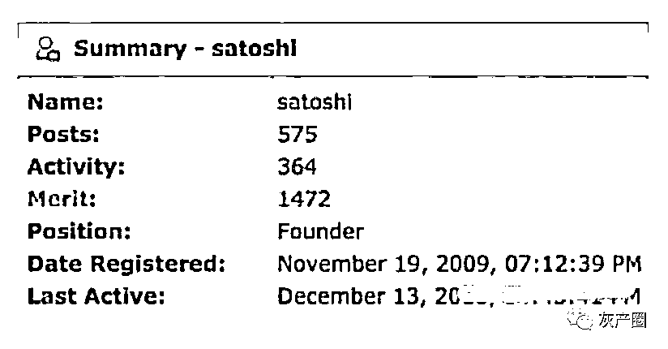

# 中本聪：我都隐退 10 年了，为什么还在找我？比特币创造者现身？

> 原文：[`mp.weixin.qq.com/s?__biz=MzIyMDYwMTk0Mw==&mid=2247527176&idx=1&sn=4fd5900fb37031ffee789930a05d5a47&chksm=97cba030a0bc29266ec786b9ab64da41cda84848218ce8483a82a928a2ca975b1e46297071fc&scene=27#wechat_redirect`](http://mp.weixin.qq.com/s?__biz=MzIyMDYwMTk0Mw==&mid=2247527176&idx=1&sn=4fd5900fb37031ffee789930a05d5a47&chksm=97cba030a0bc29266ec786b9ab64da41cda84848218ce8483a82a928a2ca975b1e46297071fc&scene=27#wechat_redirect)

该公众号已被封禁

近日马斯克爆出说有证据指向萨博就是中本聪，13 年前首次提出比特币概念背后的真实人物（化名为中本聪）是谁？马斯克试图解开这一迷团。在一个播客中，马斯克怀疑这一人物是计算机科学家尼克·萨博，他在 1998 年提出了一种去中心化的数字货币“比特黄金”(bit gold)，被广泛视为比特币的先驱。马斯克相信有证据指向萨博就是中本聪。

马斯克补充说，“萨博自称不是中本聪，但我不确定这是不是真的。但他似乎是比特币背后创意的最大推动者。”多年来，人们曾多次试图揭开中本聪的面具，萨博是十几位有可能的候选人之一。但萨博一再否认他就是“中本聪”，一些理论家坚称，“中本聪”这个假名背后隐藏的不止一个人。

正如基督教有耶稣，伊斯兰教有穆罕默德，比特币同样有一位灵魂人物——中本聪（Satoshi Nakamoto）。

2008 年 10 月 31 日，中本聪公开比特币白皮书，这篇技术性论文详细介绍了中本聪的猜想：通过利用点对点网络，创造一个无需依赖中间机构的电子交易系统。

他创建了比特币，却在比特币步入正轨后，销声匿迹。

中本聪究竟是谁？他是否尚在人间？让我们循着线索抽丝剥茧，探寻重重迷雾后的真相。

中本聪（英语：Satoshi Nakamoto），自称日裔美国人，日本媒体常译为中本哲史，此人是比特币协议及其相关软件 Bitcoin-Qt 的创造者，但真实身份未知。

中本聪于 2008 年发表了一篇名为《比特币：一种点对点式的电子现金系统》（Bitcoin: A Peer-to-Peer Electronic Cash System）的论文，描述了一种被他称为“比特币”的电子货币及其算法。2009 年，他发布了首个比特币软件，并正式启动了比特币金融系统。2010 年，他逐渐淡出并将项目移交给比特币社区的其他成员。中本聪据信持有约一百万个比特币。这些比特币在 2013 年底时的价值超过十亿美元。

从发表论文以来，中本聪的真实身份长期不为外界所知，维基解密创始人朱利安·阿桑奇（Julian Assange）宣称中本聪是一位密码朋克（Cypherpunk）。另外，有人称“中本聪是一名无政府主义者，他的初衷并不希望数字加密货币被某国政府或中央银行控制，而是希望其成为全球自由流动、不受政府监管和控制的货币。”

**线索梳理** 

想要找到中本聪，我们需要先梳理一下中本聪在网络上留下的行踪：

2008 年 11 月 1 日，中本聪在“metzdowd.com”网站的密码学邮件列表中发表了一篇论文，题为《比特币：一种点对点式的电子现金系统》。

2009 年 1 月 3 日，中本聪挖出了比特币历史上的第一个区块——即创世区块（Genesis Block），实现了比特币算法的“挖掘”并获得了第一批 50 个比特币。

2010 年 12 月 5 日，维基解密泄露美国外交电报事件闹得沸沸扬扬，为了保护尚在襁褓中的比特币，避免冲突和争议，中本聪现身反对比特币社区向维基解密捐款比特币的行为。

2010 年 12 月 12 日，中本聪在比特币论坛中发表了最后一篇文章，随后便不再公开露面，只通过电子邮件与比特币核心开发团队的少数人联系。

2011 年 4 月 26 日，在与比特币核心开发团队领导人加文·安德烈森联系过后，中本聪随即关闭了电子邮件，再也没有与任何人来往过。

从上述信息中可以看出中本聪其人十分低调，在网络上可以追溯的行踪很少，他本人与任何人交流坚持使用 PGP 加密和 Tor 网络，租借的服务器线索也是都毫无价值地指向位于芬兰赫尔辛基的一家提供匿名服务的小型主机托管商。在那个网络通讯还不是十分发达的年代，这些谨慎缜密的做法让中本聪成功躲过了当局的追查。

无数人开始踏上找寻中本聪的征途，但大多铩羽而归。中本聪到底是谁？

没有中本聪主导的比特币，已经运行多年，这是不是意味着：比特币不需要中本聪？区块链项目也不需要领袖人物？但如果这样，中本聪凭什么让我们找了 7 年？

**1、给中本聪画像**

一直以来，比特币追随者们对中本聪的了解，仅限于他活跃过的密码朋克和密码学邮件组里留下的痕迹。根据这近 600 条记录，人们给这位创造者打上了“神秘、自由和极客”的标签。

2011 年 4 月 23 日，中本聪给一位开发者发送了最后一封邮件，留下这样一句话：“我开始干别的事了，Gavin 与其他人会很好的接手比特币项目”，从此，销声匿迹。

而这个时候，比特币已经开始从极客圈子向外传播，此前两个月，比特币价格刚刚在 Mt. Gox 突破 1 美元大关。

随着比特币价格推高，人们越来越渴望知道中本聪是谁，是谁缔造了比特币，是谁提出了这个伟大的理念，又是谁手中掌握着数百万枚比特币（根据中本聪早期开采数据，有人推算中本聪拥有 110 万枚左右的比特币）？

为了找到中本聪，人们开始寻找 600 条记录中留下的痕迹，并对他进行画像。

不过，令人苦恼的是，由于信息的缺失，我们无法确定中本聪的精确信息，实际上，就连“ta”是男是女，是不是一个团队都难以确定。

曾启发徐明星进入加密货币创业的美剧——傲骨贤妻（The Good Wife）第三季——曾提及中本聪是一个三人的团队，其中一人还是中国人，编剧持有该观点的理由是：中本聪论文中首篇引述论文，正是中国人 Wei Dai 关于电子货币方案的论文。

傲骨贤妻中的比特币片段

这当然有些夸张了，人们更确信，中本聪是一位日本人，因为从名字来看，非常相像。

人们不知道他为什么要起这样一个名字。日文里 SatoshiNakamoto，“中”（Naka）表示“中间、内部、介于”，“本”（Moto）表示“本原、基础”，“聪”（Satoshi）则表示“头脑清晰、聪明、智慧”，这刚好可以描述这位“发明了一种智慧的算法，进而引领一场运动的奠基人”。

另外，中本聪也在论坛帖子中，自称是一位“居住在日本的 43 岁男性”。也许因为这个原因，日本后来形成了比其他国家、地区更加活跃的加密货币文化。

能证明中本聪是日本人的，除了名字的发音，还有其他的细节。比如，2008 年 8 月 18 日，中本聪注册了网站 bitcoin.org，最开始使用的注册服务商位于日本，并且服务器搭建在日本的 ISP 上，直到 2011 年 5 月 8 日，域名才开始转移到芬兰。

不过，他是日本人的说法也没有太大说服力，因为在所有留言中，中本聪从没有使用过日语，反而熟练采用了英文。尤其在 bitcointalk 的发言中，出现了很多英式英文，比如 bloody hard、analyse、colour 等等。

而根据“中本聪”这个名字，人们也大开脑洞。

有人发现，Satoshi Nakamoto 刚好是三星（Samsung）、东芝（Toshiba）、中道（Nakamichi）、摩托罗拉（Motorola）四家公司前几位字母的“缩写”，这是不是意味着中本聪其实是某个利益集团组建的团队？

除了名字留下的痕迹，还有另外一系列信息，那便是中本聪在所有论坛上留下的身份信息。

有人根据他在 P2PFOUNDATIONl 论坛注册信息里留下的生日信息 1975 年 4 月 5 日，浮想联翩：1933 年 4 月 5 日，美国总统富兰克林·罗斯福签署了政府法令 6102，法令规定公民持有黄金非法，该举措推高了黄金的价格；1975 年，美国总统福特再次签署法令，规定公民持有黄金合法。

大家认为，这两个时间点的组合，巧妙表达了中本聪对政治的隐喻，尤其是对当时金融状况的嘲讽，这一点可以从中本聪在创世区块中留下的数字签名得以佐证。

除此之外，有人针对中本聪所有发言，进行了数据分析，发现其活跃的时间，正好落在美国时间晚上 9 点~23 点，刚好落在使用网络的区间。因此，有人认为，中本聪是一个“披着日本外套，居住在美国的英国人”。

猜测中本聪匿名的原因也不少。

首先，在密码朋克和密码学邮件组的人，大家普遍采用匿名方式交流；加上中本聪发布白皮书前，电子黄金（e-Gold）创始人被指控洗钱，并最终认罪。除此之外，当时关于数字货币的相关一些技术，还受专利保护，为避免侵权，采用匿名也许更加方便。

虽然对中本聪的真实身份猜测不一，但有一点可以肯定：中本聪是一个挑战传统与权威的天才、斗士。

**2、真假中本聪**

关于谁是真正中本聪的讨论一直没有停歇。

2015 年，加州大学教授 Bhagwan Chowdhry 撰文表示，已经提名中本聪为 2016 年诺贝尔奖经济学奖候选人，他认为，中本聪是对经济体系造成巨大颠覆式的影响的人，“他不仅彻底改变了我们对金钱的思考方式，也很可能会颠覆央行在货币政策方面扮演的角色”。

这也是人们寻找中本聪的原因之一，既然中本聪能创造比特币，是不是也可以改变当前惨淡的金融市场呢？

强烈的期望“创造”了众多中本聪。

多利安·中本聪（Dorian Nakamoto)

2014 年，《新闻周刊》记者莉亚·古德曼声称，他找到了中本聪。这位名为多利安·中本聪的男子，是一个 65 岁的日裔美国人，毕业于加州州立理工大学，拥有物理学士学位，当时住在洛杉矶圣贝纳蒂诺山脚下。

该记者了解到，多利安·中本聪原名中本聪，他是在 1973 年的时候，将名字改为了多利安·普伦蒂斯·中本聪(Dorian Prentice Satoshi Nakamoto)，之后不再使用原名。另外，他使用多利安·S·中本聪作为签名。

这也是后来大众印象中，中本聪最有可能的样子。

多利安·中本聪

隐身三年后，中本聪现身 p2pfoundation，他回应称：“I am not Dorian Nakamoto”。

中本聪在 p2pfoundation 回应身份一事

另外，多利安·中本聪否认自己是比特币发明人，他是在儿子那里才听说了比特币这个词，虽然曾在防务承包商公司工作过，但他跟比特币没啥关系。

哈尔·芬尼（Hal·Finney）

在中本聪现身回复乌龙事件后，有人发现，曾参与过比特币早期筹备工作的哈尔·芬尼（Har·Finney），与这位假中本聪的家竟然只隔着几个街区。

一时间，关于哈尔·芬尼就是中本聪的传言开始流传。

哈尔·芬尼本尊与中本聪渊源颇深。2008 年年底，在中本聪提出比特币概念后，哈尔·芬尼针对某些问题提出了改进建议，中本聪也对这些问题做出了回应，在比特币开挖后，中本聪给芬尼转出了比特币有史以来的首笔转账。

比特币第一笔转账

不过，哈尔·芬尼没有确认这个猜测，他只是撰文记录了自己与中本聪、比特币的故事。2014 年 8 月，哈尔·芬尼告别人世，根据他的遗愿，家人将他的遗体送往 Alcor 生命延续基金旗下的冰冻工厂低温贮藏。

或许，等到哪天技术能治愈芬尼的疾病时，他醒来后，会告诉世人中本聪的真实身份。

尼克·萨博（Nick Szabo）

技术派不相信猜想，他们相信数据。

一位名叫杰克·格里夫（Jack Grieve）的技术派带领团队，针对中本聪的数百条留言进行了词频分析，他们发现，中本聪的留言表现出一些语言特性，比如“chain of”、“trusted third parties”；、“and”和“but”之前使用逗号，以及在冒号后面采用零散的句子等习惯，而这些习惯用法应该是中本聪长时间形成的。

因此，那些被猜测为中本聪的人，在写作时理应保留有这些特性。

通过对十三位“中本聪”进行分析，杰克·格里夫团队发现一位名叫尼克·萨博（Nick Szabo）的人，“所写的内容，与比特币原文之间的语言相似程度不可思议；另外，也没有别的可能作者，在文字上会达到更高的匹配程度，”

2013 年 12 月，博客作家 Skye Grey 通过对中本论文的计量文体学分析得出结论，认为其真实身份是前乔治华盛顿大学教授尼克·萨博。萨博热衷于去中心化货币，还发表过一篇关于“比特黄金”（bit gold）的论文，被认为是比特币的先驱。他也是一个著名的从 90 年代起就喜欢使用化名的人。

在 2011 年 5 月的一篇文章中，萨博谈起比特币创造者时表示：“在我认识的人里面，对这个想法足够感兴趣，并且能付诸实施的，本来只有我自己、戴维（Wei Dai）、哈尔·芬尼三个人，后来中本出现了（假定中本不是芬尼也不是戴维）。”

不过，也有人依据尼克·萨博的作品，否定了这个判断，比如在一篇文章中，他没有明确自己不是中本聪，反而给了读者脑补的空间，这明显不符合常理。

望月新一（Mochizuki）

在对中本聪是谁的问题上，汇聚了众多猜谜者。最早提出超文本、超媒体概念的互联网先驱 Ted Nelson 曾在 YouTube 上爆料说，他知道谁是比特币发明者，那就是解决了 ABC 猜想而名声大噪的日本数学家望月新一（Mochizuki）。

望月新一

Ted Nelson 的理由基于以下几点：首先，望月新一是京都大学数学教授，足够聪明到想出比特币的设想；另外，他学术研究时不使用传统的科学同行评审程序，相反，他的习惯是让其他数学家完成他的推理。

Ted Nelson 表示，望月新一的行为符合比特币创造者的行为，比如他在 2012 年发布“ABC 猜想”证明后，就没有再进一步讨论。“如果我是正确的，希望望月新一不要因为低调而不去获取这种荣誉。”Ted Nelson 表示。

克雷格•赖特（Craig Wright）

无数人跳出来自称比特币之父，又被无数次证明纯属恶作剧或骗局。

“我不想要钱，不想要名气，也不想要人们的崇拜，我只是不想被外界打扰。”2016 年 5 月 2 日，公开宣称自己是中本聪的克雷格•赖特（Craig Steven Wright） ，如此表示。

在其公开声明之前，曾有人匿名称克雷格•赖特就是中本聪，他们提供了多份邮件、通话信息、财务记录等等，但经过背景调查，人们推翻了这个结论。

克雷格•赖特

但是，即使声称拥有中本聪密钥的克雷格•赖特，也不能完全证明自己就是中本聪，反而将为其背书的 Gavin Andresen 拉下水。比特币社区的核心开发成员，Gavin Andresen 在克雷格•赖特身份曝光后，在自己的博客中公开宣称，他相信前者就是中本聪。

不过，这引发比特币社区的质疑，他们坚定地相信克雷格•赖特极有可能是假的，“Gavin Andresen 被盗号了”。

一方无法证明，另一方销声匿迹，中本聪身份变得更加扑朔迷离，就在大家僵持不下的时候，克雷格•赖特出来说“放弃证明自己是中本聪”，而这距离他跑出来宣称自己是中本聪，仅仅过去 5 天。

**3、比特币不需要中本聪**

尽管中本聪的身份依旧是个谜，但他在退出比特币前就已经做足了准备。

比如，为了防止中心化权力完全控制网站 bitcoin.org，中本聪选中的网站域名持有者，并非比特币最初开发者团队成员。另外，虽然整个发布权限还掌握在持有者手中，但该网站已经实现了代码开源。

如今，Bitcoin.org 发展成为一个社区项目，其开发、维护和翻译工作基本上都由志愿者完成。

另外，中本聪还召集了一批开发者和爱好者，让比特币得以继续更新、迭代。

2010 年 12 月 12 日，中本聪在 bitcointalk 上发表完最后一篇帖子，然后默默离开了。人们完全没有预料到，因为此前一天，中本聪还在就“维基解密通过比特币躲避 Visa 封杀”消息发表意见。

如果从 2008 年 10 月 31 日白皮公布算起，比特币走过了 10 年历程，而中本聪公开参与比特币工作的时间，不过 1/5，在中本聪消失后，比特币稳定运行了多年。

bitcointalk 上中本聪的活跃记录

这期间，比特币也面临挑战。2017 年，社区对“比特币不再适应发展要求”的质疑开始蔓延，经过漫长的拉锯战，2017 年 7 月 21 日，比特币隔离见证（Segwit）被锁定，紧接着，比特币被硬分叉，比特币现金（BCH）诞生。

直至如今，关于谁是“比特币正统”的争论还在进行。

没有了中本聪的比特币，依赖着社区信徒，依然马不停蹄。

目前没有一种能真正挑战比特币的王者地位，一部分原因是由于比特币的先发优势，另一部分，更是因为中本聪这位先驱者，汇聚起来的强大共识。

如今，“中本聪”给比特币带来的，更多是象征意义，但这种去领袖化的先例，以及社区化运行的样本，已经成为范本，开始在其他项目上演。

10 月 4 日，以太坊创始人 Vitalik Buterin 在推特上表示，“以太坊已经不怎么需要我参与了”，就算没有我，以太坊网络也“绝对会存活下去”。

10 月 11 日，莱特币创始人李启威宣布，在（未来）某一时刻，他将不得不退出，并允许莱特币变得更加多中心化。

也许，在区块链世界里，比特币不需要中本聪，“We are all Satoshi（人人都是中本聪）。”

来源：互联网行业前沿资讯

← 向右滑动与灰产圈互动交流 →

