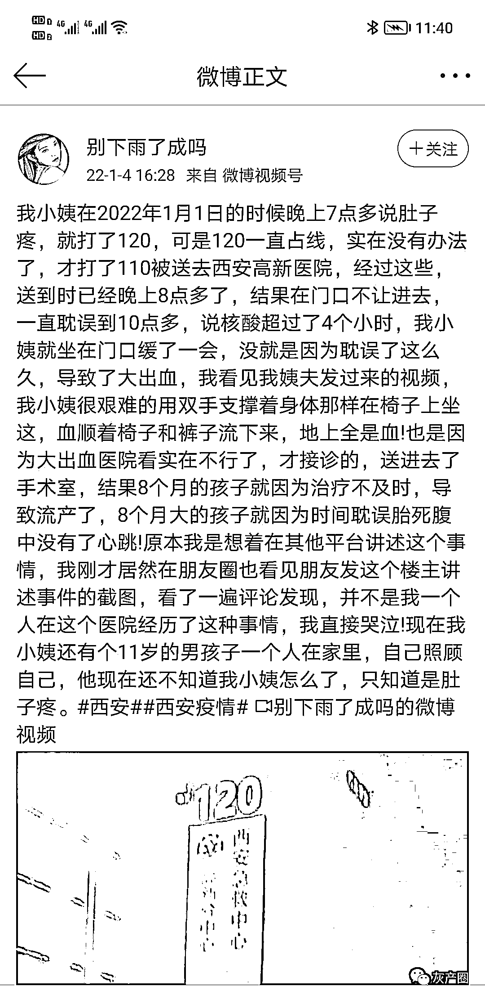
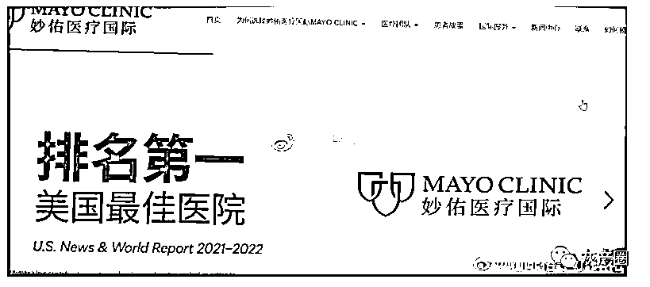
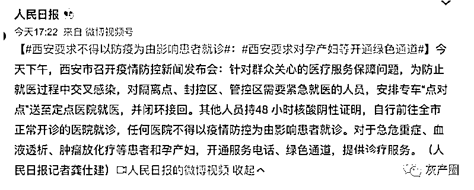
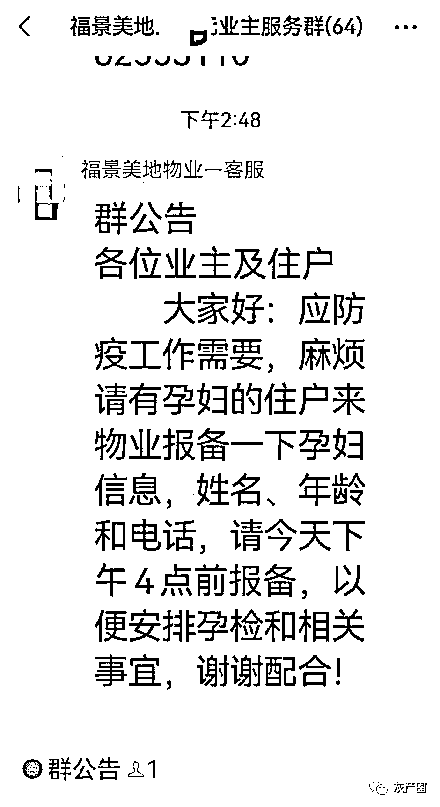

# 西安一孕妇在医院门口等 2 小时后流产引发关注，西安要求开通绿色通道

> 原文：[`mp.weixin.qq.com/s?__biz=MzIyMDYwMTk0Mw==&mid=2247527176&idx=2&sn=2d836a0376b283063f2d2e24fbe19aa5&chksm=97cba030a0bc2926b38c06decd663cddb2c38202dc6966438a8e7f13f091f1c7ae85d5031d0f&scene=27#wechat_redirect`](http://mp.weixin.qq.com/s?__biz=MzIyMDYwMTk0Mw==&mid=2247527176&idx=2&sn=2d836a0376b283063f2d2e24fbe19aa5&chksm=97cba030a0bc2926b38c06decd663cddb2c38202dc6966438a8e7f13f091f1c7ae85d5031d0f&scene=27#wechat_redirect)

1 月 4 日，陕西西安。有网友发帖称，一孕妇在 1 日晚上 8 点多在西安高新医院，由于核酸问题无法入院，在门口等待期间孕妇大出血，8 个月的婴儿流产。

[`v.qq.com/iframe/preview.html?width=500&height=375&auto=0&vid=l3316810yug`](https://v.qq.com/iframe/preview.html?width=500&height=375&auto=0&vid=l3316810yug)

对此，记者联系到西安高新医院总经理，他表示，该孕妇目前正在进行手术后的恢复。

据微博博主@上帝之鹰，疑似当事医院的医护给出了解释

1 月 5 日，西安要求对孕产妇等开通绿色通道

1 月 5 日下午，西安已经有小区开始统计孕妇信息。

写不出稿苏见祈:再次证明转发是有用的，哪怕只是惠及后来人…

冈瓦纳:自媒体也是进步的促进力量

吴铭 :前面的一些做法，如果使市民付出了生命的代价，应当严肃追责问责。

来源：围脖那些事儿

← 向右滑动与灰产圈互动交流 →

