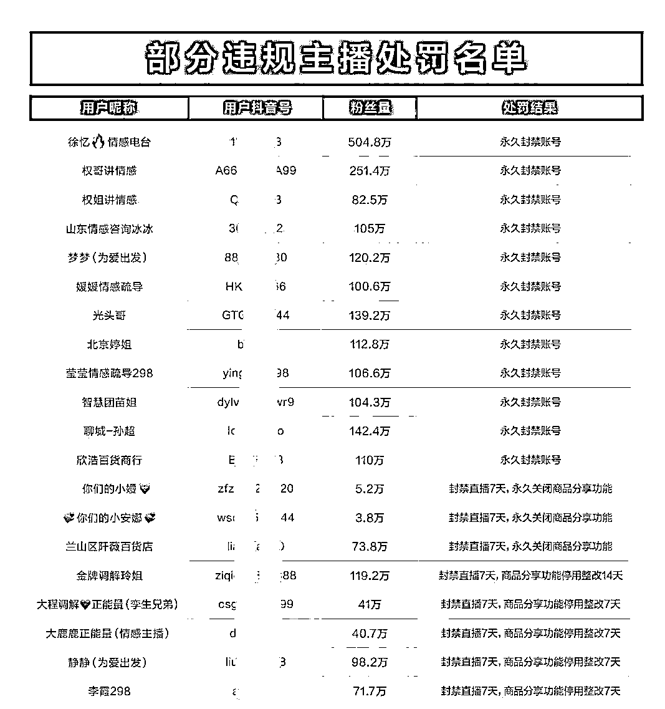

# 只要广告剧本编得好，总有傻瓜往里跳

> 原文：[`mp.weixin.qq.com/s?__biz=MzIyMDYwMTk0Mw==&mid=2247527176&idx=3&sn=07b394dedd9e67c3d015461318872db6&chksm=97cba030a0bc2926788f2fbbc6039bd870bab43c0fdfd12a478aa2b5098d243119f1b6fc94ad&scene=27#wechat_redirect`](http://mp.weixin.qq.com/s?__biz=MzIyMDYwMTk0Mw==&mid=2247527176&idx=3&sn=07b394dedd9e67c3d015461318872db6&chksm=97cba030a0bc2926788f2fbbc6039bd870bab43c0fdfd12a478aa2b5098d243119f1b6fc94ad&scene=27#wechat_redirect)

前些天，**喜茶**因为 21 年 5 月开始发布的鲜果系列广告涉嫌“利用广告对商品或服务作虚假宣传，欺骗和误导消费者”**被罚款 45 万元**。

消息一出，网友评论“虚假宣传太多了，一查一个准，给爷狠狠地查！”

翻开虚假宣传的花名册，“雪糕中的爱马仕”钟薛高曾因“不加一滴水，纯纯牛乳香”被指虚假宣传被罚；

元气森林也因为“0 蔗糖”乳品宣传误导消费者，陷入“伪健康”质疑泥淖；

潮玩行业泡泡玛特，前不久也因一款单双售价 79 元的长袜盲盒，涉嫌虚假宣传被北京市朝阳区市场监管局罚款 20 万元……

事实上，随着各行各业竞争的不断加剧，为了卖点和噱头，在比谁更“虚假”上也“卷”了起来，**虚假广告早已无处不在**。

**1**

**早年间的虚假广告耳熟能详**

少年，你有没有在电视上见过一群“神医”？

他们通常头发发白，带着专家、传承人、教授的威风噱头，滔滔不绝地在电视里讲着各种疑难杂症……

他们以自己的**专家名头“站台”，夸大药效，****用伪学术包装产品，**

**完全忽略不良反应和不适应人群**，虚假宣传保健品。

甚至连省级电视台都曾放过一位神医的广告。

她——刘洪滨，精通中外医术，得医药世家传承幸成“医学大家”，自称**大到心脑血管疾病，小到失眠祛斑**，开药妙手回春，无所不能。

三年里她以**9 个不同身份**出现在河南、西藏、青海等**多个省级电视台的养生访谈类“节目”**里，推荐了近 10 种“药品”。

但据国家中医药管理局回应，这个虚假广告的表演者，**连中医医师资格都不具备**。

直到 16 年广电发布通知严禁医疗养生类节目以介绍医疗、健康、养生知识等形式直接或间接发布广告、推销商品和服务。

2017 年，相关部门对电视上泛滥的“神医广告”进行整顿，公布了 13 个被查处的典型案例。

至此一代虚假宣传广告“神话”才逐渐在电视平台销声匿迹。

**02.**

**互联网时代激流勇进花式虚假你看不透**

时代变了，虚假广告的宣发也紧急跟上了改革的浪潮，他们从传统模式转战电商直播，在互联网新媒体中力争上游。

电商行业里的虚假广告，远比当年来得更精彩更猛烈……

比如**卖惨式直播**。

说直白点，广告宣传的本质就是为了卖货，有的主播将视频内容故意渲染悲情色彩，运用编悲惨故事的方法博取观众同情；

运用老人、残疾人等弱势群体角色，通过渲染悲惨处境引起共情，从而增加销售量；

或以原产地滞销、工厂倒闭、破产、停工等内容卖惨博取用户同情。

说个前段时间令人下头的“凉山小姑娘”事件。

图上这个红衣小女孩，视频为大家呈现的她：一身简朴着装，家住土坯房，

她泪眼婆娑地倾诉自己的身世：**父亲去世，没有见过生母，上不起学**。

然后视频拍摄者**决定资助这个女孩，并且开始直播带货卖苹果**。

啊！在这一刻，音乐煽情效果达到了满分，孩子的哭声让人揪心，主播说要资助她的话也变得如此铿锵有力令人信服。

别说了，献出爱心购买苹果的事怎么能叫买卖呢？

实际上，**视频中的内容，从头到尾没一个是真的**。

哭是假的。

身世是假的。

给小女孩资助的钱也是假的……

宝，你怎么满嘴谎话啊？到底有什么什么是真的？

有的宝贝，

**他们团队打着帮哑巴母子卖苹果的旗号，**

**从直播间里卖了十几万斤苹果，获利 29 万元。**

这是真的。

在这个金钱至上的时代里， “卖惨带货”的戏码在不少网络平台反复上演。 

从演员到剧本，从营销到推广，都充满了“套路”。

这种“卖惨带货”，打着帮助的幌子，干的却是靠消费大众的同情心谋利的事。

他们为了自己的商品在镜头下演绎了一个又一个虚假的故事，

将观众带入他们编织的名为“情绪”的陷进。

等到东窗事发后，依旧可以振振有词：**我凭本事骗的钱哪里有问题**？

**刻意演出来的“卖惨带货”，本质上就是一种欺诈**。

对于这类行为，相关平台不会坐视不管，这类欺骗事件背后的团队已经受到惩罚。

**3**

**职业造假成流水线，“为了生活嘛”**

短视频的兴起，给了虚假广告新的构思，

也给了另一群“演员”一条“生存活路”。

强仔就是顺势而为中的一份子。

“本来想去当网红，太难了……但我发现还有别的门路——**去别人的产品视频里客串**。”

“不同于影视剧精细制作，一两台普通相机，没有打光没有化妆，甚至都不需要什么表演，**只需要我们表情夸张地推荐产品就行了**。”

“也没啥情绪铺垫，慷慨激昂地喊出‘**用了这款理财 APP，财富自由不是梦**’，

或是‘**9 块钱 13 节直播课**，清北名师带队教学，……多少多少知识点什么的……现在只要点击视频下方链接就只要 29’这一类的虚假广告词。”

“起初的时候，心里还会充满愧疚，但后来拍的次数多了，好像也就无所谓了。而且，**在群里铺天盖地的短视频通告里，我实现了月均过万**。这是我从前都不敢想的。”

不过常在河边走，哪有不湿鞋。

前段时间因为猿辅导、作业帮、高途课堂、清北网校四家在线教育的广告被扒出同一个“老师”后，短视频的演员们都受到了不小的冲击。

为了避免再有这种事情发生，现在拍教育类的短视频，各家都开始要求签约；

？这个迂回的方式令人有些费解，

他们大概觉得：**只要我不被发现，那么我就是真的**！ 

不过监管的介入后，在线教育迅速萎缩，投放的广告自然也就少很多。

强仔对此表示别担心：条条大路通罗马，在互联网上，只要你想，没有不来钱的法子。

强仔还兼职做了某 Red 书上的路人测评——

**这其实和他的演员路也差不多，一个靠演一个靠吹**。 

“美妆穿搭类更受欢迎，女生最好做了。

但是很意外，我一个男的做起美妆也还算得心应手？”

“大家都觉得商家不会讲实话，但是用过这个产品的某 KOL 或是某路人小透明，他们肯定说的都是大‘实话’。”

“就是去年吧，我本想找份兼职工作，便在某聘上联系了一家公司，私下加了微信。 

刚开始说是测评一款美容仪，根据产品写个三五百字的小文案，他们承诺签合同，工资按月结付。”

后来加了群，写评测内容的时候，

群主会在群里发图片素材、小视频素材，以及产品的介绍。

我就根据产品的说明书和网上别人说过的特点来简要描述使用感受，

然后配上群主的图片素材，最后当然是极力推荐这款产品……

“**我到底用没用过吃没吃过玩没玩过，这些都不重要，重要的是我展示的这一面，这个产品是多么地吸引大众**……”

近几年，3·15 晚会针对互联网中的虚假广告问题进行过多次报道，

曝光了大量不法商家以各种方式欺骗、坑害消费者的手段。

从“套户”到流水线批发虚假广告内容再精准垂直推广。

这个大数据抓捕一切的时代里，有时会情不自禁地猜忌眼前的一切。

这些产品是真的吗？

这些令人动容的事情背后是真的吗？

互联网上的每一个人说的每一句话又是真的吗？

那些看不出来是广告的广告里，演员们拿到剧本，对着镜头捶胸顿足，热泪盈眶，他们在欺骗的狂欢中，把一出凄惨的剧目演出胜利交响乐般的快乐。

那些充满来自路人的“惊喜测评”里，字字充满天真单纯的分享欲，他们将自己的目的藏在了所谓的“空瓶推荐”、“实地打卡”里。

对于商家来说，追逐利益是本能，可企业要走的长久，岂能心中只有生意、眼里只有利益？ 

当消费者的善意被不断的消费，利用，最后变得越来越冷漠，商家们还能想出什么新招呢？

但小呸坚信：**挥霍信任、丢掉责任的企业走不远，无论是失职还是失责，都难以逃避惩处**。

← 向右滑动与灰产圈互动交流 →

# 

> 原文：[`mp.weixin.qq.com/s?__biz=MzIyMDYwMTk0Mw==&mid=2247527176&idx=4&sn=9e173044285cb650c4ac78e298fdc80a&chksm=97cba030a0bc2926d5f52d1c16e944c75eede7278e820acd16e2c27c7018813520cf5fff0112&scene=27#wechat_redirect`](http://mp.weixin.qq.com/s?__biz=MzIyMDYwMTk0Mw==&mid=2247527176&idx=4&sn=9e173044285cb650c4ac78e298fdc80a&chksm=97cba030a0bc2926d5f52d1c16e944c75eede7278e820acd16e2c27c7018813520cf5fff0112&scene=27#wechat_redirect)