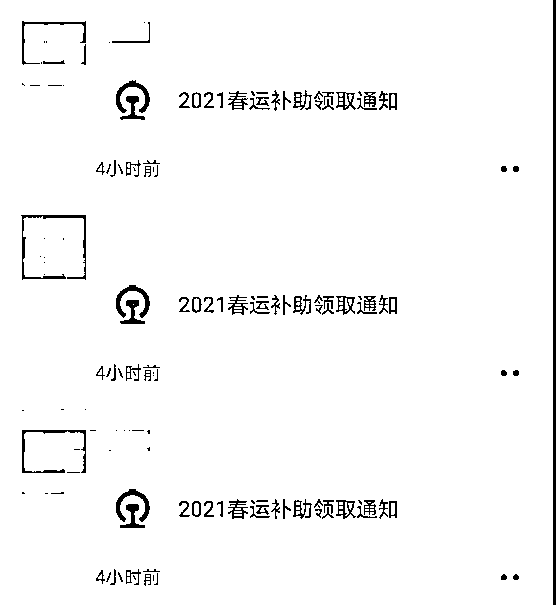
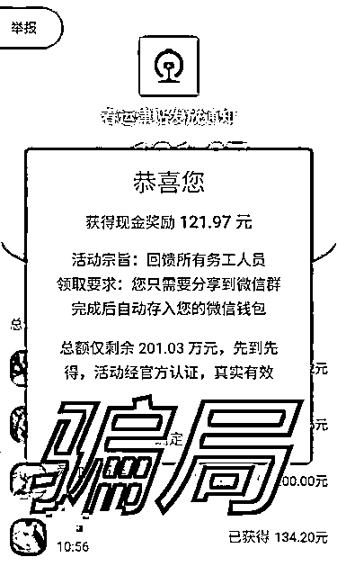
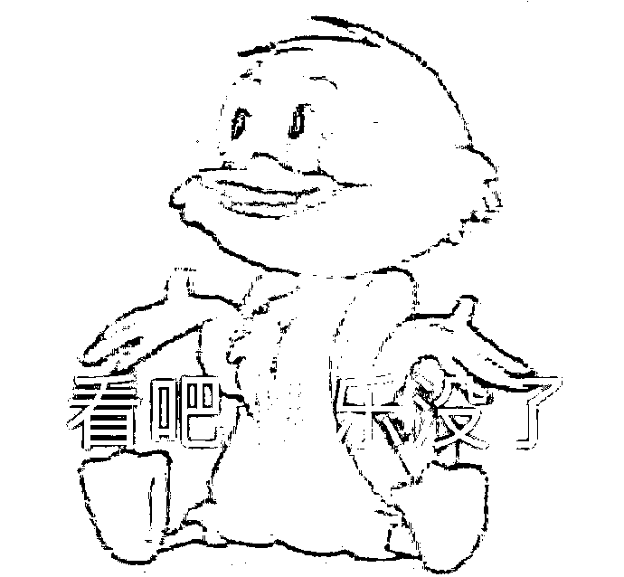
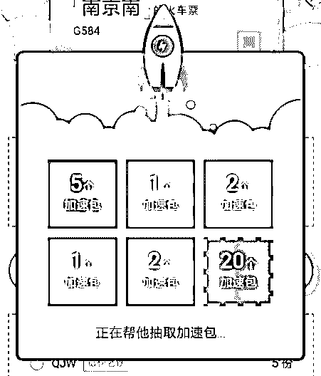
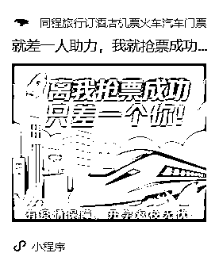
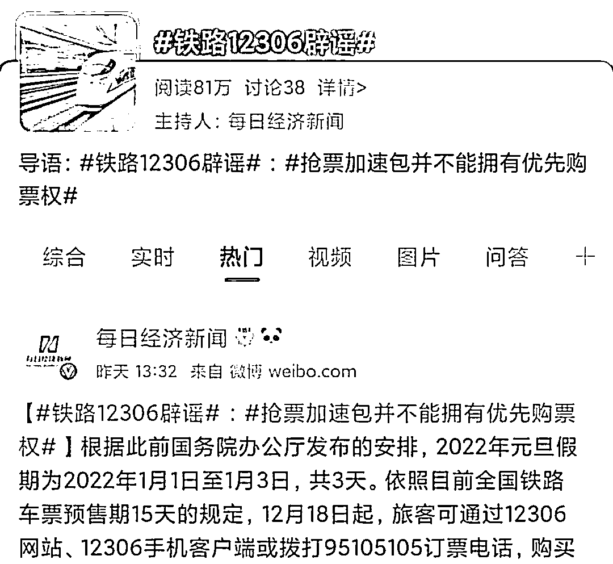
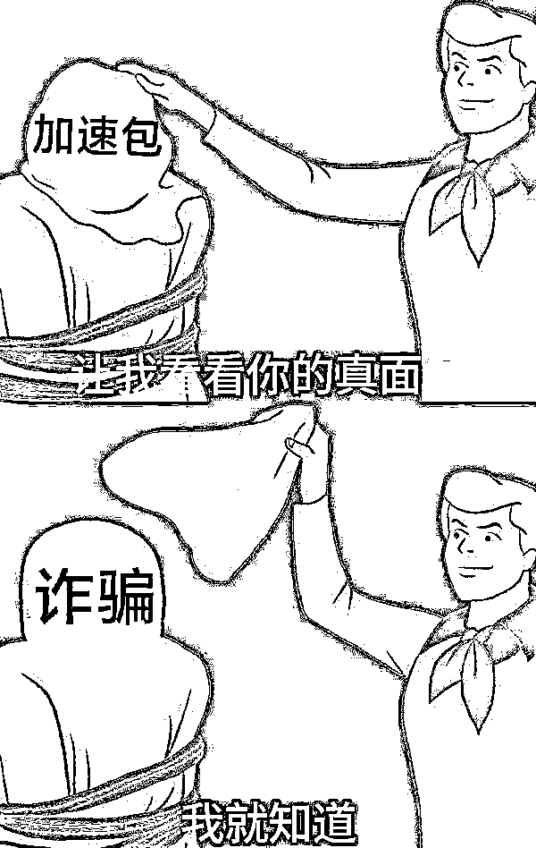
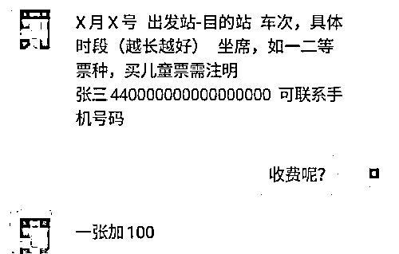
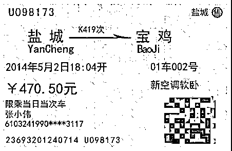

# 小心！越着急回家 越容易被骗！

> 原文：[`mp.weixin.qq.com/s?__biz=MzIyMDYwMTk0Mw==&mid=2247527176&idx=5&sn=3a108e195e93d94c9ccf06eb836be922&chksm=97cba030a0bc292672661e6b1a3f4f30693da3388788200fe23bdc115fab4eb50e65a8604b0f&scene=27#wechat_redirect`](http://mp.weixin.qq.com/s?__biz=MzIyMDYwMTk0Mw==&mid=2247527176&idx=5&sn=3a108e195e93d94c9ccf06eb836be922&chksm=97cba030a0bc292672661e6b1a3f4f30693da3388788200fe23bdc115fab4eb50e65a8604b0f&scene=27#wechat_redirect)

**2022**

**春运开始**

警惕这些骗局

元旦假期刚结束

你是不是已经在期待过年放假了？

打算春节回家的小伙伴注意啦

今年春运的购票通道已经开启了

购

票

须

知

据中国铁路消息

2022 年春运自 1 月 17 日开始

2 月 25 日结束，共计 40 天

根据以往的出行规律

**春节前 3 天的火车票是最抢手的**

这里给要抢票的朋友们画个重点：

1 月 15 日可购买腊月廿七(1 月 29 日)的车票

1 月 16 日可购买腊月廿八(1 月 30 日)的车票

1 月 17 日可购买除夕(1 月 31 日)当日的车票

春运期间，除了定时定点抢票

做好防疫措施出行以外

还有一点不容忽视，那就是

**警惕春运诈骗！**

今天小安来给大家盘一盘

春运购票期间常见的骗局套路

“

**春运补助领红包！真的假的？** 

临近春节，许多大城市发起了“就地过年”的倡议，随机而来的是大家对就地过年补贴的揣测。 

最近朋友圈里突然出现了这样的信息，“2021 春运补助领取通知，我已领到 121.97 元……”

打开链接竟是一个抢红包的界面，小安随手一点，就是一个百元以上的大红包，但想拿到这笔钱，还要先做任务——把链接分享至微信群中。

（嗯……有传销组织那味了）

如此简单的操作，让很多人都参与其中，但转发后，并不会有红包到账，平台会提示你操作失败。

不少网友遇到这种情况，只是以为自己操作不当，并没有发现自己其实已经上当受骗了。

参与者即便没有领到红包，也没损失什么，不法分子究竟骗走了什么呢？ 

首先，最重要的就是你的个人信息，在你点击链接（俗称钓鱼链接）的时候，就已经泄露了你的身份信息，很有可能会带来潜在的安全隐患。 

其次，通过“领福利”这种声东击西的方式，插入大量广告弹窗，为不法商家赢得了商品曝光的流量，使得你的满心欢喜，为他人做了嫁衣。

“

**抢票“加速包”  有用没用？ ** 

逢年过节经历过抢票的人，一定对“加速包”都不陌生，这是第三方购票平台推出的一种抢票服务，号称购买了“加速包”以后，能够提高余票刷新速度，更快抢到车票。效果真的这么显著吗？

近日，"铁路 12306"官方辟谣，消费者使用的加速包并**不能拥有优先购票权**。

其实无论如何加速，第三方购票平台也需在 12306 购票系统内完成购票，既然购票的终点都是 12306，那么“加速包”这种钱，就别给商家赚了。

小安提醒大家大家在购买车票时，一定要认清抢票软件的真相，“加速包”只是购票平台为了吸引用户流量，采取的宣传手段，想要增加抢票成功几率，不妨试试 12306 官方渠道里的候补功能。

“

**找黄牛买车票，靠谱吗？** 

哪里的资源稀缺，哪里就有人倒买倒卖，春运期间的火车票就是如此。

**“接受就下单，不接受就别回家，反正现在不愁没单接！”**下单=回家，多问=别想回家，黄牛的 PUA 话术，让很多返乡人都掏了腰包。 

然而，当你下单之后，一切都变了。

1

**不能保证出票**

“不保证 100%出票，现在抢票默认等到发车前 24 小时。”几乎所有黄牛的做法都是先引导你下单，最终能不能抢到票，还得看你的运气。

甚至有的黄牛，收了押金、拿到购票信息后，直接在其他第三方购票渠道抢购车票，抢到就是赚，没抢到就拉黑购票者，反正钱已经到手了！

2

**买到合成假车票**

为什么从黄牛那里买到的火车票却上不去车？

原因很简单，你手里的那张车票是用软件合成的假车票。

△资料图：通过“火车票合成器”合成的火车票

和真火车票的照片对比，几乎一模一样，还同样带有二维码，能够达到以假乱真的效果，但当你扫描二维码时，却根本找不到这张车票的任何信息。

3

**泄露个人信息**

传统“黄牛党”往往是虚构购票方式，冒用他人的身份买票，然后再高价卖出，谋取暴利。

而现在各种抢票网站盛行，从网站上下载的“抢票软件”风险也更大，不单单是黄牛倒买倒卖的问题了，而是容易造成大批量用户信息的泄露。

用户应用“抢票软件”进行抢票，购票者提供的个人信息将被上传至服务器数据库，如果抢票软件将这些数据出卖，被不法分子获取，后果将不堪设想。

购

票

警

示

最后，小安也在这里提醒各位抢票回家的朋友！

★ 通过正规渠道订票，勿信“低价票”、“折扣票”等虚假信息，不要从陌生人手上购买车票。

★ 在下载各种抢票、购票软件时首选官网或正规应用商店下载，避开手机资源下载网站或小型电子市场这些潜藏恶意软件的渠道，以免感染木马病毒。

★陌生链接不点击！

★切勿泄露个人信息，特别是银行卡账号和密码等。

最后祝大家都能顺利抢到回家的车票！

别忘了转给你身边抢票的朋友 一起学习！一起避坑！

来源： 神奇安全事务所

← 向右滑动与灰产圈互动交流 →

