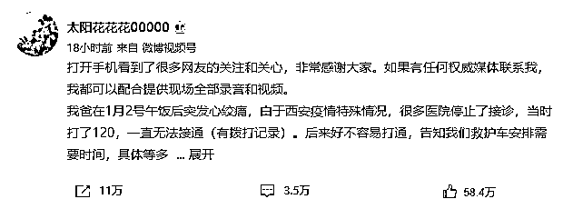
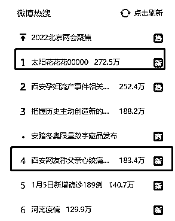
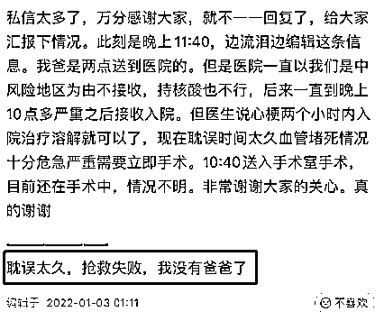
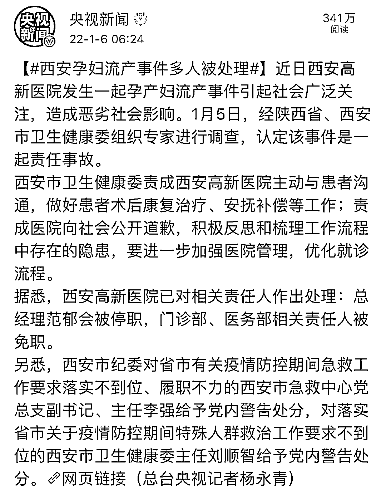
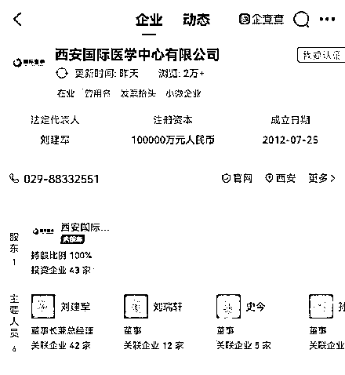
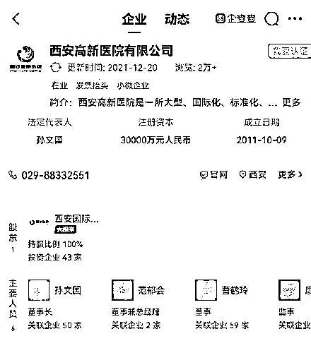
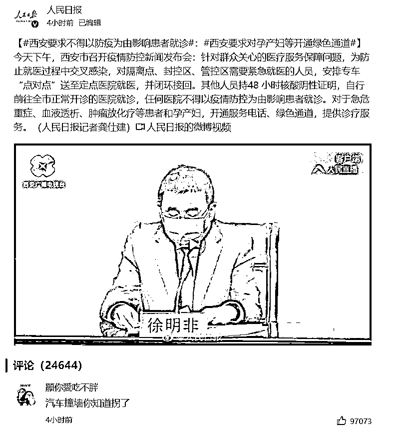
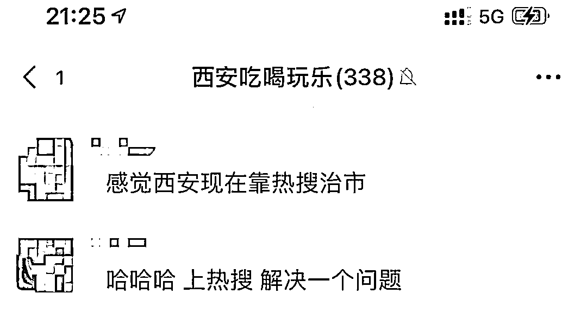

# 西安的热搜治市：没有人死于新冠，但死于了防控

> 原文：[`mp.weixin.qq.com/s?__biz=MzIyMDYwMTk0Mw==&mid=2247527232&idx=1&sn=dc893f40372e0987b561d65c8dbad347&chksm=97cba078a0bc296ece66aec5d6f682e598078f0eeb592c645bb396ef2580749ee88ee94a7087&scene=27#wechat_redirect`](http://mp.weixin.qq.com/s?__biz=MzIyMDYwMTk0Mw==&mid=2247527232&idx=1&sn=dc893f40372e0987b561d65c8dbad347&chksm=97cba078a0bc296ece66aec5d6f682e598078f0eeb592c645bb396ef2580749ee88ee94a7087&scene=27#wechat_redirect)

最近一直不想写西安的疫情，因为我在西安的公务员朋友说：

**“西安负面新闻已经够多了，不要凑热闹了。”**

我理解，因为他奋战在疫情一线忙得天昏地暗，他的每一条动态我都点赞。

但圈子里同样流传一句话：**西北望长安，可怜无数“删”。**

西安这次真的让全国人民大开眼界，但发声的寥寥无几，因为发声站位不对会被删。

在此，重要的事情说五遍：

**不要让个体的悲痛消失在群体的欢呼中。**

**不要让个体的悲痛消失在群体的欢呼中。**

**不要让个体的悲痛消失在群体的欢呼中。**

**不要让个体的悲痛消失在群体的欢呼中。**

**不要让个体的悲痛消失在群体的欢呼中。**

**他不是人群中的个例， 他是我们所有人 。**

今日不为别人发声，他日亦不会有人助我。

一个德尔塔就把西安整的人仰马翻，事实证明西安疫情防控很成功，新冠 0 死亡。

**新冠没死人，被防控死了俩人——**

孕妇在医院门口坐等 2 小时导致 8 个月的婴儿流产、心绞痛的父亲被拒诊耽误 8 小时后离世。 

**我很迷惑，新冠发生两年了，医院还不能好好处理这些事情吗？**

**01**

**西安一女子泣血控诉**

**父亲心绞痛被拒诊后离世**

看了@太阳花花花 00000  的新浪微博，眼泪都要掉下来了，今天终于爬上了热搜第一。

最早报道的媒体，只有凤凰网发了。

作为一个去年刚经历过生离死别的人，最看不得这种事情。

单看文字，已经难过到说不出一句完整的话：

**耽误太久，抢救失败，我没有爸爸了。**

一个心绞痛病人因身处疫区，从发病到救治足足耽误了八小时。

女博主父亲 1 月 2 日中午突发心绞痛，向当地多家医院求助，下午 2 点到了高新国际医学中心，但被保安以中风险地区为由一直不接诊，后来高新国际医学中心让去联系 521 医院和第三人民医院，521 医院回复只接收发热门诊，第三人民医院明确表示不接收，在随后的几个小时里又联系、找了很多医院都被拒绝，时间都在被浪费。

没有办法的情况下，女博主拨打了报警电话，但是，警方回复这不归他们管。

一直到晚上的十点钟，根据网友提供的电话，女博主联系上了西安市高新医院，然而，此时距离她的父亲心绞痛发作已经过去了八个小时，她的父亲由母亲陪同，被推进了手术室。

**最终医生称耽误太久，如果 2 个小时内使用溶栓的药物就可以救治，来太晚了，基本没有希望了。**最终，“太阳花花花 00000 ”的父亲因抢救无效于 1 月 3 日凌晨离世。

最令我抓狂的是，当事人父亲已经快不行了，医生叫她进医院见最后一面，但是门口的保安和医务人员不放她进去。

就算她是绿码有三天的 24 小时核酸也不行，因为她住的小区有确诊……

[`mp.weixin.qq.com/mp/readtemplate?t=pages/video_player_tmpl&action=mpvideo&auto=0&vid=wxv_2211281855058853889`](https://mp.weixin.qq.com/mp/readtemplate?t=pages/video_player_tmpl&action=mpvideo&auto=0&vid=wxv_2211281855058853889)

@“太阳花花花 00000”微博发布的录音视频

整个过程，女博主@太阳花花花 00000 所遇到的人，除了允许她们一家开车去看病的社区人员以外，全部人员都是在执行一种非常变态的规定——一刀切防疫。

梳理和分析女博主的父亲之死，真让人伤感之极。

**她的父亲不是死于疾病，而是死于所有的人不作为。**

也就是说，是西安这个城市里的一部分人，合伙“杀”死了她的父亲。

**因为医生已经说了，如果她的父亲两个小时以内注射溶栓类药物，是完全可以救过来的。**

在女博主送父亲就医的过程中，最关键的一个人，是第一次不同意她们入院的西安高新国际医学中心的保安，这个人几乎决定了女博主父亲的死。

因为医生已经同意她们入院治疗，保安却拦下了她们，因为怕担责。

守在门口的所谓保安们，扪心自问自己的父亲心脏病因为遵守制度从下午两点到晚上十点一直疼痛被医院拒绝到接诊。

自己明明是阴性核酸检测，在接到医生的电话通知后，却不能进去看自己父亲最后一面，摸着你们的良心，换成哪个正常人可以接受这样的事情？

**令人窒息的代入感，比死亡更可怕的是，因为人为的原因，只能眼睁睁在医院门口等死。**

**02**

**父亲心绞痛去世和孕妇流产的医院**

**背后是同一家公司 ** 

最近西安的某些领导，肯定如坐针毡。

今天早上，西安对高新医院发生一起孕产妇流产事件做出了处理。

据“西安发布”消息：近日西安高新医院发生一起孕产妇流产事件引起社会广泛关注，造成恶劣社会影响。**1 月 5 日，经陕西省、西安市卫生健康委组织专家进行调查，认定该事件是一起责任事故。**

据悉，西安高新医院已对相关责任人作出处理：**总经理范郁会被停职，门诊部、医务部相关责任人被免职。**

另外，西安市纪委对省市有关疫情防控期间急救工作要求落实不到位、履职不力的西安市急救中心党总支副书记、主任李强**给予党内警告处分**，对落实省市关于疫情防控期间特殊人群救治工作要求不到位的西安市卫生健康委主任刘顺智**给予党内警告处分。**

**父亲心绞痛去世的西安国际医学中心和孕妇流产的高新医院，是同一家公司——西安国际医学投资股份有限公司。**巧合吗？ 现在“心绞痛被拒诊”事件已经闹上热搜闹大了，估计又有几个官位不保。 

某些官员领导：**“你失去的是父亲，我们失去的可是乌纱帽啊。”**

搞成这个样子，无论事后如何处理，她的爸爸都没了。

**当天灾来临时，我真心希望能减少人祸。 **

因为一个疫情，所以连人命都不算什么了吗？

最初疫情开始的时候似乎没有像此刻更让人绝望 。

**防疫不就是为了保住更多的生命吗？**

但凡思维正常的人，把 1000 多万人封起来之前，都得考虑到这么多人里，有重病或者急病，应该怎么应急处理？

小学生都能想到的问题，为什么要等出了人命才重视起来？

西安感染了 1000 多人，到今天我还没看到有人因感染新冠去世。

但有人却因为所谓的疫情管控心脏病得不到及时救治而去世，有 8 个月大的胎儿因为踢皮球连这个世界都来得及看一眼就离开。

**他们都没有算在新冠的死亡人口里，但他们确实是因为新冠而死。**

**没有死于新冠，却死于新冠。**

两年了，这就是某些地方在防控疫情常态化下交出的作业。

**03**

**新冠不一定会死人，**

**但其他会...**

治疗新冠=政治任务

减少确诊=有效政绩

新冠之外=无效政绩

政治就是站队，此时你跟新冠对抗是政治正确，然而医院把救死扶伤当作政治任务，是一种悲伤 。

有些医院也不是治病救人的地方了，变成了只阻止新冠死人的地方。

**得了新冠我还能进医院治疗，现在西安孕妇跟心绞痛的老人都直接不给进医院了？**

其实不难发现，孕妇流产事件和心绞痛拒诊事件均具有共同的规律，**那就是上级已经有了明确的统一规定，如医院只接受发热门诊、进入医院必须出具规定期限内的核酸检测报告等。**

一刀切的规定下，不可能会设想到如果遇到突如其来的社会成员突发情况下，应该如何应对的问题。

即使规定了突发情况的特例，也需要首次接待人员经过层层的申报、领导批准程序。

**可又有谁愿意，为了一个陌生人而给自己、给单位增添麻烦，成为破坏“规则”的个例呢？**

于是乎，我们就看到了以上的这些紧急求助者，四处求助无门的境遇。

可问题是，几乎所有的部门都在往外推，又能追谁的责任呢？

**一旦执行规则的一方有人提出帮助求助者时，也就意味着，他也就站在了规则的另一方。**

会不会被人质疑，为什么要开个例，跟求助者什么关系，出了问题谁来担责任？如此的环境下，还有谁会为了求助者去挑战规则？

**于是，有些人选择了不作为和推诿，按规定来，谁也没错。**

由于西安孕妇医院门口流产事件，让西安相关部门开了疫情防控发布会，**强调了防疫不能影响患者就诊，明确了相关病人要开设绿色通道，对于急危重症、血液透析、肿瘤放化疗等患者和孕产妇，开通服务电话、绿色通道，提供诊疗服务。**

**但是，如果这一切需要用 60 岁老人和未出世婴儿的死才能换来，代价是不是太大了？**

如果社会每一点的进步，都需要鲜血去铸成，也太过于讽刺。

也难怪网友吐槽，西安靠热搜治市。

又或许，我们学习历史，但从来不曾吸取教训。

西安封城抗疫，坊间流传的种种喜怒哀乐，令人五味杂陈。

平心而论，西安人其实已经很能忍了，也很听话，也很齐心。

尽管现在存在着一些乱象，但只要我们能够团结一心，能通过暴露出来的问题总结经验和教训，相信疫情一定能被我们所战胜。

今天我在想一个可能，如果女博主没有那么“理性”，会不会是另一个结局？

**女博主的短板就是过于遵守规则以及没有身强体壮的男人帮她用武力解决一些问题。**

**如果女博主在每个可以挽救却没有被挽救的环节里，故意撒泼打滚或者主动闹事，医院会不会早点接诊，她爸爸会不会还有抢救回来的希望。**

举一个我知道的例子，一朋友母亲突发车祸要做手术，但手术风险太高医院内各科互相推诿不接诊要求转院，我朋友就跳在医院导诊台上开始撒泼并大喊“到底给不给人看病？”

随后医院领导出面，乖乖接诊、救人。 

**如果我是女博主的兄弟姐妹，我可能会很野蛮，哪怕负治安责任。**

从西安地铁女子拖拽事件，到买馒头充饥被打，到男子怀疑自己感染要求隔离被拒导致一家 6 口确诊，到孕妇流产事件，再到心梗父亲延误救治去世……

**这一桩桩一件件，撕开了千年古城华丽的外表，露出了丑陋的根，也让我对这个没去过的城市感到一丝心寒。**

对于历史而言，这一切可能只是一粒小小的尘埃，最多不过一句**“抗击疫情过程中付出巨大代价”。**

**但是这一粒小小的尘埃，落在每一个人身上，都是一座扛不起来的大山。**

最后，希望没有那么多悲伤的故事再上演，肉夹馍加油，西安加油‍！

← 向右滑动与灰产圈互动交流 →

