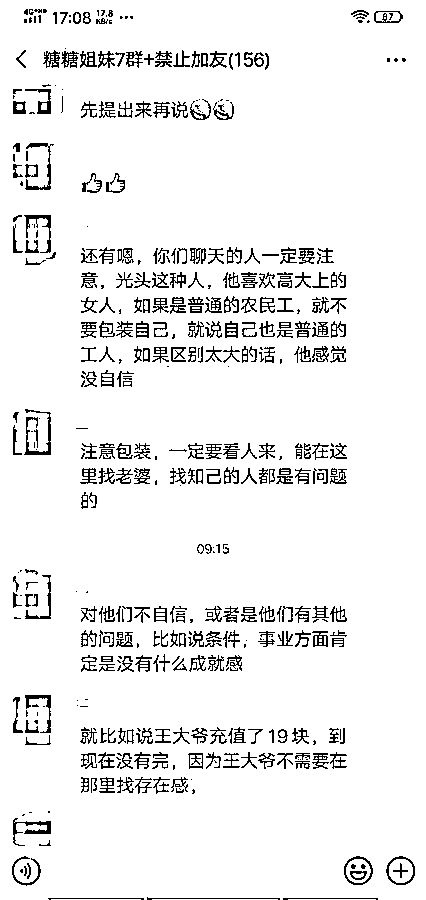
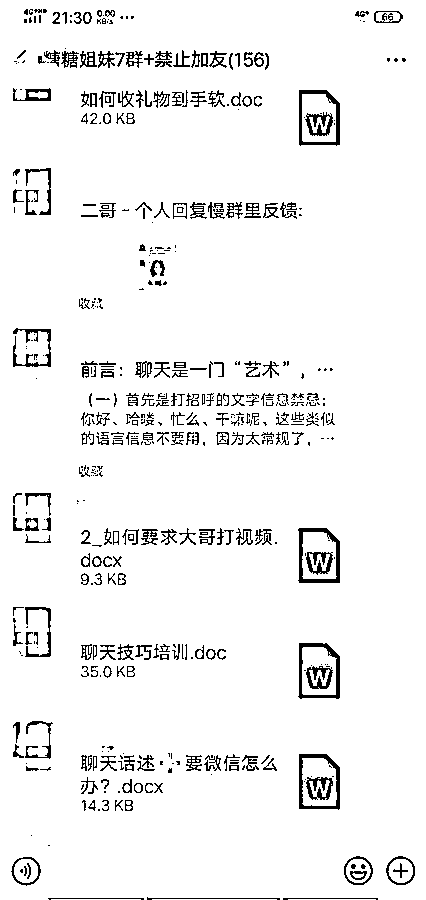
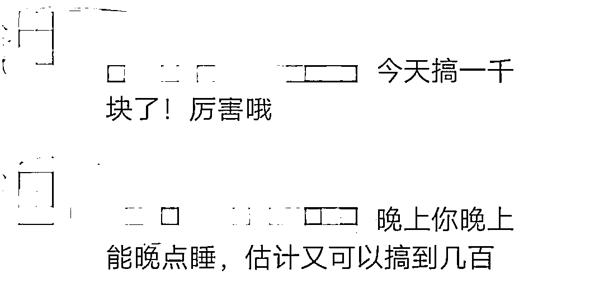
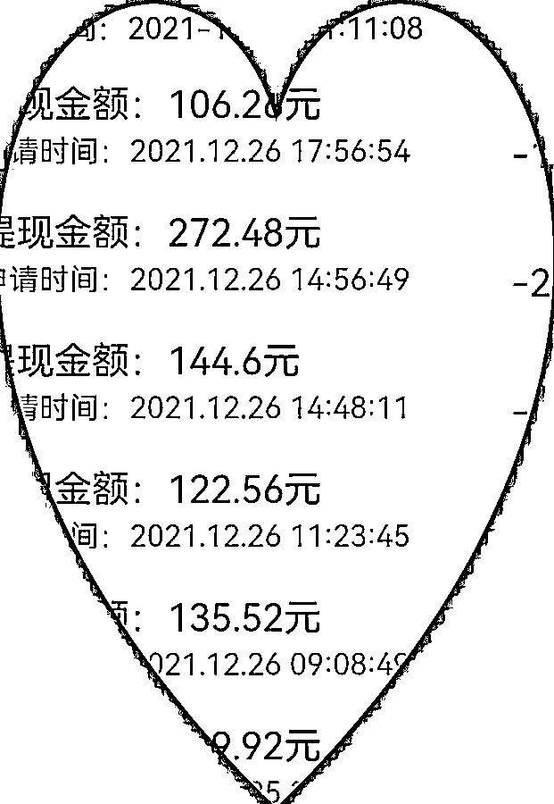
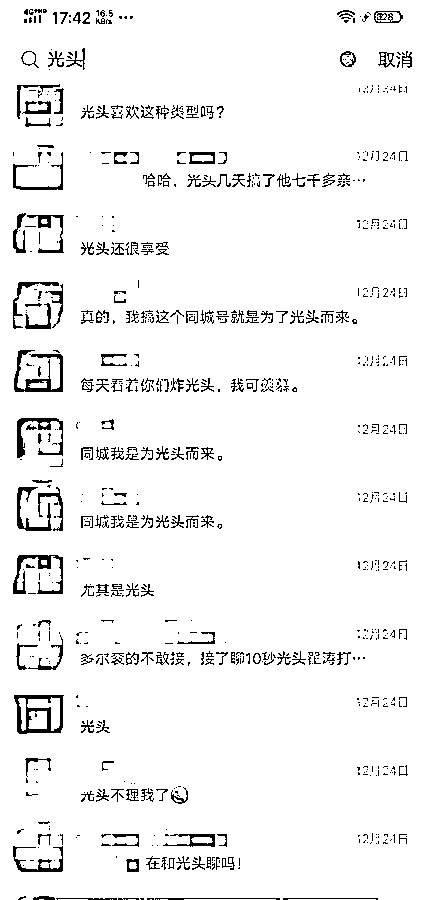
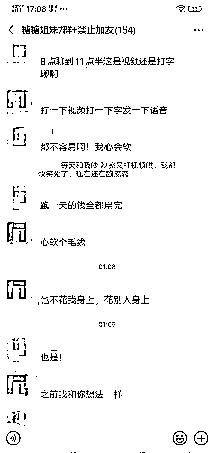
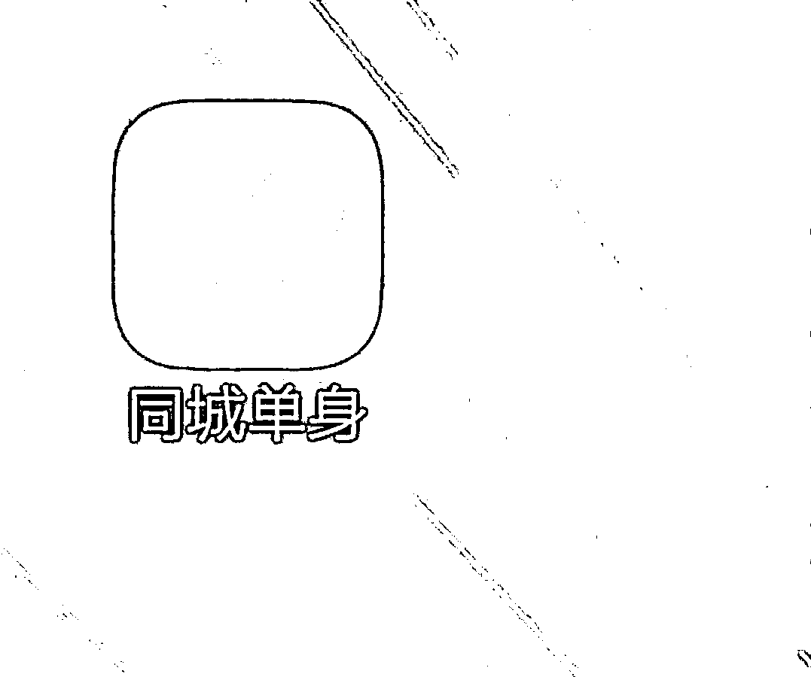

# 这些交友 APP 暗藏骗局，陪聊的是已婚妇女……

> 原文：[`mp.weixin.qq.com/s?__biz=MzIyMDYwMTk0Mw==&mid=2247527232&idx=2&sn=0a3b25877719112d2cd75b193367d0b1&chksm=97cba078a0bc296e9faadfcf66f5dc410694f87bfb87fc656eb6ad9734fdfb76bb8abcfe9f54&scene=27#wechat_redirect`](http://mp.weixin.qq.com/s?__biz=MzIyMDYwMTk0Mw==&mid=2247527232&idx=2&sn=0a3b25877719112d2cd75b193367d0b1&chksm=97cba078a0bc296e9faadfcf66f5dc410694f87bfb87fc656eb6ad9734fdfb76bb8abcfe9f54&scene=27#wechat_redirect)

## 

**近日，有网友爆料称，一款名为“同城单身”的 APP 主打真实交友，但背后深藏猫腻，**很多男性想通过平台交友解决终身大事，但屏幕的另一端很可能是哄人刷礼物的已婚女性。**** 

**“**我在学校食堂工作，身边的厨师都是男性，接触不到女生，就想通过交友 APP 来脱单。**”西安市民张波（化名）告诉极目新闻记者，在注册几天后他发现，**这个 APP 不仅交友难，还费钱**，“我才聊了几天，就已经花了千把块，在这个软件上面，每发一个字都是要钱的，**而且给我打招呼的还有一些已婚女性**。”**

****

**另一款名为“蜜月”的交友 APP，也打着同样的幌子。湖南怀化市民黄华（化名）曾借女性朋友的账号在该 APP 兼职陪聊员两天，从与他交友的男性网友获利 100 元。“**有不少已婚妇女兼职陪聊，有男性刷礼物价值上万元。**”**

****

**近段时间，极目新闻记者暗访发现，这些无法在手机应用市场下载的交友软件，全靠熟人或广告分享下载，推荐 APP 成功下载并注册后，还可获得 20%的直推收益。一些有家室的女性化身陪聊员，想方设法套收男性礼物，有陪聊员日入千元。**

****线上培训收礼技巧****

**来自湖南怀化的黄华，曾在一位女性朋友的推荐下，下载了一款名为“蜜月”的交友 APP。黄华向极目新闻记者爆料称，这一款打着真实交友旗号的交友软件，其实藏着不少猫腻。“**我在微信群里，每天看她们分享自己一天的陪聊成果，说白了就是骗了多少钱，还把截图发出来，鼓励群里的其他人继续去聊天骗钱**。”黄华说，他曾出于好奇，借用女性朋友的账号，在蜜月 APP 兼职当起了陪聊员。**

****

**“**我只陪聊了两天，赚了 100 元，来 APP 聊天的都是男性，他们为了聊天交友花了不少钱。**”黄华说，他最初并不懂如何陪聊，当他的女性朋友将他拉进群后，他发现群内经常会分享聊天技巧，有时候还会专门开设网络课程。“之后蜜月被人举报了，他们就全部换到了同城单身 APP。”**

**经黄华介绍，极目新闻记者添加了黄华上线的微信，向其表达了想兼职陪聊员的意愿，对方便分享了“同城单身”APP 的下载链接，经手机号码注册、实名认证等操作后，就会生成一个 ID 账号。黄华上线问询 ID 账号后，便发来两段录音文件。“先看（听）一下这个技术，再去和软件上的人聊天要礼物，才能提高你的收入。”黄华上线说，有陪聊员一天收入几千元，但这并非一两天就能达到，若有男性回复就能赚钱，**与对方视频一分钟可收入 2 元，语音聊天 1 元一条，文字聊天 0.008 元一条**。“**主要是礼物，你要学会要礼物，这样才有收入。**”**

****

**黄华上线分享的两段录音文件，一段命名为初级教程，另一段则命名为如何要礼物超级干货分享。这些内容均是真人授课内容，对头像、背景、签名及聊天话术进行了详细介绍，其中一段说：“**要营造出比男性更迫切的形象，以此来解锁微信号，前三位数字用 50 元的礼物解锁，后面的越来越高……**”。黄华称，加入陪聊学习群后，群主和其他群友经常会开设类似课程，有时会直接在群内文字或语音培训，有时则到其他平台进行线上培训。**

****已婚妇女陪聊敛财****

**当极目新闻记者向黄华上线提出希望加入群聊的想法时，对方称入群需要向她支付 500 元。向其支付费用后，极目新闻记者进入一个名为“糖糖姐妹 7 群”的微信群，群内共有 150 余人，群规定禁止互相添加好友。**通过群内聊天内容判断，群内大多数人已经结婚生子，群成员多为女性，也有五六名男性成员。****

**一个微信名为“糖糖”的女性是该群的群主，若群成员在陪聊过程中遇到任何问题，糖糖都会作出解答。“推荐别人下载 APP，就有 20%的直推收益。”糖糖说，兼职陪聊的大多数人都已有家室，有的人一天最多能赚几千元。糖糖还称，如果想陪聊赚钱，就需要想方设法向男性索要礼物，从而变现成钱。**

**“今天平安夜，盘礼物的机会来了。”12 月 24 日晚，微信群内的氛围变得活跃，群内不少成员早已做好大赚一笔的打算，不料遇到 APP 突然无法运行情况，微信群也因此炸了锅。不少成员在微信群内表示 APP 显示网络不给力、发不出消息或账号无法登陆的情况，群主糖糖在群里回应称“没有出问题，APP 在更新”。但黄华上线则告诉极目新闻记者，平台是因遭人举报而被封了。**

**除了在群内咨询陪聊过程中遇到的问题，还有不少成员会在群内分享她们每天的“战利品”。**一成员表示自己每天的收入在 400 元至 500 元之间，一个月收入已经过万元，另一成员也表示自己陪聊了两个月，每个月收入都已过万。****

****

**在群内，一个被大家称之为“光头”的网友，因喜欢视频聊天、刷礼物，成为了群内多名成员聊天的共同话题。从她们分享的视频聊天截图显示，**光头网友是一位四五十岁的中年男子，他出手阔绰，群里不少人表示下载同城单身 APP 就是为“光头”而来，希望能有幸“逮”到他**。有成员在微信群表示，光头网友经常跟她视频，甚至视频教她做做馒头和豆沙花卷，一聊就是一个多小时。以视频 2 元一分钟计费，该成员视频陪聊一个小时可获利 120 元。**

****男性聊天字字花钱****

****广撒网，是陪聊员的一种战术**。黄华的上线告诉极目新闻记者，一天至少需要向 1000 名网友发语音消息，这样才有回复的可能，而聊天的最好时机需要选择在夜晚。**

**自 12 月 20 日开始，**极目新闻记者将实名注册的账号包装成一个年龄 25 岁、身高 163 厘米、体重 47 公斤的单身形象，并将头像换成了自己的美颜照片，每日晚六点开始陪聊，最晚到深夜一两点**，在交友页面随机选择对象，给对方发语音打招呼，大部分都不会收到回复。黄华上线称“**这是一个过程，要多打招呼，每天 1000 个**”。**

**在暗访过程中，极目新闻记者发现，同城单身 APP 的多位男性网友在聊天过程中，会要求女性脱衣，其中两位男性网友还主动发送多张隐私部位的照片和多条语音，不过这些都会因为涉嫌违规，而在短时间内被平台屏蔽。**

****

**群聊天截图**

**来自西安的张波与极目新闻记者之间的互动最为频繁，他称 APP 的一位女性网友曾告诉他，平台会自动屏蔽电话号码或微信号，对方给他发联系方式时，多个数字显示为*号。在“糖糖姐妹 7 群”微信群中，极目新闻记者曾看到成员们讨论如何应付男性网友索要联系方式，对付办法就是故意发送带*号的联系方式，并主动告知对方平台会屏蔽。**

**张波向极目新闻记者索要联系方式后，记者向其发送了完整的电话号码，号码并没有被平台屏蔽，张波还为此感到诧异：“之前别人给我发的都带*号，为什么你的不带呢？”**

****张波是一名厨师，由于身边无法接触到适龄女性，今年 30 岁的他几乎每天都在为恋爱发愁。**在某社交平台的广告中，张波遇到了“同城单身”这个交友 APP，随后被其“真实交友、快速脱单”的介绍所吸引，并立即下载并注册了该款 APP。**

**同城单身 App 截图**

**原本希望在 APP 中实现早日脱单的梦想，但聊过几天后，张波感到不对劲。“这个 APP 打广告时都说不要钱，但实际上很费钱。”张波说，他每天都会收到不少来自陌生女性的信息，他只会选择部分进行回复，“**有的女的一看就已经结婚了，来聊天就是想我多刷一点礼物。**”**

**“**我才聊了几天，就已经花了千把块，在这个软件上面，每发一个字都是要钱的。**”张波说。在极目新闻记者的善意提醒下，张波已经不再使用该交友软件。**

**黄华称，据他了解，类似交友 APP 上像张波一样的网友非常多，**他还曾听闻陪聊微信群内的成员称有男性网友充值数万元来找女性聊天**。“**我担心会有越来越多的男性上当受骗，有很多男士被骗了还不知道**，以为真的是两个不合适不聊天了，希望相关部门能够注意到此类乱象。”黄华说。极目新闻记者发现，除了蜜月、同城单身 APP 以外，类似的交友 APP 还有甜蜜聊、缘来有你等。这些 APP 均无法查询到开发者，截至发稿前，同城单身 APP 还能正常运行。**

**来源:极目新闻，巴蜀反诈**

****

**← 向右滑动与灰产圈互动交流 →**

****