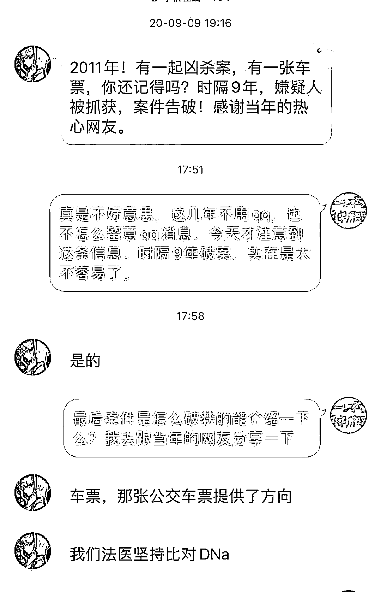
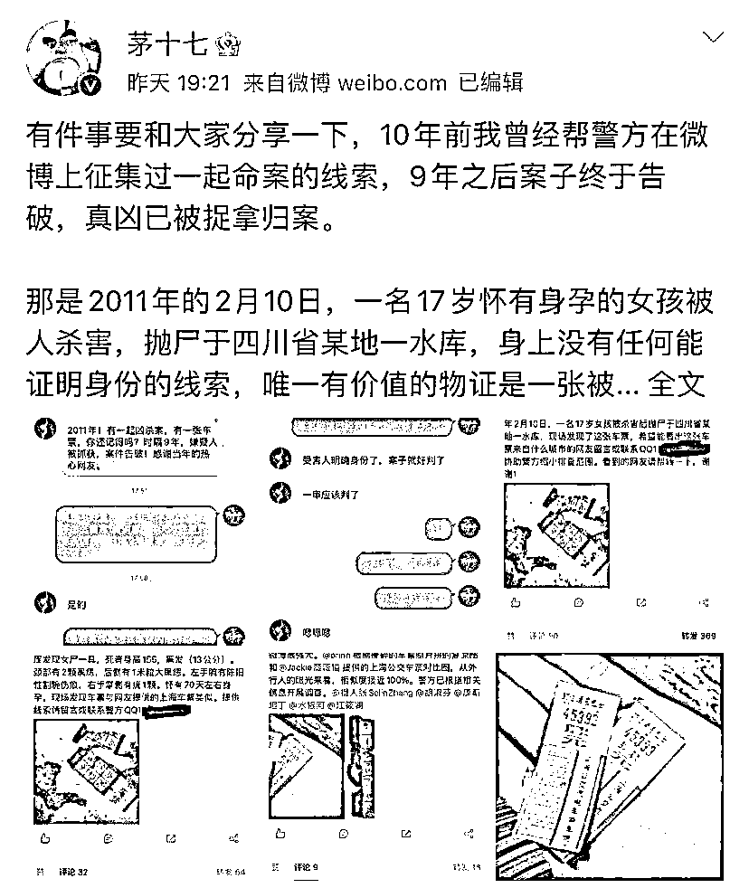
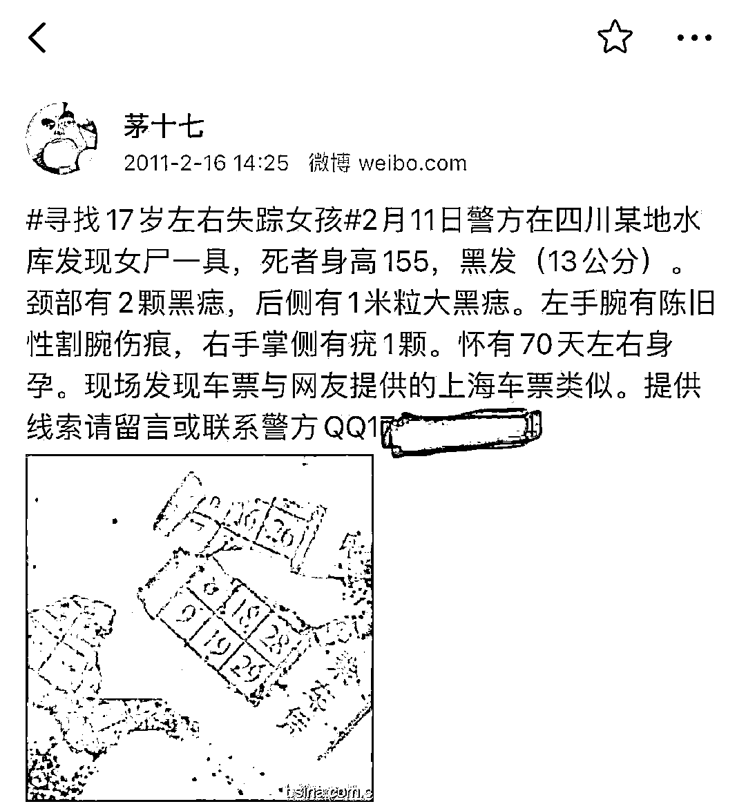
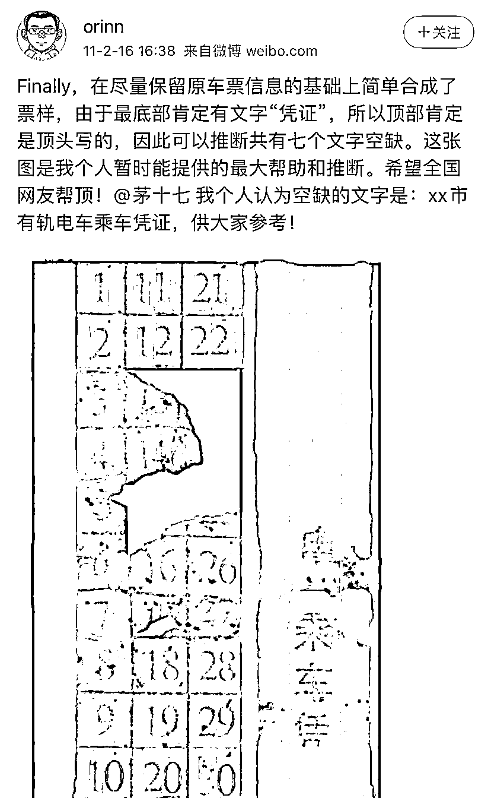

# 网友接力拼凑线索，17 岁怀孕女孩被杀抛尸案告破

> 原文：[`mp.weixin.qq.com/s?__biz=MzIyMDYwMTk0Mw==&mid=2247527232&idx=3&sn=5f98f527b43a92b992365d2daad347e0&chksm=97cba078a0bc296e4bcb104224e11f7ca8fd5a2994d1e0016ff60358c49f80d38be1a5e2cfbf&scene=27#wechat_redirect`](http://mp.weixin.qq.com/s?__biz=MzIyMDYwMTk0Mw==&mid=2247527232&idx=3&sn=5f98f527b43a92b992365d2daad347e0&chksm=97cba078a0bc296e4bcb104224e11f7ca8fd5a2994d1e0016ff60358c49f80d38be1a5e2cfbf&scene=27#wechat_redirect)

一张被水泡烂的公交车票由网友接力 P 图“拼接”后，为警方破案提供了方向，一起命案于 9 年后得以告破。 

四川省宜宾市江安县一水库 2011 年 2 月发生一起命案，一名怀有身孕的 17 岁女子被人沉入水库致死。 

2022 年 1 月 4 日，网络写手“茅十七”发布微博称，他在 2011 年帮助警方在微博上征集线索的一起命案告破，这起案件当年的重要线索是一张被水泡烂的车票。该案办案民警在 2020 年 9 月向“茅十七”留言称，嫌犯在案发 9 年后被抓获。

“茅十七”和办案民警的 QQ 对话

澎湃新闻查询到一份公开的起诉书显示，杀害 17 岁女子孙某某的正是其继父宋某云，二人因回家途中起争执，孙某某遭继父打晕后，被绑沙袋沉入水库溺水身亡。宋某云于 2021 年 3 月 19 日被四川省宜宾市人民检察院以涉故意杀人罪提起公诉。

1 月 5 日，澎湃新闻从江安县公安局获悉，目前该案件被告已上诉，正在走司法程序，已进入二审阶段，最终结果需等待二审判决。 

“这么多年都在不停地寻找（嫌犯），后来技术更发达后，通过 DNA 比对确定身份，再进一步破案。”江安县公安局一名工作人员称。 

**警方微博征集线索**

**热心网友 P 图“拼接”车票碎片**

“有件事要和大家分享一下，10 年前我曾经帮警方在微博上征集过一起命案的线索，9 年之后案子终于告破，真凶已被捉拿归案。”2022 年 1 月 4 日晚，网络写手“茅十七”发文分享了这一消息。

“茅十七”微博截图

“茅十七”在微博中称，2011 年的 2 月，一名 17 岁怀有身孕的女孩被人杀害，抛尸于四川省某地一水库，身上没有任何能证明身份的线索，唯一有价值的物证是一张被泡烂的车票。为了征集更多线索，一位办案的警员想到了那时还属于新生事物的微博，努力说服了领导之后，辗转找到其帮助发布信息。

“茅十七”2011 年发出微博求助

“茅十七”还称，当时很多热心网友都提供了帮助，一位擅长 P 图的网友将车票碎片拼起来之后，另一位网友提供出了极为相似的车票照片，给警方提供了重要线索。

网友 orinn 还原了车票

此后的 9 年间，案件虽然没有破获，但警方一直没有放弃努力。2020 年 9 月，办案警官在 QQ 上给“茅十七”留言称：“2011 年！有一起凶杀案，有一张车票，你还记得吗？时隔 9 年，嫌疑人被抓获，案件告破！感谢当年的热心网友。”

“茅十七”发文透露，看到留言他连忙联系了警官，得知当初那张公交车票确实为办案提供了方向。 

“这件案子的告破，首先当然是办案民警的功劳，尤其是那位一直坚持对比 DNA 的法医；其次也要感谢当初一起努力的网友。”“茅十七”写道。 

**起诉书：被告人因口角打晕继女**

**并将其拖下水库**

澎湃新闻在 12309 中国检察网检索发现，四川省宜宾市人民检察院在 2021 年 3 月 19 日的起诉书披露了该起命案的相关情况。 

起诉书显示，被告人宋某云于 2010 年下半年与其继女孙某某先后到宜春市参与非法传销活动，被骗数万元。2011 年 2 月 9 日深夜, 宋某云和孙某某从上海乘长途客车回到宜宾市江安县，然后同时搭乘一辆出租摩托车到宋某云家附近一水库堤坝排洪处。下车后，二人因口角发生激烈争执，宋某云气恼之下，用拳头对孙的头、脸、腹部进行猛打，并扼颈致其昏迷后将孙某某随身携带的垮包装入河沙后挂在孙的身上，然后将她拖下水库堤坝沉入水库后逃离现场，致孙某某死亡。经法医鉴定，孙某某系存在颅脑损伤、被扼颈的情况溺水死亡。 

起诉书显示，宋某云因涉嫌故意杀人罪，于 2020 年 9 月 11 日被江安县公安局刑事拘留，经江安县人民检察院批准，于同年 9 月 23 日由江安县公安局执行逮捕。 

宜宾市人民检察院认为，宋某云故意剥夺他人生命并致他人死亡的行为，触犯了《中华人民共和国刑法》第二百三十二条的规定，犯罪事实清楚，证据确实、充分，应当以故意杀人罪追究其刑事责任。根据《中华人民共和国刑事诉讼法》第一百七十六条第一款的规定，向宜宾市中级人民法院提起公诉。 

2022 年 1 月 5 日傍晚，澎湃新闻从江安县公安局获悉，该案被告人已经上诉，目前正在等待二审判决。

来源：澎湃新闻（ID：thepapernews），观察者网

← 向右滑动与灰产圈互动交流 →

