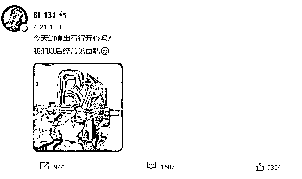

# 吸毒韩星入驻中国社交平台，转眼就被...

> 原文：[`mp.weixin.qq.com/s?__biz=MzIyMDYwMTk0Mw==&mid=2247527232&idx=4&sn=a4fe90b4b0cf17964fdbe54d9902d728&chksm=97cba078a0bc296ed0d09f73bf810b93a33ec239b033173ec6b0d13cc3c7dbc6af51b53807f8&scene=27#wechat_redirect`](http://mp.weixin.qq.com/s?__biz=MzIyMDYwMTk0Mw==&mid=2247527232&idx=4&sn=a4fe90b4b0cf17964fdbe54d9902d728&chksm=97cba078a0bc296ed0d09f73bf810b93a33ec239b033173ec6b0d13cc3c7dbc6af51b53807f8&scene=27#wechat_redirect)

近日，有中国网友发现，去年 9 月因吸毒被判 3 年、缓期 4 年执行的韩国歌手 B.I（本名金韩彬）继去年开通微博后，今年元旦一口气开通了小红书和抖音账号，并喊话中国粉丝“我们多多见吧”。然而，此番全面进军中国社交平台的势头，惹恼了不少中国网友。 

在中国网友迅速的投诉行动下，截至 1 月 5 日晚，金韩彬微博@BI_131 暂时被禁言，抖音账号被封禁，小红书则呈现清空状态。

金韩彬 1996 年 10 月出生于韩国，是歌手、制作人、韩国 YG 娱乐旗下男团 iKON 前队长。其 2015 年随组合 iKON 在韩国正式出道，因音乐创作能力受到关注，曾为韩国女团 BLACKPINK 出道曲《Whistle》填词。

2019 年 6 月，韩媒曝出金韩彬吸毒丑闻，金韩彬在 2016 年 4 月与 A 某的聊天记录被曝光：他曾向对方要求购买致幻剂 LSD，并称“因为和你一起吸过才会问你”，暴露曾吸食大麻的经历。报道称，韩国警方 2016 年就已掌握金韩彬购买大麻和 LSD 等毒品的事实，但并未就此展开调查。

同月，金韩彬在 Instagram 发文否认自己吸毒并宣布退出组合，称“有一段时间因为太痛苦和难受而想依赖不应该关心的东西，这是事实，但因为害怕而没去做”。随后，其所属经纪公司 YG 娱乐称，已决定让其退出组合并解约。

2019 年 9 月 17 日，金韩彬因涉嫌购买大麻及吸食大麻，以证人身份接受了韩国警方的调查，在调查过程中，金韩彬承认了部分嫌疑，韩警方因此将其证人身份转换成嫌疑人，并继续展开调查。

2021 年 5 月 28 日，金韩彬因违反毒品管理法等嫌疑被韩国检方起诉；8 月 27 日，金韩彬涉嫌吸毒案开庭，检方向法院求刑判处其三年有期徒刑并处以 150 万韩元（约合人民币 8000 元）罚款。

2021 年 9 月 10 日，韩国首尔中央地方法院刑事部判处金韩彬有期徒刑 3 年，缓期 4 年执行。同时，金韩彬还被判处 80 个小时的社区服务，40 小时的药物治疗讲座，以及 150 万韩元的罚款。对此，金韩彬没有提出上诉。

接受调查到正式宣判的 2 年里，金韩彬虽然退出了组合，但没有停止艺人活动，也没有放弃中国市场。

他不仅于 2021 年 5 月入驻微博，甚至在 2021 年 8 月 27 日初审前，还一直在微博宣传当年 10 月份的首场线上演唱会；9 月 10 日宣判后，不到一个月，金韩彬不仅顺利完成了演唱会，还第一时间向中国粉丝问好，称“我们以后经常见面吧”。

另一边，金韩彬的中国粉丝也没有停止应援。

值得注意的是，2020 年 2 月，金韩彬中国粉丝团@金韩彬吧官博（现更名为“金韩彬 _WITHID”）称，金韩彬委托家人向中国粉丝送来数万只防护口罩。这也是众多粉丝在其吸毒被判后还不忍离去的原因之一。

2021 年 8 月 27 日，初审结果出炉后，@金韩彬吧官博（现更名为“金韩彬 _WITHID”）曾发文称，“作为粉丝，我们将尊重法律的审判，不会因对偶像的喜爱混淆相关事件舆论，积极响应国家清朗行动号召，规范追星行为，维护网络环境”，并称暂停全部应援活动，直至 9 月 10 日宣判后做统一处理。

当时，有不少中国粉丝宣布“脱粉”，并要求粉丝团开放黑胶专辑团购退款通道。

不过，部分粉丝却认为，金韩彬已经“付出了他应付的代价”，应该给他改过自新的机会。

2021 年 9 月 10 日，判决结果出来当天，@金韩彬吧官博（现更名为“金韩彬 _WITHID”）发文称，“今后会尽最大的力量正确引导粉丝，谨言慎行保有清醒的认知，不为他（金韩彬）的过去辩解”，同时称要“为帮助他（金韩彬）成为成熟正确的社会成员而一起共同努力”。

此后，@金韩彬吧官博（现更名为“金韩彬 _WITHID”）正常更新金韩彬动态。金韩彬本人微博@BI_131 也保持频繁更新，内容多为专辑宣传。

2021 年 10 月 22 日，金韩彬在微博晒出一张中国粉丝团送出的生日应援，应援车的韩文条幅下标注了应援来自“CHINA KIMHANBINBAR”。

2022 年元旦，金韩彬宣布入驻小红书和抖音。这番全面进军中国社交平台的动作随后引发热议，部分中国网友认为，对涉毒艺人应该“零容忍”，这种态度不分国籍。此后，不少中国网友对金韩彬在中国社交平台开通的账号进行了投诉。

截至 1 月 5 日，金韩彬已经发布一条内容的抖音账号被封禁，其已经发布一条内容的小红书则呈现清空状态。

1 月 5 日晚，金韩彬微博暂时被禁言。

**相关阅读：**

[吸毒艺人喊冤想复出？怒了！](http://mp.weixin.qq.com/s?__biz=MzIyMDYwMTk0Mw==&mid=2247522018&idx=1&sn=7c42a0df86decedd89e77658f6923249&chksm=97cb5ddaa0bcd4cc4f6507d519e4c14abf41b31932dcd13e98994d3224f68d0af6f157b0afe1&scene=21#wechat_redirect)

[涉毒艺人参加商演？紧急叫停！](http://mp.weixin.qq.com/s?__biz=MzIyMDYwMTk0Mw==&mid=2247522231&idx=3&sn=90b1ebe47837f1835e741be54e46dbb5&chksm=97cb5c8fa0bcd599056fb9fe299f813bcca25a543cbe9f1267fca07d4af9fffe7de65665bfc3&scene=21#wechat_redirect)

来源：观察者网

← 向右滑动与灰产圈互动交流 →

