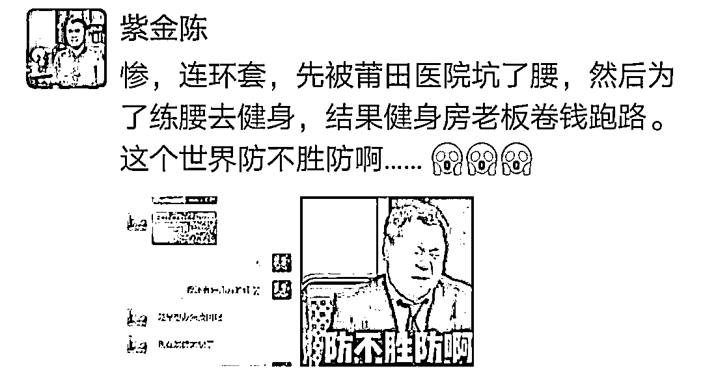
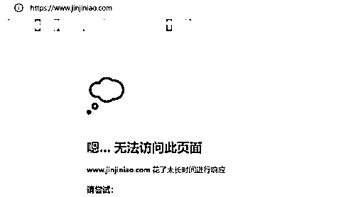
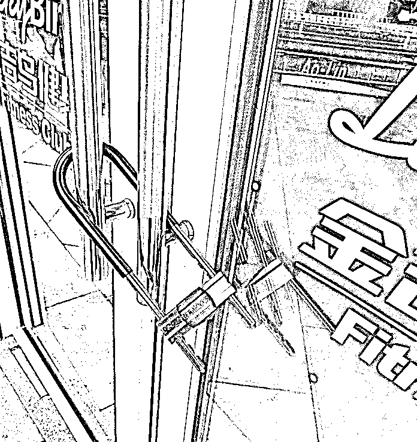
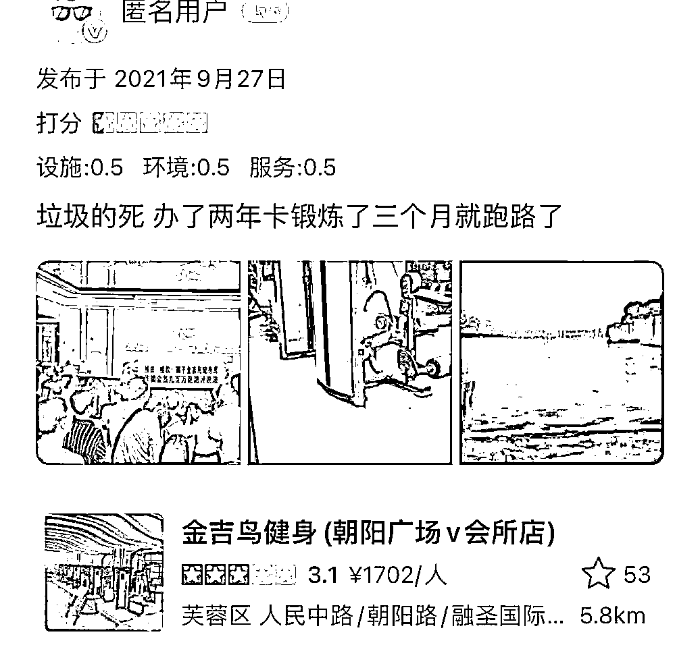
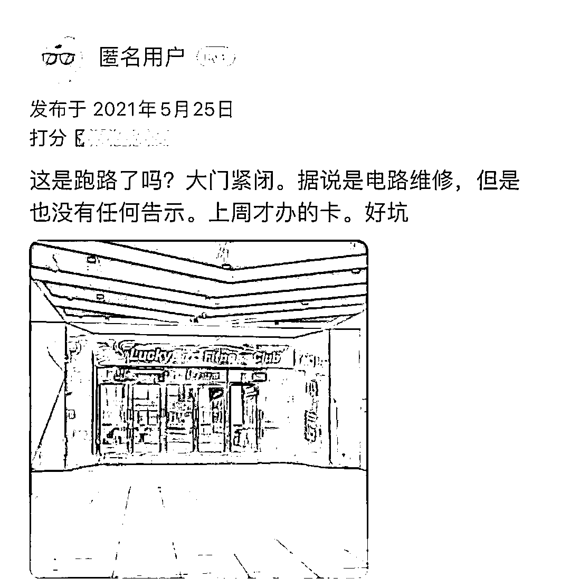
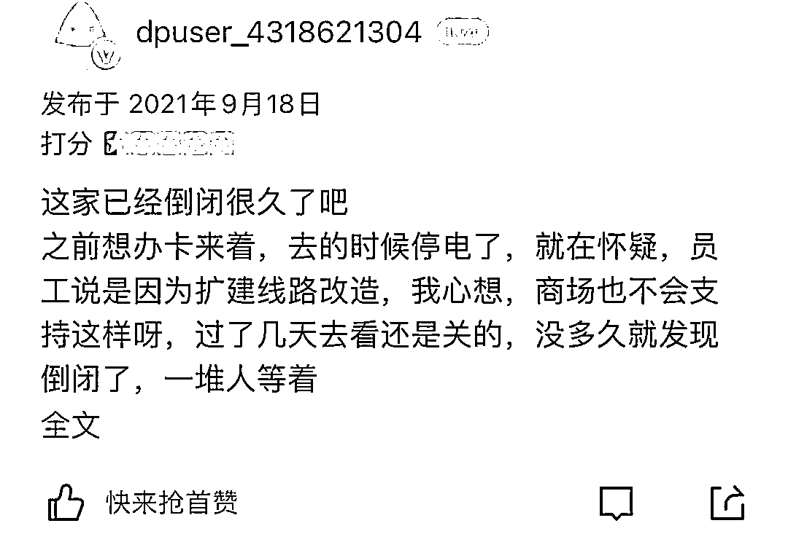

# 知名作家被“连环坑”，门店卷钱跑路！

> 原文：[`mp.weixin.qq.com/s?__biz=MzIyMDYwMTk0Mw==&mid=2247527232&idx=5&sn=1b958e2949c06bae9dd0e24829bb22e9&chksm=97cba078a0bc296e6f2ac6ca4f889dbe88d419e3750a42861a10334645be258f85af18823abe&scene=27#wechat_redirect`](http://mp.weixin.qq.com/s?__biz=MzIyMDYwMTk0Mw==&mid=2247527232&idx=5&sn=1b958e2949c06bae9dd0e24829bb22e9&chksm=97cba078a0bc296e6f2ac6ca4f889dbe88d419e3750a42861a10334645be258f85af18823abe&scene=27#wechat_redirect)

《隐秘的角落》《沉默的真相》

原著作者紫金陈，

去年到某医院就诊时，

被引导“小分子祛炎针”治疗，

腰疼越治越严重，

结果疼得直不起腰半夜赶去急诊：

我要把他们写进书！

[`mp.weixin.qq.com/mp/readtemplate?t=pages/video_player_tmpl&action=mpvideo&auto=0&vid=wxv_2212235300335157248`](https://mp.weixin.qq.com/mp/readtemplate?t=pages/video_player_tmpl&action=mpvideo&auto=0&vid=wxv_2212235300335157248)

视频来源：钱江晚报 

作为知名推理作家，被忽悠了这件事，成为粉丝调侃紫金陈的段子。他接受电视媒体采访，一度上热搜，画面也被粉丝们制作成表情包。

1 月 5 日，紫金陈在社交平台吐槽：**“惨，连环套，先被莆田医院坑了腰，然后为了练腰去健身，结果健身房老板卷钱跑路……”**

紫金陈对记者表示，自己腰部正在恢复时期，买了**金吉鸟健身房（宁波宁南北路店）**的会员卡和私教课。

中间有几个月忙着写稿子，没去健身房，昨天噩耗传来：老板卷钱跑啦！教练告诉他，他们几百人员工，也已经被欠好几个月的工资。

紫金陈只能感叹自己最近太惨了，腰刚恢复，想健身锻炼一下，结果几万块钱没了。他表示自己这次亏了 4 万元，当时办卡也是一时心血来潮，后来也没怎么去健身，至于是否会把钱追回来，他说不追了，因为追不回来，先看其他人怎么处理。

记者发现，金吉鸟官网目前是打不开的状态。在地图软件上搜索到另一家分店（鄞州区堇山店）的联系方式，对方表示已经离开金吉鸟了，不清楚状况。

金吉鸟于 2005 年成立，全国门店连锁最多时达 400 多家，金吉鸟的盈利模式，是采取预售模式，卖出年卡、私教课后回笼资金，一方面支撑门店运营，另一方面迅速拓展新店，再聚累资金，循环往复。资金链断裂，就会引发一系列后续问题。

**早在去年 7 月份，金吉鸟在南京、天津、长沙等地的门店接连关闭，不少会员都陷入了退卡难的境地。**

去年 7 月 11 日，长沙的曹小姐在接受潇湘晨报记者采访时就曾无奈地表示，3 月底，她和男友在长沙砂之船奥莱的金吉鸟健身房各办了一张“半年卡”，共计交纳 2000 元。没多久，健身房大门紧闭，金吉鸟就因拖欠租金跑路了。

长沙一金吉鸟健身房会员去年接受湖南公共频道采访时称，长沙有 8 家金吉鸟健身房，如今有 6 家都关门了。

金吉鸟健身房（长沙雨花区万博汇店）的店长也向记者表示，从 2019 年开始，就出现了拖欠员工工资的情况，累计起来就导致一连串的反应。

**如今在某点评软件上，查看长沙金吉鸟健身房，评论页面充斥着消费者对其跑路的差评投诉：**

健身房关门或者跑路的消息屡见不鲜，我们应该注意甄别主动规避，消费权利遭到损害也要有维权意识：

**根据相关法律规定，记名会员卡预存款不得超过 5000 元一张，不记名会员卡不得超过 1000 元**，如果超过，消费者可以举报。遇到店子突然关门，第一消费者可以直接报案；第二如果是经营不善，建议大家办理会员卡一定要谨慎，选择信誉好、成立时间长的企业，保留充值和服务承诺凭证，**尽量不要办长期、高预存费的会员卡。**

你遇到过哪些消费被坑的经历？ 

如何维护了自己的消费权益？ 

欢迎来评论区分享你的经历和经验~

来源 ：潇湘晨报（记者：向帅）综合湖南公共频道、新民晚报、红星新闻、钱江晚报、1818 黄金眼

← 向右滑动与灰产圈互动交流 →

