# 再探“杀猪盘”话术，你付出的感情可能是黄粱一梦

> 原文：[`mp.weixin.qq.com/s?__biz=MzIyMDYwMTk0Mw==&mid=2247527232&idx=6&sn=120d685b2ab172e65ee8b0d5ee7436d0&chksm=97cba078a0bc296eac36f48008d795b734473d6f1e36c6986f05fde07b23ecd748a327189bba&scene=27#wechat_redirect`](http://mp.weixin.qq.com/s?__biz=MzIyMDYwMTk0Mw==&mid=2247527232&idx=6&sn=120d685b2ab172e65ee8b0d5ee7436d0&chksm=97cba078a0bc296eac36f48008d795b734473d6f1e36c6986f05fde07b23ecd748a327189bba&scene=27#wechat_redirect)

**“杀猪****盘”诈骗****使用的十大高频话术**

**如果你在网络交友中听到了****这 10 句话**

**一定要****提高警惕****，谨防被骗！**

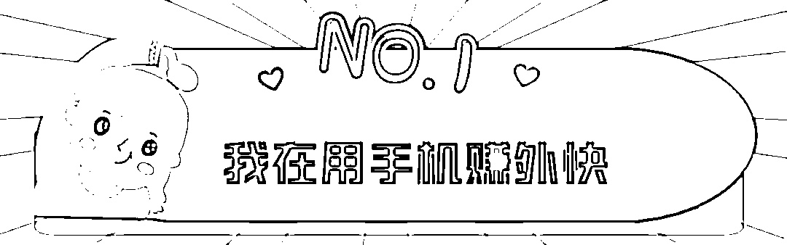

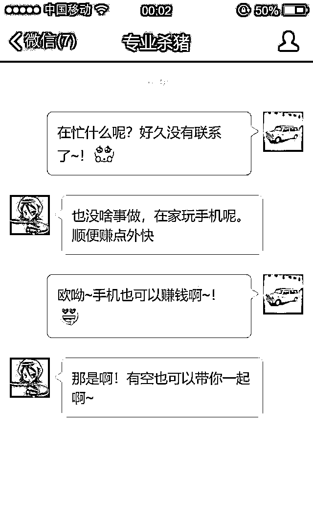

这句话大多使用在杀猪盘的切入阶段 

骗子和你加入好友之后，先会聊一阵子

然后突然减少聊天频率，等你去问他

当你问他时，他也不会说具体做什么，

只会说赚赚外快，目的是勾起你的好奇心

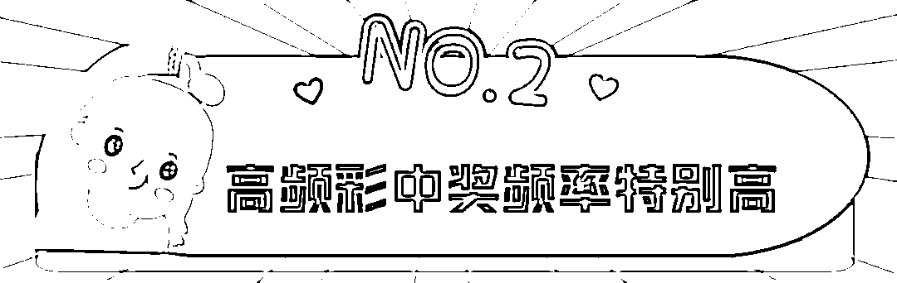

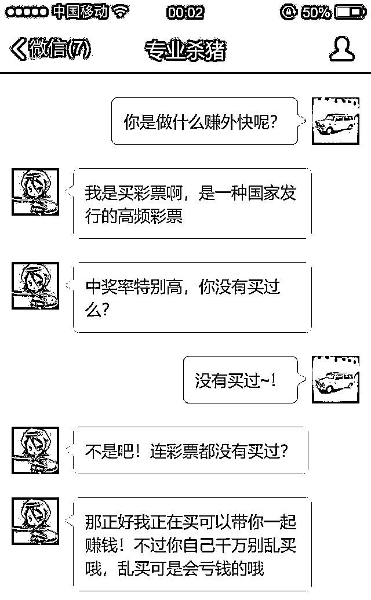

等你上钩后，骗子会说自己在卖国家行的彩票

并暗示可以指导你购买

这是为了进一步引诱你走进陷阱

其实国家目前不允许任何网上销售彩票的行为

网络私彩基本上都是诈骗套路

千万不要碰

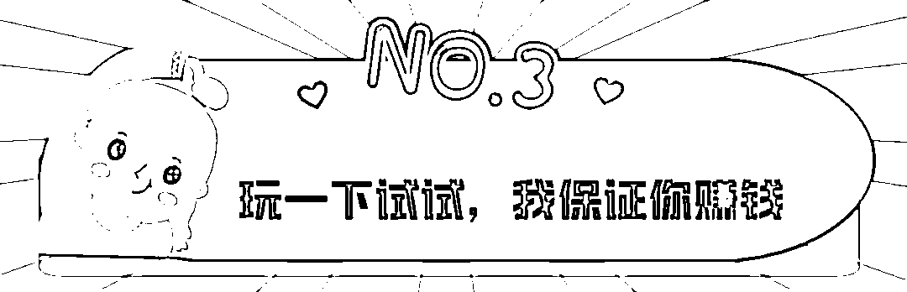

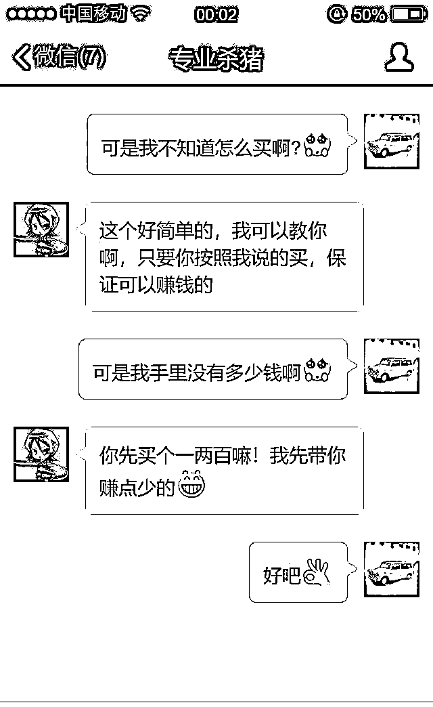

当你动了心，但是下不定决心的时候

骗子一般会用保证赚钱来进一步引诱你

一般会让你先投入少量的钱，然后让你赚钱

目的是让你体验轻松赚钱的快感

同时展示实力

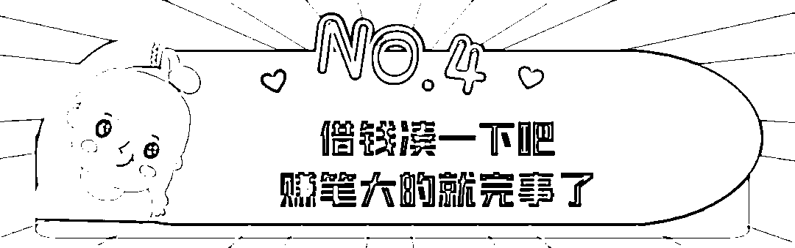

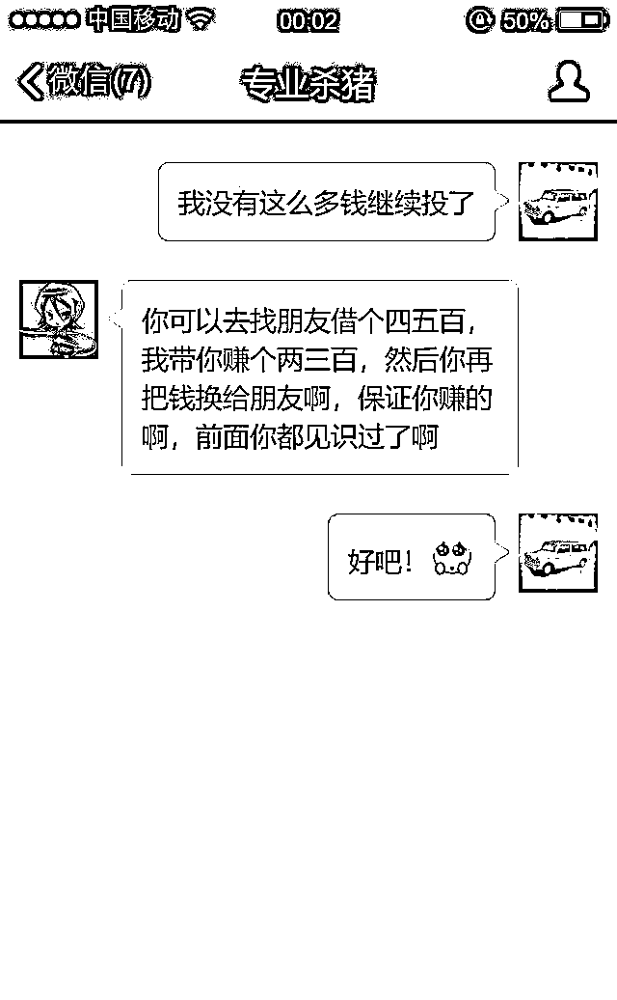

这是杀猪盘的“调大”阶段 

当你赚了钱，想提现，又或者赔了钱，不想继续

骗子就会忽悠你借钱，朋友家人，甚至网贷平台

目的是为了让你继续陷入这种疯狂的游戏不能自拔

同时也会后续让你加大投入做好铺垫

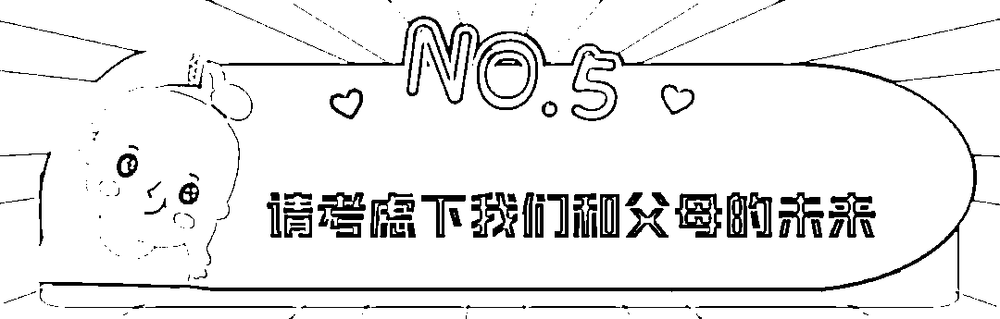

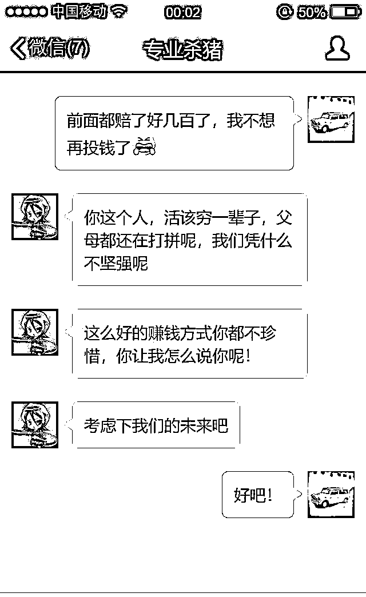

当你打退堂鼓的时候， 

骗子会用激将法让你继续投钱，

通常会说让你考虑自己和父母的未来

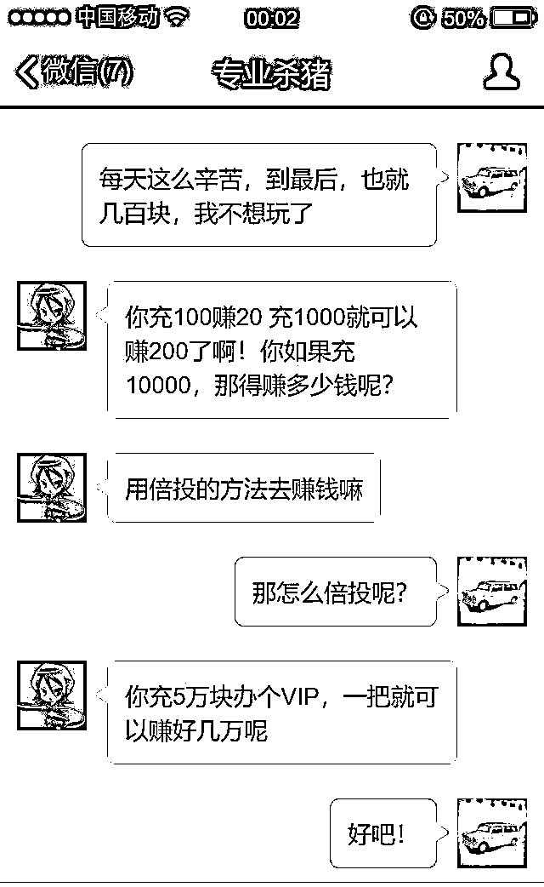

这时候杀猪盘诈骗进入了关键阶段 

当你的赌性被逐渐培养出来之后，

骗子就会忽悠你进行大额投注

目的是骗更多的钱

而人一旦习惯一次输赢几万

就会对金钱不再敏感

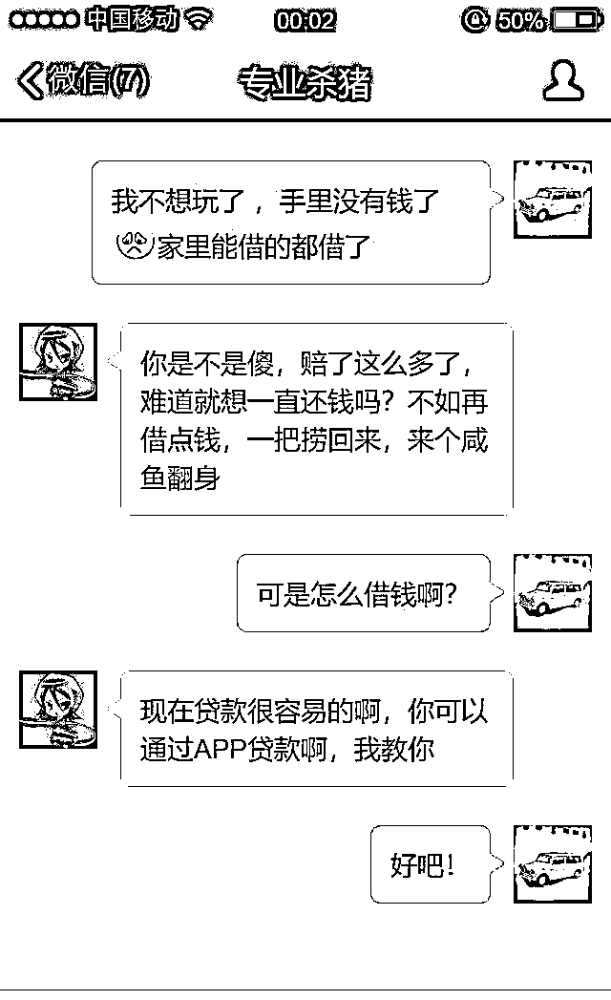

这是杀猪盘最血腥的阶段

这个时候，你的钱已经赔光了，

不继续投钱，就只能就地还债，

继续投钱，就要四处贷款，

骗子正是利用这个心理，知道你去贷款

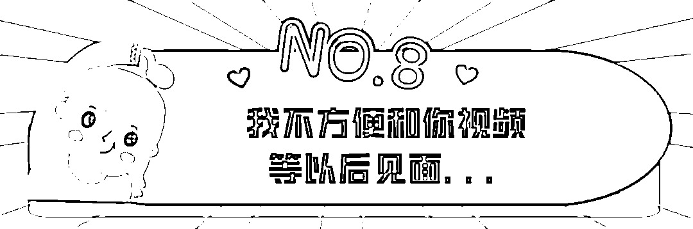

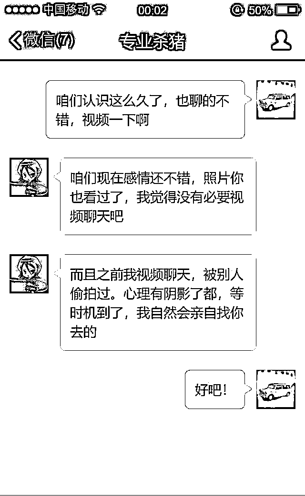

骗子会想尽一切办法拒绝和你视频

一方面他们的朋友圈照片都是盗用的，一视频就会暴露，

另一方面，就是不想留下任何证据

“不视频”是杀猪盘诈骗的一个显著特征

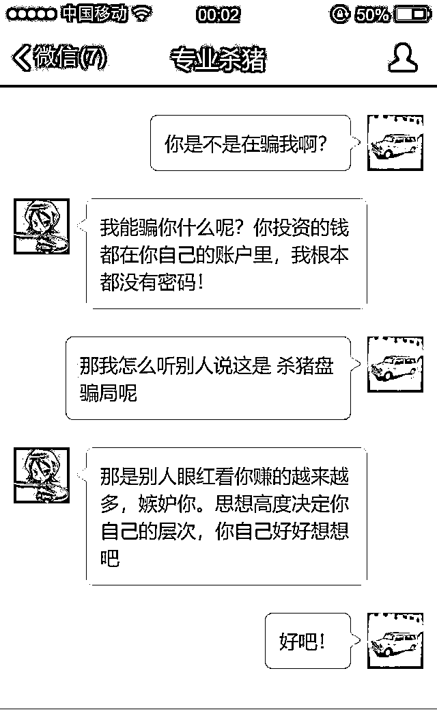

当你质疑的时候

骗子就会以一些“鸡汤文”来给你洗脑

说这是全新的盈利模式，而不是诈骗 

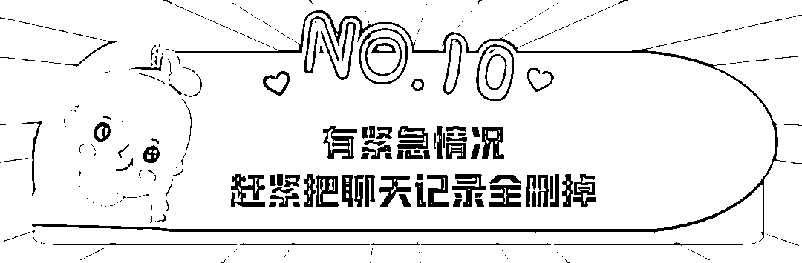

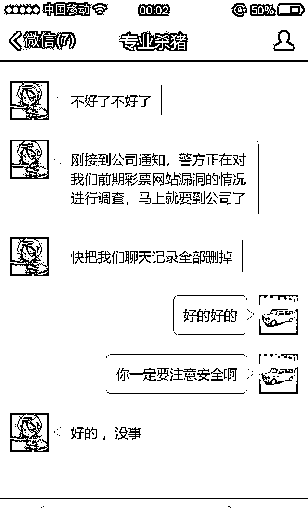

这是杀猪盘最最狠的地方 

在觉得你无钱可骗的时候，

会利用前期对你的感情铺垫，

制造一个紧急情况的理由，

让你删除所有的聊天记录。

目的是毁掉所有证据

有不少受害者，还以为自己的“恋人”被抓了，而自己没有被骗

**友情提醒**

      1、 网络交友需谨慎，特别是对那些没见过的人，尤其在涉及金钱往来时，一定要提高警惕，并与身边亲朋好友多沟通、多询问，防止落入“圈套”。

      2、 对于引导在网上玩彩票、投资、理财之类，先给尝甜头再引导继续投入的，必是骗子无疑。

      3、“天上不会掉馅饼”，所谓“低成本、高回报”往往都是骗人的幌子，一定不要贪图利益，赚钱还是要脚踏实地。

来源：十堰人民路派出所，防骗每日电讯提醒

← 向右滑动与灰产圈互动交流 →

