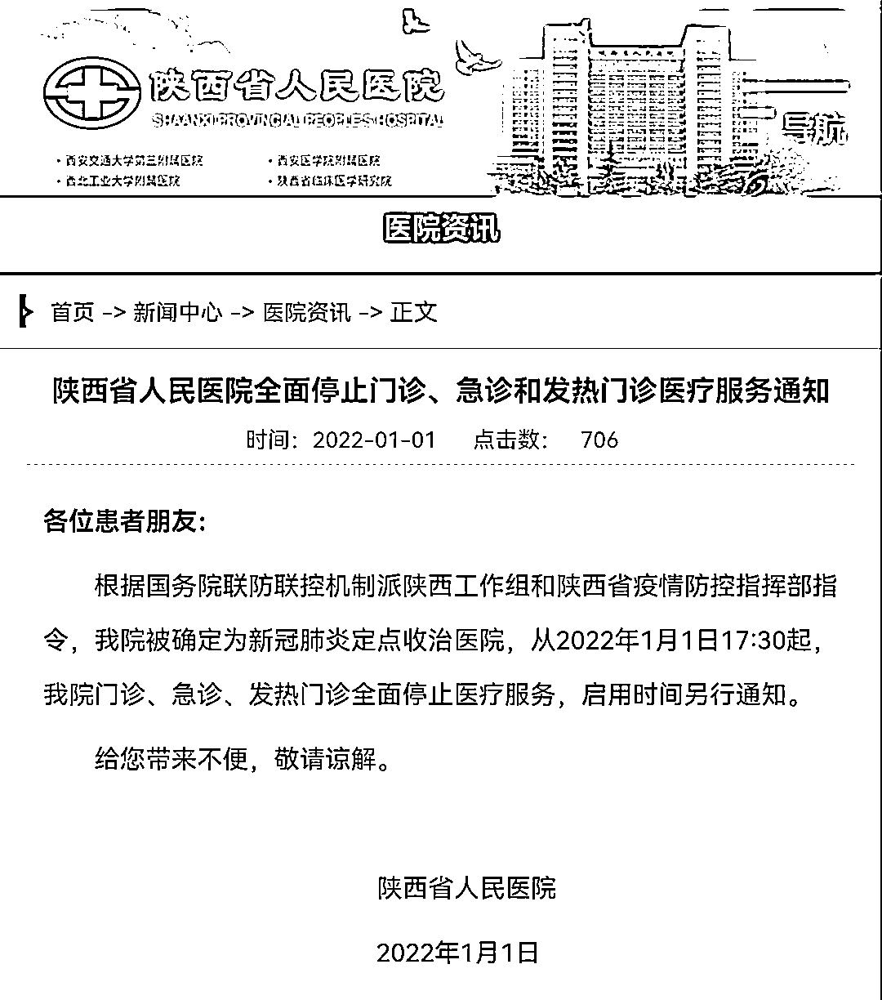

# 西安男子突发胸痛，连续被 3 家医院拒诊最终猝死

> 原文：[`mp.weixin.qq.com/s?__biz=MzIyMDYwMTk0Mw==&mid=2247527311&idx=1&sn=aa3caecbffb5da394e7c53db5b587519&chksm=97cba0b7a0bc29a130b627528ed1e7e16afd12ccd2281195e92e4626e800cb0323aa37621b0c&scene=27#wechat_redirect`](http://mp.weixin.qq.com/s?__biz=MzIyMDYwMTk0Mw==&mid=2247527311&idx=1&sn=aa3caecbffb5da394e7c53db5b587519&chksm=97cba0b7a0bc29a130b627528ed1e7e16afd12ccd2281195e92e4626e800cb0323aa37621b0c&scene=27#wechat_redirect)

39 岁的西安男子李海（化名）在 2021 年最后一天死去。2021 年 12 月 31 日凌晨 4 点 40 分，西安市第九医院给出的死亡结果是“猝死，主动脉夹层”。 

在这之前的 4 个小时，突发胸闷的李海多次拨打“120”急救电话未能打通，只能通知朋友帮忙拨打；后又因尚未拿到 48 小时内核酸检测结果，“120”急救中心医护人员表示无法送往医院；拿到核酸结果后，又相继被三家医院拒诊，直到第四家医院接收时，医生表示“抢救希望不大，放到医院床上时呼吸心跳就没有了。”

最后经过西安市第九医院医护人员 1 小时 42 分钟的奋力抢救，李海被宣布临床死亡。

（诊断证明书）

**“没有核酸证明，医院不接收”** 

1 月 6 日，李海的嫂子李女士向大河报•豫视频记者表示，李海平时很健康，没有心脏病。

帮助李海拨打“120”、目睹李海送医全经过的朋友小东（化名）和李海共同工作超过 5 年，也表示李海病情事发突然。他向大河报•豫视频记者透露了当天送医的全过程。

据介绍，39 岁的李海独自租住在西安的城中村郝家村。

“那天晚上，我们俩前几分钟还发微信，中间有 5 分钟他没有回复，我以为他睡着了，因为已经 12 点多了，我也就打算睡觉了。然后 12 点 36 分，他给我打来电话，当时他说话声音很痛苦，说胸口特别疼，但打不通 120，让我帮他打 120，我打 120 也是一直占线，但是我始终没有挂机。打通之后，急救中心工作人员说西安所有医院要求病人必须有 48 小时核酸检测证明才肯接收，但是他们愿意派救护车过去。”

（急救中心院前病情告知书）

救护车到达之后在原地进行抢救，十几分钟后小东再次打电话过去，是李海楼下的一个商店邻居接的，邻居表示，“120”急救人员说核酸检测结果没有出来，所以无法送医。这时李海疼得已经开始用头撞墙了。

小东立即从家里出发，与小区门卫、路上各个疫情防控卡点说明情况后被放行。

“120 的车在村口停着，我朋友在车下蹲着，十分痛苦。”小东到达后与“120”急救人员交涉，请求送医。

在小东拍摄的现场视频中，120 急救人员多次声明，没有核酸检测证明只能被送去“大明宫医院”，那里都是红码和黄码的病人，不想去的话只能等核酸检测结果出来，因为别的医院不接收。

经记者查询，急救人员所说的“大明宫医院”即西安交通大学第二附属医院大明宫院区，被西安市确定为风险人员省级定点医院，接收的病人都为封控区、管控区隔离（观察）人员及健康码为“黄码”、“红码”人员。

小东表示，李海是绿码，可能由于身体不舒服，未按时做核酸检测，上一次的核酸检测结果过期了，最近一次的核酸检测结果尚未公布。

视频中，“120”急救人员表示，核酸检测结果出来前，可以先把李海送回家。小东急了，“就是因为身体难受才打急救电话，送回家干啥呢？等死吗？”

经过现场商议，急救人员和小东决定先送李海前往大明宫医院，“哪怕进去之后转不出来了，要被隔离，也得先抢救人。”此时李海还能在他人的搀扶下走上救护车。

前往医院的路上，李海发现核酸检测结果出来了，是阴性，“这时他意识还是清醒的。”因此“120”救护车的急救人员选择送他前往其他的医院。

（与 120 急救人员沟通）

**连续被三家医院拒诊，救护车出车 4 小时后猝死** 

据小东介绍，他们先后去了三家医院，第一家医院是距离最近的西安交大第一附属医院，对方直接说不收患者，由于疫情原因选择封院了。

接下来，他们选择距离不远的陕西省人民医院。“救护车开到省人民医院的后门，一个守门的说已经封院，不接收病人。”

5 分钟后救护车立马掉头，去往最近的友谊医院，也就是西安医学院第三附属医院，“到了医院也是跟门口交涉了半天，医院说院里有两个肺部感染的，也没有绿码，不敢让进来，而且说他们医院比较小，就算接收了也只能做检查，没有治疗条件，不如直接去找大医院，所以又给拒绝了。又拒绝以后我没有办法，我也不清楚哪个医院能接收，急救人员他们就说去第九医院，但是第九医院在南二环，有六七公里的距离，就马上开车去第九医院。”

李海被送到西安市第九医院时已凌晨 3 点，他被顺利送进医院，扫码后直接进了急救室。“先量体温，医生说量 5 分钟体温就可以抢救，结果夹着体温计夹到第 4 分钟的时候，都说来不及了要赶紧进抢救室，做心脏复苏。这时他人还清醒的，只是很疼，我看到他在撞担架。和医生说右侧心脏疼。”

抢救约半个小时后，医生找到了小东下达病危通知单。在小东拍摄的视频中记者看到，医生告诉他，“现在病人就是猝死，我们正在抢救但希望不大，因为已经半个小时了。你一来我就说让你联系他的陪（护）人了，放到我们床上就呼吸心跳没有了。”

抢救 1 小时 42 分钟后，李海被宣布临床死亡。死亡原因为“猝死，主动脉夹层”。

小东通过报警联系到李海的家人，在 2021 年的最后一天，李海离开了人世。医院无法存放尸体，第二天也就是元旦，人就就被送往火葬场火化。李海的哥哥嫂子将骨灰带回了家。

早在 12 月中旬，就有多名市民反映，西安交大一附院突然封闭，医院曾发布公号，因疫情防控停诊封院。

1 月 1 日，陕西省人民医院也在官网发布通知，全面停止门诊、急诊和发热门诊医疗服务。

1 月 6 日，大河报•豫视频记者再次拨打陕西省人民医院、西安交大一附院等医院的电话，对方均表示，“目前无法接收急诊病人，请联系别的医院。”

来源：观察者网，顶端新闻·大河报记者

← 向右滑动与灰产圈互动交流 →

