# 女性用卫生巾是矫情？西安作协主席回应

> 原文：[`mp.weixin.qq.com/s?__biz=MzIyMDYwMTk0Mw==&mid=2247527311&idx=2&sn=0bf8ca838944acae6389586cad34b27c&chksm=97cba0b7a0bc29a1cc5b75ea352216d721339a544c9aa1abdab88605dd607335b20b44b69e45&scene=27#wechat_redirect`](http://mp.weixin.qq.com/s?__biz=MzIyMDYwMTk0Mw==&mid=2247527311&idx=2&sn=0bf8ca838944acae6389586cad34b27c&chksm=97cba0b7a0bc29a1cc5b75ea352216d721339a544c9aa1abdab88605dd607335b20b44b69e45&scene=27#wechat_redirect)

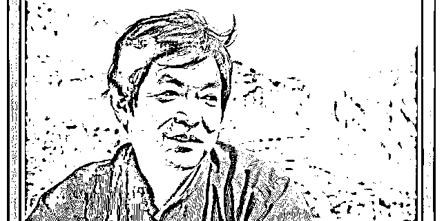

本文转载自：环球时报

1 月 5 日，陕西省作家协会副主席、西安市作家协会主席吴克敬疫情“日记”《扎在长发上的橡胶手套》里的部分语句引发了争议，他喊话此前“在酒店隔离期间哭着讨要卫生巾”的西安女子，批评其在紧要时刻“苛责别人不能上门送（卫生巾）”一事是“小姐作派”。

此文一出，随即引发争议。部分网友认为女性生理期的卫生需求是合理的，不应该被称为“小姐作派”；也有人认为当事人边求助边录视频、擅自离开隔离房间的做法有待商榷，称其应该理解防疫人员的不易。

1 月 6 日，吴克敬回应《红星连线》称，他对此也很痛苦，本来写文章是想让大家少些抱怨，让被隔离的人和一线工作人员互相理解，网友有权批评，“我现在真的没啥话说，我就想一个人，从此一句话不说，就在家看看书，也不写了。”

[`v.qq.com/iframe/preview.html?width=500&height=375&auto=0&vid=q3317i94gd0`](https://v.qq.com/iframe/preview.html?width=500&height=375&auto=0&vid=q3317i94gd0)

视频来源：红星连线

同天，吴克敬回应澎湃新闻称，文章想要表达的意思是，疫情当下，大家都不容易，在这样的环境下确实不好提供卫生巾，希望大家“不要抱怨”，也不要那么矫情。 

吴克敬表示，自己从未有过不尊重女性的想法，自己一直以来都崇拜女性。对于网友的批评，他表示，“让大家批评吧，疫情当中，还是要理解每个人。”

1 月 6 日，发布吴克敬这篇文章的微信公众账号已将该文删除。

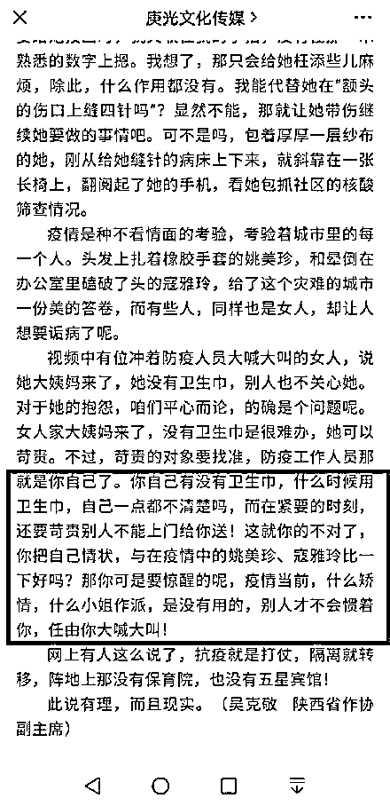

据《西安晚报》报道，吴克敬是陕西扶风人，小学毕业，曾当过木匠，后来进入西北大学作家班学习，上世纪 80 年代，他在《当代》杂志上刊发了成名作《渭河五女》。吴克敬曾任《西安日报》、《西安晚报》副总编，现任陕西省作家协会副主席、西安市作家协会主席，其所著的《手铐上的蓝花花》获第五届鲁迅文学奖中篇小说奖。

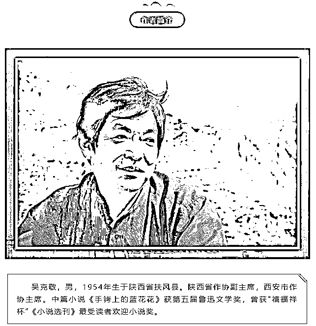

此次西安疫情发生后，连日来，微信公众号“周原文艺”（原名“陕西扶风作家”）和“庚光文化传媒”发布了多篇吴克敬所写的聚焦抗疫故事的文章，多为其看到抗疫新闻后有感而发的随笔。

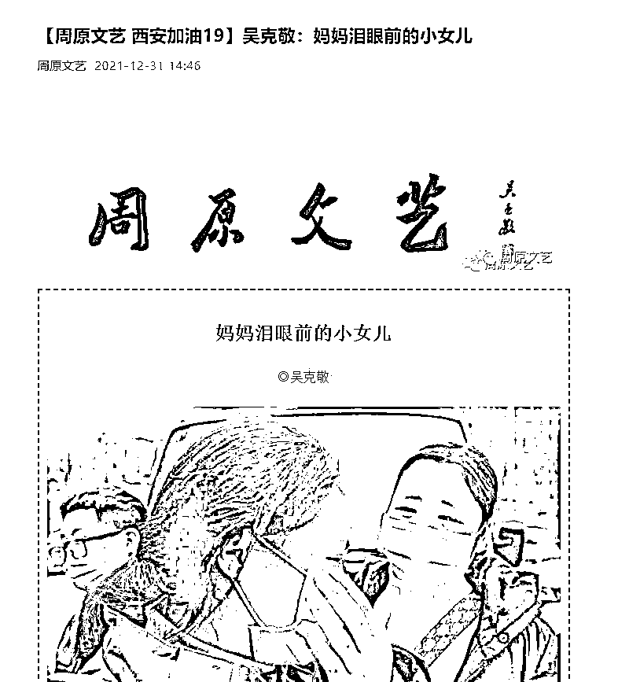

1 月 5 日，微信公众号“庚光文化传媒”发布了吴克敬的文章《扎在长发上的橡胶手套》。

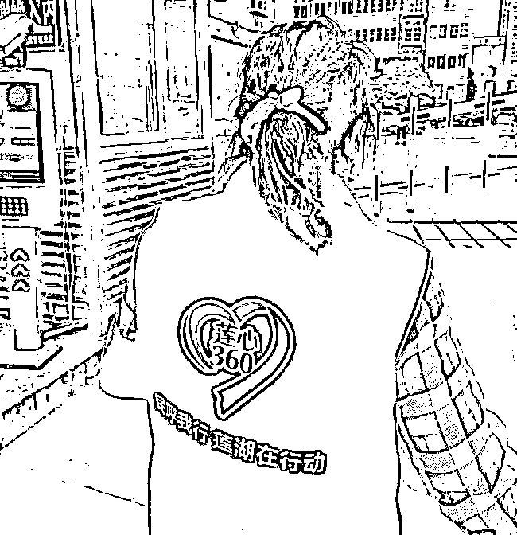

用橡胶手套扎住长发的姚美珍

在此文中，吴克敬先称赞了两位奋战在西安防疫一线的女性：一位是为防疫奔波、顾不上找皮筋而用橡胶手套扎住长发的西安市莲湖区枣园街道唐都花园社区党委书记兼主任姚美珍，另一位是连续工作 7 天后晕倒在工作岗位上的西安曲江“中心社区”和“华著中城社区”疫情防控工作的牵头负责人寇雅玲。

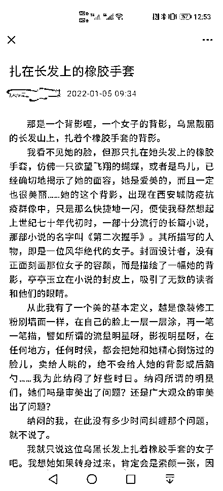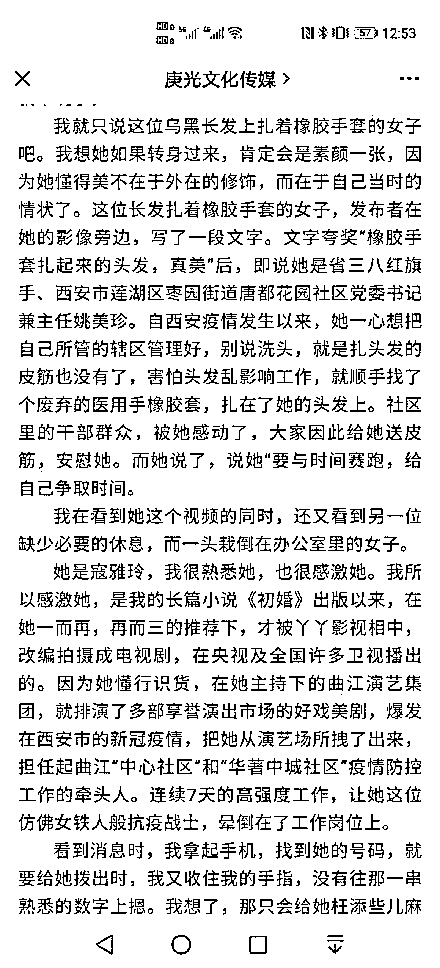

吴克敬写道：“疫情是种不看情面的考验，考验着城市里的每一个人。头发上扎着橡胶手套的姚美珍，和晕倒在办公室里磕破了头的寇雅玲，给了这个灾难的城市一份美的答卷，而有些人，同样也是女人，却让人想要诟病了呢。”

他继而提到日前“在酒店隔离期间哭着讨要卫生巾”的西安女子，称该女子大姨妈来了没有卫生巾、求助得不到回应后，她的抱怨“平心而论的确是个问题呢”，“没有卫生巾是很难办，她可以苛责”，随后话锋一转，称“苛责的对象要找准”，“你自己有没有卫生巾，什么时候用卫生巾，自己一点都不清楚吗，而在紧要的时刻，还要苛责别人不能上门给你送……疫情当前，什么矫情，什么小姐作派，是没有用的，别人才不会惯着你，任由你大喊大叫！”

此话一出，随即引发争议。

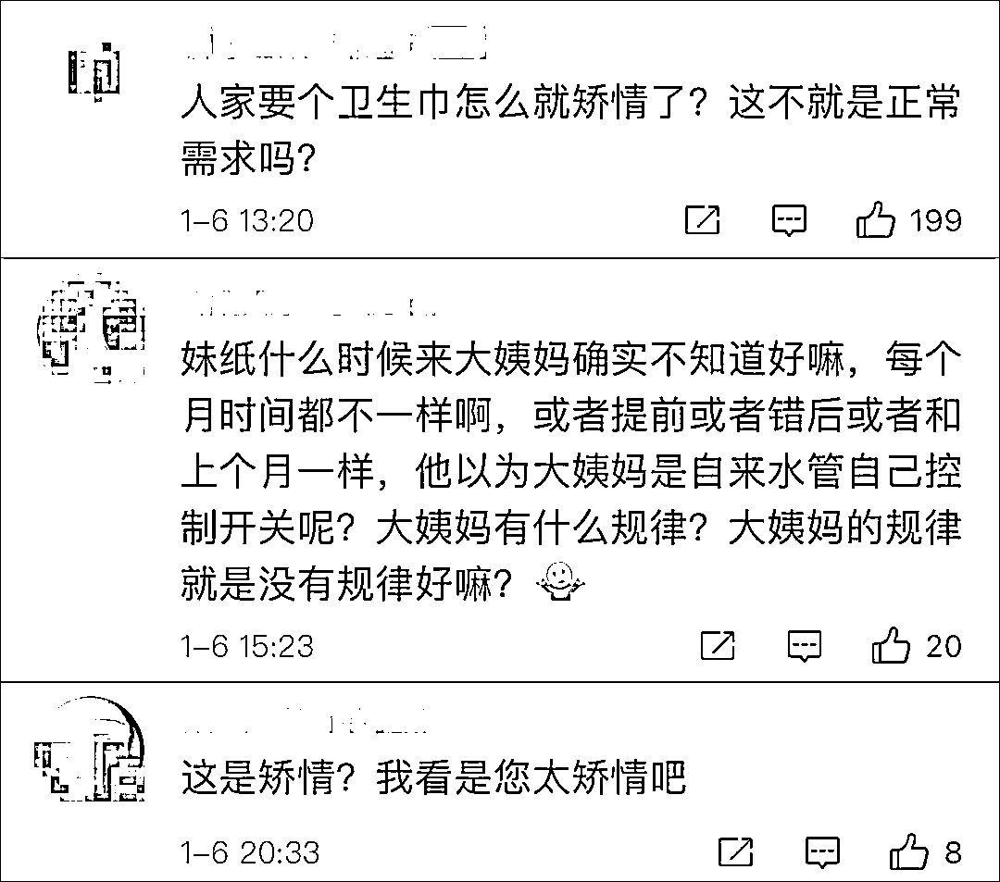

实际上，在此之前，西安女子在酒店集中隔离期间来例假、哭着讨要卫生巾并录下视频一事就曾引起了较大范围的讨论。

视频中，女子哭着对隔离点的工作人员说：“早饭到现在都没有送过来，还有，我来大姨妈了，也没有卫生巾，我来大姨妈以后就一直联系你们隔离点的人，我打供餐的电话没有人理我，疾控防疫办的电话没有人接，公班的电话没有人接，我就想问一下是没有人管吗？”

[`v.qq.com/iframe/preview.html?width=500&height=375&auto=0&vid=n3316mveqmw`](https://v.qq.com/iframe/preview.html?width=500&height=375&auto=0&vid=n3316mveqmw)

视频来源：红星连线

视频发出后在网络引发关注，不少网友转发求助信息希望帮到当事人。

不过，有人认为当事人边求助边录视频、擅自离开隔离房间的做法有待商榷，称其应该理解防疫人员的不易，更人有批其为“巨婴”。

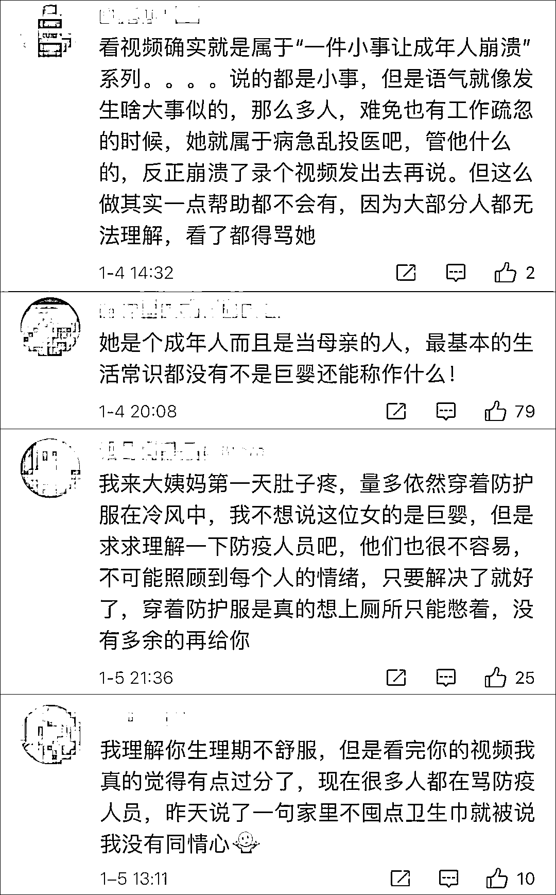

但也有人认为，身体变化不可控，集中隔离可能来不及准备好卫生巾，当事人例假期间求助无门后情绪崩溃可以理解，希望网友多一些包容。

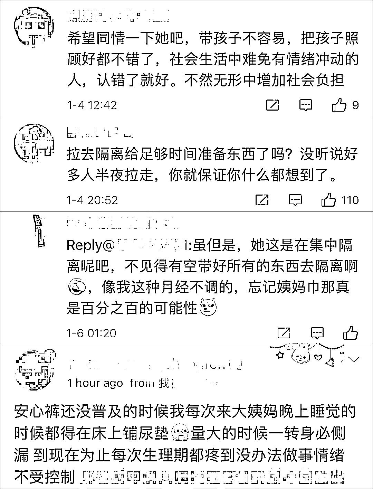

1 月 3 日凌晨，视频当事人在微博发文称，自己当时是集中隔离的第 4 天，“已经到了不用卫生棉已不行的地步，我赶紧开始联系隔离点的人想寻求帮助，因为房间的纸就剩下了一小卷，可是拨打了所有的电话都无人接听。”

该女子称：“我干了一件无比冲动的事情、我冲下了一楼，我想看到底有没有人管我，我怕因为自己当时的坏情绪会和工作人员会发生摩擦，我打开了视频或许是处于本能的自我保护意识吧。”

随后她强调，自己的问题已经全部解决了，社区工作人员凑了卫生巾送给了她，专班的工作人员也给她送来了纸、水、饭，并对自己冲下去拍视频的做法感到后悔，称防疫工作人员也处于危险之中，“甚至比我还要危险，我都不知道今天的我为什么冲昏了头脑，为了卫生棉、为了没饭吃……闹了这样一出！”

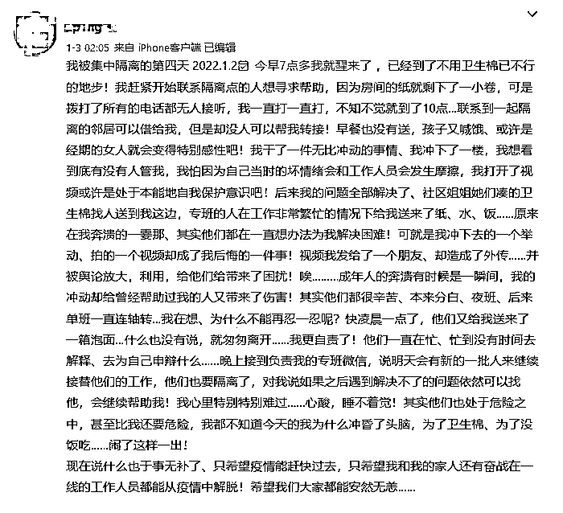

风波发酵后，该女子 1 月 4 日继续发文解释称，事发当天上午 10 点多，她下楼哭着求助，之后将录的视频给了和她一起隔离的邻居，邻居把他们在群里聊天的种种遭遇和她的视频发到了小区物业群，想以此向物业寻求帮助，没想到却被群里的人发至朋友圈，转发至网络平台。随文，她晒出了视频的录制时间和被转发的时间。

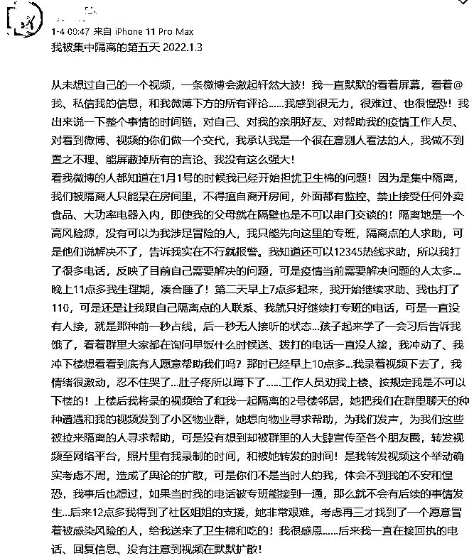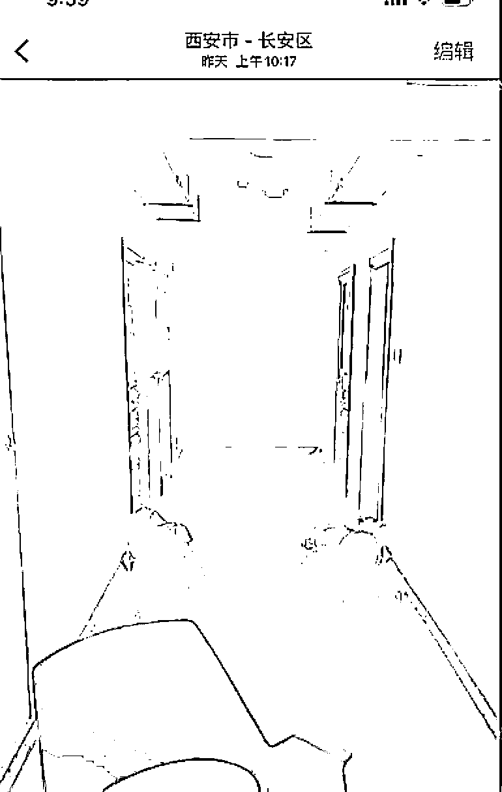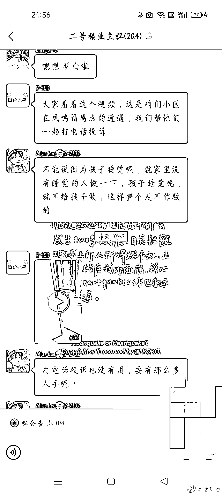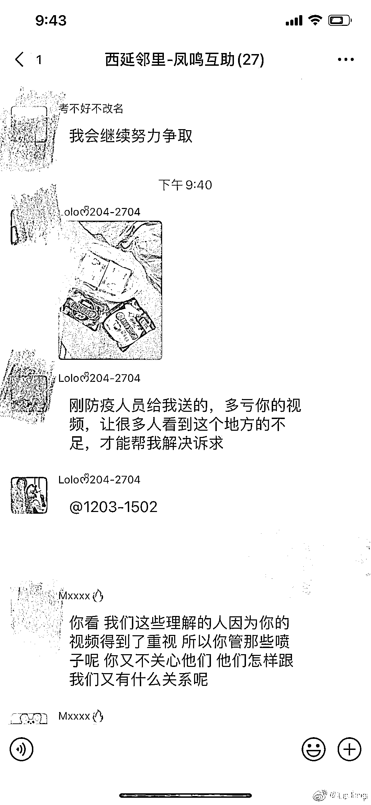

该女子称，当天中午 12 点多她得到了社区工作人员的帮助，“一个愿意冒着被感染风险的人，给我送来了卫生棉和吃的！我很感恩……后来我一直在接回执的电话、回复信息、没有注意到视频在默默扩散！”

最后，该女子称：“我的问题解决了、我很感恩，我希望所有和我面临一样困境的人问题也能被解决，因为我一个人好不叫好，大家好才是真的好！我希望大家能把我问题已解决的微博转发下去，我希望所有正能量可以得到传递，带给大家力量！”

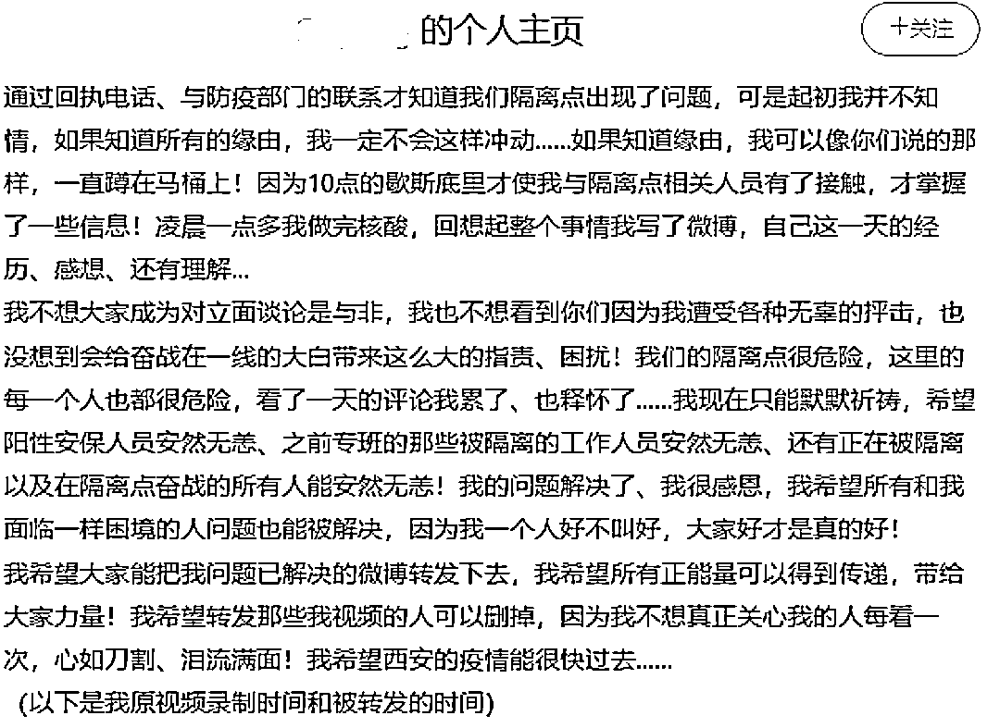

面对争议，1 月 6 日，吴克敬回应《红星连线》称，网友有权批评，他表示尊重，并透露自己已经在家隔离了 10 多天，其妻子也在抗疫一线。

“我为了这个事儿，今天很痛苦，确实没想到（影响这么大），我觉得文章就是给大家鼓劲，让大家少些牢骚，少些抱怨，因为在一线工作的人他们那么辛苦。我觉得被隔离的人和一线工作的人员相互都理解，是最好的一种方法。”

吴克敬称，现在的争议也不能说是网友误会，这是网友的权利，“网友对我的这种（批评）也是一种关爱吧，我现在真的没啥话说，我就想一个人，从此一句话不说，就在家里面看看书，也不写了。”

实际上，疫情发生以来，女性卫生用品需求一直牵动人心。据《中国妇女报》2020 年 3 月报道，中国妇女发展基金会携手爱心企业、爱心网友短期内紧急募集并定向援助了一线女性医护人员价值 1300 万元的公益物资，包括成人纸尿裤、卫生巾、安心裤和一次性内裤等。

另据《中国妇女报》2021 年 11 月报道，大连市出现疫情后，封闭管理的庄河大学城中女大学生达 9086 人，女大学生们反映：封闭管控期间，女性卫生用品的需求迫在眉睫。随后大连市妇联迅速行动，两条战线同时运转，一边发动女企联等机构筹集资金，一边派出工作人员赶往各大商超，收集所有库存，最后收集到 719 箱卫生用品，总价值为 14.43 万元。这些物资的筹集，仅用了不到一天时间。

2020 年 7 月，国务院联防联控机制曾举办新闻发布会，主题是新冠肺炎疫情防控中保障妇女和儿童健康，明确提出要关注女性的身体健康、心理需求和工作环境。比如个人防护设备应该有适合女性的大小规格，为那些从事预防、筛查、治疗工作的女性医务工作者提供必要的清洁卫生工具，如卫生巾、香皂、洗手液、手消等卫生产品，通过这些可以更好地使得女性在抗疫过程中发挥更大的持久的作用。 

来源：南风窗，环球时报

← 向右滑动与灰产圈互动交流 →

