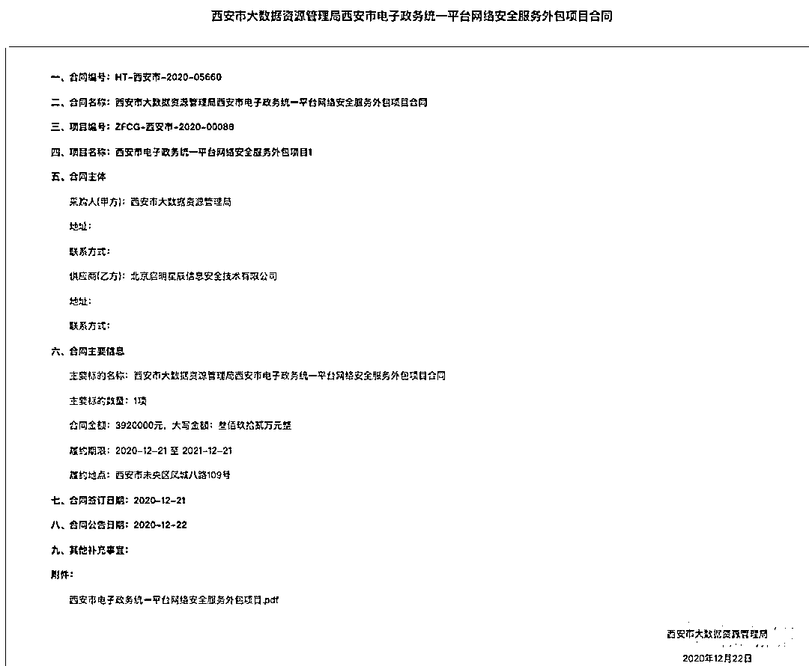

# 西安一码通“崩溃”调查：一场系统性失灵的数字政府再思考

> 原文：[`mp.weixin.qq.com/s?__biz=MzIyMDYwMTk0Mw==&mid=2247527311&idx=3&sn=d6c34cad324bf68d923f7dda9f6218ea&chksm=97cba0b7a0bc29a1091c989c4a773267d09dfce686168ac6726b54b053d6b05f464c54372ae1&scene=27#wechat_redirect`](http://mp.weixin.qq.com/s?__biz=MzIyMDYwMTk0Mw==&mid=2247527311&idx=3&sn=d6c34cad324bf68d923f7dda9f6218ea&chksm=97cba0b7a0bc29a1091c989c4a773267d09dfce686168ac6726b54b053d6b05f464c54372ae1&scene=27#wechat_redirect)

图片来源视觉中国

##### **▎****这是一起因流量过载、系统架构应对高并发不足，最终导致防火墙拦截数据无法返回的系统性故障。**

1 月 4 日，西安一码通又“崩”了，半个月崩溃两次，引发了业界关注，关于事件原因也引起外界诸多猜测。 

1 月 6 日下午 5 时许，东软集团对投资者回应事故原因时，表示该故障与东软所处应用层无关。回复称，在进行现场分析之后，专家提出：“要加强网络和信息安全，优化应急预案……防止出现网络安全事故。”等指导意见。

一位接近西安“一码通”项目的人士向钛媒体 App 表示，当下已排除应用层故障；且在故障排查和压力测试时发现，防火墙设备存在多次丢包现象。由此可以判断，出故障的防火墙不属于应用层。那么故障是由什么层面出现问题导致的？一次看似平常的健康码请求，跟防火墙有哪种关联，为什么会因为防火墙丢包造成故障？

针对上述情况，钛媒体 App 联系网络与信息安全专家李冬，据李冬判断，西安“一码通”属于政务工程，从系统安全上来说，西安市民访问西安“一码通”属于外网访问内网，二维码调后台数据用确实要过防火墙，如果并发量超过原有架构设计，确实会发生防火墙丢包的可能。

钛媒体 App 从另一位接近西安“一码通”项目人士处获悉，自 12 月 20 日“一码通”故障后，多批专家组进驻调查，形成了多份报告，**由官方最终拍板的报告尚未发布，但事实大致清楚，这是一起因流量过载、系统架构应对高并发不足，最终导致防火墙拦截数据无法返回的系统性故障。**

不过事实上，经钛媒体 App 编辑多方求证了解，在西安“一码通”故障事件中，防火墙丢包虽是最终原因，但或许并不是根本原因。在诸多供应商和事件主体中，究竟是“谁”、在哪些环节出了问题，我们也做了一次全面复盘和还原。

## **西安一码通的复杂供应商**

西安一码通的系统建设涉及基础资源层、网络层、应用层等多个专业厂商，并且据钛媒体 App 了解，这些多个专业厂商在中标合同中分属不同标的，主要标的有两个。

**一个是“疫情防控平台一码通项目（以下简称：西安“一码通”），**该项目总包为西安电信。自 2020 年 3 月西安“一码通”上线后，西安电信以招标形式分包给近十家科技公司的服务，包括开发与运维、安全相关产品与服务、引擎软件产品、短信服务、大数据可视化等项目。

**另一个是“西安市电子政务统一平台”，该项目简称为“政务云”平台。**据钛媒体 App 了解到的消息，西安“一码通”以政务云平台为技术底座，基于政务云平台搭建，其基础资源层、网络层的所需的存储、网络、计算等服务均由政务云平台输送，而西安“一码通”通过西安电信购入的服务，可以统称为“应用层”服务。

钛媒体 App 根据官方公布的公示信息统计，在应用层服务中，阿里云提供政务云和短信服务；西安东软系统集成有限公司（以下简称“西安东软”）提供“一码通”软件开发和运营维护服务；安恒信息技术股份有限公司（下称“安恒信息”, 688023.SH）提供“一码通”部分安全项目服务；美林数据股份有限公司（以下简称“美林数据”，831546.NQ）提供引擎软件产品及相关服务；中译语通科技（陕西）有限公司（以下简称“中译语通”）提供大数据可视化服务。

而在政务云平台中，北京启明星辰信息安全技术有限公司（以下简称“启明星辰”，002439.SZ）提供部分网络安全服务；阿里云也担纲了政务云平台的私有云建设。

在多类服务商纠葛下，问题也变得愈发复杂，这也导致西安“一码通”故障调查和排除的繁琐，相**关方对事故认定的说法不一。**

2021 年 12 月 20 日，西安“一码通”第一次故障时，曾有消息将故障原因指向属于应用层服务提供商的美林数据，但美林数据随即回应称：美林主要负责一码通后台，提供算法，‘一码通’运营不属于美林。

安恒信息给钛媒体 App 发来回应称，“安恒信息负责‘一码通’的一部分安全工作，保障系统不被网络攻击，到现在为止，没有发现网络攻击迹象。”

也有网友捕风捉影，分析称西安一码通的“码”采用图片形式下发，导致 CDN（内容分发网络）冲垮负载均衡。钛媒体 App 求证获悉，“二维码以图片形式下发”的分析系误读，健康码本身并不是以图片形式传输。健康码就是个 ID，通过 ID 指向数据库找出对应的信息。

最诡异的是，有传言称西安“一码通”建设是花了 27 万，让小公司几个实习生来做的项目。对此钛媒体 App 查阅官方资料得知，在西安市相关单位发布的中标公告中，确实有条公告信息符合“27 万”、“不知名”公司的条件，并且标的中也明确出现了“一码通”字眼。

***西安科学技术局创新一码通系统招标信息***

但钛媒体 App 求证发现，此“一码通”并非西安“一码通”。这项 20 几万的项目由“西安市科学技术局”主体招标，时间为 2021 年 11 月 26 日，并且公告全称为“《创新一码通系统开发项目竞争性磋商公告》”，公告明确表示该项目为以西安市创码通系统（以下简称“创码通”）为抓手，加快推动西安“秦创原”整体战略的落地建设。也就是说该项目实际是西安市“创码通”项目并非西安“一码通”。此前传言为断章取义。

## **“一码通”为何不通？**

在杂乱的信息中，有接近西安“一码通”项目人士向钛媒体 App 判断称，**问题可能在于连接“一码通”和西安政务云的安全防护机制过载，让“一码通”平台无法调用政务云上的数据，因此“一码通”一直无法加载出数据。这一说法也侧面排除了应用层故障，将问题矛头指向政务云平台以及政务云平台上的安全防护机制。**

综合多方给我们的回复，从技术上讲，“并发访问量过大触发防火墙防御阈值，同时还存在网络堵塞、丢包现象”的说法最为可靠，但无法单纯将责任归至其中任何一方。

**简单来理解则是，处于应用层的西安“一码通”在运行过程中由于流量过载，触发了底层政务云的防火墙防御机制。——两个来自不同标的的各方本来各司其职，但在实际运行过程中却成为了彼此影响的统一系统。他们看似都没有直接责任，却像蝴蝶效应一般，酿成最终故障。**

在公开信息显示的西安“一码通”事故相关的的近十位服务商中，众多争议主要集中在三家厂商——东软、阿里云和启明星辰。

东软负责西安“一码通”信息技术平台软件产品及相关平台功能定制化开发服务。据了解，起初该平台并不是为了支撑西安全员的核酸检测（核酸检测需要亮码），所以平台并没有设计与之对应的并发指标。而且在 12 月 20 日西安“一码通”出现故障后，QPS（每秒查询率）已经扩容至系统最大值 4 万，并且重新完善了代码，但这依然不足以支撑西安全城 1200 万人的集中检测并发量。

阿里云牵扯其中，不仅因为出现在一码通的采购清单中，也因为其负责西安政务云的建设。政务云核心都采用私有云方式建设，西安政务云也是如此。

前述接近项目消息人士透露，阿里云智能 DNS 解析在“一码通”中出现了解析错误问题，两条为“一码通”预留的 VIP 线路中，有一条出现故障。此外，RDS 数据库中大量慢 SQL，也导致了流量拥堵。这两个问题在后续排查中被快速解决。

但在后续求证中，阿里云一位发言人直接向钛媒体 App 否认了上述两个问题，指出云平台遭遇流量拥堵消息失实，这位发言人对钛媒体 App 回复：“阿里云在西安一码通提供的是云底层设施，没有参与上层的系统搭建。西安疫情期间，阿里云云平台运行稳定，DNS 解析和 RDS 数据库产品也并没有发生故障，我们的技术团队一直在现场重点保障。阿里云十分愿意为西安抗疫贡献更多力量。”

**“流量过载，饱和式流量冲到网络防火墙之后，导致流量被拦截，数据请求无法访问数据库，市民信息与后台数据库信息无法比对，最终导致手机端的展示系统无法显示，也就是瘫痪，这个是可以说得通的。”李冬向钛媒体 App 表示。**

据钛媒体 App 了解，西安“一码通”的网络防火墙产品由启明星辰提供。在一份 2020 年 11 月 30 日发布的“西安市电子政务统一平台网络安全服务外包项目单一来源采购征求意见公示”文件中，采购人为西安市大数据资源管理局，中标金额为 392 万元人民币，采用单一采购方式，中标方为启明星辰。

***西安市电子政务统一平台网络安全服务外包项目合同***

问题到这里并没有结束。**钛媒体 App 了解到，网络防火墙阈值是可以人为调整和设置的，即便一开始在压测时阈值设置较低，收到报警后可由工程师在后台修改调整，并不需要耗费太长时间。“但是从西安一码通的故障修复时间看（第一次故障次日修复，第二次故障约两小时修复），网络防火墙出现问题只是表象。”李冬分析，深层次原因的排查应该在架构设计是否合理，计算、存储和网络带宽资源是否充足，两个大的层面，而从以往经验来看，责任更多在前者。**

对此，截至发稿前，钛媒体 App 再次联系启明星辰，启明星辰回复称，一切以官方信息为准，目前官方信息暂未公布，同时启明星辰也否认防火墙本身出现问题。钛媒体 App 获悉，启明星辰团队目前在现场积极参与故障的修复，防火墙只是恰好成为故障爆发的弱环，超出设计本身限制。

此外，数字政府项目层层分包（运营商以及大型企业都可以作为总包方，也会互相成为彼此的分包商）也是被外界诟病的一点，这在项目层面属于正常现象。而在西安“一码通”项目中，西安电信作为项目总包，负有验收和把控项目的最终责任。仅西安“一码通”项目就涉及不下十个分包商，更不要说项目规模更大的城市类项目。如何做好分包商产品与服务质量管理，是总包以及项目主体不可推卸的责任，特别是涉及民生的关键基础设施项目。

**当汹涌的疫情成为西安“一码通”的新预设条件，这场“违背”预设的系统崩溃似乎也不那么让人意外了。**

## **现有架构应对高并发，力有未逮**

西安“一码通”的故障与多年前 12306 春运高峰宕机、双十一狂欢节淘宝与京东的宕机并无二致。不同在于，12306 与淘宝、京东的高并发是商业性的，而西安“一码通”故障涉及的是民生问题，出现在疫情防控的紧要关头。

随着数字化、信息化的推进，各种“码”被应用在生活中的各个方面。西安“一码通”这类健康码和微信、支付宝的支付码有相似之处，但支付码却甚少发生大规模宕机事件，两者的对比也有一定参考意义。

与健康码不同，支付码的投入建设周期长，并且从规划之初就采用了支持大规模、高并发的分布式架构，健康码则更多是在疫情期间紧急上马，事急从权，例如西安一码通是在 2020 年 3 月到 12 月数次招标，而在此期间西安一码通已经投入使用，类似情况在全国范围内并不少见。

其次，对疫情态势发展的预估也影响到系统建设。2020 年初，社会普遍认为新冠疫情是一次突发事件，并没有意识到事态会长期持续，自然也不会在一个“临时系统”上花费重金。相比之下，微信、支付宝的健康码则是多年来持续迭代、不断优化，才有了良好的体验。

“健康码是非常典型的阶段性突击任务，还是按照传统的建设方式去管理和推动的。初期确实很正常，但存在这面对大并发场景下的问题隐患。”浪潮软件副总经理张峰对钛媒体 App 表示。

而当相关方重视程度不够时，健康码作为一种需要持续资金投入的数字基础设施，不可能凭空完成系统架构的改进。“就好比平时是一匹马拉一辆车的货，当货变多的时候，要么换一匹更厉害的马，要么加更多的马。但只是换匹马的话，再厉害也不会增加太多的马力，更合理的做法是增加更多马。从技术上说，前者是垂直扩展，后者为水平扩展，互联网公司大多使用可水平扩展的分布式架构。”张峰举例。

然而，尽管分布式架构有诸多好处，但是其所需要的启动成本和时间也远多于单体式架构，对资源的消耗和技术的要求也更高，由单体式架构向分布式机构的重塑也并不容易，所以很多系统都是在原有架构上修修补补，这也是为什么西安“一码通”不能在短时间内实现水平扩展，一个月内连续两次出现故障的原因。

“如果是架构的问题，那么架构的改动是不能简单用‘优化’来概括的，这是个大工程，虽然不是从零开始，也等于重整。”李冬的分析也印证了张峰的判断。

综合来看，西安“一码通”全套系统的本质问题在于预设前提突变，远远超出系统设计的基础标准，系统架构改造也不足以应对大规模防控场景，从而导致系统中的各个环节危如累卵，最终汇集到防火墙处，造成连续“失码”。

## **数字政府再思考**

**回溯西安一码通连续两次崩溃事件，有一点已经很明确，这不仅仅是技术问题。**

12 月 20 日，西安“一码通”第一次发生崩溃，在当日举行的西安疫情防控记者会上，彼时西安市大数据局局长刘军表示，当日早 7 时 40 分左右，西安“一码通”用户访问量激增，每秒访问量达到以往峰值的 10 倍以上，造成网络拥塞，致使包括“一码通”在内的部分应用系统无法正常使用。

1 月 4 日，西安“一码通”第二次崩溃，时间点也很“巧合”——一位西安市民告诉钛媒体 App，1 月 4 日是西安市社会面清零的时间点，西安全市“拿出最佳状态发起总攻，攻坚拔寨推进社会面清零”。在这一目标下，当天大批市民需要核酸检测，而无论是核酸检测还是外出都要亮码。“一是疫情严重，上班点都要亮码；二是短时间内全员核酸，大批转移、大量亮码导致流量激增。哪怕是分批呢？”在重压之下，“一码通”又一次扛不住了。

钛媒体 App 联系另一位在西安定居多年的市民了解到，第一次故障发生时，西安除了基本处于正常运转状态，部分行业尚未歇业，日常进出各类场所需要亮码，所以“一码通”故障影响可能较大；但第二次故障时，西安各方都在努力实现社会面清零，大部分行业仍居家办公，只有特殊人员或需要做核酸人员在外活动，“当天听到社区大喇叭通知，说‘一码通’故障了，希望大家等系统好了再出门做核酸。但有些居民可能刚好在故障时正在排队，这些居民可能受到影响。”该市民表示。

然而，在“健康码”类应用已经在全国各省市普及的情况下，西安“一码通”短期内两次崩溃，引起了各界广泛关注。1 月 5 日，西安大数据资源管理局党组书记、局长刘军也因履职不力，被停职检查。

**复盘一码通故障原因，数字政府、政务云平台的建设还是要做好顶层设计，对于关键基础设施应该统一规划、前瞻部署，而不应该草草上马。“决定系统健壮性差别的关键，更在于建设和运营。尽管技术高低可能稍有差别，但不会造成如此不同的差异，数字政府项目支撑城市级别的流量是经过验证的，健康码的问题在于重视不足。”张峰对钛媒体 App 表示。**

从郑州特大暴雨到西安“一码通”，这些突发事件背后都反映出维护数字基础设施稳定意义重大。

**“这不是常规解决电子化的问题，而是需要提供工具化来支撑政府以不变应万变。”**一位智慧城市建设从业者对钛媒体 App 表示，面对潜在的紧急情况，首先是做好各种应急预案，然而当事态发展超出应急预案所能解决的范畴时，如何在专业信息化支撑部署完成之前，做一些工具化的支撑，实现快速应变，这可能是下一步智慧城市等领域需要着重要考虑的问题。

← 向右滑动与灰产圈互动交流 →

