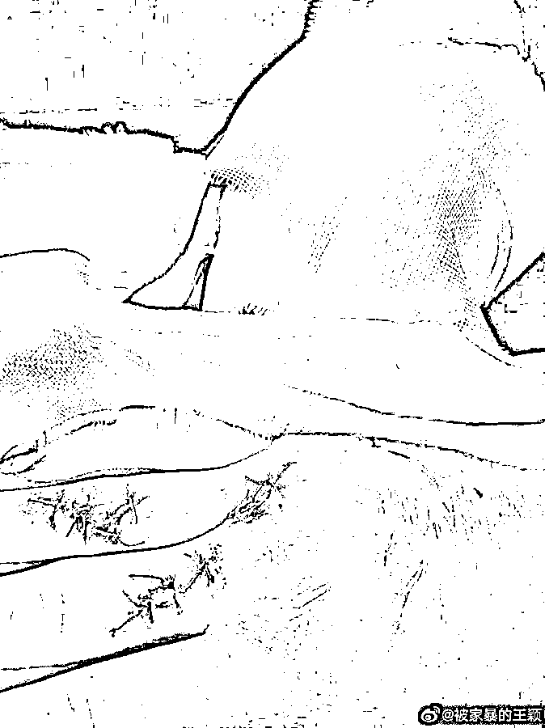

# 女子举报警察丈夫，对方回应：我又不是普通老百姓，咋可能家暴？官方已展开调查

> 原文：[`mp.weixin.qq.com/s?__biz=MzIyMDYwMTk0Mw==&mid=2247527311&idx=4&sn=585f6c32079f938d8750d09167aab6cd&chksm=97cba0b7a0bc29a1c2bab64b3ad58cec7c857a8b668f228ba2ab368e7429a99a704ff97f54b9&scene=27#wechat_redirect`](http://mp.weixin.qq.com/s?__biz=MzIyMDYwMTk0Mw==&mid=2247527311&idx=4&sn=585f6c32079f938d8750d09167aab6cd&chksm=97cba0b7a0bc29a1c2bab64b3ad58cec7c857a8b668f228ba2ab368e7429a99a704ff97f54b9&scene=27#wechat_redirect)

近日，安徽滁州。女子王颖实名举报丈夫乔某某家暴且大量财产来路不明。

王颖实名举报的乔某某是滁州市公安局琅琊分局正式在编民警。王颖在多个平台表示，乔某某此前曾多次故意伤害她，后从家暴升级为故意伤害，造成她右手中指、无名指肌腱断裂。同时王颖表示，乔某某有资金来路不明，自己手里掌握有乔某某的流水信息。

对此，有网友表示疑惑，为何王颖此前不向有关部门举报？对此王颖回复称，自己报警多次，但每次均是丈夫所在单位受理，后都无处理结果。王颖还表示，自己的孩子也被藏匿，现在想见孩子非常困难。

在王颖诸多平台的账号中，有多张其手部缝针的照片，以及一张银行流水图。流水图显示，在 2019 年和 2020 年，该账户收到过多笔汇款，其中最多的一笔达到 20 万元。

[`v.qq.com/iframe/preview.html?width=500&height=375&auto=0&vid=e33179w8jrr`](https://v.qq.com/iframe/preview.html?width=500&height=375&auto=0&vid=e33179w8jrr)

对此，乔某某则回应媒体称，“我是个警察，又不是普通老百姓，我们素质那么高，怎么可能家暴呢？她比我小十几岁，有点轻度抑郁，我疼都疼不过来。”

然而，执法记录仪显示，乔某某曾当着警察的面殴打妻子。对此，乔某某未回应。

[`v.qq.com/iframe/preview.html?width=500&height=375&auto=0&vid=z3317ds0428`](https://v.qq.com/iframe/preview.html?width=500&height=375&auto=0&vid=z3317ds0428)

6 日，警方通报称，已成立联合调查组，对王某反映情况进行调查核实。

来源：极目新闻、青蜂侠、青流视频、滁州公安在线、潇湘晨报

← 向右滑动与灰产圈互动交流 →

