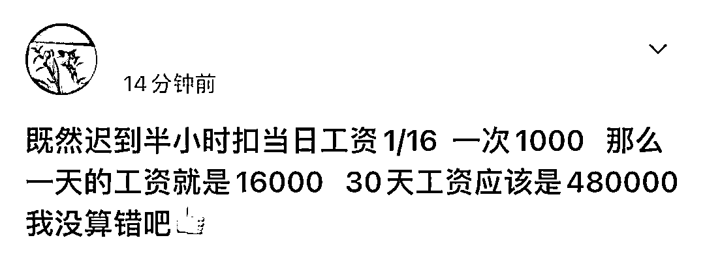
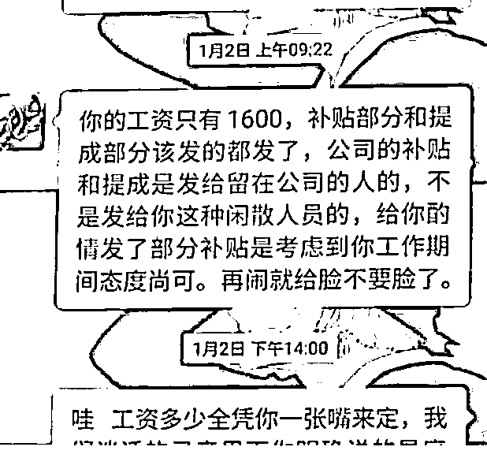

# “迟到 1 次罚 1000 让记者滚蛋”，劳动监察部门介入

> 原文：[`mp.weixin.qq.com/s?__biz=MzIyMDYwMTk0Mw==&mid=2247527311&idx=5&sn=857d3e5e80ae05338e118d92396f2a75&chksm=97cba0b7a0bc29a142b1cbf5476b4870863b6bba462279dbcb9e6ccb55e9743c78943364320a&scene=27#wechat_redirect`](http://mp.weixin.qq.com/s?__biz=MzIyMDYwMTk0Mw==&mid=2247527311&idx=5&sn=857d3e5e80ae05338e118d92396f2a75&chksm=97cba0b7a0bc29a142b1cbf5476b4870863b6bba462279dbcb9e6ccb55e9743c78943364320a&scene=27#wechat_redirect)

*   近日，安徽一公司“迟到 1 次扣 1000 工资”事件引发关注，当事人许总回应称：希望回到法制本身，不要采取不好的引导。

*   公司大股东李总道歉：愿意接受调查，许总爆粗口因为不知道记者真假，愿意接受批评和相关部门调查。

*   当地劳动监察部门回应，已让单位提供考勤、绩效等证据。

[`mp.weixin.qq.com/mp/readtemplate?t=pages/video_player_tmpl&action=mpvideo&auto=0&vid=wxv_2213590067489619968`](https://mp.weixin.qq.com/mp/readtemplate?t=pages/video_player_tmpl&action=mpvideo&auto=0&vid=wxv_2213590067489619968)

澎湃新闻记者：祝文博 编辑：唐燕丽 素材来源：安徽电视台 责任编辑：周琦

1 月 4 日

在安徽子任生物科技有限公司 

上班的小程反映 

去年 11 月份因为迟到 3 次 

被扣了 3000 元

因为质疑罚款缺乏依据

向当地媒体投诉

合肥蜀山区一公司员工反映，他迟到一次被扣 1000 元。来源：安徽广播电视台

事件引发网友围观

有网友认为

这样罚太重

迟到几次可能

一个月工资都倒贴进去了

也有人认为

该员工多次迟到

自身也有问题

公司的前员工表示

放假比登天还难 

每天工作 14、15 小时 

还没有加班费 

安徽电视台记者采访时

被该公司负责人许总骂“滚蛋” 

且被要求出示“节目备案” 

还要说出领导名字 

该公司负责人接受最新采访表示

“不管大家认为我的公司怎么样

或者我这个人怎么样

希望回到法制本身

不要采取不好的引导”

[`mp.weixin.qq.com/mp/readtemplate?t=pages/video_player_tmpl&action=mpvideo&auto=0&vid=wxv_2213589338838351874`](https://mp.weixin.qq.com/mp/readtemplate?t=pages/video_player_tmpl&action=mpvideo&auto=0&vid=wxv_2213589338838351874)

澎湃新闻记者：祝文博 编辑：唐燕丽 素材来源：安徽电视台 责任编辑：周琦 

该公司大股东李总也表示 

如果有错

愿意接受相关部门的调查

如果没有错或存在争议 

也希望回到法制上 

同时为许总的“爆粗口”行为

向记者道歉

当地劳动监察部门回应 

不管是新创业还是什么 

都要依法依规

[`mp.weixin.qq.com/mp/readtemplate?t=pages/video_player_tmpl&action=mpvideo&auto=0&vid=wxv_2213635154881888256`](https://mp.weixin.qq.com/mp/readtemplate?t=pages/video_player_tmpl&action=mpvideo&auto=0&vid=wxv_2213635154881888256)

澎湃新闻记者：祝文博 编辑：唐燕丽 素材来源：安徽电视台 责任编辑：周琦

对于该员工被扣罚工资问题

已让该公司提供考勤记录 

绩效考核标准等证据 

来源：澎湃新闻综合祝文博/澎湃新闻、安徽电视台、网友评论

← 向右滑动与灰产圈互动交流 →

