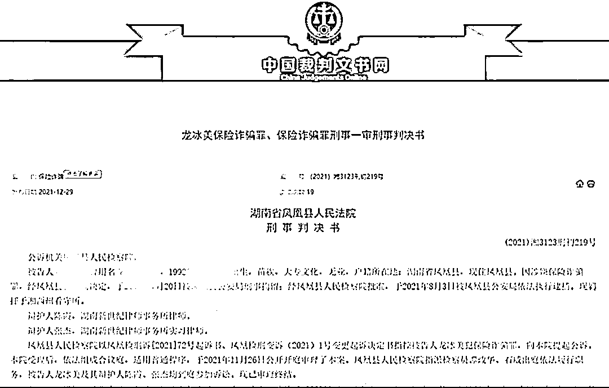

# 湖南一女子为还欠款，挥斧自剁脚趾骗保 43 万！曾约人制造车祸遭拒

> 原文：[`mp.weixin.qq.com/s?__biz=MzIyMDYwMTk0Mw==&mid=2247527311&idx=6&sn=89f90a8541169f9a89a1ec556a7ac00e&chksm=97cba0b7a0bc29a1b8d796653c49a6a0979efa7bab6da0f1a98c2ba6d2169a9410217cd7bfd6&scene=27#wechat_redirect`](http://mp.weixin.qq.com/s?__biz=MzIyMDYwMTk0Mw==&mid=2247527311&idx=6&sn=89f90a8541169f9a89a1ec556a7ac00e&chksm=97cba0b7a0bc29a1b8d796653c49a6a0979efa7bab6da0f1a98c2ba6d2169a9410217cd7bfd6&scene=27#wechat_redirect)

[`mp.weixin.qq.com/mp/readtemplate?t=pages/video_player_tmpl&action=mpvideo&auto=0&vid=wxv_2213873165913718789`](https://mp.weixin.qq.com/mp/readtemplate?t=pages/video_player_tmpl&action=mpvideo&auto=0&vid=wxv_2213873165913718789)

2021 年 2 月 24 日，30 岁女子龙某向田某借款 6 万元后被网络诈骗。因无钱偿还，她曾邀约田某合谋制造车祸骗保，被田某拒绝。

同年 4 月 6 日至 4 月 10 日间，龙某主动与 6 家保险公司的业务人员联系，花 1.3 万元左右，共计购买了 17 种意外伤害保险和 1 种其他保险。

同年 4 月 13 日，龙某以搬新家为名，多次邀请田某等到其位于凤凰县沱江镇滕子坪 XX 号租住房吃饭。龙某双脚穿凉鞋，左手持斧头在厨房独自砍猪脚时，斧头意外脱落，但未对其脚部造成任何伤害。此时，龙某便产生了通过将其脚趾砍伤的方式骗取保险金的想法，随后，龙某左手持斧头对着自己左足第四、第五根脚趾砍去，造成其左足第四、第五根脚趾被齐根砍断，后龙某大声呼叫，田某等人查看伤情后拨打了 120 急救电话送医。期间，龙某通过微信或电话联系各保险公司业务员报案，谎称自己意外受伤。

十天后，龙某分别向保险公司申请理赔，理赔金额达 43 万元。

同年 7 月 6 日，经湖北同济法医学司法鉴定中心鉴定，龙某左足损伤系锐器作用所致，与其所诉左手持斧头意外脱落致伤方式不相符。

2021 年 7 月 19 日 9 时许，龙某被凤凰县公安局依法传唤到案。

湖南省凤凰县人民法院认为，龙某故意虚构其左足意外致伤的事实，向保险公司申请意外保险理赔，骗取保险金额共计 43 万元，数额巨大，其行为已构成保险诈骗罪，依法判处有期徒刑三年，缓刑四年，并处罚金人民币 5 万元。

来源：极目新闻、晨视频

← 向右滑动与灰产圈互动交流 →

