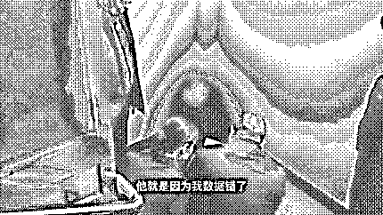

# “即使 17 万都被骗了，我也认了，我要马上转账......”

> 原文：[`mp.weixin.qq.com/s?__biz=MzIyMDYwMTk0Mw==&mid=2247527311&idx=7&sn=ef3159cfbeb2c28d51fc197f0ef9d432&chksm=97cba0b7a0bc29a12b3610ffe3c1e1353f5969e94b628ac9ce5736a3d10b868cafbe9e25d770&scene=27#wechat_redirect`](http://mp.weixin.qq.com/s?__biz=MzIyMDYwMTk0Mw==&mid=2247527311&idx=7&sn=ef3159cfbeb2c28d51fc197f0ef9d432&chksm=97cba0b7a0bc29a12b3610ffe3c1e1353f5969e94b628ac9ce5736a3d10b868cafbe9e25d770&scene=27#wechat_redirect)

“ 当一个人处于不能克服无法避免的痛苦中时，就会爱上这种痛苦，并把它看成幸福。”

——**弗洛伊德**

**先来看看下面这段**

**让人匪夷所思的画面**

湖北恩施利川县的刘女士蜷缩在楼道间，急切地说：**“即使 17 万都被骗了，我也认了，我要马上转账......”**

**当时，刘女士的母亲打了她两下，却无法将其从骗局中唤醒。**

事情是这样的。12 月 11 日，刘女士在**抖音平台**上刷到一个兼职刷单的广告。想到自己有空，她就联系了作者，并在其指导下下载了名为**“植树”**的 APP，随后加入两个聊天群进行刷单和抢单。

完成任务后，“导师”告知刘女士，因出现数据纰漏导致其任务失败，补救方式为继续**充值刷单**。在“导师”的诱导下，刘女士借钱充值 9 万余元。可是，平台仍以其刷单时数据错误为由，拒绝提现。

这时，刘女士慌了。**她一边报警求助，一边继续联系“导师”。**“导师”给了刘女士一个银行账号，让她在 16 时前转账 6 万元便可直接提现 17 万元。于是，**刘女士四处借钱准备转账。**

接到报警后，派出所民警判定刘女士遭遇了诈骗，立即赶往其家中进行劝阻。

民警给刘女士详细讲解了刷单骗局，并说明所谓的“导师”就是骗子。**但刘女士一直强调自己没错，“导师”也没有骗人，坚持要继续转账。**

**民警和刘女士的父母苦口婆心地劝阻，但她仍然不肯配合。眼看快到 16 时，刘女士急得直跺脚。民警只得将她的手机暂时交由其母亲保管，这才出现了开头视频中的那一幕。**

**随后，民警将刘女士带回派出所，继续劝阻其转账。反复讲解诈骗知识后，刘女士才放弃了转账念头。**

****

**担心刘女士情绪无法平复，12 月 15 日，民警邀请辖区反诈志愿者官女士来到派出所，以相似被骗经历现身说法向刘女士揭秘骗局。** 

**经民警、反诈志愿者再次讲解，刘女士终于彻底醒悟过来，说着：**“我错了，这次被骗，我一辈子都忘不了！** **

**** 

****

****

**现实生活中**

**亲友、民警反复劝阻**

**受害人坚持转账的案例**

**还真不少**

****他们为何执迷不悟****

****又是如何被骗子洗脑的？****

**赶紧跟着小编**

**了解骗子下手的“突破口”**

**巩固心理防线**

**才能抵御很多骗术**

**利用记忆曲线**

**重复虚假信息**

**现在人们都有一定的提防心理，骗子不会让人立刻掏钱参与所谓的项目，而是默默地做心理铺垫——**培养人们对某个产品或项目的好感和记忆反应，让人在想到赚钱时，会情不自禁地联想到这些信息。******记忆曲线，又称遗忘曲线或艾宾浩斯曲线。人们在认知和学习的过程中，随时伴随着遗忘，学习最初一段时间的遗忘速度很快，之后会逐渐缓慢，大约在七天以后遗忘掉大部分信息。但如果这期间不断重复这些信息，则一周后能记住大约 86%的信息，并转化为长时记忆，深刻地印在脑子里。****骗子利用这种记忆规律，不断通过重复信息来洗脑，强化记忆，让受害者在有需要的时候，能够第一时间想起他们。所以，**如果有人非常积极地不断向你重复某些固定信息，你可能需要当心他的用意。****

**利用补偿心理**

**给予小恩小惠拉近关系**

**骗子都是操控人心的高手，知道仅输出信息，老百姓不会买账，于是**通过主动施加小恩小惠来取悦别人。******个体在适应社会生活时，总希望达到一种平衡。大多数人有互惠的心态，感激之余总想回报别人的善意。当骗子介绍情况的时候，很多人出于补偿心理和要面子的心态，即使有些疑虑，多少也会尝试一下。****比如，受害人开始刷单时，连续几单及时获得了返利，对“导师”产生了信任，后面会毫不犹豫地接下大额刷单任务，从而误入诈骗陷阱。******骗子的江湖套路很深，往往通过拉近关系，套出对他们有利的信息，从而方便开展骗局。****

**利用个体焦虑**

**深挖目标人群的痛点**

**每个人都有不足和弱点，甚至这些痛点还有共同性，**骗子利用人们的恐惧心理，故意制造恐慌，让其丧失理智。******比如，声称是某某公安局的办案民警，准确说出受害人的身份信息，出示伪造的警官证、通缉令等资料，让其相信自己真的涉嫌违法犯罪了，于是任其摆布，将所有资金转入所谓“安全账户”，以此洗脱自身嫌疑。这就是冒充“公检法”骗局。****如果这时候心情焦虑，被情绪左右，你就很容易上当。所以，**学会稳定自己的情绪，用理性思考问题，能更好地避免被骗子牵着鼻子走。****

**利用从众心理**

**制造争抢的假象**

**为了适应社会生活，人们会不自觉地想要保持和群体的一致性，在群体的压力或影响下放弃自己的观点或想法，也就是我们常说的“从众心理”。这样的心理特别容易受到骗术影响。****一些骗子会让内部人员来当“托儿”，制造出热闹繁荣的假象。他们经常说的是：**“你看别人都在做！”“这么多人都选这个，错不了！”“我们肯定是拉着你一起发财，几百个人都报名了，你看你的熟人都在做，你做不做？”**他们甚至用时间紧迫来催促，让人没有足够的时间去询问他人和做慎重考虑。如果你习惯于凡事听别人的意见，不善于从自己的实际情况出发来思考问题，就很容易中招。****这就可以解释为什么有人被骗了才发觉“整个群里除了自己，其他全是骗子”的现象。**

**封闭信息渠道**

**制造思想控制**

**这类方式主要见于一些控制人身的洗脑。他们切断了受害者与外界的联系，不让受害者随便上网、看电视、读报纸或打电话通信。****人们被骗子严密地监视，一举一动都要向他们报告。同时，通过频繁地、长期地开展信息轰炸，给与人以各种消极暗示，使人逐渐麻痹，思想缺乏独立和批判的能力。****民警上门劝阻受害人转账的时候，常常看到这样的现象：他们常常把自己锁在房里，或者到酒店开房，长时间接听骗子的电话。******在信息封闭的环境下，人们容易产生高强度的心理压力和绝望的情绪，会被动认同控制方的一切思想和观点。******更不幸的是，一些人会发展为斯德哥尔摩综合征，反过来为骗子开脱、依赖和协助骗子进行人身监控，被骗者会完全按照骗子的意志来行事。**

**来源：平安恩施、湖北反诈中心、阻击诈骗**

****

**← 向右滑动与灰产圈互动交流 →**

****