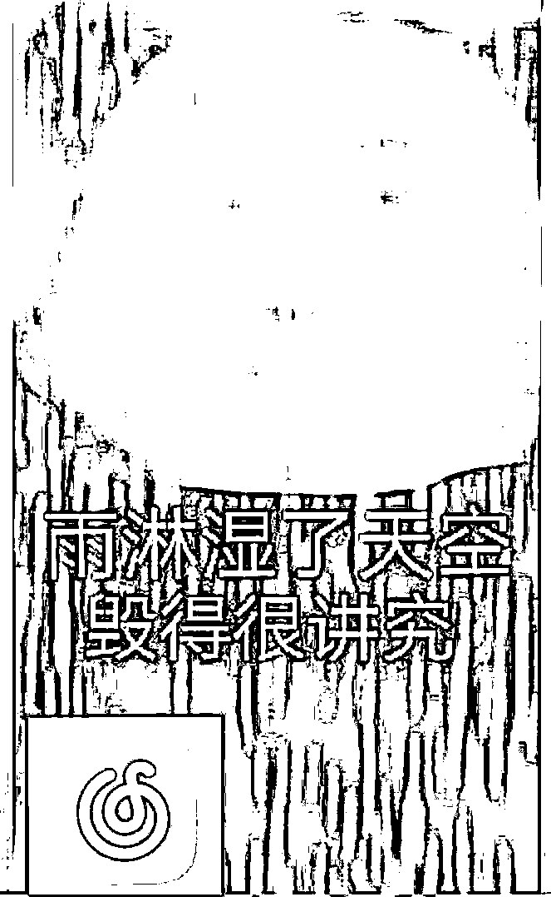
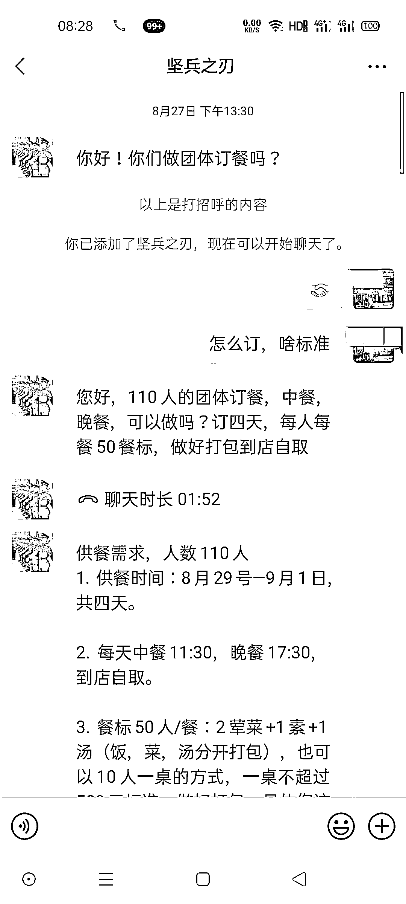
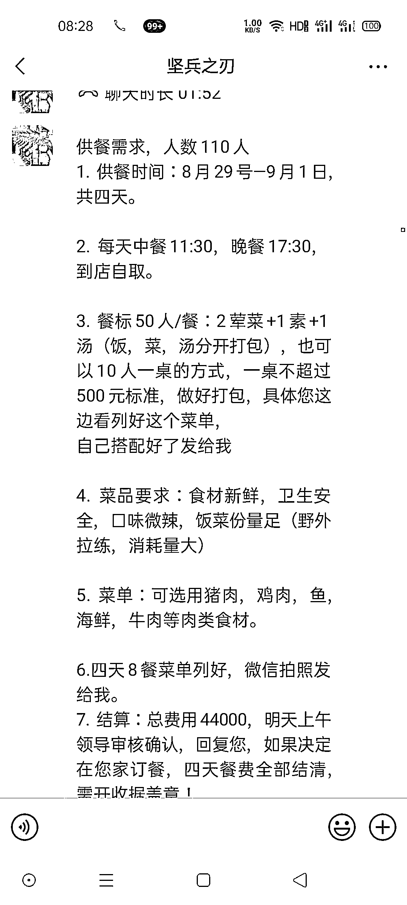
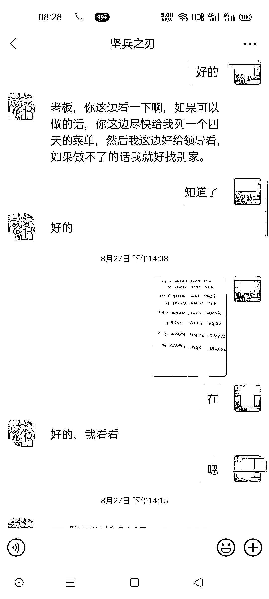
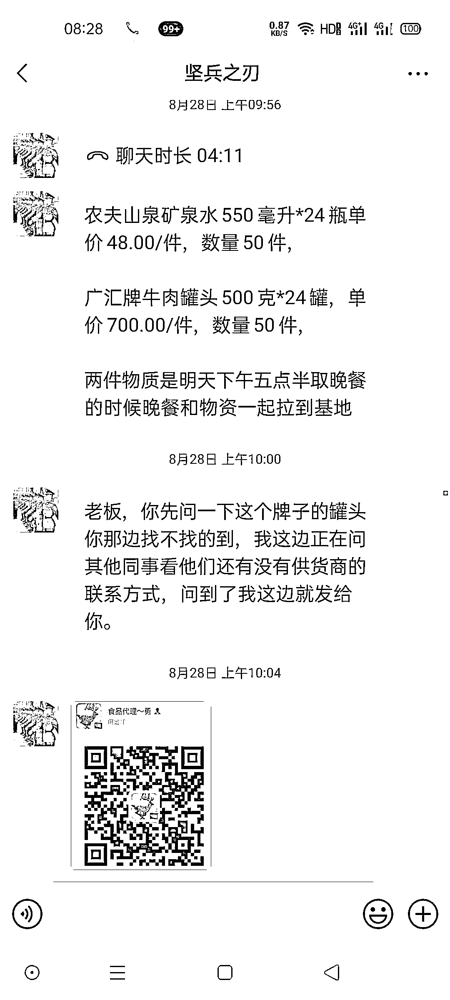
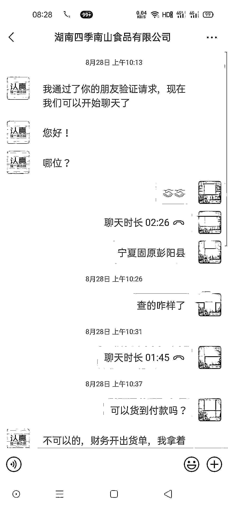
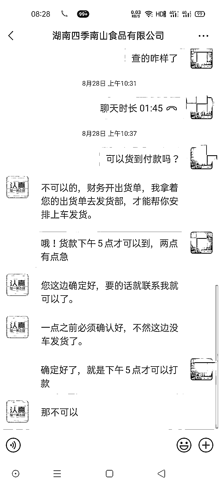
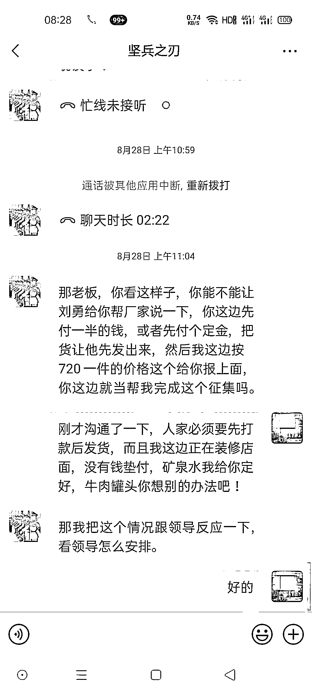
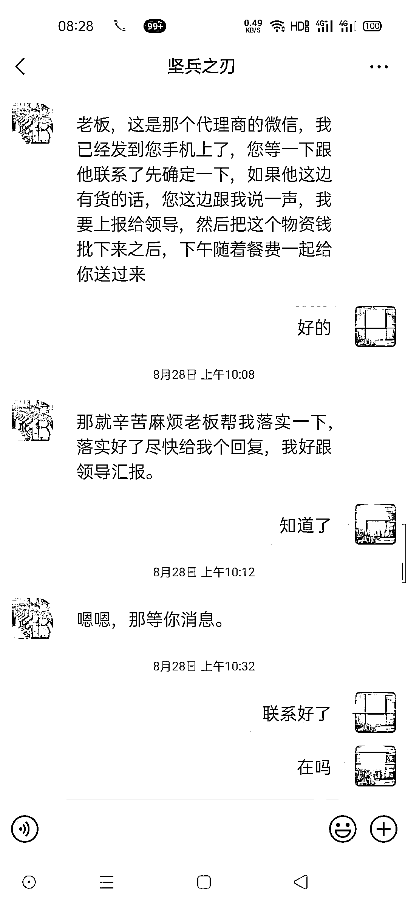
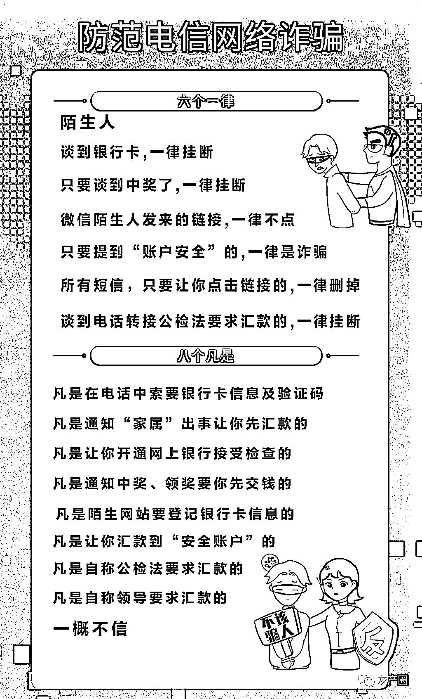

# 骗术升级！冒充“军人”订餐诈骗来袭，官渡已有两人被骗上万元

> 原文：[`mp.weixin.qq.com/s?__biz=MzIyMDYwMTk0Mw==&mid=2247527311&idx=8&sn=1b3f749d047a395fa25ce09906f7dc5f&chksm=97cba0b7a0bc29a12b371a233b6831aaf6eec393706b31d1cc5f2affe6c854166afd42e0f50b&scene=27#wechat_redirect`](http://mp.weixin.qq.com/s?__biz=MzIyMDYwMTk0Mw==&mid=2247527311&idx=8&sn=1b3f749d047a395fa25ce09906f7dc5f&chksm=97cba0b7a0bc29a12b371a233b6831aaf6eec393706b31d1cc5f2affe6c854166afd42e0f50b&scene=27#wechat_redirect)

“你好，我是某部队采购处处长，

我们想采购一批驻训帐篷。”

“喂，我是某部队后勤军人

我们想订餐，可以详谈吗？”

当你听到这类大额订单消息

你接不接单？

他们都选择接单

结果……

2021 年 11 月

官渡区高先生

接到一个微信好友申请

对方自称**武警某部军人**

需要向其订 3 天的餐

每餐每个人标准为 50 元

 之后又让高先生购买某品牌的罐头 50 件

并提供了“罐头商家”的微信

对方自称是厂家需要对其转账

高先生信以为真

立即往对方提供的账户转账

谁知对方又要求继续转账购买

高先生才发觉被骗

**损失 2.8 万余元**

无独有偶

2021 年 11 月

官渡区李女士

收到一个微信好友申请

对方自称是**某部队军人**

对方称最近在拉练需要向李女士订餐

以及代购若干牛肉罐头

并提供了“罐头商家”的微信 

添加微信后

李女士按照要求转账

转账结束被拉黑后

李女士才意识到被骗

**损失 1.5 万余元**

**骗局揭秘**

此类诈骗是之前“冒充军人、消防员”诈骗的“升级版”。**这类诈骗主要针对的是商户，前些年骗子多以采购帐篷、高低床等物资为由，如今骗子则打着订餐的旗号。**

**从采购物资到订购团体餐**，虽然诈骗的由头变了，但其实骗子的诈骗套路大同小异。

骗子利用群众对军人的信任，以大额订单为诱惑，为被骗群众提供所谓的“厂家”联系方式，群众在与“厂家”联系过程中，对方便以收取“定金”为由诈骗群众资金。

**01**

**批量订单骗取信任**

骗子会对自己的微信头像、昵称、朋友圈等进行前期包装，**一般会使用军人特色的昵称和头像骗取群众信任。**添加群众微信后，以**订购“团体餐”为诱惑**，从而引导群众落入骗子“陷阱”。

如今餐饮从业者的手机号等信息可以从“某团”“某了么”等外卖平台轻易获得，所以当有人准确添加您的微信号时，千万不要惊慌。

**02**

**声称需某品牌罐头**

当骗子感觉到群众已经对其信任后便会称需要某些特定产品，让老板帮其准备。

为了这笔大订单，很多人都会选择铤而走险，进行进一步了解。

**03**

**二号角色“厂家”出现**

这里所谓的**“厂家”其实就是骗子本人或其同伙**，只不过多用了一个微信号而已。

“厂家”的出现标志着骗局已经要进入“收网”状态了，“军人”与“厂家”联合诈骗的套路开始上演。

一边是必须要有这种罐头，另一边是必须支付“定金”或“货款”，还不支持“货到付款”。

（“厂家”与群众聊天记录）

（骗子与群众聊天记录）

这种情况会让群众很为难，一旦群众防范意识差，为了挣“大额订单”，会很容易被骗。

**04**

**一旦转账就会拉黑闪人**

如果一旦餐饮店老板反诈意识较弱，答应支付“定金”或“货款”，骗子收款后会立即将其拉黑，玩失踪。

 **反诈民警提醒** 

未确定陌生网友身份时

一定要保持警惕

牢记“**六个一律**” “**八个凡是**”

**任他套路怎么变，以不转账应万变**

来源：昆明反电信网络诈骗中心，利箭在行动

← 向右滑动与灰产圈互动交流 →

