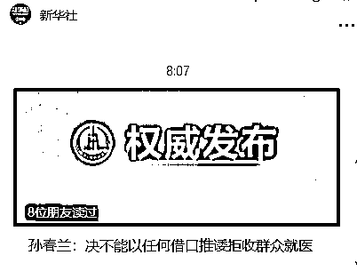
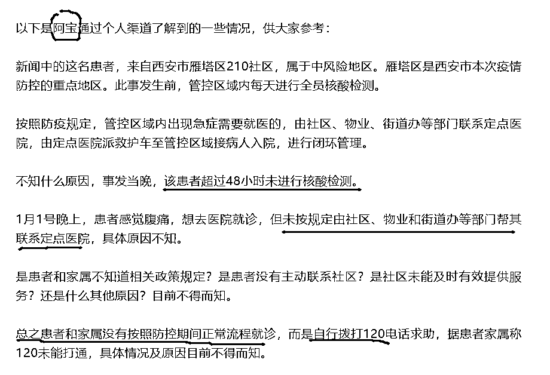
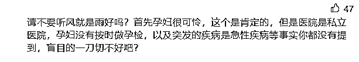
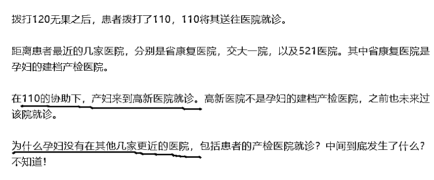
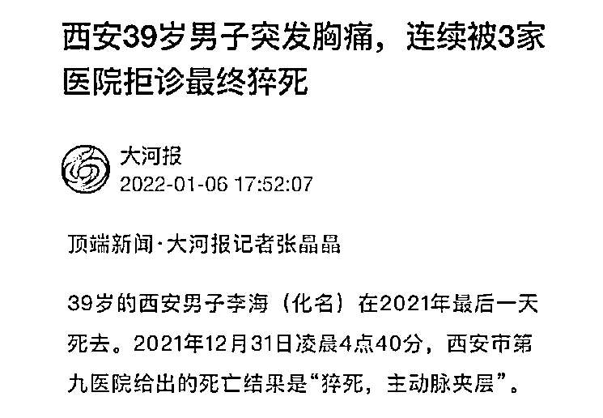
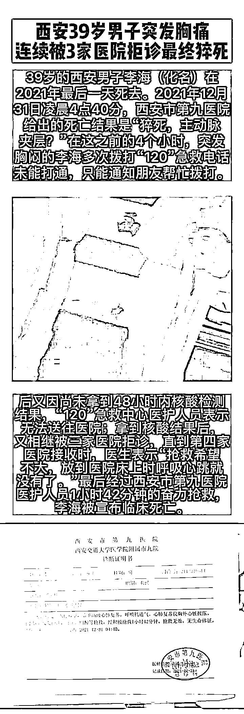
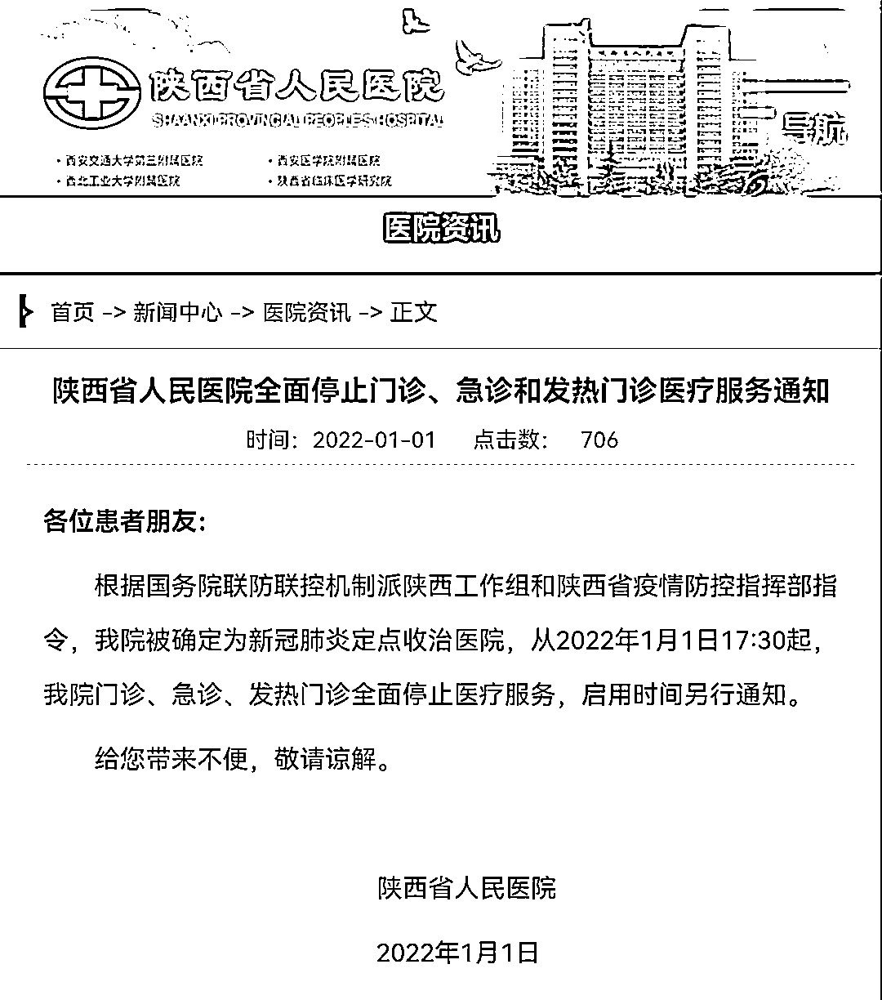
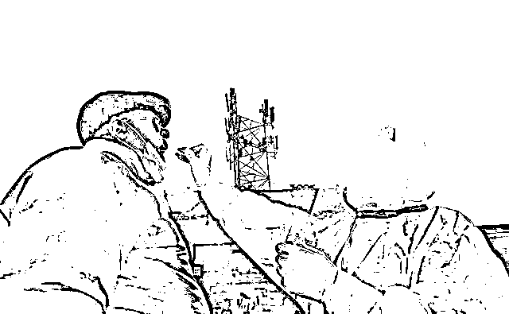
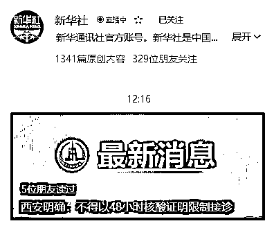
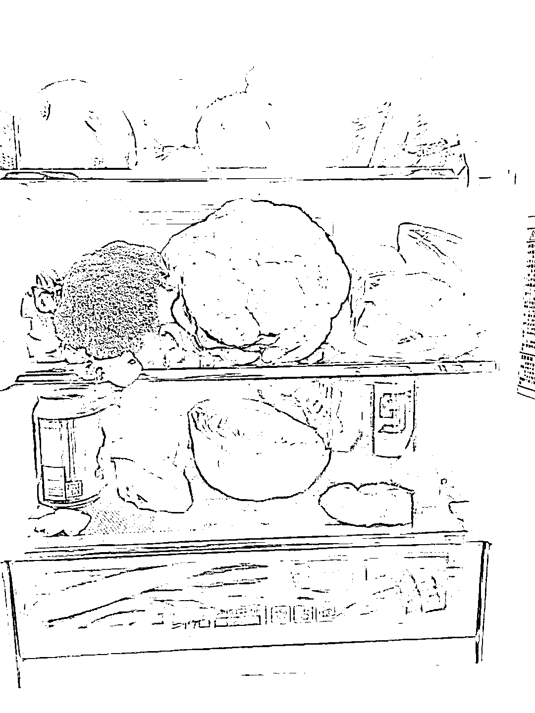

# 副总理“深感愧疚”！西安孕妇仅仅是流产吗？更残忍的事还是发生了

> 原文：[`mp.weixin.qq.com/s?__biz=MzIyMDYwMTk0Mw==&mid=2247527395&idx=1&sn=226240a73b68fa5dbfed4fe73b6667cb&chksm=97cba0dba0bc29cd6a554c3f78eda3ef4f80f387e3662b6010a7736c09666f21db4275ed00b7&scene=27#wechat_redirect`](http://mp.weixin.qq.com/s?__biz=MzIyMDYwMTk0Mw==&mid=2247527395&idx=1&sn=226240a73b68fa5dbfed4fe73b6667cb&chksm=97cba0dba0bc29cd6a554c3f78eda3ef4f80f387e3662b6010a7736c09666f21db4275ed00b7&scene=27#wechat_redirect)

据新华社报道，孙春兰副总理 1 月 6 日在西安召开专题会议，部署医疗服务保障工作。

她指出，

**发生这样的问题十分痛心、深感愧疚**，暴露出防控工作存在不严不实的问题，教训深刻。疫情防控本身是为了人民的健康、为了护佑每一个生命。医疗机构的首要职责是提供医疗服务，**因此防疫期间决不能以任何借口将患者一拒了之。**

所有人都知道，孙副总理说的“这样的问题”是指“西安高新医院孕妇流产事件”。

一位国家高层领导，直接说西安发生这样的问题十分痛心、深感愧疚，在道歉的同时，体现出的是对民众的一片爱护之心。

我当时在想，西安市的党政主官此前有无公开表达一下“深感愧疚”呢？

1 月 6 日下午，西安市政府召开西安市新冠肺炎疫情防控工作新闻发布会(第 48 场)。会上，**西安市卫生健康委主任刘顺智代表西安市卫健委就西安高新区孕妇流产责任事故道歉。**

被中层干部代表了。

西安卫健委主任，腿都没站直就又坐下了，一秒钟结束“战斗”，这就是鞠躬道歉。

**不发生一点大事，是看不出来一个地方官员的素质能力的。**

人命大于天，何况还是怀胎八月的孕妇。

西安的主官是应该公开向西安市民道歉的。

事实上道歉也于事无补，我们要的是能真正改善，是别让事情再次发生。

**少一点遗憾，少一点道歉；多一点温情，多一点人性。**

**01**

**孕妇仅仅是流产吗？** 

**更残忍的是脏水和引产**

孕妇流产事件本不想再多说什么，我认为这是医院的锅没得甩。

但随着事件的发展，有一张不好的声音在发酵：**孕妇****自己没做好产检以及有并发症之类的，医院拒诊可以理解。**

我当时就：？？？？

**洗白还能这么洗？真是小刀捅屁股，开了眼了。**

**不出所料，有人已经开始给西安失去孩子的孕妇泼脏水了！**

这位作者首先立了一个前提，“管控区域内每天进行全员核酸检测”，然后开始指责这个孕妇超过 48 小时没有进行核酸检测，**意思就是说，她不遵守防疫规定，这场悲剧一开始就是她自找的。**

后面，又开始指责**“患者没有按照规定由社区、物业和街道办等部门帮她联系定点医院。”**

后面一看实在没东西可以说了，就开始质疑孕妇自己去错了医院怪谁。

再后面，文章又开始质疑“患者系经产妇，孕妇没有按照规定正规产检”，**总而言之一句话，只要铁了心想要往人家孕妇身上泼脏水，就什么话都能说出来。**

**首先定个调，孕妇没错。**

医院就算是私立的，也是市政府指定接收孕妇的定点医院，就不应该拒诊。

孕妇到底有没有按时做孕检，跟医院拒诊又有什么联系？她不按时做孕检她就该死了是么？

**这不是医院拒收的理由，这是“受害者有罪论”的无脑论调。**

**这件事情让人无法忍受的原因，不是该孕妇是否按时做过产检才导致的流产，而是她在求医的过程中百般不顺。**

在医院门口血流成河却被拒绝进入医院，这才是让人看了该新闻后倍感不适的原因。

至于为什么大家都那么气愤，是因为正常人类都有一个东西叫同理心，**这件事是随机事件，它有可能会发生在所有人的身上。**

**谁都有或伴侣或孩子或父母，任何一个遇到被医院拒绝治疗，都是我们无法接受的事！**

另外 8 个月大的胎儿那不叫流产，只能引产，**意思就是说孕妇要靠自己分娩出来一个已经死掉的婴儿，这件事的残忍程度一般人绝对无法想象。**

别人生孩子迎接的都是新生命，那位孕妇却要分娩一个明确知道已经死去的孩子。

**网络上的人还恨不得拿着放大镜去看她是不是 100%的“完美受害者”，无耻不无耻？**

**02**

**西安男子突发胸痛**

**连续被 3 家医院拒诊最终猝死** 

1 月 6 日，是西安疫情在舆论场的一次大爆发，因为实在是压不住了。

昨天又冲上热搜的是**“西安男子被 3 家医院拒诊最终猝死”。**

**39 岁的西安男子李海（化名）在 2021 年最后一天死去。**

2021 年 12 月 31 日凌晨 4 点 40 分，西安市第九医院给出的死亡结果是“猝死，主动脉夹层”。

在这之前的 4 个小时，突发胸闷的李海多次拨打“120”急救电话未能打通，只能通知朋友帮忙拨打；后又因尚未拿到 48 小时内核酸检测结果，“120”急救中心医护人员表示无法送往医院；拿到核酸结果后，又相继被三家医院拒诊，直到第四家医院接收时，医生表示**“抢救希望不大，放到医院床上时呼吸心跳就没有了。”**

**最后经过西安市第九医院医护人员 1 小时 42 分钟的奋力抢救，李海被宣布临床死亡。**

**在 2021 年的最后一天，李海离开了人世。**

医院无法存放尸体，第二天也就是元旦，人就就被送往火葬场火化，李海的哥哥嫂子将骨灰带回了家。

此前的三家医院分别是哪些医院，以什么理由拒诊的？

第一家医院是距离最近的**西安交大第一附属医院**，直接说不收患者，由于疫情原因封院了。 

第二家，他们选择距离不远的**陕西省人民医院**。**“救护车开到省人民医院的后门，一个守门的说已经封院，不接收病人。”** 

5 分钟后，救护车掉头去往最近的**友谊医院**，也就是**西安医学院第三附属医院。**

**“到医院跟门口交涉了半天，他们说院里有两个肺部感染的，也没有绿码，不敢让进来，而且说他们医院比较小，就算接收了也只能做检查，无治疗条件，不如直接去大医院。”**

最后，急救人员把患者送到了六七公里之外位于南二环的**第九医院**。

然而，最佳的抢救时间过去，什么都已经晚了。 

医者仁心。 

**防疫可以理解，当医院在没有特别安排部署的情况下，“一刀切”式直接拒绝接诊，这就很不正常，这就很不专业，这就是漠视生命。**

**不禁想问：**这样的医院，要它何用？****

**如果疫情是一面照妖镜，则无疑照出了这些拒诊医院的自私自利、冷漠霸道和麻木不仁。**

**这次疫情，完全的暴露了西安的防控一刀切、防疫错乱的不合理。**

****任何错误失误都有挽回和止损的空间，唯独犯不起对待生命的错误。****

****03****

****别把一切责任推给疫情****

****这次请一定要向西安学习了****

**为西安感到惋惜，这些年辛辛苦苦积累起来新一线城市形象不容易，可惜了大唐不夜城。**

**一座特大城市，千万级人口，物资供应、医疗保障、社会秩序维持，很大程度上都依赖于市场和高度现代化的设施。**

**突然封城，出现各种各样的混乱在所难免。**

**这种情况在任何城市都可能发生，程度轻重而已，但我反对把一切责任都推给疫情的行为。**

**因为西安的这次表现，确实“差了”。**

****

**这两年疫情大爆发时，也没听说有哪儿个医院因为疫情而导致孕妇一而再再而三的流产，还有各种拒诊的情况，这是什么原因？**

**有业内人士分析，此前发生的多起“院感”事件或是医院“严防死守”的重要原因之一。**

**如去年 7 月的郑州市第六医院疫情，涉及人群包括保洁人员、医务人员，呈现局部散播状态；2020 年 10 月的青岛疫情，就是一起医院聚集性疫情，系青岛港疫情感染者在住院期间与普通病区患者共用 CT 室引发，但未发生社区传播。**

**这不禁让人联想到这样一段话，我们好像在同一个城市，又好像不在。**

****有人吃着火锅喝着酒，有人买馒头充饥都困难；有人过着新闻里的生活，也有人过着评论区的生活；人类的悲欢并不相通。****

**明天生活保障全凭能力，某些事件的出现会唤醒大家对这座城市的爱，而有些事的出现却让热爱这座城市的人们心受凉。**

**万幸的是，一切都在好转。**

**有副总理在上面定调，现在西安的医院都不会也不敢拒诊急症病人——**

****西安明确就医流程：任何医疗机构不得以任何理由推诿、拒诊患者。****

****

**有些教训十分沉痛，有些代价完全可以避免。**

**亡羊补牢虽不晚，何不防范于未然。**

**最后我想说的其实不是西安，想说的是那些没被疫情光顾过的城市，尤其是那些大中型城市——** 

****这次一定要向西安学习了。****

**西安的这次“局促”，各地都看到了；教训，也不知汲取没有。**

**假如疫情再次降临到其他城市，能做到从容应对吗？**

****所以，各地大中城市是有必要把西安的这次表现作为****反面教材****，认真学习，以改进工作的。****

**抗疫陷入艰苦的胶着状态，老百姓都有意识的进行“实操演习”，诸如有些人开始讨论囤积肉罐头和饮用水，以应对时局。**

****

**城市防疫，那么大的一个系统要进入状态，不可能不出问题。**

****所以防疫中心必须要有实操演习的过程，工作人员、社区与志愿者都需要对自己的位置了然于心，于整个防疫系统了如指掌，才有可能应对意外情况。****

**西安卫健委主任低头了，副总理道歉了，医院的紧急通道也开通了，知错就改，这是好事情。**

**昨天钟南山也说西安疫情的拐点已经出现，曙光在前，我希望所有人都能在这波疫情中挺过去。** 

****没有一个冬天不可逾越，没有一个春天不会来临。****

****熬过了最难艰的时光，终将迎来最盛大的繁华。****

****

**← 向右滑动与灰产圈互动交流 →**

****