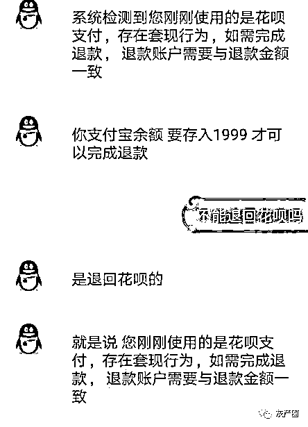

# 找网络兼职被骗的全过程，十分钟被骗 6000 元！

> 原文：[`mp.weixin.qq.com/s?__biz=MzIyMDYwMTk0Mw==&mid=2247527395&idx=4&sn=3a8a78bbd4bb45eace40aebfa0270ac4&chksm=97cba0dba0bc29cd5e301d1147f7f2b1a794c76cb2d386d3af9d42a7f7b20d0c6bfed3690757&scene=27#wechat_redirect`](http://mp.weixin.qq.com/s?__biz=MzIyMDYwMTk0Mw==&mid=2247527395&idx=4&sn=3a8a78bbd4bb45eace40aebfa0270ac4&chksm=97cba0dba0bc29cd5e301d1147f7f2b1a794c76cb2d386d3af9d42a7f7b20d0c6bfed3690757&scene=27#wechat_redirect)

**提示：**

被骗经历：在豆瓣上找兼职小组，之后就看到了他们的信息，他们找兼职，时间短，还好做。添加 QQ 好友后，就开始了他们的骗局。 首先说是审核信息，他们还要看花呗额度，*（之后才知道看花呗额度是决定骗我多少钱。）* 

我的额度有 2000，然后发给我一个淘宝链接，如下图。*（并没有黑小米的意思）*，这个链接根本啥用没有。只是让你觉得，嗯，我是在做一个简单的来钱快的浏览单。 

淘宝链接截图，骗局与小米无关，只是利用了小米。

浏览结束后，还要有浏览时间的截图。之后提交订单，但是不付款。之后发给我一个二维码，用支付宝扫，这是一个 1999 元的支付宝付款二维码，然后精彩的部分开始了*（事实证明，骗子们也是动了脑子的，也许是我太傻）*。

**第一步，莫须有的支付方式**

并没有企业代付这个选项的存在，只是因为有的人不懂，所以他们才抓住这个点，好像很高深的样子，让你以为自己什么也不懂，只能按照他的步骤来。

说实话，我现在才注意到他发的企业代付码实际就是一个邮箱而已，还不知道是不是他自己的。唉，只能怪自己傻了。图片估计也是 P 过的。这一步骤，是这位“演员”的最后的表演了。

因为付完这个，并不会出现他所说的输入超时，无法付款，1999 就进入他的钱包。 

“故事”的过渡部分来了呦。请看下图。

 **第二步：付款成功，骗局接力棒交给下一位选手：售后客服。**

接力棒交接给售后客服后，刚开始特正常，问什么时候付款的，支付宝账号，看上去像在帮你，现在想想，那就是看看你是哪个倒霉蛋。然后又让扫码，用淘宝扫。如下图。

二维码涂了，防止大家好奇扫了就毁了。

这个二维码不知道是什么码，扫出来后显示是可以允许对方在安徽合肥登录我的淘宝账号。后来我去查了自己的账号信息，在安徽合肥登录了很多次，后来我自己改了密码，弄了弄账号安全，对方就没有再登录了。

之后，他就问是本人退款吗。还说系统提示需要截图，蚂蚁借呗的额度截图*（他看这个并不是因为系统提示，而是看看他能骗你多少钱）*。之后像模像样的核对是不是本人退款。再之后，甩了一张之前就截好的图，如下。

看，他截的多好，边边角角的圆弧都弄好了。

接下来，他说了一个从来只听说过没遇到过的概念：**套现**。感觉自己还是一窍不通，就只能被对方牵着鼻子走。如下。

他的语气感觉很着急，让我觉得得赶紧充值好，就没有精力去想是不是骗子，只想把 1999 赶紧追回来。导致只能被对方牵着鼻子走。之后，他甩过来下图。

然后让用支付宝扫描一个二维码，实际就是一个付款码，说是教我怎么激活，哼，就是在让我转着圈付款。本来想发图的，但是截图太长了，打字吧。

他：先选择不够钱的卡，支付失败截图给我。
我：有需要用余额付款吗？
他：不是，不需要付款。
我：（截图）。
他：点击账户余额，然后输入两次错误的支付密码，然后点击换个验证方式，然后验证码界面截图给我。
我：（截图).
他：点击找回并完成支付，然后弹出验证码界面截图给我。我：（截图）。
他：输入验证码，然后下一步，然后系统弹出让你输入正确的支付密码完成付款，不要输入密码，选择查看退款码，然后截图给我，然后系统立即退款到账。

*(这个图是假的，因为从来没有出现过退款码这个事情。)*

他：现在是不是身份验证界面，认识的人，最近收藏过的商品，城市，这些。
我：对。
他：认识谁就选谁，然后点下一步，然后系统弹出让你输入正确支付密码完成付款，不要输入密码，选择查看退款码，然后截图给我，然后系统立即退款到账。
我：（截图）。

之后就是我付款成功，没有出现他所说的东西。然后又折进去 1943 块钱。

之后，他扔过来个图。

他说系统现在出现这个提示。意思就是，我还得往里扔钱。

这时候我已经有所意识了，就拉着男票去了派出所，报了案。

刚从派出所出来，收到一条花呗 1999 退款成功的短信，去花呗看了看，的确是成功了。这时候又动摇了，看，骗局很完美。

之后他让我下载 360 借条，借钱，再重新存入 1942 块。套路就跟之前的部分是一样的了，充值，扫码，输入密码，然后他就挣钱了。而我，傻到被套路了三次，5828 块钱，飞喽飞喽。

他是有破绽的，只不过现在我才反应过来。比如他要看我 360 借条的额度，当时是 3400，我只需要重 1942，他让我借 3400，实际上，他是为了下一步的套路。

他说手续费就 2-3 块，实际上，老娘今天借的，今天还的，还掏了 663 的利息！！！

所以也提醒大家，不要去 360 借条借钱，坑人，我现在想注销账号都不行，他还读取我的隐私信息什么的，说是注册时候签订协议了，我呸！

还有还有，你看看他的语气，一直在催我，感觉好像真的我特别麻烦他，大哥，你是在骗我的钱好不啦！

最后，这位大哥也把我删了。

然后...我只能等警察叔叔的回复了...

说实话学生没那么多钱，都是管我姐借的。谁知道现在成这个死样子。只能怪自己太傻，没带脑子，脑子进水啦！

来源：打工一家亲，洛阳市反诈骗中心，利箭在行动

← 向右滑动与灰产圈互动交流 →

