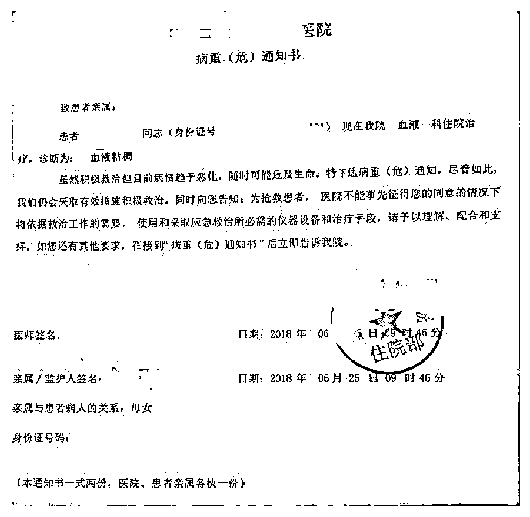

# 活人竟能私人定制“死亡证明”？央媒发声

> 原文：[`mp.weixin.qq.com/s?__biz=MzIyMDYwMTk0Mw==&mid=2247527395&idx=6&sn=ccda2292d9f2bef84995bd865947a168&chksm=97cba0dba0bc29cd68ee41058810dfca785d47ab91f770f78240b0ca8fd2092e92c585d099dc&scene=27#wechat_redirect`](http://mp.weixin.qq.com/s?__biz=MzIyMDYwMTk0Mw==&mid=2247527395&idx=6&sn=ccda2292d9f2bef84995bd865947a168&chksm=97cba0dba0bc29cd68ee41058810dfca785d47ab91f770f78240b0ca8fd2092e92c585d099dc&scene=27#wechat_redirect)

图为伪造病危通知书。受访者供图

280 元一张“居民死亡医学证明”，120 元一张“火化证明”，450 元一张“病危、病重通知书”，检查报告单、诊断证明书、住院证明书更是按张收费，一两百元搞定……

近日，新华每日电讯记者调查发现，在部分平台，只要花上几百元，就能轻松买到“私人订制”的伪造重要文书，甚至有卖家表示“全国哪里都能开、各地公章都能盖”，令人不寒而栗。

**“死亡证明”也能“私人订制”，**

**有商家一上午接到 40 多单**

在某电商平台上，“死亡证明”“病危通知”等伪造的重要文书正在隐秘销售。记者在多个电商平台以“死亡证明”为关键词检索，并未找到相关店铺，但更换为“证明”“病历”等关键词后，马上出现了很多相关店铺。

记者随机联系了其中 9 家店铺，询问客服是否能开“死亡证明”，有 2 家店铺明确表示做不了，另有 7 家表示可以办理相关“证明”。有客服隐晦地表示“想要的证明我们这里都有”，并发来微信号，暗示让记者添加微信“私聊”。

一家店铺客服告诉记者，能根据需求定制“死亡证明”，只需提供姓名、民族、死亡原因等信息，发来的两个模板上落款分别为某医疗机构和某地派出所，“不盖章的 280 元一份，按需求定制印章需要加 100 元。”

“证明”的真实度如何？会不会被识破？面对记者的疑惑，有商家表示，现在大部分都是通过刻章而不是 PS，制作得非常真实，只要不用于司法鉴定即可，“我们就是吃这碗饭的，做这行三、四年了，从来没有发生过被查出来的事情”。商家制作完成后，还拍照发给记者确认，并表示可以邮寄到家。

除了“死亡证明”，其他重要文书也在销售范围之内。其中一家店铺告诉记者，可以制作全国各类医院开具的疾病证明。只要提供患者身份、就医医院等信息，即可获得“病危通知书”，“还可以一并出具住院证明、检验报告单、诊断证明书等‘一条龙套餐’，价格在 800 元至 4000 元不等。”记者随后联系了商家提供的模板上的一家医院，院方表示对此并不知情，院外提供的各类证明均是假的。

甚至有商家表示，全国各地的“火化证明”也都能够提供，一份仅需 120 元。商家自称自家的优势就在于“章子是现刻、现盖的，比其他家都要真实”。当记者询问能否用于银行或公安系统证明时，商家回应说，“这个有风险。”

多家店铺均表示“生意还不错”，其中一家店铺说，仅一个上午就接到了 40 多单。

**伪造证明“用途广泛”：**

**骗筹款，骗保骗继承权，逃避刑责**

商家代开的伪造证明虽然样式五花八门，甚至连基本信息都不完整，却依旧“用途广泛”。

**骗取同情和网上筹款。一位商家告诉记者，拿着“病危通知书”去网上“骗点筹款”，根本不会被发现。**

 **记者发现，利用网络销售假证骗取钱款的情况的确存在。此前重庆一女子就通过某互联网平台，伪造白血病诊断证明和两个孩子死亡证明等相关材料，炮制“丈夫、子女相继去世，自己又患白血病晚期”的“经历”，利用伪造材料在某网络服务平台上发起网络筹款，不到一年时间骗取了 9 万余元。**

**“如果有的平台信息审核能力不足或把关不严，很容易造成假证行骗的情况。”中国政法大学法学方法论研究中心研究人员吴国邦说。**

****骗保，甚至骗取继承权。**记者调查发现，此前有人从中介处购买伪造的父母死亡证明等证件，将父母房产过户到自己名下，又以 510 万元进行二次抵押获取不正当利益。甚至有女子还在上班，却成社保局“死亡人员”，原因是其丈夫通过伪造死亡证明等材料，取走了该女子个人养老保险账户的余额、丧葬补助金和抚恤金共 11 万余元。**

**此前，有地方也出现一男子将健在父亲变为“亡父”，在提供了死亡证明、土葬证明及家庭关系证明的材料后，申请获得死亡赔偿金 8 万余元，后经查证该男子父亲还健在，之前提供的证明材料均系伪造。**

**受访专家认为，在骗保、骗取继承权、私人纠纷等事件中，普通民众很难鉴别文书的真假，伪造文书者很可能骗取不正当利益，甚至逃避相关责任，性质十分恶劣。**

****逃避法律责任。**去年底，一男子为逃避刑罚给自己办死亡证明，最终数罪并罚获刑 12 年的新闻，曾引起舆论广泛关注。案件中的男子骗取他人钱财 192 万元后被查处，在看到办假证的广告后，决定从网上购买伪造的“死亡证明”“火化证明”，从而达到人死案销，逃避法律制裁的目的。该男子在开庭前向法院寄去了伪造的“死亡证明”等文件，最终被法官明察识辨。**

**2021 年，广东一女子也伪造“死亡证明”逃避刑罚 11 年终落网，该女子在入狱服刑期间，通过保外就医、伪造死亡证明逃避刑罚，被发现后一直下落不明，警方历经 11 年的侦查，在去年 8 月将其抓获。**

****专家：倒逼平台“守土有责”，****

****彻底铲除“暗黑文书市场”****

**中国互联网协会法工委副秘书长胡钢等专家认为，通过网络买卖伪造的“死亡证明”等重要文书，严重破坏了社会诚信，助长违法犯罪，给社会带来不可测的风险，应彻底铲除“暗黑文书市场”。**

**吴国邦说，目前我国尚未建立统一的文书信息管理系统，各类文书名称、制式，因时间、行业、地区、级别不同而存在差异。因此，文书真伪的鉴别难度较大，一般只能由文书主体单位确认或通过司法鉴定完成。“有关部门应不断加强监督，从源头上治理制假、售假。”**

**胡钢认为，从假文书网购之便捷，可见目前造假成本的低廉，以及背后“灰产链条”的成熟。**

**专家提醒，商家可能涉嫌伪造、变造、买卖国家机关公文、证件、印章罪；买家购置假文书的行为本身涉嫌购买国家机关公文、印章罪，如以假文书实施不法行为并造成侵害后果，轻则承担民事欺诈责任，重则应同时承担诈骗罪的刑事法律责任。**

**公安机关对此类行为露头就打的同时，应顺藤摸瓜依法查处相关卖家和买家，提高买卖“死亡证明”等伪造文书的违法成本，让相关人员不敢为、不能为。**

**此外，吴国邦等人认为，倒逼平台“守土有责”才能对此类问题形成长效、动态监管。为避免打击治理后，不法商家换个“马甲”卷土重来，平台应利用技术手段加强甄别，做到违规行为动态监测，对专门从事违法行为的平台则要坚决打击和取缔。**

**在有关部门坚决打击、平台履行监管责任的同时，个人也要提高防范意识，避免掉进“假文书”的陷阱。**

****央广网：****

****对“暗黑文书市场”**** 

****必须**一**锅端****

**一纸假证明之下，活人能“死亡”，健康人也能“病危”。买假之人将其当作“摇钱树”和“护身符”，躲刑罚、骗保险、骗捐款，投机取巧钻空子，搅起一片乌烟瘴气，严重破坏社会诚信，也助长了违法犯罪之风，给社会带来了诸多风险。**

**假证明何以能大行其道？关键在于接收它的人并没有甄别其真伪的能力或途径。譬如说，在一张病危的假证明面前，又有多少人知道真证明是何模样？从这一点来说，“假文书”肆无忌惮，实际上直击的正是信息共享的“软肋”。没有统一的文书信息管理系统，“真模样”没有走入千家万户，无以“验真”，才让别有用心之人有了制假售假、以假乱真的底气。**

**以“假证”谋“真利”，买卖两头都有责。专家提醒，商家可能涉嫌伪造、变造、买卖国家机关公文、证件、印章罪；买家购置假文书的行为本身涉嫌购买国家机关公文、印章罪。电子商务法第十三条明确规定，电子商务经营者“不得销售或者提供法律、行政法规禁止交易的商品或服务”。那么，“假文书”大行其道，成熟的“灰产链条”背后，暴露出的不只是买卖方法治意识的淡漠，也暴露出相关部门责任的失守。**

**彻底铲除“暗黑文书市场”势在必行，这离不开多部门齐心协力。有关部门应加快实现信息共享，以数字整合提高“验真”能力，铲除“假文书”生存的土壤；执法部门应强化监管，加大执法力度，以法的震慑让买卖伪造文书者却步；网络平台应守土有责，加强对假证明、假文书的甄别能力，堵住“暗黑文书市场”交易渠道。如此多措并举，或才能釜底抽薪，去伪存真，对“暗黑文书市场”实现“一锅端”。**

**来源：@央广网，新华每日电讯，澎湃新闻******

**← 向右滑动与灰产圈互动交流 →**

****