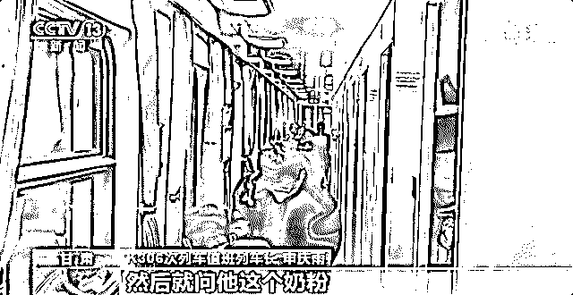
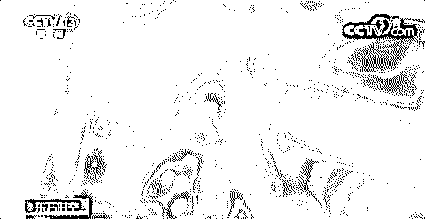
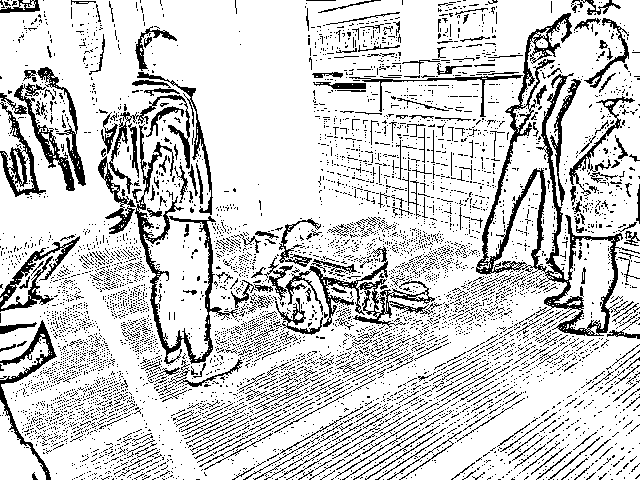
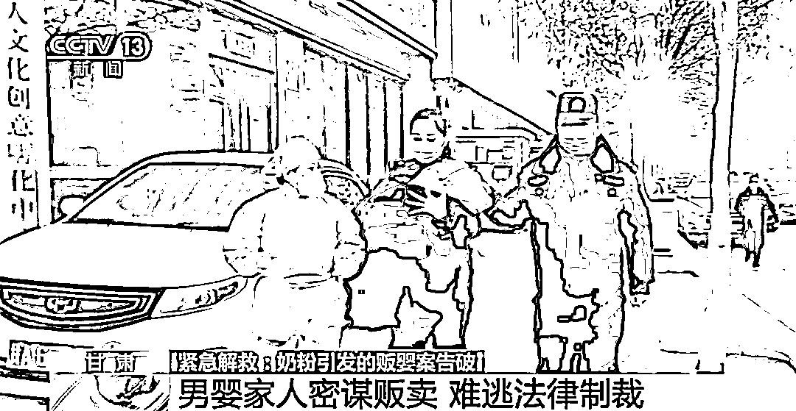
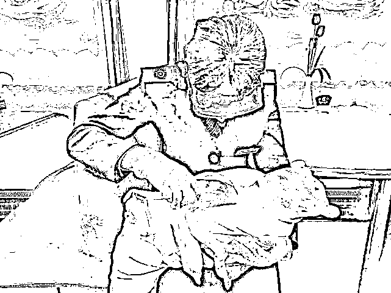

# 夫妻俩列车上借奶粉被识破：婴儿竟是花 11 万元买来的！更寒心的是…

> 原文：[`mp.weixin.qq.com/s?__biz=MzIyMDYwMTk0Mw==&mid=2247527395&idx=7&sn=84baa8052d659d8ba929c40c4f21fcdb&chksm=97cba0dba0bc29cdf7064c710c953784388c1201dfaaf8770cc76cd93eba6ec654e4a9082893&scene=27#wechat_redirect`](http://mp.weixin.qq.com/s?__biz=MzIyMDYwMTk0Mw==&mid=2247527395&idx=7&sn=84baa8052d659d8ba929c40c4f21fcdb&chksm=97cba0dba0bc29cdf7064c710c953784388c1201dfaaf8770cc76cd93eba6ec654e4a9082893&scene=27#wechat_redirect)

2021 年 12 月 31 日，在从兰州开往温州的 K306 次列车上，一对夫妇因为孩子的奶粉不够，向乘务员求助。但对于婴儿的来历，却先后给出两套说辞。乘务员、列车长和乘警在帮助他们的过程中发现疑点，并最终证实：**这对夫妇并不是孩子的父母，他们手中的男婴是刚刚花 11 万元买来的。**目前，兰州铁路公安已经联系男婴的老家河南南阳的民政部门，做后续的安置。

[`v.qq.com/iframe/preview.html?width=500&height=375&auto=0&vid=t3317lhlnn4`](https://v.qq.com/iframe/preview.html?width=500&height=375&auto=0&vid=t3317lhlnn4)

男子列车上借婴儿奶粉引怀疑
列车长果断报警

事发当天，在兰州开往温州的 K306 次列车上，软卧车厢的一名男性旅客吴某找到乘务员说，自己帮朋友照顾孩子，因为带的奶粉不够，希望能帮他寻找婴幼儿奶粉。乘务员因没有找到奶粉，便将此事汇报给列车长。

然而，列车长在与吴某和随行女子沈某的交流中，产生了怀疑：“问他们小孩奶粉带了多少，发现只有一小瓶，里面只有一勺，问小孩每次喝多少剂量，他们也含糊不清。”

随后，列车长注意到吴某的行李，发现小孩的衣物只有一件，婴幼儿用品几乎什么都没有。列车长立即盘问孩子的来历，吴某和随行女子马上换了一套说辞，说他们是孩子的父母。见状，列车长立即向车上的乘警通报。

兰州铁路公安处乘警支队刑警大队侦查员李兴东介绍：“根据嫌疑人吴某和沈某的交代，他们 2021 年 12 月 29 日在河南省邓州市一个公园内，根据其他人的介绍，在李某处花 11 万元购买了男婴，准备携带男婴到温州自己的家中抚养。”乘警立即联系温州站派出所，由温州站派出所对两名旅客实施逮捕，并由列车带回信阳站，由公安人员调查处理，婴儿则乘坐这趟列车先带回兰州。

男婴家人密谋贩卖
目前已被采取刑事强制措施

根据吴某和沈某的供述，兰州铁路公安处乘警支队调派侦查员前往事发地河南省邓州市，对贩卖男婴的李某虎和吴某提供的所谓收养协议上另一名女性嫌疑人李某霞进行调查。

记者进一步采访得知，两名卖掉男婴的嫌疑人，分别是男婴的姥姥和舅姥爷。男婴的母亲杨某还没有成年。李兴东说：“杨某是非婚生子，经济来源比较少，抚养能力不行。她的母亲李某收入也低，所以就将这个孩子交给了舅姥爷李某。男嫌疑人李某通过多次的寻找，找了一个出价最高的买家，就将孩子卖掉了。孩子的母亲杨某不知道舅姥爷和姥姥将孩子卖掉的事情 。”

兰州铁路公安处乘警支队刑警大队民警何花介绍：“接到婴儿，我们打开检查的时候，看他挺可怜的。在小包被里面，包被也是比较潮湿。小孩身上衣着比较单薄，仅仅是穿了一件跟自己身形很不符的上衣，胳膊都在里面这样蜷缩着，腿基本上就是光着，没有穿裤子。按照医院对他身体各方面的推测，也就刚满月的样子 。”

“因为这个孩子是非婚生子，他的母亲是未成年人，没有抚养能力，其次他重要的一些家人、亲属都是涉案人员，所以目前不能把他交给他的家人。我们已经联系了河南省南阳市的民政部门，对这个孩子后续的一些抚养问题，包括一些法律手续，比如户口问题，我们都会持续跟进。”何花表示。

目前，售卖男婴的嫌疑人李某虎、李某霞和收买男婴的嫌疑人吴某、沈某都因涉嫌拐卖儿童罪被警方采取刑事强制措施。本案已准备移交检察机关进行起诉，男婴已被送往河南南阳市民政部门进行抚养。

来源：央视新闻、中国妇女报、红网

← 向右滑动与灰产圈互动交流 →

