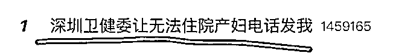
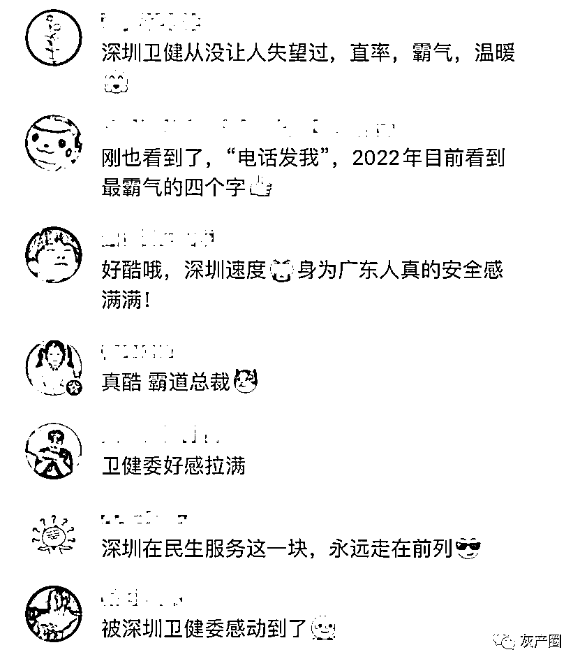

# “电话发我”被怒赞上热搜！

> 原文：[`mp.weixin.qq.com/s?__biz=MzIyMDYwMTk0Mw==&mid=2247527455&idx=1&sn=ddbaffe0969a278ccaa67a81b8f0972b&chksm=97cba727a0bc2e314868f2932847adeb51be28fe8fe9052f027daec4d374ccc9686ff15eb73d&scene=27#wechat_redirect`](http://mp.weixin.qq.com/s?__biz=MzIyMDYwMTk0Mw==&mid=2247527455&idx=1&sn=ddbaffe0969a278ccaa67a81b8f0972b&chksm=97cba727a0bc2e314868f2932847adeb51be28fe8fe9052f027daec4d374ccc9686ff15eb73d&scene=27#wechat_redirect)

深圳卫健委因一句四字回复，又登上了热搜。 

昨天上午，深圳一孕妇在深圳卫健委公众号留言求助，**因等着住院要核酸证明，但等了 12 小时还未出结果。**仅 6 分钟后，深圳卫健委回复道“**电话发我。**”

截至 1 月 9 日 12 时许，这条 4 个字的回复已收到 2.4 万点赞。相关话题也冲上了热搜。

**深圳卫健委回复“电话发我”后**

**发生了什么？**

南都记者采访了解到： 

**1 月 8 日上午 10 时 57 分**，深圳卫健委公众号小编在后台收到市民求助，要到市民电话以后，立即转交龙华中心医院进行处理。

**1 月 8 日上午 11 时 10 分**，医院职能管理微信群出现了那张大家都熟悉的截图，市民在市卫健委公众号留言反映昨晚在龙华中心医院核酸采样 12 小时后未能查询到检测结果。

**11 时 17 分**，龙华中心医院门诊部根据截图中市民 Prnliy 在 10 时 57 分发到公众号留言中的电话号码，与市民 Prnliy 联系上，问询采样的过程，并请 Prnliy 提供姓名与身份证号码。

**11 时 20 分**，Prnliy 发来两个身份证号码，在医院未查询到结果。

**12 时 07 分**，市民短信提示采样点是“在大门进来左边往中医科那条路”（指的是医院核酸采样点旁边的临时采样点）。医院发现，这是一个医院设置的临时采样点，并非医院为入院患者专门设置的采样点，采样后标本被送到第三方检测机构。入院患者的都是由医院自己实验室检测的。

**12 时 26 分**，医院问询第三方检测机构回复，“结果已出，但因人手不足未经审核，马上审核”。

**12 时 28 分**，测报告并上传。

**13 时 04 分**，市民回复短信表示：“好的，已收到。感谢”。 

深圳市卫健委宣教处处长王岭表示，当时是她在微信后台看到留言后做的回复，收到孕妇名字和身份证信息后，她马上联系了龙华中心医院，医院迅速查看了孕妇的核酸检测的相关信息，并让工作人员将她的信息提出来优先上传，就这样快速解决了。

另据新华社报道，起初，在医院数据系统的查询中，并没有看到孕妇的结果。后网友回忆起采样的具体地点，医院判断，该采样点是临时设置的，并非医院为入院患者专门设置的采样点，该采样点采样后，标本将被送到第三方检测机构。

医院方面迅速联系了第三方检测机构。第三方检测机构回复道：“结果已出，但因人手不足未经审核，马上审核。”随后，检测报告审核通过并上传。

 图片来源：新华社

**孕妇情况稳定，已接受治疗**

8 日晚，@Penliy 鹏 在微博发文：首先感谢深圳卫健委及时帮忙联系了做核酸的医院录入了结果，顺利办理了入院。当时发这个评论的时候只是想加快核酸录入，我们应该叫孕妇不是产妇，宝宝 8 周左右很不稳定，医生建议住院，我们昨晚 9 点核酸后，等到上午 10 点多还没出结果，宝妈人又很难受，一着急就去公众号留言了，还是要给深小卫点赞（我也是每期必看的老粉了），刚评论留言就回复了。

最后希望宝宝看在这么多人关心的情况下坚强健康地留下来，以后也去深小卫当小编。

1 月 9 日上午，深圳晚报记者联系上该市民，他表示，得到深圳市卫健委帮助后，不到一小时就在粤康码里查到了核酸报告，目前孕妇情况稳定，正在深圳市中医院进一步治疗。

图片来源：新华社

**网友怒赞：深圳速度！**

深圳卫健委的这波操作引发不少网友怒赞深圳速度！ 

**延伸阅读：****[西安的热搜治市：没有人死于新冠，但死于了防控](http://mp.weixin.qq.com/s?__biz=MzIyMDYwMTk0Mw==&mid=2247527232&idx=1&sn=dc893f40372e0987b561d65c8dbad347&chksm=97cba078a0bc296ece66aec5d6f682e598078f0eeb592c645bb396ef2580749ee88ee94a7087&scene=21#wechat_redirect)****[女性用卫生巾是矫情？西安作协主席回应](http://mp.weixin.qq.com/s?__biz=MzIyMDYwMTk0Mw==&mid=2247527311&idx=2&sn=0bf8ca838944acae6389586cad34b27c&chksm=97cba0b7a0bc29a1cc5b75ea352216d721339a544c9aa1abdab88605dd607335b20b44b69e45&scene=21#wechat_redirect)****[西安男子突发胸痛，连续被 3 家医院拒诊最终猝死](http://mp.weixin.qq.com/s?__biz=MzIyMDYwMTk0Mw==&mid=2247527311&idx=1&sn=aa3caecbffb5da394e7c53db5b587519&chksm=97cba0b7a0bc29a130b627528ed1e7e16afd12ccd2281195e92e4626e800cb0323aa37621b0c&scene=21#wechat_redirect)****[西安一码通“崩溃”调查：一场系统性失灵的数字政府再思考](http://mp.weixin.qq.com/s?__biz=MzIyMDYwMTk0Mw==&mid=2247527311&idx=3&sn=d6c34cad324bf68d923f7dda9f6218ea&chksm=97cba0b7a0bc29a1091c989c4a773267d09dfce686168ac6726b54b053d6b05f464c54372ae1&scene=21#wechat_redirect)****[副总理“深感愧疚”！西安孕妇仅仅是流产吗？更残忍的事还是发生了](http://mp.weixin.qq.com/s?__biz=MzIyMDYwMTk0Mw==&mid=2247527395&idx=1&sn=226240a73b68fa5dbfed4fe73b6667cb&chksm=97cba0dba0bc29cd6a554c3f78eda3ef4f80f387e3662b6010a7736c09666f21db4275ed00b7&scene=21#wechat_redirect)**

来源：澎湃新闻综合深圳卫健委微信公众号、南方都市报、深圳晚报、新华社等，网友评论

← 向右滑动与灰产圈互动交流 →

