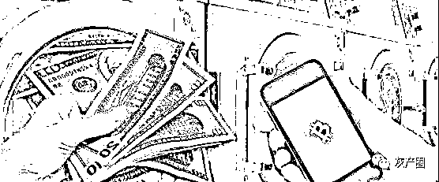

# 利用数字人民币洗钱 骗子又推新骗法

> 原文：[`mp.weixin.qq.com/s?__biz=MzIyMDYwMTk0Mw==&mid=2247527455&idx=3&sn=ce248561f6aa0a34ee19e84b1675ceb9&chksm=97cba727a0bc2e31be443334bffb455c6a63b5383aab75cb6bb529fc41acb17c9d6d0994488c&scene=27#wechat_redirect`](http://mp.weixin.qq.com/s?__biz=MzIyMDYwMTk0Mw==&mid=2247527455&idx=3&sn=ce248561f6aa0a34ee19e84b1675ceb9&chksm=97cba727a0bc2e31be443334bffb455c6a63b5383aab75cb6bb529fc41acb17c9d6d0994488c&scene=27#wechat_redirect)

**示**

**：**历时 30 余天，地跨广东、福建 2 省，涉及新疆、黑龙江、吉林、湖南、江苏、广东、山西等 7 省区多市 20 余起冒充公检法电诈案，查明涉案金上亿元……12 月 26 日，山西晚报记者从晋城市公安局获悉，经连续奋战 11 个日夜，晋城警方成功破获该市**首例利用数字人民币洗钱犯罪案件。**

**宋女士接“警察”电话，银行卡里少了 20 万******

****今年 11 月 3 日，晋城公安城区分局民警接到一条紧急预警，辖区内的宋女士可能正在遭遇冒充公检法类电信诈骗，接到指令后，民警第一时间联系对方，但始终占线无法接通。****

****“我的银行卡里少了 20 万元!”正当民警发动亲友同事寻找宋女士时，宋女士来到城区分局报警称自己已经被骗。****

****宋女士称，当日下午 1 点，她接到一自称是太原市公安局工作人员的电话。对方称，宋女士有非法入境记录，而且涉嫌洗黑钱。听说自己犯罪了，宋女士表示自己当时就彻底慌了。据她事后回忆，这名“警察”提供了太原市公安局的“办公电话”，宋女士打通电话后，电话那头要求宋女士登录指定“中国最高检察院网站”查询相关违法记录，而查询结果准确无误地显示着宋女士的名字、证件号码等信息，并显示宋女士已经涉嫌洗钱犯罪被提请逮捕了。****

****事情发展至此，宋女士坚信自己是“犯罪”了。随后对方以需要证明清白为由，诱导指挥宋女士开启手机录屏功能，并开通了数字人民币账户，同时告知下载相关软件，目的是为获取手机验证码等关键信息。****

****直到此时，宋女士始终不知自己正处于“骗局”之中，直至同事找到她，并到银行查询发现少了 20 万元时，才匆忙报警。****

******转账方式竟是“数字人民币”******************

******“无论诈骗套路再复杂，骗来的钱总是要转走的，赃款的流向无疑是侦办此案的关键。”民警介绍，此案发生后，晋城警方立即组成专案组，紧盯案件线索全力开展侦查工作。其间，警方通过对宋女士通讯方式、登录网站、银行转账等案件细节详细询问并固定证据，确定通话电话为“00”开头境外网络电话号码，浏览通缉令网址和下载 APP 登录的 IP 网址也是境外虚假网站，转账方式是用数字人民币进行转账。******

******今年 11 月初，河南警方刚刚打掉全国首例利用数字人民币进行洗钱的犯罪团伙。而对于这种“特殊”转账的方式，办案民警都是第一次听到，即使到银行询问也只是被告知，此种方式只特定在北京、杭州、深圳等大城市试点开通运行中，而山西地区未开通试点，具体情况尚不清楚。******

******“那段时间，我们的民警经常加班到凌晨两三点，恶补‘数字人民币’相关知识，我们知道必须走在骗子前面，才能最大限度追回损失!”负责侦办此案的民警李志远说。******

******最终，专案组民警通过查资料、跑银行、沟通部级数字人民币管理部门等多种方式，了解数字人民币的交易方式和查询条件等，与工商、邮储、交通、建设等多家省级分行积极沟通，全力开展调查取证工作。11 月下旬，专案组在相关部门积极配合下，查清了基本犯罪事实，锁定了主要犯罪嫌疑人身份，决定集中收网抓捕。******

******为境外诈骗分子洗钱牟利******************

******“别动，抱头靠墙蹲下!”民警破门而入，将正准备睡觉的犯罪嫌疑人抓获。面对民警，陈某脱口而出：“这下完了!”而此时的民警们也长舒一口气，他们已经在该嫌疑人落脚点连续蹲守两夜。******

******近日，经过 11 天的连续奋战，专案组民警辗转福建、广东两省，在当地警方的大力配合下，通过走访摸排、蹲点守候等侦查措施，接连抓获陈某弟、巫某明、姚某钰、全某等 6 名犯罪嫌疑人，破获涉及新疆、黑龙江、吉林、湖南、江苏、广东、山西等 7 省区多市 20 余起冒充公检法电诈案件。其中，宋女士被骗的资金被追回 10 万元。******

******到案后，作为犯罪团伙成员李某交代：因自己赌博债台高筑，在同乡建议下，开始接触“数字人民币”，并利用数字人民币为境外诈骗分子“洗钱”。而发财的美梦变成一场走上犯罪之路的噩梦，提及这件事他满是后悔。******

******经查，该团伙上线冒充公检法人员诈骗得手后，在福建宁德和广东揭阳两地的团伙成员，或结伙或单独，利用境外聊天软件同上游犯罪人员沟通联系获取信息，按照对方要求，通过数字人民币的形式帮助转移涉案赃款，随后通过境外虚拟币 APP 平台，以低买高卖虚拟币的方式从中非法牟利，涉案金额上亿元。目前 6 名犯罪嫌疑人均被刑事拘留，案件正在进一步审理中。******

********警方揭秘********

******数字人民币真能“洗钱”吗?******

****众所周知，数字人民币是人民银行发行的数字形式的法定货币，具有可控匿名性，这是一种对数字人民币交易的隐私保护。正是这“匿名性”三个字，引起了不法分子的兴趣。以晋城警方破获的此起数字人民币洗钱案件为例。犯罪分子看似“高明且隐蔽”的一套操作，很快便被侦查机关识破。****

****事实上，用数字人民币进行洗钱是行不通的。据悉，数字人民币的可控匿名性，是以风险可控为前提的有限匿名，在保护合理的匿名需求同时，也保持对犯罪行为的打击能力。比如，数字人民币的交易会记录在链上，一旦发现犯罪行为，很容易被追查到。****

****值得一提是，不同于常见的银行卡洗钱案件，洗钱案件涉及数字人民币“钱包”，这给警方侦办相关案件制造了一定的难度。但伴随相关案件的不断破获，警方获取数字人民币信息权限的渠道也已经有所改善，侦办此类案件也更加“得心应手”。****

******如何识别数字人民币骗局套路?******************

******数字人民币逐渐走进大众的视野，然而，其支付隐私性强、钱包转账金额大等特点却被不法分子利用。今年以来，数字人民币诈骗花样层出不穷，令人防不胜防。目前数字人民币诈骗有三种常见的模式。******

******一是通过建立数字人民币学习群进行虚假推广的诈骗，二是冒用人民银行名义在资产交易平台进行虚假理财的诈骗，三是发送虚假数字人民币活动链接的短信进行诈骗。这三类模式中涉及的学习群、资产交易平台和短信均具有较强的隐蔽性特点。******

******那么，我们是否能利用法律武器来保护自己?根据现行法律法规，不法分子建立虚假数字人民币学习群，实施假推广，混淆消费者视听，或者假冒数字人民币活动链接诈骗，利用假短信的方式骗取消费者资金的行为，涉嫌违反诈骗罪的规定。而不法分子冒用人民银行名义在资产交易平台上进行数字人民币交易的行为，不仅涉嫌诈骗，还可能涉嫌组织、领导传销活动。******

******为此，警方提醒广大市民要保护钱包里的数字人民币，个人防护意识非常必要。用户应当警惕不法分子借推广数字人民币之名，通过建立所谓的学习群，或者打着数字人民币理财旗号进行交易的传销诈骗行为，同时还应警惕宣传数字人民币活动的虚假链接。******

******来源：山西晚报，利箭在行动******

************

******← 向右滑动与灰产圈互动交流 →******

************