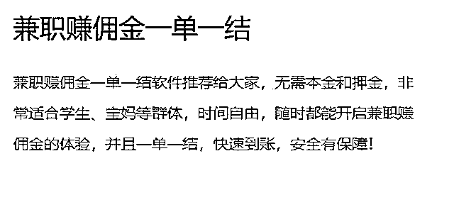
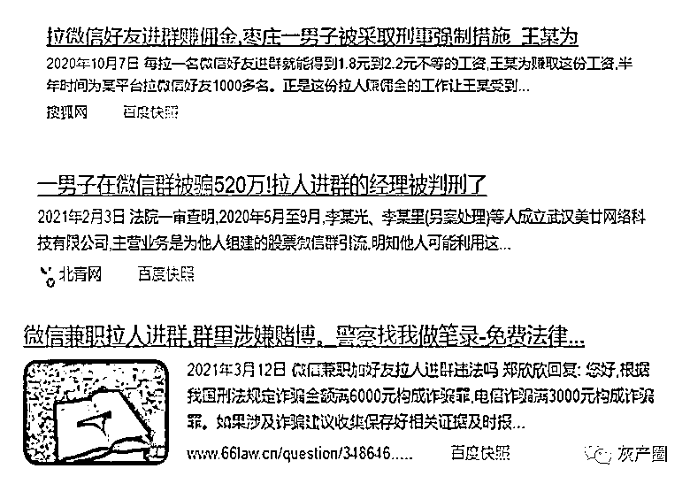
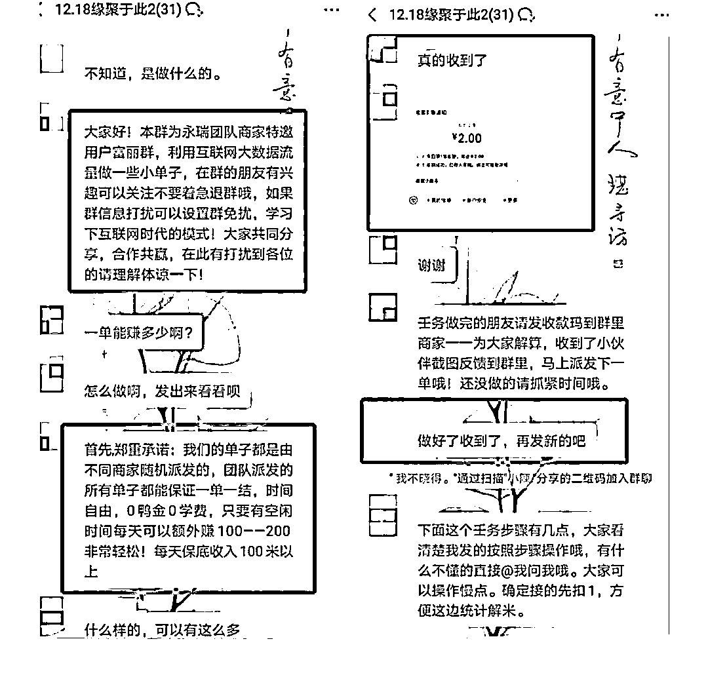
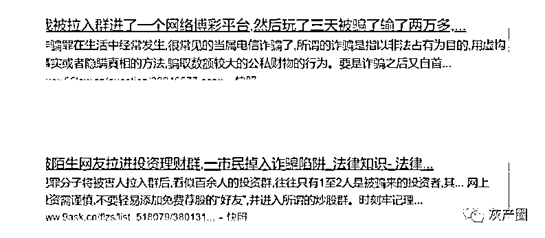
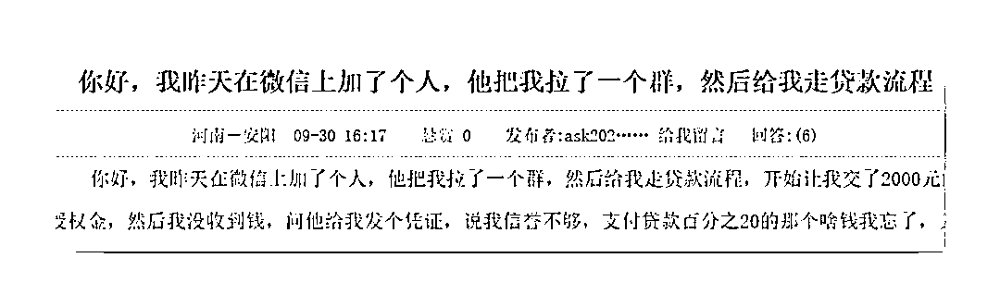

# 拉人进这种群，可能涉嫌犯罪！

> 原文：[`mp.weixin.qq.com/s?__biz=MzIyMDYwMTk0Mw==&mid=2247527455&idx=4&sn=6c0add9ab03ed1998fedd7bfbf025908&chksm=97cba727a0bc2e31a182dde161b8e92368a89a334b4820a51e08fbb6a33180570468d69f6e83&scene=27#wechat_redirect`](http://mp.weixin.qq.com/s?__biz=MzIyMDYwMTk0Mw==&mid=2247527455&idx=4&sn=6c0add9ab03ed1998fedd7bfbf025908&chksm=97cba727a0bc2e31a182dde161b8e92368a89a334b4820a51e08fbb6a33180570468d69f6e83&scene=27#wechat_redirect)

网络兼职 事关拉人进群 

无需垫资 无本万利

是不是特别有吸引力

小王就看到了这条兼职广告

细聊之下 

只需下载个 APP

在 APP 内接收上家下发的群名称和微信号

小王一个个添加 

通过后就直接拉进群

成功一个人能获得 2-5 块不等

几个月内小王拉了 2-3 千好友进群

赚了 7、8 千

没多久小王因涉嫌诈骗被警方带走 

审讯室里

小王无奈地问

“我就拉人进群，怎么就犯法了？”

这样的案例并不少

你清白干净的账号身份 

轻轻松松降低了别人的防范之心

他们通过了你的申请

被你拉进了群

等待他们是什么

你知道吗？

**他们很可能会遭遇刷单诈骗** 

**他们可能遭遇投资理财诈骗**

**他们可能遭遇贷款、代办信用卡诈骗**

**甚至可能遭遇“杀猪盘”**

**一旦入群**

**就像羊入虎口**

**各种广告**

**各种试探**

**群主和托儿之间的一唱一和**

**总会有触动心弦的一天** 

**那就是陷入骗局的时候**

所以很多人以为的拉人入群 

其实是将人

送进诈骗团伙预设好的陷阱

这种行为被称作“吸粉引流”

目前“吸粉引流”已经发展成独立门类

有专门的的团伙运作

通过网络兼职的方式

低价招揽学生党、宝妈们进行操作

再由诈骗集团

发送博彩网站、刷单广告等实施诈骗

**友情提醒 **

** 这种行为很有可能涉嫌犯罪！ **

你无法保证那个群到底是何用途

甚至可能心知肚明

但还是受利益驱使

拉群引流很有可能使你成为

为网络诈骗犯罪提供前端服务的一员 

这类钱千万不能赚！！！ 

来源：南通反诈

← 向右滑动与灰产圈互动交流 →

