# 最全诈骗短信合集！你遇到过吗？

> 原文：[`mp.weixin.qq.com/s?__biz=MzIyMDYwMTk0Mw==&mid=2247527455&idx=5&sn=ddb049252f0872b673acb50219682b28&chksm=97cba727a0bc2e312f49d57f7ece88b439bd27af74f70f63714ca9274688edae0aa10c6aa309&scene=27#wechat_redirect`](http://mp.weixin.qq.com/s?__biz=MzIyMDYwMTk0Mw==&mid=2247527455&idx=5&sn=ddb049252f0872b673acb50219682b28&chksm=97cba727a0bc2e312f49d57f7ece88b439bd27af74f70f63714ca9274688edae0aa10c6aa309&scene=27#wechat_redirect)

**反诈进行时**

- 电信诈骗套路深，学好知识好防身 -

**“杀猪盘”诈骗**

**···**

**易受骗群体：**大龄未婚、离异单身男女，女性被骗比例较高

**典型案例：**2021 年 12 月 29 日，许女士报案称，其通过短视频平台认识了一名男子，两人添加微信并闲聊起来。之后，对方称自己掌握一些银行数据，让许女士帮忙登录投资，还引导其**投资了 130000 元**，但许女士提现两次共 28443 元后，就**不能正常提现**。问及原由，对方和客服均称需要资金流水，许女士才意识到被骗了。

**警方提醒：**网恋需谨慎，不要被所谓的爱情冲昏头。素未谋面的网友、网恋对象推荐你**网上投资理财、炒数字货币、博彩赚钱的都是骗子**。

**冒充领导诈骗**

**···**

**易受骗群体：**公司行政、财务、出纳人员

**典型案例：**2021 年 12 月 30 日，南海的张女士报案称，公司员工小红接到“合作公司”的电话说需要开发票，于是添加对方 QQ。随后，小红被拉入**标注其公司名称的 QQ 群**，群内两位公司“领导”让其**把财务张女士拉进群**，其后更在群内讨论开票事宜，接着就让张女士将账户余额**98.6 万元转到指定账户**，直到真正的领导问及才意识到被骗。

**警方提醒：**如遇以“领导”通过微信、QQ 要求转账的，要先**核实身份**，转账前一定要通过电话等**多种途径反复确认**。

 Ding~ 

您有一条短信未读

点击链接/添加微信

跟着操作

就……

**掉入骗子的陷阱啦！******

**01 点赞刷单** 

**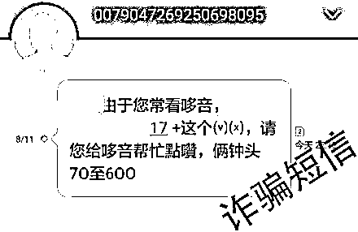** 

****02 中奖送礼品****

**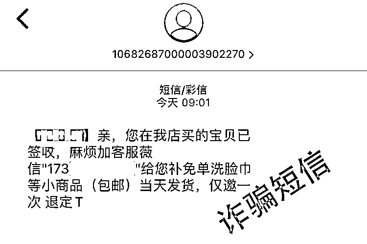**

****03 冒充保险****

**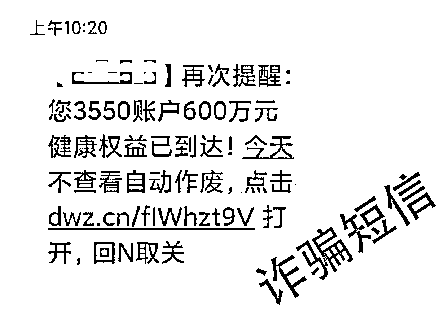**

* * *

**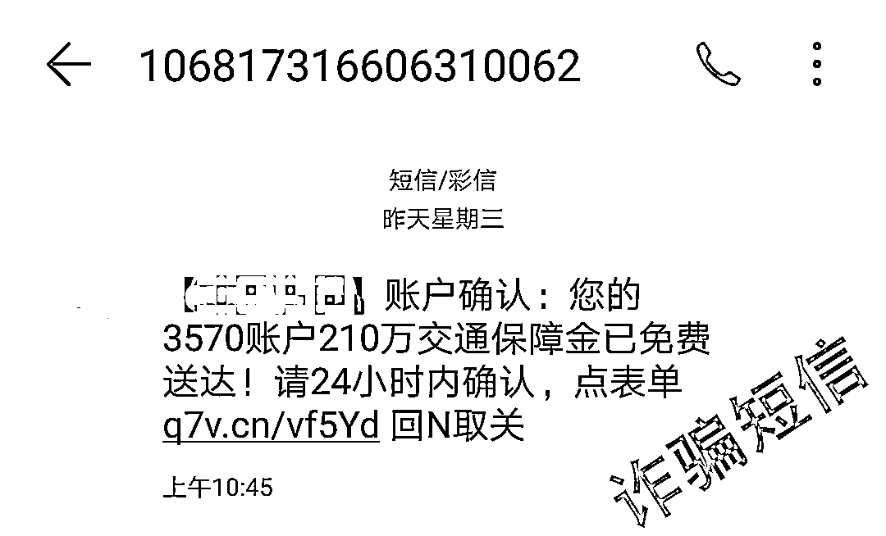**

* * *

**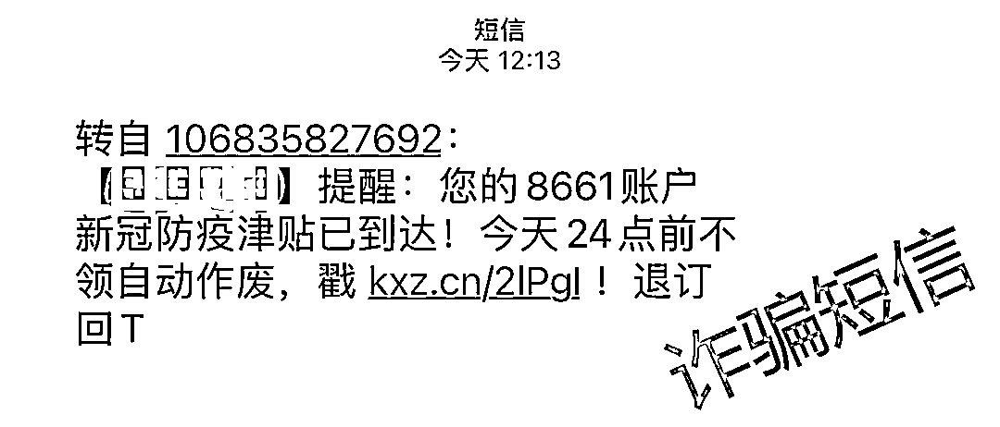**

****04 贷款申请****

**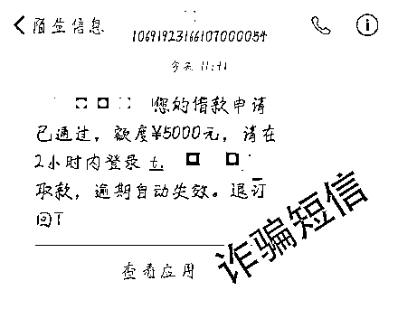**

****05 ETC 通行****

**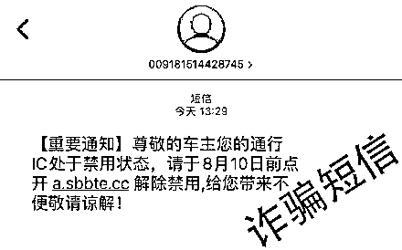**

* * *

**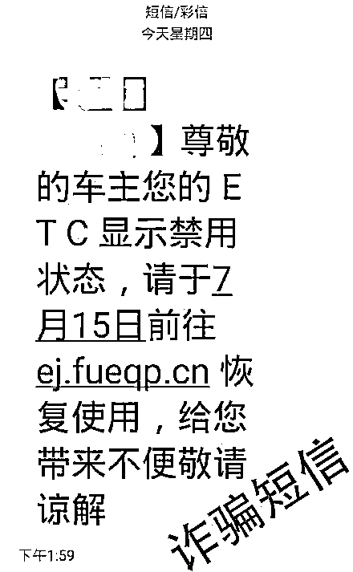**

****06 冒充银行****

**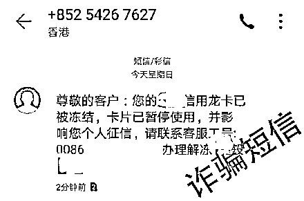**

****07 冒充社保中心****

**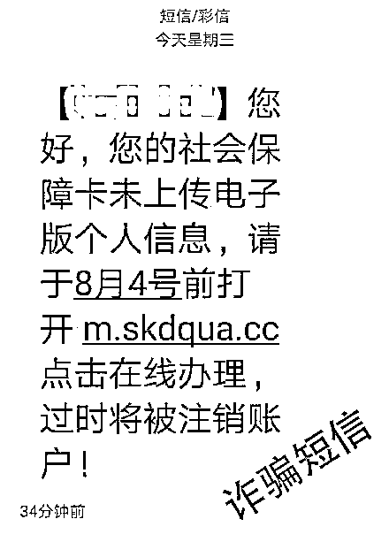**

****08 冒充工商部门****

**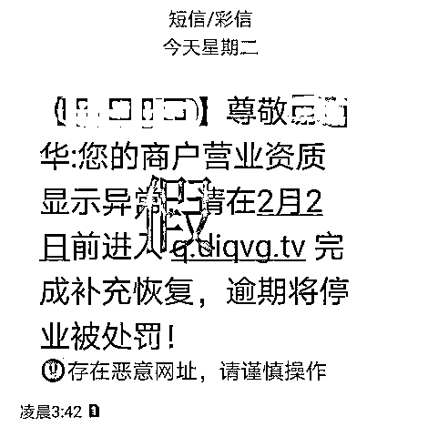**

****警方提醒****

****1****

****“钓鱼”短信不要点** **

**短信中的链接可能含有木马病毒，会自动获取手机最高权限，从而盗刷第三方软件绑定的银行卡。**

****2****

** **切莫随意添加陌生好友** **

**短信中的领取奖品、刷单等信息本身就是虚假的，添加对方的联系方式只会步入诈骗分子的圈套，随后以各种理由让你转账。**

****3****

** **网上转账需谨慎** **

**网上自称要转账才能办理的业务，很可能是诈骗分子设下的圈套。涉及重要个人及账户信息多留心。**

****4****

** **办理业务请找正规平台** **

**以 ETC 业务为例，建议直接到各大银行网点进行办理，有疑问也可以直接向当地银行营业厅咨询。****诈骗短信千千万****勿被套路是王道**

****

**来源：佛山市公安局，昆明反电信网络诈骗中心**

****

**← 向右滑动与灰产圈互动交流 →**

****