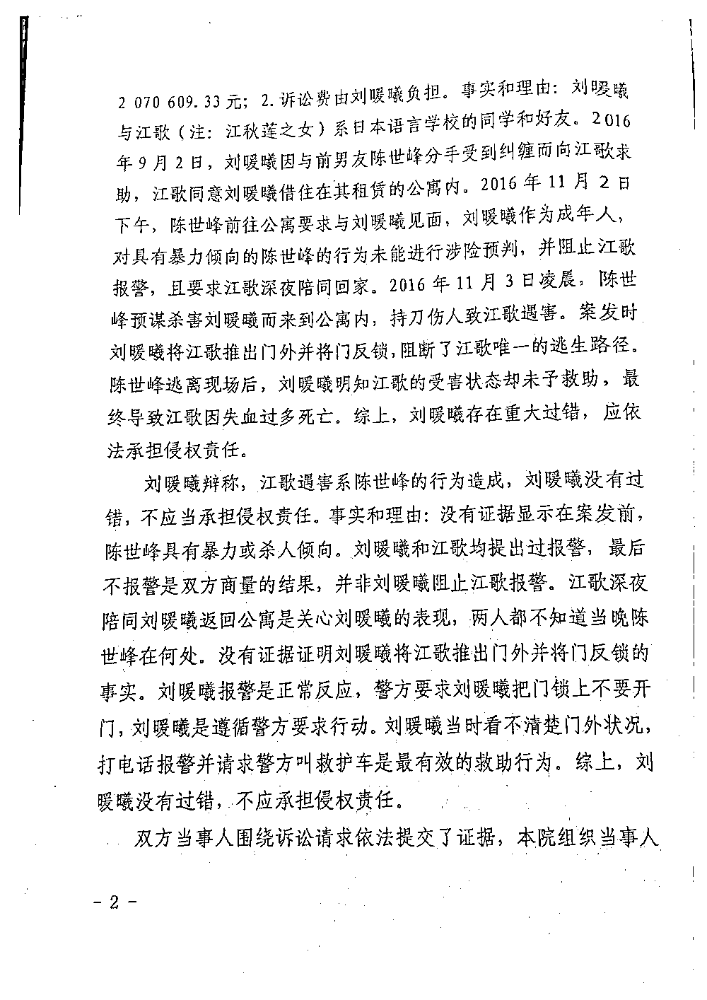
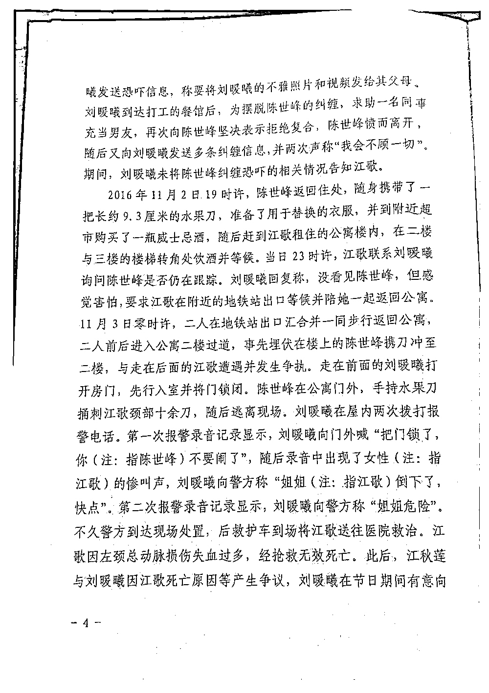
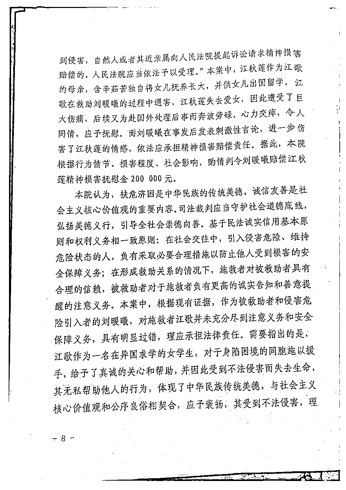

# 江歌母亲起诉刘鑫案终于判了！

> 原文：[`mp.weixin.qq.com/s?__biz=MzIyMDYwMTk0Mw==&mid=2247527523&idx=1&sn=c649e9059f907f706476285f32a52b6b&chksm=97cba75ba0bc2e4d983e432a426480982d45859809f6bbdd491fc8c98134a1f43fb578977c33&scene=27#wechat_redirect`](http://mp.weixin.qq.com/s?__biz=MzIyMDYwMTk0Mw==&mid=2247527523&idx=1&sn=c649e9059f907f706476285f32a52b6b&chksm=97cba75ba0bc2e4d983e432a426480982d45859809f6bbdd491fc8c98134a1f43fb578977c33&scene=27#wechat_redirect)

2022 年 1 月 10 日，江秋莲失去女儿的第 1894 天，山东省青岛市城阳区人民法院对原告江秋莲与被告刘暖曦（原名刘鑫）生命权纠纷案作出一审判决：被告刘暖曦于判决生效之日起十日内赔偿原告江秋莲各项经济损失 496000 元及精神损害抚慰金 200000 元，并承担全部案件受理费。 

1 月 10 日，江秋莲在庭外接受采访时表示，要去看江歌，告诉她这个结果，“妈妈在法律上认定了刘暖曦的行为。”今天还带了女儿的衣服来，要一起见证这一刻。

[`mp.weixin.qq.com/mp/readtemplate?t=pages/video_player_tmpl&action=mpvideo&auto=0&vid=wxv_2217825244998877189`](https://mp.weixin.qq.com/mp/readtemplate?t=pages/video_player_tmpl&action=mpvideo&auto=0&vid=wxv_2217825244998877189)

澎湃新闻记者 ：史含伟 祝文博 编辑：张兆亿 素材来源：澎湃新闻 相关人士 责任编辑：周琦

法院审理认为，**刘暖曦作为江歌的好友和被救助者，对于由其引入的侵害危险，没有如实向江歌进行告知和提醒，在面临陈世峰不法侵害的紧迫危险之时，为求自保而置他人的生命安全于不顾**，将江歌阻挡在自己居所门外被杀害，具有明显过错，应当承担相应的民事赔偿责任。

综合考量本案的事发经过、行为人的过错程度、因果关系等因素，法院对江秋莲主张的有证据支持的各项经济损失 1240279 元，酌情支持 496000 元。对于江秋莲主张的其他经济损失，不予支持。本案中，**江歌在救助刘暖曦的过程中遇害，江秋莲失去爱女，因此遭受了巨大伤痛，后续又为赴国外处理后事而奔波劳碌，而刘暖曦在事发后发表刺激性言论，进一步伤害了江秋莲的情感**，依法应承担精神损害赔偿责任。法院根据行为情节、损害程度、社会影响，酌情判令刘暖曦赔偿江秋莲精神损害抚慰金 200000 元。

法院在判决书中指出，扶危济困是中华民族的传统美德，诚信友善是社会主义核心价值观的重要内容。司法裁判应当守护社会道德底线，弘扬美德义行，引导全社会崇德向善。基于民法诚实信用基本原则和权利义务相一致原则：在社会交往中，引入侵害危险、维持危险状态的人，负有采取必要合理措施以防止他人受到损害的安全保障义务；在形成救助关系的情况下，施救者对被救助者具有合理的信赖，被救助者对于施救者负有更高的诚实告知和善意提醒的注意义务。

本案中，根据现有证据，作为被救助者和侵害危险引入者的刘暖曦，对施救者江歌并未充分尽到注意和安全保障义务，具有明显过错，理应承担法律责任。需要指出的是，**江歌作为一名在异国求学的女学生，对于身陷困境的同胞施以援手，给予了真诚的关心和帮助，并因此受到不法侵害而失去生命，其无私帮助他人的行为，体现了中华民族传统美德，与社会主义核心价值观和公序良俗相契合，应予褒扬**，其受到不法侵害，理应得到法律救济。**刘暖曦作为江歌的好友和被救助者，在事发之后，非但没有心怀感恩并对逝者亲属给予体恤和安慰，反而以不当言语相激，进一步加重了他人的伤痛，其行为有违常理人情，应予谴责**，应当承担民事赔偿责任并负担全部案件受理费。据此，法院依法作出上述判决。 

**新闻背景**

澎湃新闻此前报道，五年前，2016 年 11 月 3 日凌晨，在日本东京住所门外，江歌被室友刘鑫的前男友陈世峰杀害，年仅 24 岁。 

当地时间 2017 年 12 月 20 日下午 3 点，日本东京地方裁判所当庭宣判，陈世峰犯故意杀人罪和恐吓罪，被判处有期徒刑 20 年。 

因认为刘鑫对江歌的死亡存在重大过错，江秋莲于 2018 年 10 月发布微博称，将启动对刘鑫的法律诉讼。 

2020 年 3 月 29 日，青岛城阳区法院发布公告称，该院已受理原告江秋莲诉刘鑫生命权纠纷一案。同年 6 月 5 日和 11 月 20 日，该案先后召开二次庭前会议。 

澎湃新闻此前从江秋莲方代理律师处获悉，江秋莲在本案中提出民事索赔金额 203 万余元。本案起诉理由包括四个方面： 

第一，刘鑫为个人私利阻止江歌报警，以致日本警方无法及时介入对陈世峰采取强制措施； 

第二，刘鑫明知具有暴力倾向的前男友陈世峰存在暴力攻击他人的危险性，却未能对陪伴她的同伴江歌善尽提醒的义务，尤其是在她本人明显感知陈世峰的现实威胁而要求江歌深夜陪同一块回家的时候，却始终没有提醒江歌要警惕陈世峰的暴力伤害行为，导致陈世峰能够接触到江歌并实施犯罪行为； 

第三，刘鑫在遇险时从内侧将门反锁将江歌隔离门外，阻断了江歌唯一的求生路径，导致江歌无法逃避陈世峰的暴力伤害，最终因无法抵挡陈世峰的暴行而遇害；

第四，凶手陈世峰逃离后，刘鑫明知江歌的受害状态，但并未采取任何施救措施，放任江歌的伤情发展，最终江歌因失血过多抢救无效而死亡。 

获法院受理一年多后，该案件于 2021 年 4 月 15 日在山东青岛市城阳区人民法院开庭。江秋莲和两名律师到场参加庭审。 

原告向被告索赔金额从此前的 203 万余元增至 207 万余元，刘鑫方面仅有代理律师胡贵云出席。法院未当庭宣判。 

刘鑫是否对江歌的死存在过错成为本次庭审的焦点。江秋莲的代理律师黄乐平在庭审中表示，刘鑫存在阻止江歌报警、明知陈世峰有暴力报复的风险却不告知江歌以及案发时将江歌推出门外，反锁房门，在江歌受伤倒地后未采取措施对江歌施救等过错。 

刘鑫方面代理律师则称，他们此次作无责抗辩。江歌的遇害是陈世峰的行为造成，应由陈世峰承担侵权责任。刘鑫在整个事件过程中无任何过错，依法不承担责任。 

经过三个多小时的审理，审判长宣布：因双方争议较大，案件将择期宣判。 

江秋莲在庭审结束后表示，起诉刘鑫的初衷是寻求法律的权威结论。无论本案有多少赔偿款，她都将代表江歌将其全部捐给公益机构。 

对于刘鑫方面代理律师在庭审中“平和相处”的提议，她称，在江歌遇害后，她曾多次联系刘鑫及其家人。“当时没想追究责任，只想知道江歌被害的真相” ，希望刘鑫告知她江歌被害的真相，但没有结果。 

2021 年 12 月 27 日，青岛市城阳区人民法院曾发开庭传票传唤江秋莲，称该案定于 12 月 31 日上午开庭宣判。 

在原定的宣判日期前一天，2021 年 12 月 30 日晚上，江秋莲和代理律师黄乐平接到城阳区人民法院工作人员通知称，因审判长身体不适，该案原定的开庭宣判暂时取消。 

2022 年 1 月 4 日，澎湃新闻从江歌母亲江秋莲处获悉，该案将于 1 月 10 日上午在青岛市城阳区人民法院开庭宣判。

案件判决书全文

**此前报道：**

[江歌母亲诉刘鑫，被告方主张不承担任何责任！更多细节披露](http://mp.weixin.qq.com/s?__biz=MzIyMDYwMTk0Mw==&mid=2247512831&idx=4&sn=d9c4c9844172b03a89d8622e5f3661dd&chksm=97cb79c7a0bcf0d16be88458a814d6b79b6886553a39f21dcb7da19778581a38397f060a0eb2&scene=21#wechat_redirect) 

来源：新京报，澎湃新闻

← 向右滑动与灰产圈互动交流 →

