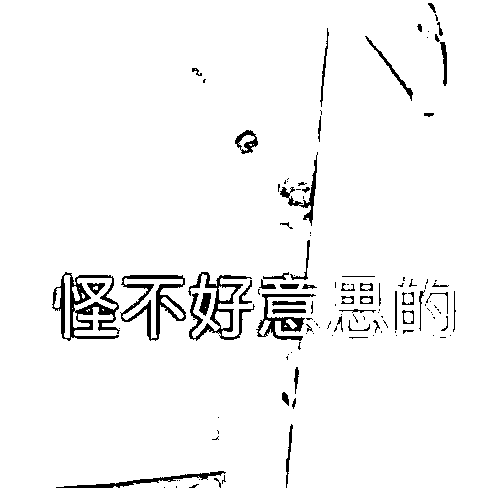

# 男子 1 年被骗 3 次共计 61 万！网友：每次都上当，当当不一样…

> 原文：[`mp.weixin.qq.com/s?__biz=MzIyMDYwMTk0Mw==&mid=2247527523&idx=4&sn=3352015295f8fa8339fdb41461c09327&chksm=97cba75ba0bc2e4d6fab6c3eaf345976856d8a8bdbd546cedc2c4c6ba7c3dc015c816055a59c&scene=27#wechat_redirect`](http://mp.weixin.qq.com/s?__biz=MzIyMDYwMTk0Mw==&mid=2247527523&idx=4&sn=3352015295f8fa8339fdb41461c09327&chksm=97cba75ba0bc2e4d6fab6c3eaf345976856d8a8bdbd546cedc2c4c6ba7c3dc015c816055a59c&scene=27#wechat_redirect)

骗子的套路层出不穷

常常让人防不胜防 

在受骗上当这件事上

**辽宁沈阳男子李先生**

**可谓“经验丰富”**

**1 年内，他连续 3 次被不同手段诈骗**

**总共损失了 61 万元！**

**请看三起案件还原**

**▼**

****第一次被骗****

****2021 年 1 月初，李先生到公安机关报案。****

****2020 年初，他通过“细聊 APP”**认识了一位网友**，和对方聊了 4 个月后，感情进入白热化，这时候，对方开始畅想美好的未来生活，李先生在对方的诱导下，****下载理财 APP 进行投资，先后投入 39 万元，**直到去年 1 月想要提现时，才发现提不出来。但是，存在侥幸心理的他并没有立即报警，而是继续抱有幻想，直到 APP 无法打开了才选择报警。******

********************第二次被骗********

******给骗子白打一年工的他心有不甘，同时，寂寞的生活让他继续选择在网上寻找寄托。**2021 年 10 月，他“幸运”地遇到了“富白甜”，**“她”带着李先生**玩起了****网络押大小赌博，**一夜间竟然“赚”了 15 万。这下一发不可收拾，第二天，他把大半年赚的钱全部投入进去，结果前面赢的钱一分没拿回来，**又搭进去 15 万。********

**************************第三次被骗**********

**********时间来到了 2021 年 11 月底，眼看就要到年底了，李先生想赚点“快钱”解决燃眉之急，他在刷抖音时，一条广告引起了他的兴趣：“招聘抖音点赞员，**工资日结 300-500，轻松月入过万”**，结局大家都可以猜到了，**他第三次来到同一个派出所报警，这次他被骗了 6 万余元……************

****************

********可以想象********

********派出所民警看到他时******** 

**********崩溃又炸裂**的心态********

******************** 

********都说人不能在同一个地方摔倒两次********

********像李先生这样********

********摔了 3 次的人应该不多吧？********

********然而********

********沈阳警方统计了这么一组数据********

**********▼**********

********去年在沈阳共有******** 

**********32 人****被骗 2 次以上**********

********其中 1 人（上面的李先生）********

********被骗 3 次********

**********男性****17 人****，女性****15 人**********

********高发警情年龄段：********

**********27 岁-40 岁**********

**********被骗的手段包括：**********

********刷单 23 起、杀猪盘 17 起、虚假购物 13 起、冒充公检法 5 起、投资理财诈骗 3 起、虚假贷款 2 起、冒充电商客服 1 起、网络游戏虚假交易类 1 起。********

****************

**********警方紧急提醒**********

********认知能力、互信方式 、价值取向和情绪管理，是每个人必须提升的防骗技能。********

********在互联网里，不要对没有见面的人轻易建立信任，骗子会把所有策略组合起来使用，能做到让你对各种危险的信号视而不见。********

**********在情绪巨大波动的状态下，不要试图做任何决定**，此时，你的所有本能反应，都可能会让自己一步步走入陷阱。********

**********最好的求助方式就是问警察**，因为，直接拨打 110 咨询公安机关，这个电话永远不会被转接到诈骗分子的手中。********

********李先生真是********

********每次都上当，当当不一样啊********

********小编也再次提醒大家********

********天上不会掉馅饼********

********遇到任何轻易赚钱的“好事”********

********一定要擦亮眼睛，捂紧钱包********

********不要钻进骗子的圈套！********

********来源：辽沈晚报、沈阳公安反电信网络犯罪查控中心、红网********

****************

********← 向右滑动与灰产圈互动交流 →********

****************