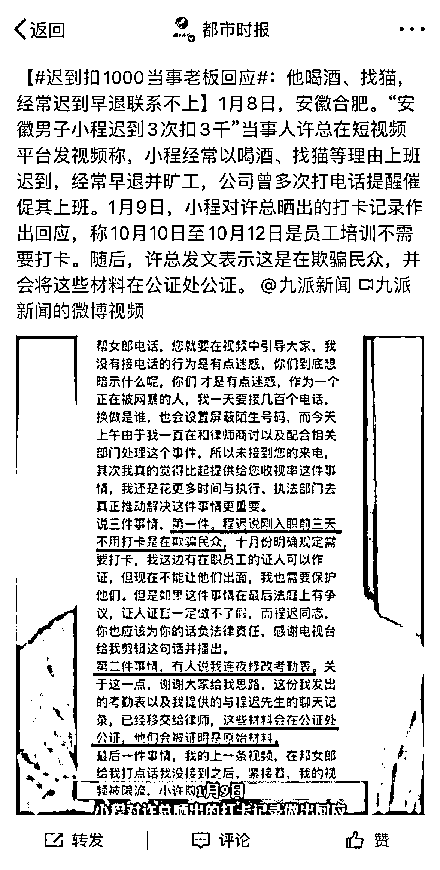
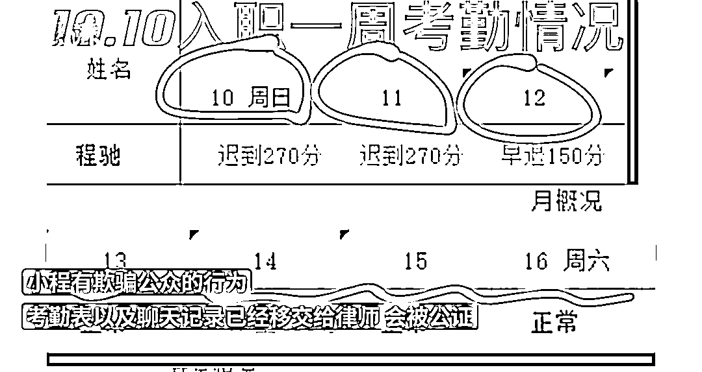
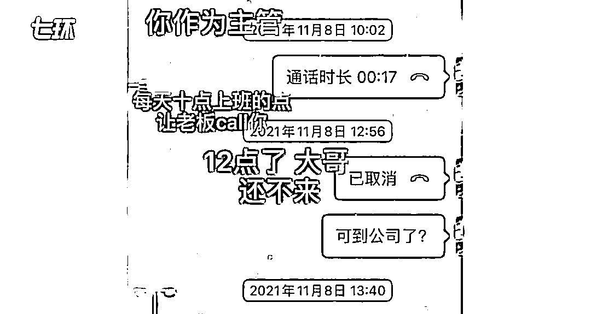
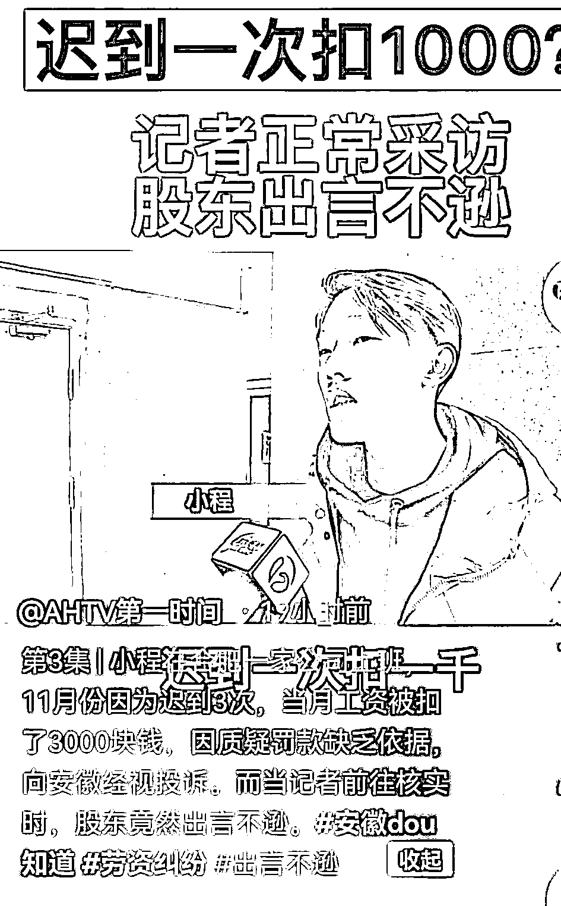
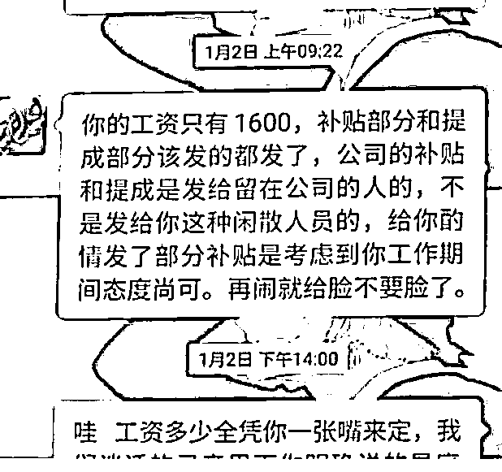

# “迟到罚 1000 让记者滚蛋”事件，反转了？

> 原文：[`mp.weixin.qq.com/s?__biz=MzIyMDYwMTk0Mw==&mid=2247527585&idx=1&sn=783b5bce2d6a48ea8b644708c1102080&chksm=97cba799a0bc2e8f9e4df0bf7a6aa995febbf33ff882b63fe6905235ed082f29e3bdd204a96f&scene=27#wechat_redirect`](http://mp.weixin.qq.com/s?__biz=MzIyMDYwMTk0Mw==&mid=2247527585&idx=1&sn=783b5bce2d6a48ea8b644708c1102080&chksm=97cba799a0bc2e8f9e4df0bf7a6aa995febbf33ff882b63fe6905235ed082f29e3bdd204a96f&scene=27#wechat_redirect)

[`mp.weixin.qq.com/mp/readtemplate?t=pages/video_player_tmpl&action=mpvideo&auto=0&vid=wxv_2219278180224417799`](https://mp.weixin.qq.com/mp/readtemplate?t=pages/video_player_tmpl&action=mpvideo&auto=0&vid=wxv_2219278180224417799)

澎湃新闻记者：祝文博 编辑：王福艳 素材来源：综合网络 责任编辑：周琦 校对：刘威

近日

[**“迟到 1 次罚 1000，让记者滚蛋”**](http://mp.weixin.qq.com/s?__biz=MzIyMDYwMTk0Mw==&mid=2247527311&idx=5&sn=857d3e5e80ae05338e118d92396f2a75&chksm=97cba0b7a0bc29a142b1cbf5476b4870863b6bba462279dbcb9e6ccb55e9743c78943364320a&scene=21#wechat_redirect)

事件引发大量关注

当事人许总回应该事件：

晒出和举报者小程的聊天记录

记录显示小程以各种理由迟到

公司曾多次打电话提醒催促

并表示 

自己因为没有接到节目组的电话 

就被节目组针对 

节目组的行为也很迷惑

9 日 

小程作出回应

称去年 10 月 10 日至 12 日 

是员工培训不需要打卡

随后 

许总发文表示这是在欺骗群众

并会将材料在公证处公证

1 月 4 日

在安徽子任生物科技有限公司 

上班的小程反映 

去年 11 月份因为迟到 3 次 

被扣了 3000 元

因为质疑罚款缺乏依据

向当地媒体投诉

合肥蜀山区一公司员工反映，他迟到一次被扣 1000 元。来源：安徽广播电视台

安徽电视台记者采访时

被该公司负责人许总骂“滚蛋” 

且被要求出示“节目备案” 

还要说出领导名字

公司的前员工表示

放假比登天还难 

每天工作 14、15 小时 

还没有加班费 

当地劳动监察部门回应 

不管是新创业还是什么 

都要依法依规

对于该员工被扣罚工资问题

已让该公司提供考勤记录 

绩效考核标准等证据 

来源：澎湃新闻综合祝文博/澎湃新闻、九派新闻、都市时报

← 向右滑动与灰产圈互动交流 →

