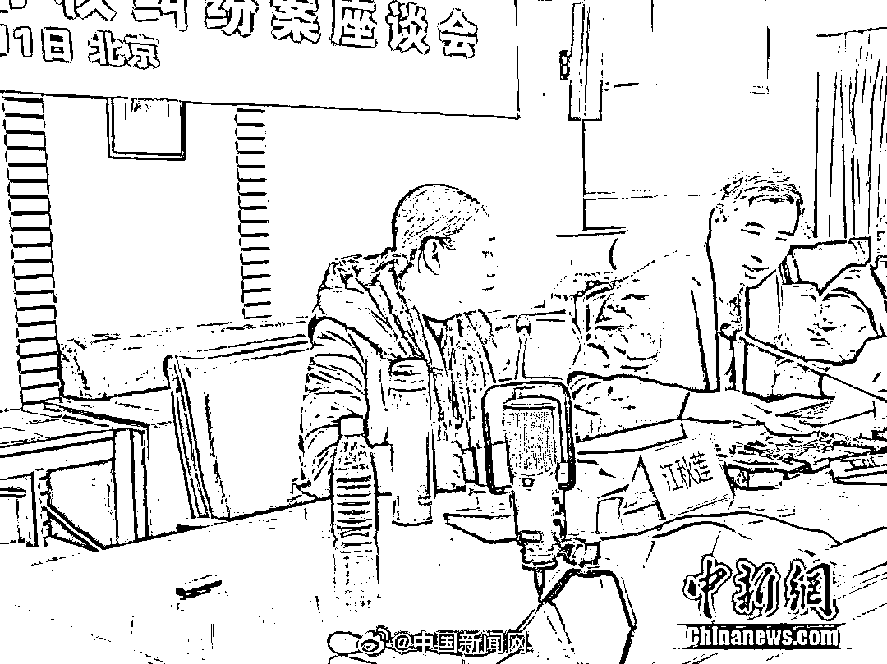
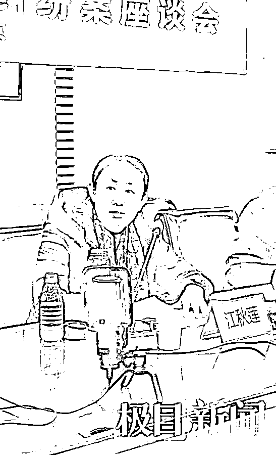

# 江歌妈妈：我需要赚钱，等凶手出狱回国继续起诉

> 原文：[`mp.weixin.qq.com/s?__biz=MzIyMDYwMTk0Mw==&mid=2247527585&idx=3&sn=b67d287100e559d15575c04649c41482&chksm=97cba799a0bc2e8fcb85450a2cd56bb9e18060b886cbb2ba446d89599d34e073ef96abe6fa49&scene=27#wechat_redirect`](http://mp.weixin.qq.com/s?__biz=MzIyMDYwMTk0Mw==&mid=2247527585&idx=3&sn=b67d287100e559d15575c04649c41482&chksm=97cba799a0bc2e8fcb85450a2cd56bb9e18060b886cbb2ba446d89599d34e073ef96abe6fa49&scene=27#wechat_redirect)

江秋莲表示，自己在有了江歌之后，便一直只有一个身份，江歌妈妈。江秋莲称，自己在此前曾开设网店。“我需要维持自己的生活，**2037 年陈世峰出狱回国后，我将继续对他的诉讼。**”江秋莲称，如果有能力，自己希望可以回馈社会。

[`mp.weixin.qq.com/mp/readtemplate?t=pages/video_player_tmpl&action=mpvideo&auto=0&vid=wxv_2219300759874125827`](https://mp.weixin.qq.com/mp/readtemplate?t=pages/video_player_tmpl&action=mpvideo&auto=0&vid=wxv_2219300759874125827)

澎湃新闻记者 史含伟 编辑 胡岑 责任编辑：顾亚敏

1 月 11 日，江母诉刘鑫案当事人江秋莲及其代理律师黄乐平在北京召开座谈会，讲述判决后的感受。此前，江秋莲起诉刘暖曦（原名刘鑫）侵犯江歌生命权纠纷案宣判，法院判定刘暖曦侵犯行为赔偿 69.6 万元。

江秋莲表示，**她需要赚钱维持生活，也要为继续起诉 2037 年从日本出狱的陈世峰做准备。**

******江歌妈妈感谢众人******

 ****[`mp.weixin.qq.com/mp/readtemplate?t=pages/video_player_tmpl&action=mpvideo&auto=0&vid=wxv_2219309171852787717`](https://mp.weixin.qq.com/mp/readtemplate?t=pages/video_player_tmpl&action=mpvideo&auto=0&vid=wxv_2219309171852787717)**** 

****澎湃新闻记者：史含伟 王文娟 编辑：林蓉 责任编辑：李蕊**** 

****座谈会上，江秋莲首先感谢了媒体和网友的关注和关心。“这个案子有今天的结果，主要的功劳在两位代理律师。”江秋莲表示，自己 2018 年 1 月 12 日从日本回国，在家待了两天后，便前往了上海。“到昨天 1 月 10 日宣判，差五天整整 4 年，很辛苦。”江秋莲表示，自己这 4 年从最开始的找律师整个过程都十分曲折，最后在好心人的介绍下认识了两位代理律师，有今天这个结果，自己十分感谢两位律师。****

****对于判决结果，江秋莲表示了对法官的感谢。**“感谢法官对江歌善良行为的认定。”**但同时，江秋莲表示，自己对于判决金额并不十分认同。“我这 4 年为这个案子花费的都不止这么多钱，更不用说江歌的生命。”****

********

****江秋莲表示，昨日判决结束后，自己第一时间将判决结果告知了此前在日本帮助她的海外侨胞。同时，她再次感谢了此前曾帮助她的海外侨胞。****

****江秋莲称，“**判决宣判后，我带着判决书到江歌那里，全文给江歌读了判决书，告诉她妈妈做到了。**因为判决书认定的事实，我一直知道这个事情的事实就是这个样子，我女儿也知道，我也知道，那么我这一次，通过法律的判决来告诉大家这个事实。”****

******刘鑫仍未联系江歌妈妈******

****江秋莲提到，自江歌被害以来的 1895 天，和刘暖曦（曾用名“刘鑫”）只有唯一一次见面，就是 2017 年 8 月 23 号。“这些道歉你们都看到了，可是这个道歉是真的吗？那只是为了自己的生活不被打扰而道歉，并不是对江歌这条生命的愧疚而道歉。”****

****“她的道歉只是为了自己，还发布消息诋毁江歌，之后再也没有道过歉。”江秋莲称。****

******刘鑫拒不执行赔偿怎么办******

****对于刘暖曦（曾用名“刘鑫”）的赔偿事项，黄乐平现场提到，一是判决还未生效，如果判决生效以后，**被告刘暖曦没有在规定的时间内来履行执行义务，江秋莲女士有权利向人民法院申请强制执行。**对于江秋莲曾在微博说要继续追责陈世锋的刑事责任，由于时间还比较长，到 2037 年，那还有十几年，从法律或者法理上来说，江秋莲确实有权利去继续追究陈世锋的责任，至于将来怎么追责，可能要看当时江秋莲女士本人的意愿，以及当时的法律政策的规定。****

******暂不打算对刘鑫上诉******

****极目新闻记者了解到，目前，**江秋莲暂不打算就刘暖曦（原名刘鑫）侵犯江歌生命权纠纷案上诉。******

********“江秋莲女士需要沉淀一下自己的心情，届时是否上诉，江秋莲女士将告诉大家。”黄乐平表示。********

 ********“这五年怎么过来的，每一天都是在痛苦中。”江秋莲表示，自己此前也曾就网络暴力进行相关起诉，目前已有两案判决。********

********来源：澎湃新闻********

****************

********← 向右滑动与灰产圈互动交流 →********

****************