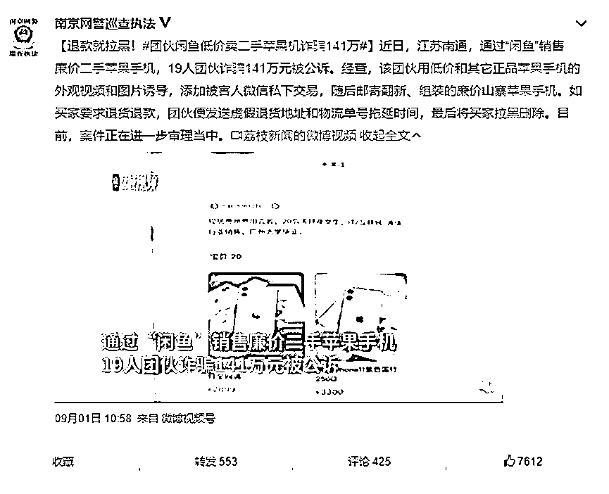

# 比“学生 50 包邮”更过分，闲鱼的骗术让人心碎

> 原文：[`mp.weixin.qq.com/s?__biz=MzIyMDYwMTk0Mw==&mid=2247527585&idx=4&sn=6878a611d2563fab8883142810b727ae&chksm=97cba799a0bc2e8f85b10768df3d67bf14229844a0c179d399d4cb4b92c235dd2c39137e0952&scene=27#wechat_redirect`](http://mp.weixin.qq.com/s?__biz=MzIyMDYwMTk0Mw==&mid=2247527585&idx=4&sn=6878a611d2563fab8883142810b727ae&chksm=97cba799a0bc2e8f85b10768df3d67bf14229844a0c179d399d4cb4b92c235dd2c39137e0952&scene=27#wechat_redirect)

“亲亲，宝贝还在吗？想买！QAQ” 

梦梦第一次挂闲鱼卖东西，没想到买家来得这么迅速且豪爽。

咨询了两句货物详情，对方就下单了。

“欸？付款怎么被平台拦截了？

宝子**你是不是没交消费保障金**呀！”

对方发来一张截图，图上显示梦梦这个卖家出了点问题，

要解决这个问题，就得按操作扫码。

梦梦扫码后发现跳转到了“客服中心”，

言简意赅表达一下客服的意思：**交一笔保证金**。

好消息是梦梦是个穷大学生，没什么钱，

坏消息是对方一直催促表示自己很想拍下宝贝，

并且出示了自己曾经的“退款记录”让梦梦放心。

“**如果不是顾虑买家的心情，我根本不会去交这个钱**。”

梦梦老实地交了这 1980 的消费保障金，

“客服”却还要追索 5000 元的假一赔三押金。

梦梦真的没钱了，决定放弃这笔交易追问如何退回。

对方没了回信，

恶人得逞后洋洋得意地离开了。

想不通，好好一个互惠互利的二手交易平台，

怎么就变成了诈骗团伙发挥的大舞台？

今天，我们就来好好说说关于闲鱼的那些诈骗之术。

**诈骗出没，卖家谨慎！**

**1.退货不退款诈骗**

不知道你有没有遇到过这种情况，

交易之前大家什么都谈妥贴了，

对方也老老实实下了单交了钱，

本来都已经等到货对方确认火速收钱了。

对方：**我要退款（且不退货）**。

在产生售后退货的时候，

一定要注意买家申请的是退货退款，还是仅退款**。**

**有的骗子会申请仅退款**，

一旦没有仔细核对，钱货两空泪两行。

**2.面交空手套白狼骗局**

简单来说，就是卖家发布了出售的商品，

骗子拍下来但不付款，并联系卖家当面交易。

与此同时，骗子把卖家的物品再次发布到平台上寻求新的买家，

找到新买家以后，卖家同样约他当面交易。

骗子与卖家和新买家约定见面同一时间和地点，

**最后见面交易的，是被骗的卖家和新买家**，

新买家确认收货以后，钱就打到了骗子的账户上。

靠着这个信息差，骗子一手移花接木、瞒天过海秀花了眼，

剩下苦逼的卖家和新买家去扯稀里糊涂的皮。

**3.****保证金诈骗**

这就是开篇说的诈骗手段，

“买家”发来消息称购买物品，

但因**卖家没有开通“消费者保障”导致支付失败**，

随后发来一张支付失败的页面截图。

截图上确实有显示该项内容，并附有一个二维码，诱导卖家扫码。

结果进去以后就是“客服”聊天页面，

“客服”称开通“消费者保障”需要从绑定的银行卡转出一笔“保证金”，

**并保证开通后可以退回全款**。

铁子们记住了：这不是官方！陌生二维码链接不要随便点！

**谁要想从你口袋里捞钱，**

**直接跟他说拜拜！**

**赚钱不易，买家注意！**

**1.低价骗局**

为了吸引眼球，

骗子们谎称自己是“低价捡漏”、“考研结束”、

“学生自用”、“工作室闲置”等理由低价出售商品，

这时候一定要提高警惕！

你以为捡到宝了欢天喜地下了单，

在双方交易后他却寄出的是山寨产品。

这类典型当属“**低价苹果手机**”骗局……

总之，不要老想着捡漏，

就算天上真的有馅饼，

为啥能精准落到你头上呢？

**2.私下交易骗局**

“直接微信转我，便宜你 50？”

？便宜 50 欸，好耶！

可是哥，为什么我转了钱你人就不见了？

可恶，你给我等着，我立马维权！

**亲亲，闲鱼只认可在平台上的聊天记录作为纠纷凭证！**

在微信或电话的内容，都没办法成为证据。

怎会如此……

无论如何闲鱼的交易就老实走闲鱼下单，

不要私下转账给卖家，以免钱财两失！

**3.链接骗局**

骗子发布产品的出售信息，利用低价来吸引人，

当有人前来询问，骗子就会发来一个**伪装成闲鱼网站的山寨链接**；

或在**改价以后发链接让买家付款**，

付完款后，发现在闲鱼官方平台根本没有这笔交易记录？！

哦豁了，糟了哇。

现在的骗局防不胜防，随意授权或扫码，就可能把你的信息套走，

因此**不要随意点击任何链接**，在交易平台拍下商品后先不要急着付款，

要在平台“待付款订单”中查看是否有显示这笔订单。

如果找不到相应的待付款订单，那 100%就是骗局。

**4.货到付款诈骗**

“货到付款不应该是很安全吗？验货后再付钱，怎么可能会被骗！”

那如果骗子寄出的是假货、山寨产品，甚至只是一个空包裹。

你怎么和快递小哥争论呢？

尤其手机、游戏机等电子产品，

当买家收到快递之后，

根本没有足够的时间去验机，短时间内无法辨别真伪。

在付款以后，就算发现东西有问题，

快递公司也会说他们只负责送货，

而此时你也发现联系不上卖家了。

说了这么多，

骗子的套路看似花样百出，其实都“万变不离其宗”：

他们利用大家贪小便宜的心理，一步一步引入自己的圈套。

希望大家擦亮双眼，**千万不要「贪小便宜吃大亏」**，

不要离开闲鱼去其他平台交易，

也不要随便点击对方发来的链接！

**闲鱼被骗了，该怎么办？**

当诈骗这事已经发生时，懊恼是没有用的，

不过可以尝试一下以下几种“自救”方式。 

**1.举报投诉**

闲鱼 APP 点击**【我的】**，点击**【帮助与客服】**，进入**【自助举报】**，

再点击**【交易欺诈举报】**，直接对骗子的行为进行举报，

或在【自助服务】页面下拉可联系正儿八经的官方客服小蜜。

如果买卖双方已经达成交易，但对售出的商品有争议，

**【闲鱼小法庭】**是除了人工客服外比较有效的维权方式。 

闲鱼小法庭的发起方式如下：

在卖家拒绝买家的退款申请后，买家可以进入退款详情页面，

点击申请介入，系统会判定由人工客服处理，

或是进入「闲鱼小法庭」进行判决。

**2.报警**

平台的监管有时并不是面面俱到，

而且说句老实话，

闲鱼小法庭的判决并不像现实的法庭那样以法律为准绳；

为了运营成本，各家平台的官方客服入口都隐藏的很深 ，

有时小单子也得不到人工客服“嘘寒问暖”的服务。

这时候怎么办呢？ 

小呸的建议是：**该报警时就报警**！ 

恶人胜利的条件，就是好人的束手就擒。

不要害怕丢脸或麻烦而选择“算了，就当买个教训了。”

对骗子越是容忍，他们就越是猖狂。 

多一条报警信息，警方就多一条骗子的线索！

每一位受骗人，也多一分希望！

← 向右滑动与灰产圈互动交流 →

