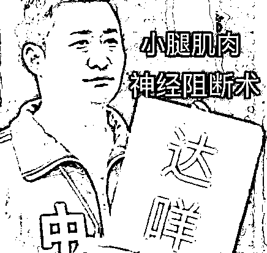
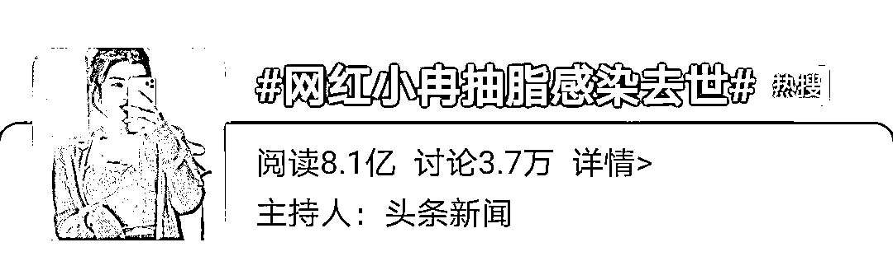

# 高潮针注入下体，一次 9800：这是自虐性行为上瘾吗？

> 原文：[`mp.weixin.qq.com/s?__biz=MzIyMDYwMTk0Mw==&mid=2247527649&idx=3&sn=cbbb78d0dd61e9b9e2acb3eebdeb2c38&chksm=97cba7d9a0bc2ecfbae3fed71be7d858d39ea77a91b7827a0bd27a61d9c837037354c4ebf9e1&scene=27#wechat_redirect`](http://mp.weixin.qq.com/s?__biz=MzIyMDYwMTk0Mw==&mid=2247527649&idx=3&sn=cbbb78d0dd61e9b9e2acb3eebdeb2c38&chksm=97cba7d9a0bc2ecfbae3fed71be7d858d39ea77a91b7827a0bd27a61d9c837037354c4ebf9e1&scene=27#wechat_redirect)

图文均来源网络

“颜在江山在”、“好看就是王道”成为当下一种流行。

爱美是人的天性，每个人都有追求美的权利。

匪夷所思的是，有人不惜大动刀子，冒着生命危险也要把自己套进“美人模板”。

像前段时间引起热议的“阴间整容术”：打针做手术也要有精灵耳、挑断腿筋变成漫画腿、切开头皮做成高头颅......

然而最近我发现，这些都不是极限，还有女性为了所谓的“完美私处”，对自己的下半身动手：打高潮针、切割私处。

原本就困在容貌焦虑、身材焦虑里的女性，再次被畸形审美绑上“美丽”的手术台。

我相信，所有女孩都做过美美的公主梦；

为了美也试过各种办法改善自己的外貌和身材：控制饮食、运动健身、化妆护肤、仪态穿搭等等。

追求高质量外貌的行为，值得赞同，也支持女性保持着良好精神面貌示人。

**在这里要反对的，是过度追求美，为了让自己符合“美人标准”不惜进行“病态美容”的行为。**

标价“9800 元”一次的打高潮针、切割私处整容，真的能让女性由内而外地更有魅力吗？

按照实施手术美容机构的说法，只要打一针，私密处就能水润、紧致，与男友老公的性生活体验会更美妙。

宣传文案里也是明里暗里在表达：那处完美紧致，和另一半性生活和谐，两人关系甜蜜，“性福才能幸福”。

是不是听着就蛮有诱惑力？ 

而且，为了让更多女性相信高潮针的科学性，它还有个医学名：高浓度血小板血浆治疗技术。

商家为了证明自己的权威，也是煞费苦心。 

说自己有批文，自己有专利，反正你们不信我就是你们不懂。

但是，这些在国家药监局的官网上一查，就可以发现些猫腻。

虽然能在药监局查到批文，但是批准的只是这个“血小板离心装置”。 

至于高潮针，国家根本连提都没提。 

好一招无中生有、暗度陈仓、凭空想象、凭空捏造......

而且离心出来的血小板，官方更是没有充足说明重新注入体内会对人体 100%无害。

目前国内有指南支持的，提取血小板再注回人体治疗的，只有用于治疗软骨、骨头受损的骨关节炎 。

在腾讯医典的知识科普视频中，来自中山大学附属第三医院整形外科主治医师赵博士，曾做过一个解释“高潮针”的视频。

（图片来自腾讯医典视频截图，侵权请联系删除）

高潮针广告中宣称的“高浓度血小板血浆治疗技术”，与医学上的血小板血浆手术，不是一回事。

在医学上，血小板血浆手术主要应用在骨科和口腔科，目前没有实际医学研究能证明，它跟紧致女性私处弹性、保养阴道变粉嫩存在联系。

众所周知，女性私处是一个由粘膜、肌层和外膜组成的性器官，它的弹性和可延展性很强，本身就有可恢复性，哪怕经历过顺产，经过凯格尔肌肉训练后也能恢复。

（图片来自 B 站截图，侵权请联系删除）

根据目前妇产科的研究，真正与阴道松弛有关的是盆底肌，没做好这个修复，打高潮针真的跟交智商税没什么区别。

至于经过手术之后女性与另一半的性生活是不是更爽，目前还没相关亲身体验过的女性现身说法，能找到的大部分是整容医院的说辞。

再退一万步说，女性私处作为性器官，跟人体所有器官一样会经历自然衰老的过程。

**性生活不和谐，怎么就成了女性单方面的问题？难道就不能是男性给“小弟弟”打个玻尿酸变强变大吗？**

**与高潮针一同流行起来的，还有阴道手术。**

山西太原一名 28 岁女子生完孩子后，想要更完美的阴道，在某机构花费 17 万做了私密超声刀手术。

手术前检查，她身体健康，一切指标都是正常的。

然而在手术过程中，她就感受到非常不适，阴道有发烫发热的感觉；

做完手术后，私处出现开始胀痛感。

百般不适应之下，她去省妇幼医院做了检查，结果鉴定为：阴道损伤、子宫凸垂。

（图片来自都市 110 新闻报道，侵权请联系删除）

唉，有这 17 万做什么不好啊？非要用来折腾自己，伤了阴道，甚至会影响以后生孩子问题。

还有女性的阴蒂切割下来后被拍照发到网上，美名其说：“向干净完美靠拢！”

（图片恶心到上周的宵夜都吐出来了，给大家做了模糊处理）

有的缩阴术更是赤裸裸的智商税，花钱买难受。

美容机构给我们徒手缩阴的，大部分是没有经过专业训练的从业人员，稍有不慎就可能会伤及私处肌肉和神经，严重者会导致瘫痪；

药物缩阴、冷冻缩阴更是毫无科学依据，这些方式用的药物暂时性能让阴道紧缩，实际上都有后患无穷的副作用。 

**这年头，“性爱焦虑”已经成为女德绑架的另一种形式。**

她们总是担心是自己不够好，不符合“美人标准”，就不能让另一半满意。

早在高潮针、切割私处出现前，漫画腿、高头颅、精灵耳就以“精致好看”为名荼毒过不少女性。

**整容术不是为了打着变美的旗号让女性变着法子“残害”身体的！**

身体发肤受之父母，古人剪头发都觉得愧对爸妈，现代人竟然为畸形审美，花高价让身体受罪，冒着生命危险也要做手术，几乎每年都有女孩为“美丽”失去宝贵的生命。

前年 10 月，香港千金小姐罗贝儿到韩国做抽脂和隆胸手术时，因为镇静剂使用错误引起身体不良反应而去世；

前年 1 月，19 岁女大学生做隆鼻手术，出现四肢痉挛、恶性高热，抢救无效身亡；

龚自珍在《病梅馆记》中说到，“梅之欹之疏之曲，又非蠢蠢求钱之民能以其智力为也。”

古人以“病梅”为美，甚至告诉种梅的农人，在梅花生长时用尽办法把枝条弯曲、扭断，以满足自身的审美意趣。

**今天为了“美丽”病态美容的女性，不外如是。**

**如此疯狂的行为，真的是为了让自己变得更美，还是符合“美”而取悦别人？**

****虽说爱美是天性，但不能把改变外貌变成人生方向。

方向不但掌握不好，容易触礁身亡。

前段时间**“网红小冉做抽脂手术不幸身亡”**冲上热搜。

大家也都纷纷为小冉惋惜——年仅 33 岁，有事业，有美貌，太可惜了。

也有不少人说：“已经这么美了，如果她对自己要求不那么高就好了”。 

谁身边都有几个朋友，明明很瘦了，却还说自己胖；明明五官已经很精致了，却还觉得自己不够美。 

**女孩太容易把外貌和自信挂钩，自卑就成了人生底色。**

在《超级演说家正青春》节目中，15 岁网红女孩周楚娜分享了自己的整容经历。

13 岁开始整容，15 岁已整容上百次，花费超过 400 百万。

在周楚娜的认知里，**“长的美的人才有青春，长的丑的人只叫长大。”**

她期待通过手术刀从丑小鸭逆袭成白天鹅，从此开启崭新的人生。

可结果，她的人生都毁在了手术室。

不少人评论她：

「最该整的地方不是脸，而是脑子。」

变美不是为了让自己整容变成另外一个人，可惜很多姑娘都不知道。

**活在容貌焦虑中的人就像被关进的笼子里的兔子。**

**想要重获自由和快乐，就需要打破困境，学会欣赏自己的美。**

**你要学会迎合自己，而不是别人。**

**摒弃千篇一律的审美，才能活成万里挑一的自己。**

****

早在 2012 年，记录在案的全球整形事故就高达 96853 起。

**中国一年有 5.6 万人赴韩整容，失败率猛增 15%，短短十年，就毁了二十万张脸。**

甚至有女孩因为整容，失去生命。

那些黑作坊，买一块鸡腿，对着打五天针，就能成为经验丰富的“微整形专家”。

网红经济的催促下，无数女孩去追求尖下巴，追求网红美，最后伤及己身，得不偿失。

与其冒着这么大的风险，去整容，不如想想怎样去提高自己的内在。 

毕竟，美人在骨不在皮。

**别把自己的人生放在整容的手术台上，别让“美丽”绑架自己。** 

**美貌或许会让你尝到一些甜头，但逆天改命，靠的是实力。**

来源：育儿记录 幸福小酒馆

← 向右滑动与灰产圈互动交流 →

