# 最快翻车？B 站新晋百大 UP 主被爆母亲是"老赖"

> 原文：[`mp.weixin.qq.com/s?__biz=MzIyMDYwMTk0Mw==&mid=2247527649&idx=7&sn=96858b8f54a296c11b0a8c9979c1b036&chksm=97cba7d9a0bc2ecff6f7012fe6fc27bff9651458657bc448b0242429f850bf7a083286734afc&scene=27#wechat_redirect`](http://mp.weixin.qq.com/s?__biz=MzIyMDYwMTk0Mw==&mid=2247527649&idx=7&sn=96858b8f54a296c11b0a8c9979c1b036&chksm=97cba7d9a0bc2ecff6f7012fe6fc27bff9651458657bc448b0242429f850bf7a083286734afc&scene=27#wechat_redirect)

近日，B 百大 UP 主名单出炉，评选标准一度引发粉丝的争执。不过相比之下，今年当选的新 UP 主@朝烟今天唱歌了没 被卷进了更大的争议。

自 2021 年 9 月起，用户@bibibibi 怎么有这种人 连续发布动态及视频，**控诉自称该 UP 主妈妈的@朝烟头号真妈妈粉 在已经被法院判处还款 28 万的情况下欠钱不还，还到处声称债主所说内容不实。**

1 月 11 日，百大 UP 主名单公布后，@朝烟头号真妈妈粉 在 B 站更新动态表示正在协商还款，“不要骂我女儿，要骂就骂我吧，对不起”。

由于该 UP 主为未成年人，本文重点为该 UP 主母亲的行为，罗列资料来自法律文书及双方公开的聊天记录。

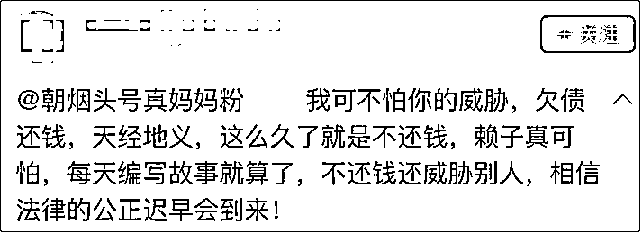

@朝烟今天唱歌了没 是 B 站 UP 主，目前在 B 站粉丝超过 146 万，微博粉丝破 47 万。

2021 年 9 月，B 站用户@bibibibi 怎么有这种人 开始在 B 站更新动态，表示 B 站用户@朝烟头号真妈妈粉 是这位 UP 主的妈妈，这名母亲在已经被法院判处还钱的情况下仍然欠钱不还，还到处声称债主所说内容不实。

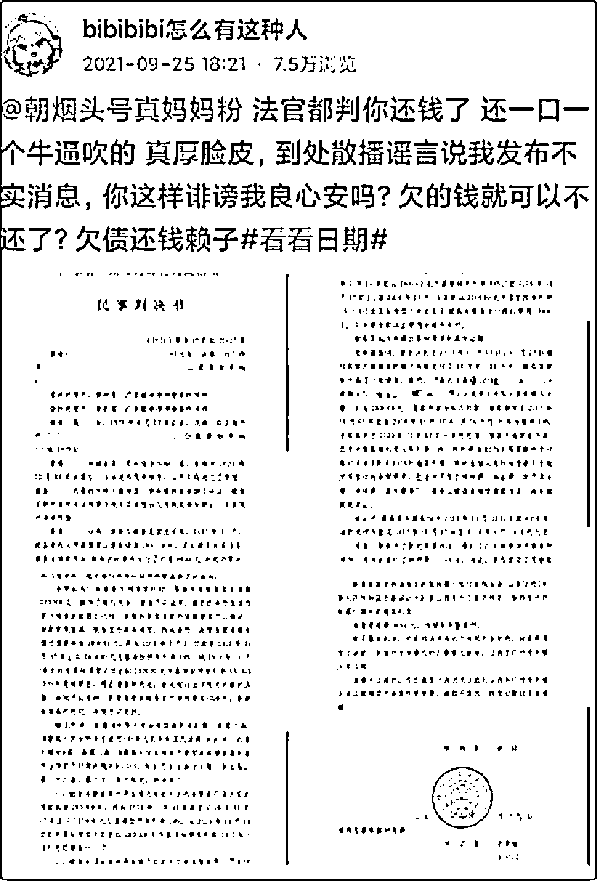

目前该动态已经删除，仅留两条他与该 UP 主妈妈的对话录屏。

视频中，该 UP 主妈妈表示接下来的收入会用来还钱，没必要赖账。

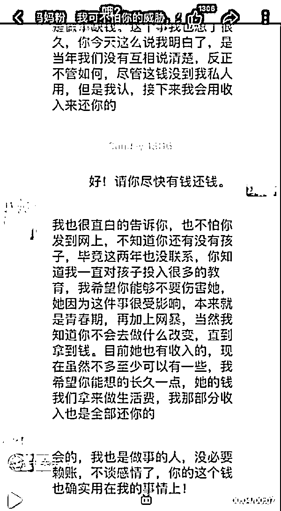

他还晒出借条。

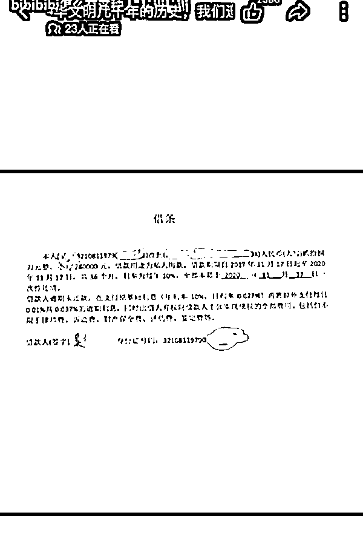

这名用户目前也删除了先前发布过的民事判决书。根据网传资料，观察者网核实到该民事判决书已在“中国裁判文书网”上公开。

该判决书发布于 2021 年 6 月 2 日，原告诉称双方为朋友关系，被告因私人用款需要向原告借款 280000 元，并向被告出具借条。原告出借款项后，被告仅向原告支付了利息 4000 元。

判决结果为，被告在本判决生效之日起十日内向原告偿还借款本金 280000 元，并从 2018 年 1 月 11 日起至 2020 年 11 月 17 日止以 280000 元为基准按照年利率 10%、从 2020 年 11 月 18 日起至实际清偿之日止以 280000 元为基准按照年利率 13.32%计付利息给原告。

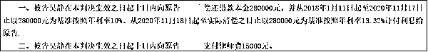

2021 年 11 月开始，@朝烟头号真妈妈粉 开始在 B 站上发表双方聊天记录进行解释。

2021 年 5 月，她在聊天中称当初谈的是公司投资，对方所发布的为不实言论，对方反问她“哪里不实，我私下找你沟通你不理我，我只能通过网络来寻求帮助”。

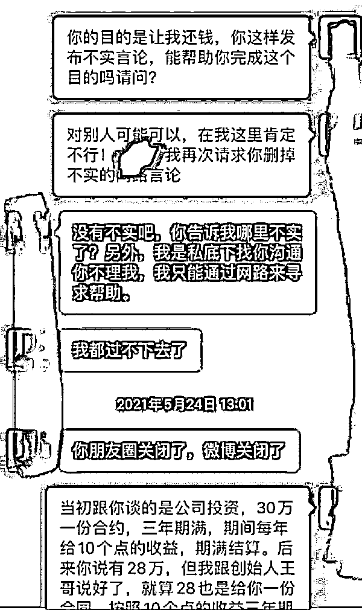

2021 年 8 月，判决出来后，对方催促她能否再还一部分，她说自己“不会不承担”，还不出是因为确实没有，并表示自己“两年来连袜子都没新买过一双”。

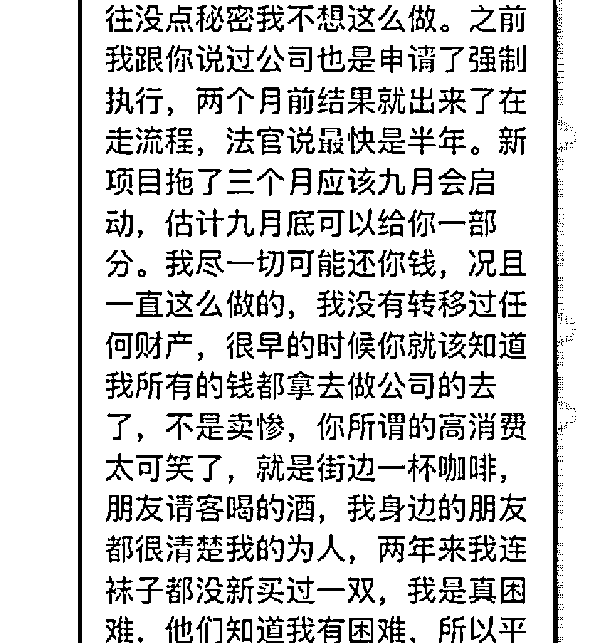

对方则解释当初是借钱，不是投资，他只想要回属于自己的钱，双方对“借钱”与“投资”说法不一致。该 UP 主妈妈还说，希望不要伤害孩子，她正处于青春期，遭遇了网暴。

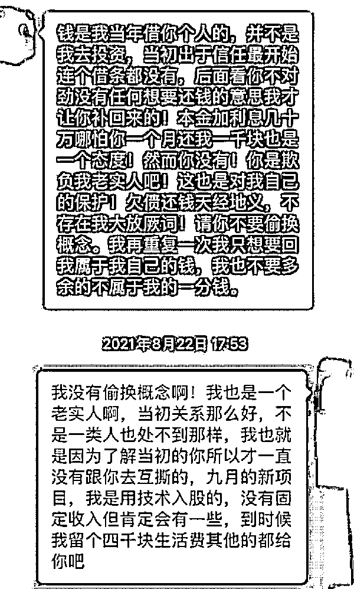

2021 年 11 月，她请求对方发表一个书面说明，说明自己是出于姐弟感情私人借款，并在对方在网上继续发布信息后威胁如果 24 小时内不删除将开始法律流程。

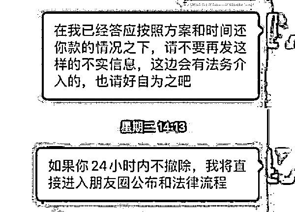

11 月后，@朝烟头号真妈妈粉 没有再发表更多内容。但随着该事件发酵，有网友指出，**她在聊天记录中说自己连袜子都没新买一双，却在 2021 年 3 月的一个视频中回复网友，给女儿上课的老师是“英皇留学回来的非常棒的一位老师”。**

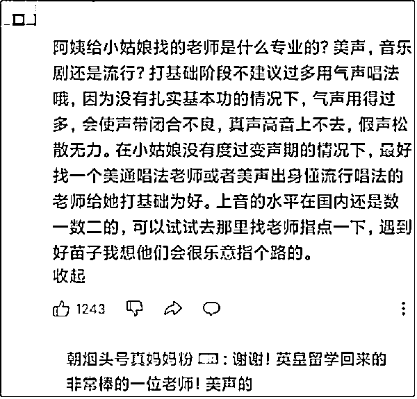

2022 年伊始，B 站新的“百大 UP 主”开始话题发酵，名单于 11 日公布。

名单公开后，有网友发现@朝烟今天唱歌了没 也在其中，便提起这一事件。

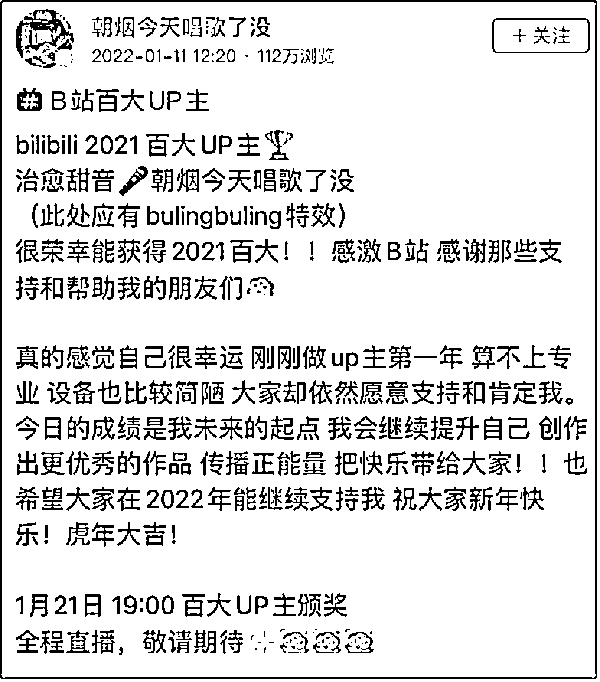

11 日下午，@朝烟头号真妈妈粉 在 B 站发布动态，表示：

**“正在协商还款中，不要骂我女儿，要骂就骂我吧，对不起！**因为我的事情连累了很多人，我女儿还有我女儿的粉丝。”

她附上一张自己与对方的聊天记录，以印证自己“正在协商还款”的话。该图片显示，她分别于 2021 年 11 月 30 日和 12 月 30 日各还款 5000 元。

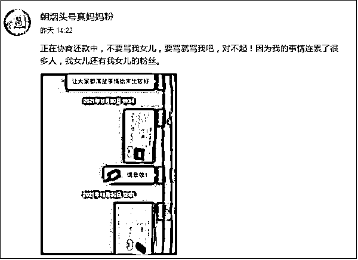

来源：观察者网

← 向右滑动与灰产圈互动交流 →

