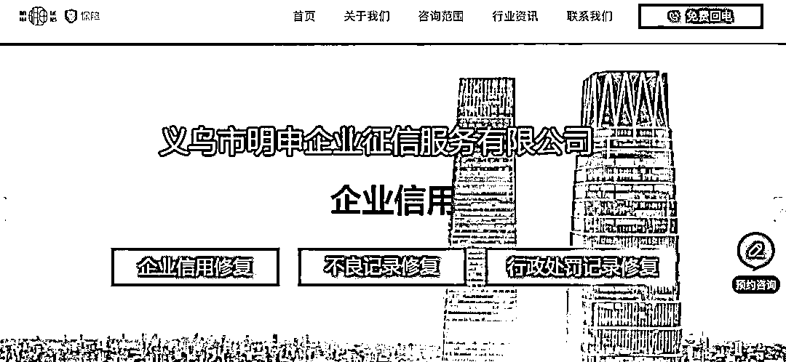
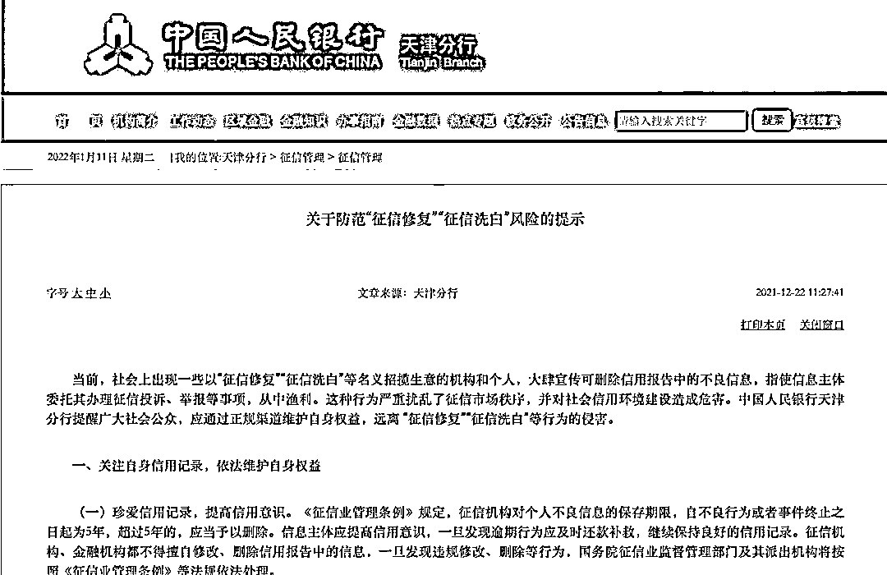

# 千元修复个人征信报告可信吗？

> 原文：[`mp.weixin.qq.com/s?__biz=MzIyMDYwMTk0Mw==&mid=2247527649&idx=8&sn=2a9916ac0b8caa5eb0b8d77dd2346a66&chksm=97cba7d9a0bc2ecfa068f34a2341227a3553dcebeac1ef29125dcd3184268f158f94c9b024a1&scene=27#wechat_redirect`](http://mp.weixin.qq.com/s?__biz=MzIyMDYwMTk0Mw==&mid=2247527649&idx=8&sn=2a9916ac0b8caa5eb0b8d77dd2346a66&chksm=97cba7d9a0bc2ecfa068f34a2341227a3553dcebeac1ef29125dcd3184268f158f94c9b024a1&scene=27#wechat_redirect)

征信报告是由中国人民银行征信中心出具的记载个人信用信息的记录，用于查询个人或企业的社会信用。如果一个人的信用卡没有及时还，或者有欠税记录、强制执行记录、电信欠费记录等，个人信用报告上就可能显示，在办理信贷的时候就会受到影响。

于是，一些号称能“修复个人征信报告”的广告就在网上出现了。“一条 1000 元至 2000 元。如果修复不成功，可以退款。”征信记录真的能“修复”吗？存在怎样的风险？

有机构声称能修复征信

费用从几千元到上万元不等

这两年，社会上有机构或个人专做“征信修复” “征信洗白”的生意。记者在网上以关键词“征信修复” 搜索，有多家打着“逾期征信修复”招牌的公司网站。一家叫（浙江）义乌市明申企业征信服务有限公司的网站宣称，他们主要经营企业信用修复、不良记录修复、行政处罚记录修复。

△浙江义乌一家征信修复公司在其网站上宣传它的经营范围

记者以名下信用卡有 6 次逾期记录为名，拨打了这家公司业务员刘先生的电话，他给出的报价是最低 9 千元，“连续逾期的记录，修复就便宜一点；有一个月还一个月没还的这种，处理费用就会高一点，得 1500 元一条。”

据刘先生介绍，只要在他发的表格上，填上身份证号码、信号卡账号，以及发去一份征信逾期报告就可以了，付费方式则需要预付定金。业务员刘先生还对记者表示，如果是企业贷款逾期，尤其是那些账户被冻结的企业客户，征信修复操作起来就更贵了，“这种异常的要 5 万块一条了。”

征信修复，多久可以操作成功？业务员刘先生宣称，大概是 25 到 60 个工作日之间，“像您这种五六条的操作起来也比较简单。因为银行会判定逾期的性质，如果是连续逾期，就说自己有一些事情，跟银行打交道有个申诉点，就好操作一点。”

这家公司在其网站承诺：若某公示平台某条信息修复不成功，则该条信息对应修复的费用不收取或者退还！

业内人士：正常个人征信记录申诉

不需要通过第三方公司

这些信用修复机构究竟是怎么操作的？一位熟悉银行征信管理的金融业人士季女士表示，如果是正常的个人征信记录申诉，根本不需要通过第三方公司。

“客户逾期申诉，其实是可以直接向银行申请的。中国人民银行也有一个明确的规定，符合信用逾期修复的几个条件，比如系统信息的录错，或者是客户个人信息被盗用套贷等，这些情况都可以通过官方途径直接联系银行修复。”

季女士说，现在疫情期间，有一些企业纾困的规定，比如一些企业因为疫情的原因经营不太好，也可以去向银行申请还贷延期和信用记录的异议申请等。 

在季女士看来，社会上所谓的征信修复机构，严格来说，顶多算是征信异议处理的代办机构。因为个人或企业征信是非常严肃的事情，所以即使是银行内部审批完后，也需要银行去联系当地的人民银行，再向人民银行进行报批。“整个链路下来，完全违法操作的可能性不大，像这种第三方机构属于是批量处理的，频繁地向人民银行申诉，人民银行也会引起重视的。”

银行：征信领域不存在“征信修复”说法

收费的“征信修复”都是骗局

实际上，征信修复和征信异议有着本质区别。征信异议本质上是一种“改正错误”的纠错机制，有别于“失信后”为重塑信用而进行的修复。

2021 年 12 月 22 日，中国人民银行天津分行发布“关于防范‘征信修复’ ‘征信洗白’风险的提示”。其中提到，征信领域不存在“征信修复”“征信洗白”等说法。 “征信修复”实则“借机牟利” ，这种行为严重扰乱了征信市场秩序，并对社会信用环境建设造成危害。

△央行发布的风险提示

中国政法大学知识产权中心研究员赵占领表示，正是因为有较大的市场需求，市场上才有大量征信修复机构存在。类似不法机构的泛滥，损害社会诚信体系，处罚力度亟须加大。“如果其他的个人或者是所谓的公司，通过非法的方式实现，这种做法本身也是违规的，有黑色地带。”

记者在中国裁判文书网查询发现，近年来各地发生多起有关“征信修复”的诈骗案件或合同纠纷。近期，中国人民银行重庆营业管理部征信管理处相关负责人公开表示，所有声称是合法的、商业的、收费的“征信修复”都是骗局。

来源：中央广电总台中国之声微信，利箭在行动

← 向右滑动与灰产圈互动交流 →

