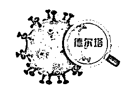
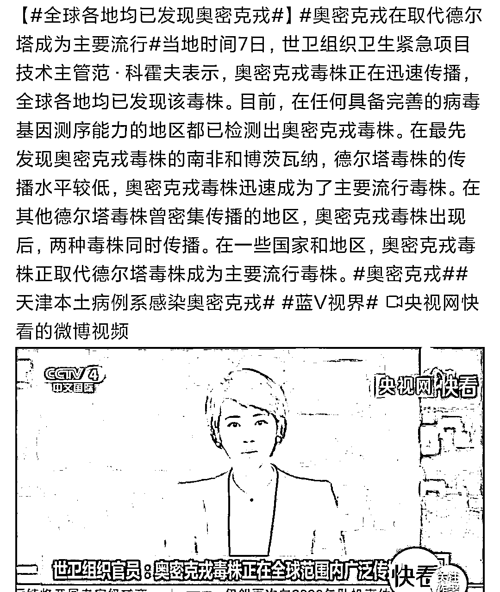
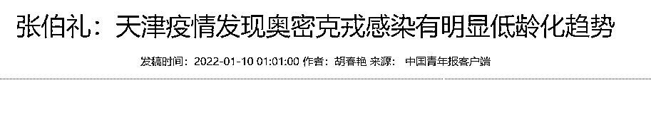
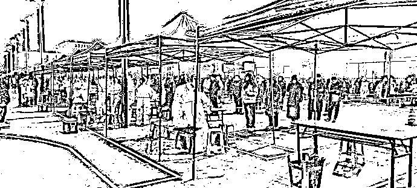
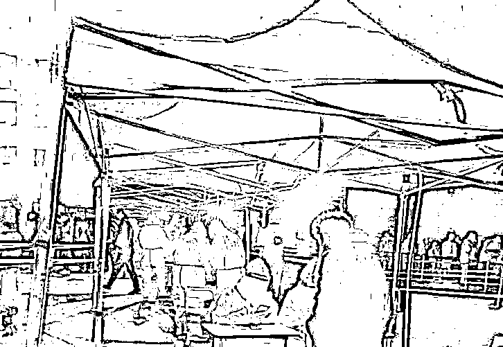
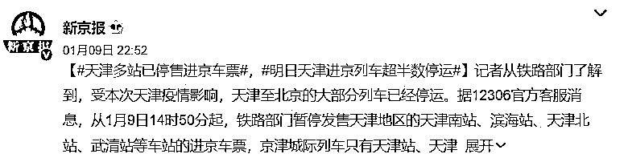
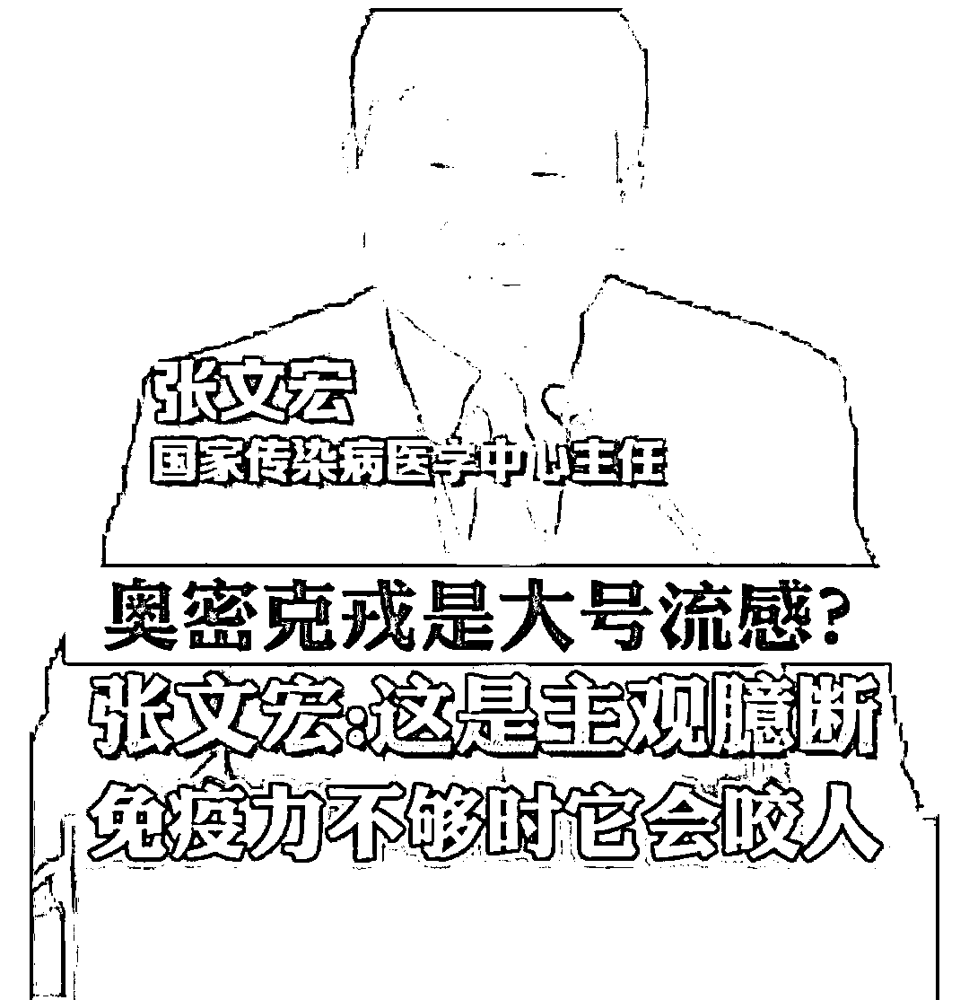

# 天津疫情，比你想象的凶猛！！！

> 原文：[`mp.weixin.qq.com/s?__biz=MzIyMDYwMTk0Mw==&mid=2247527722&idx=3&sn=5f2b9464bb3bef27b2d26f2cbc4e3f3d&chksm=97cba612a0bc2f0409819beadd867df47f10bc8b594b2c75a20981e86066e2fc1572d8dca3e7&scene=27#wechat_redirect`](http://mp.weixin.qq.com/s?__biz=MzIyMDYwMTk0Mw==&mid=2247527722&idx=3&sn=5f2b9464bb3bef27b2d26f2cbc4e3f3d&chksm=97cba612a0bc2f0409819beadd867df47f10bc8b594b2c75a20981e86066e2fc1572d8dca3e7&scene=27#wechat_redirect)

新冠病毒最凶险的变异株奥密克戎，终于还是攻破了世界防疫做得最好的中国内地。

防不胜防。

**天津，成了中国内地首个正面迎战奥密克戎的城市。**

**截至目前****，天津已新增 137 例感染者。**

全市范围内已开展大规模核酸检测。

这波凶险的疫情，到底造成多少感染，目前未知。

但，不管是从官方到民间，大家的重视程度，都在提醒着我们：

天津疫情，不容小觑，来势汹汹。

这波疫情，和之前我们交战过多场疫情，有什么不同？

我们一起来看看。

**这场疫情，**

**对手****凶悍且陌生****。**

伴随年关的临近，新冠肺炎有卷土重来的趋势。

西安、郑州、许昌、宁波和深圳等城市，相继打响抗击新冠疫情的狙击战。

其中，以陕西西安和河南许昌最为严峻。

但这些地方的新冠病毒，均为德尔塔变异株。

德尔塔最早于 2020 年 10 月在印度发现。

但直到 7 个月后的 2021 年 5 月，它才获得世卫组织的命名。

然后，在全球 200 多个国家开始大范围传播。

截至今天，我们已经掌握了对付德尔塔的有效手段：

**“流调→封锁→反复核酸→集中隔离”。**

**但此次天津迎战的奥密克戎，凶险至极。**

奥密克戎自 2021 年 11 月 9 日，首次在南非病例样本中被发现，并快速以惊人的速度席卷整个南非。

**短短两周后的 11 月 26 日，奥密克戎就获得世卫组织的命名。**

有科学家预测，奥密克戎是在艾滋患者身上发生的变异株，携带至少 32 处突变，且具有逃避免疫的狡猾性。

1 月 9 日，就在天津疫情爆发之时，世卫组织表示，奥密克戎已经攻陷了全世界，全球各地都发现了它的踪影。

**奥密克戎正取代德尔塔，成为主要流行毒株。**

在疫情严重的地方，存在德尔塔和奥密克戎同时流行、交叉传染的情况。

奥密克戎是位陌生的敌人，传播速度比德尔塔快了 30%，且第一次登陆中国内地，之前我们抗疫的惯用手段，是否行之有效，有待观察，有待探索。

**这就意味着，天津面临的这场考试，之前没有遇到过。**

如何解答这张考卷，是天津人民的严峻考验，也会成为中国内地战胜奥密克戎的样本。

天津没有作业可抄。

敌人来势汹汹，天津压力山大。

**这场疫情，** 

**源头****诡异且不明****。**

众所周知，天津首轮新增确诊的 20 名病例中，15 名为中小学生。

天津二轮确诊的 21 名病例中，8 名是 10 岁以下的孩子。

天津市疾控中心发布：

确诊的首轮 20 名病例，至少已经传播了 3 代，并可能在社区里已经传播了一段时间。

**传播速度极快。**

**传染性极强。**

**症状较轻，具有极大隐秘性。**

**感染者呈低龄化趋势。**

是天津这波疫情的特点。

首轮疫情的震中，是天津津南区一所校外托管机构。

先是托管老师被感染，然后是学生和学生家长。

最早被发现的这名托管老师，在流调时被发现从津南乘坐地铁，多次前往天津市中心。

更让人担忧的是，首轮确诊的 15 名学生，分别来自咸水沽镇、辛庄镇、闸口镇 3 个镇，涉及第七小学、高庄子小学和辛庄中学 3 所学校。

多少学生、多少家长被感染？这些家长又去了什么地方，会不会把病毒传染给更多人？这些都有待进一步检测。

目前，天津全市启动核酸检测，全部学校、托管机构、学科性和非学科性课外辅导班，全部停课。

听朋友说，他孩子所在的班级，老师几乎每隔一两个小时，就在班级群发布抗疫要求：

**不能离津，原地不动，听从安排，配合抗疫，打赢硬仗。**

**这场疫情，** 

**事关****京津两地****。** 

因为早在 2021 年 9 日，天津首次在中国内地检查出奥密克戎境外输入病例。

如今，天津又出现本土新增奥密克戎感染者。

新增的本土感染者，近期并未离津，一直在生活圈子里活动，所以无法确定，境外输入病例和本轮天津疫情，是否属于同一条传播链。

**也就是说，这轮疫情，到底是如何发生，又如何传播的，还不确定。**

不确定，意味着存在未知感染源。

而感染源不切断，感染的范围就会不断扩大。

事情有点复杂。

天津抗疫任务艰巨。

因为地理位置的特殊，天津在抗疫方面从未掉以轻心。

不管是全国疫情较轻的夏天，还是疫情越来越严峻的冬天，天津公共场所的防疫都非常严格：

口罩，绿码，体温，是任何场所不变的标配。

这场凶险的疫情，恰好爆发在北京冬奥会前夕。

津京两地距离甚近，且互动来往频繁。

**保护天津，守住北京，无疑是这场抗疫的最重要任务。**

虽然，一开始也难免有慌乱，但天津的抗疫能力和决断能力，都堪称雷厉风行：

半天时间就完成了所有确诊者的精准流调。

15 个小时就划定了封控区、管控防范区。

发布确诊 20 例的消息之同时，连夜核酸检测同时开始。

所有医务工作者，所有社区人员，很多志愿者，全部上阵，昼夜不停。

天津人天生乐观派，平时无事时，爱贫嘴说段子，但遇到了大事，会义无反顾冲上前。

我的一位朋友，就在天津。

他所在的区，距离津南还有些距离。

据他说，社区网格员一直在群里和大家交代核酸检测的注意事项。

从网络到现实，大家都表现得谨慎、平静又团结。

早上 5 点，两名社区工作人员，就敲响了他家的门，通知下楼核酸检测：

为了避免人群聚集和交叉感染，核酸检测点就设立在小区内。

一栋楼一栋楼检测，社区组织有序，大家积极配合。

**这场抗疫，** 

**全国瞩目。**

奥密克戎首现天津，是对天津这座城市的考验。

因为发现略晚、源头不明，存在诸多不确定因素。

在迎战奥密克戎的途中，天津人没有作业可抄，需要靠自己摸索出一条路。

出于安全的考虑，天津已经暂停部分航班、高铁和地铁，通过减少人员流动的方式，不给病毒传播的机会。

天津人到北京上班的居多。

他们在接到相关抗疫命令后，都选择了居家办公。

减少出行，就是不给病毒传染的机会。

1 月 8 日，在一场公益论坛上，张文宏表示：

**奥密克戎绝非“大号流感”，如果免疫力不够强大，也没有很好的医疗资源，奥密克戎是会咬人的。**

不掉以轻心。

不糊弄骗人。

科学部署，实事求是，尊重生命。

**重视，严肃，团结，互助，有家国情怀，也看见个体的悲欢，永远是最好的抗疫之路。**

与此同时，天津也得到了其他兄弟省市的援助。

我们有理由相信，训练有素、医疗技术过硬的天津，能打赢这场战役。这次，让我们一起喊出： 

**加油，煎饼果子。**

****加油，狗不理包子。****

****加油，天津大麻花！****

来源：闲时花开（ID:xsha369）

← 向右滑动与灰产圈互动交流 →

