# 为何“完美恋人”，让我倾家荡产？

> 原文：[`mp.weixin.qq.com/s?__biz=MzIyMDYwMTk0Mw==&mid=2247527722&idx=4&sn=b20c8408b7f3fb8fd4ae91289d9bc019&chksm=97cba612a0bc2f0499c7a204262ed3c02d4453a8a0a8b8a2cdd1461d2978a0f137689420a670&scene=27#wechat_redirect`](http://mp.weixin.qq.com/s?__biz=MzIyMDYwMTk0Mw==&mid=2247527722&idx=4&sn=b20c8408b7f3fb8fd4ae91289d9bc019&chksm=97cba612a0bc2f0499c7a204262ed3c02d4453a8a0a8b8a2cdd1461d2978a0f137689420a670&scene=27#wechat_redirect)

骗子们步步为营，为受害人打造出了一个完美的“剧本”。 

第一步**细致入微的培训**

一个合格的杀猪盘骗子，必然经过漫长又全面的培训，**你可以说骗子们丧尽天良，却不能说他们不“努力”。**

**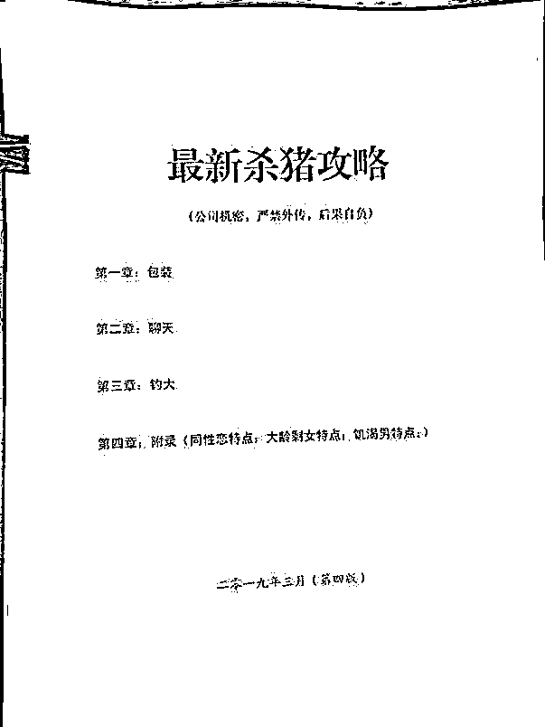**

***杀猪盘内部培训材料，全文 80 多页***

**从自我包装到谈吐气质，从恋爱情话到洗脑话术，在找到你之前，骗子们一直在进行“自我提升”。**

**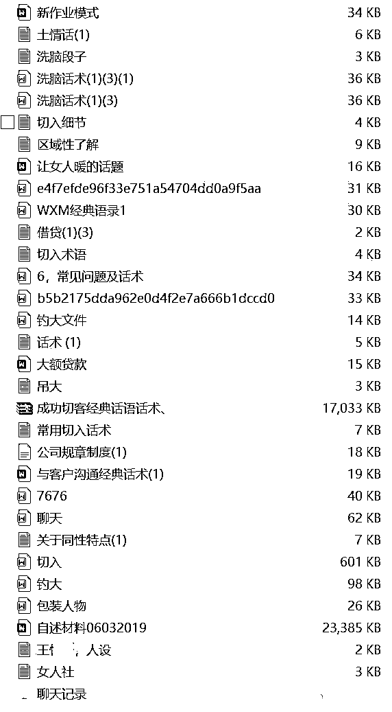**

***诈骗网点流出的杀猪盘剧本***

**第二步******无处不在的撒网****

**培训之后，骗子们便正式“上岗”了。**

**在以往的案例里，我们发现，骗子们结识异性的途径包括但不限于：微信、QQ、抖音、快手、微博、小红书、陌陌、百合、世纪佳缘、Blued、facebook、twiter、ins......**

**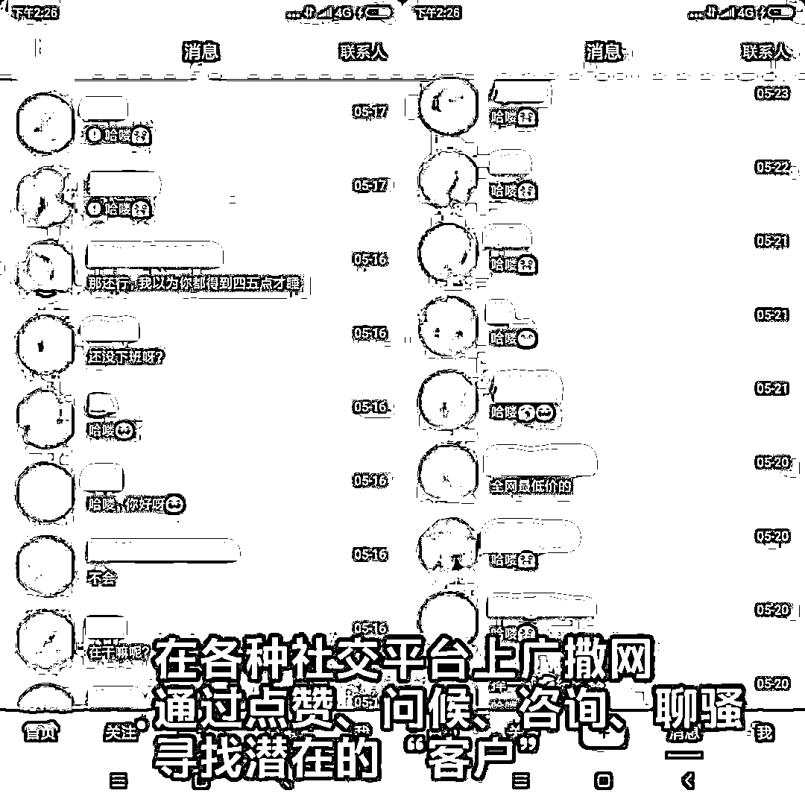**

**第三步******满足幻想的包装****

**骗子和明星网红一样需要人设，从姓名年龄到过往等都有明确的要求。**

**而这一切包装的重点，都是真实！**

**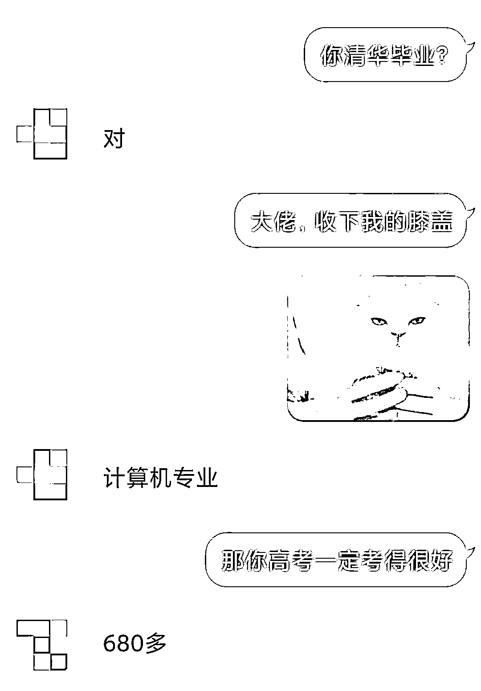**

**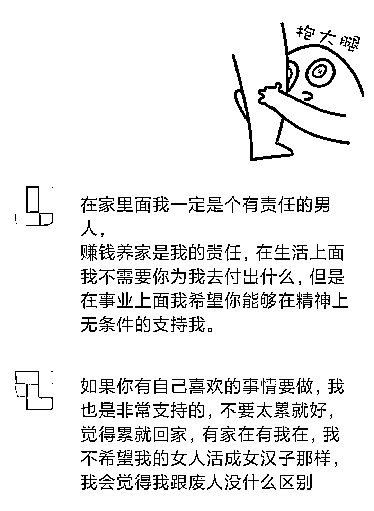**

**第四步******满怀爱意的聊天****

**恋爱中的人离不开甜言蜜语，来看看杀猪盘的受害人是如何在浪漫中沦陷的吧。**

**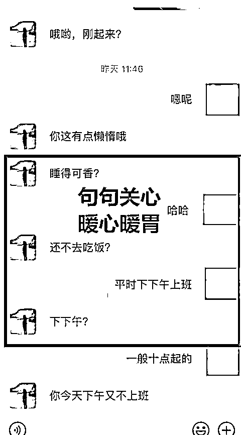**

**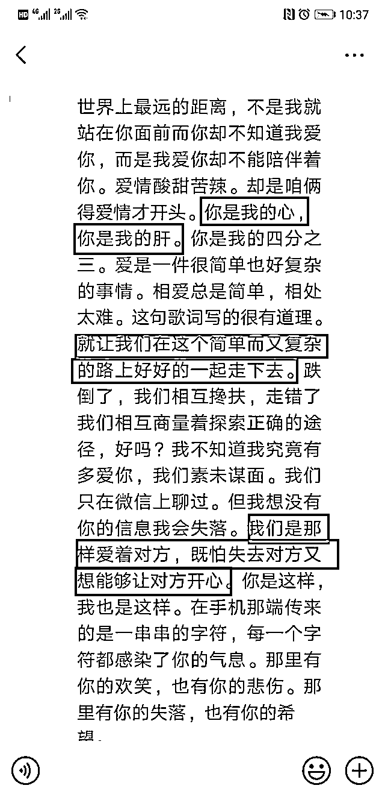**

**第五步******裹着糖衣的炮弹****

**等到你们感情稳固了，骗子就该将话题引向“赚钱”上去了。**

**一旦你的欲望被对面勾了起来，他就会给你推荐各种“稳赚不赔”“高回报”的投资、博彩、数字货币项目。**

**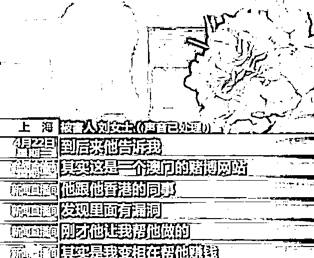**

**初期，骗子会通过后台操作，**让你小赚几笔。**** 

**骗子给过糖衣之后，会在此时和你谈未来和婚姻，让你以为自己只要继续听他的，就能事业爱情双丰收。**

**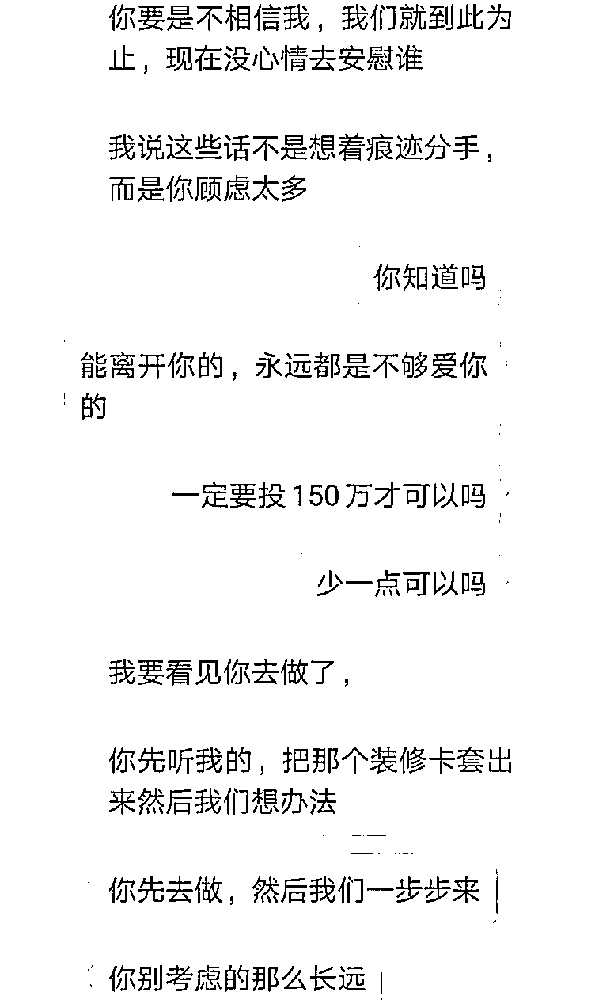**

**而等到你加大投入，则必然会有所谓的“意外”发生。**

**比如，不小心亏损了。**

**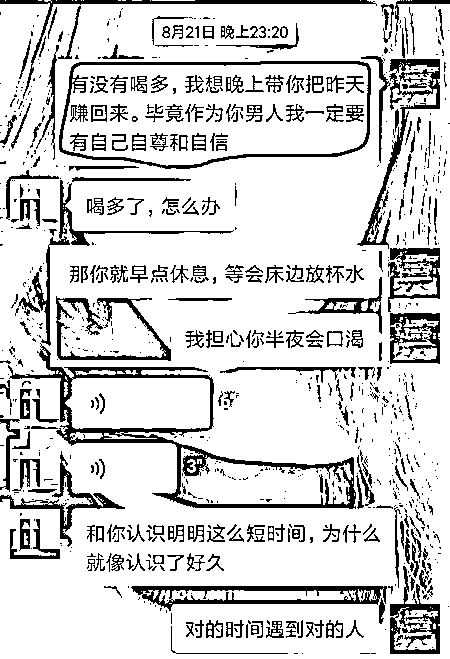**

**这时对方会继续对你温暖地关心，目的是让你继续投入资金。**

**如果你真的信了继续投钱，请做好被“榨干最后一滴血”的准备。**

**待你倾家荡产、血本无归时，等来的就是对方失踪的消息。**

**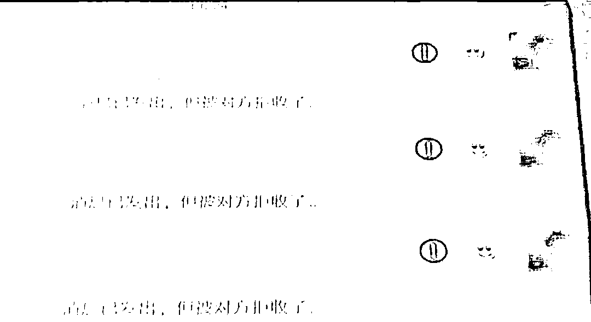**

****警方提醒********

**1、网络交友提高警惕，不要被陌生人的甜言蜜语迷惑，不要和没有见过面的人谈钱；**

**2、不相信“有内幕、稳赚不赔”的博彩、理财，守紧自己的钱袋子；**

**3、不向陌生人提供个人身份证号、银行卡号、密码、验证码等信息。不扫描陌生人发来的“二维码”，不点击来历不明的网页链接；**

**4、如不慎被骗或遇可疑情形，请注意保护证据，立即拨打 110 报警或拨打乌鲁木齐市反诈专线 0991-7654321 咨询。**

**来源：乌鲁木齐市反诈骗中心，阻击诈骗**

****

**← 向右滑动与灰产圈互动交流 →**

****