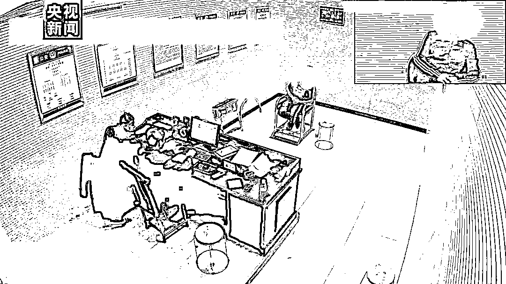
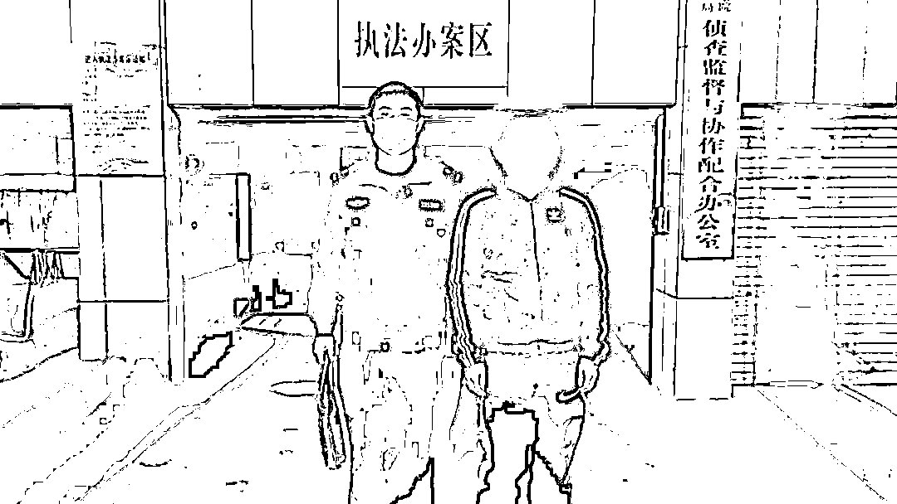

# 男子彩票中奖 700 多万挥霍一空，为快速赚钱参与“跑分”洗钱

> 原文：[`mp.weixin.qq.com/s?__biz=MzIyMDYwMTk0Mw==&mid=2247527722&idx=6&sn=0c2e8c6e1faeeb960bef5e2535316896&chksm=97cba612a0bc2f040bb3be3d305bb823a9a8b2d913d798ca4aca1697946e679c377f6e740d1b&scene=27#wechat_redirect`](http://mp.weixin.qq.com/s?__biz=MzIyMDYwMTk0Mw==&mid=2247527722&idx=6&sn=0c2e8c6e1faeeb960bef5e2535316896&chksm=97cba612a0bc2f040bb3be3d305bb823a9a8b2d913d798ca4aca1697946e679c377f6e740d1b&scene=27#wechat_redirect)

1 月 11 日，益阳安化县公安局通报称，近日，辖区南金派出所抓获一名跑分洗钱犯罪嫌疑人夏某某。据办案民警介绍，夏某某用自己名下的 7 张银行卡参与跑分洗钱，10 天获利 6000 余元。

然而，随着调查的深入，夏某某的过往让民警大吃一惊。原来，他在 2015 年中过 700 多万彩票大奖，但因为自我管理能力差，短短 6 年时间，便将 700 多万挥霍一空。想着尽快赚钱的夏某某，将再次“发财”的希望寄托在了跑分洗钱上。

[`mp.weixin.qq.com/mp/readtemplate?t=pages/video_player_tmpl&action=mpvideo&auto=0&vid=wxv_2221078124329566213`](https://mp.weixin.qq.com/mp/readtemplate?t=pages/video_player_tmpl&action=mpvideo&auto=0&vid=wxv_2221078124329566213)

据办案民警介绍，嫌疑人夏某某在 2015 年中得福利彩票双色球 724 万元巨额大奖。中奖后，夏某某将钱用于赌博、高额消费，以及各种失败的生意投资，最终全部花光。

夏某某不甘心平淡的日子，一边坚持买彩票，一边想着如何快速赚钱。2021 年 4 月，夏某某经朋友介绍知道了跑分洗钱活动，为了快速赚钱，夏某某提供了本人名下 7 张银行卡参与跑分洗钱活动，帮助犯罪分子转移资金，10 天获利 6000 余元。

2022 年 1 月 5 日，南金派出所民警接到线索，夏某某涉嫌帮助信息网络犯罪活动。经民警电话联系，夏某某当天主动到南金派出所投案自首。

目前，夏某某因涉嫌帮助信息网络犯罪活动罪，被公安机关依法刑事拘留。

来源：央视新闻、益阳公安、红网

← 向右滑动与灰产圈互动交流 →

