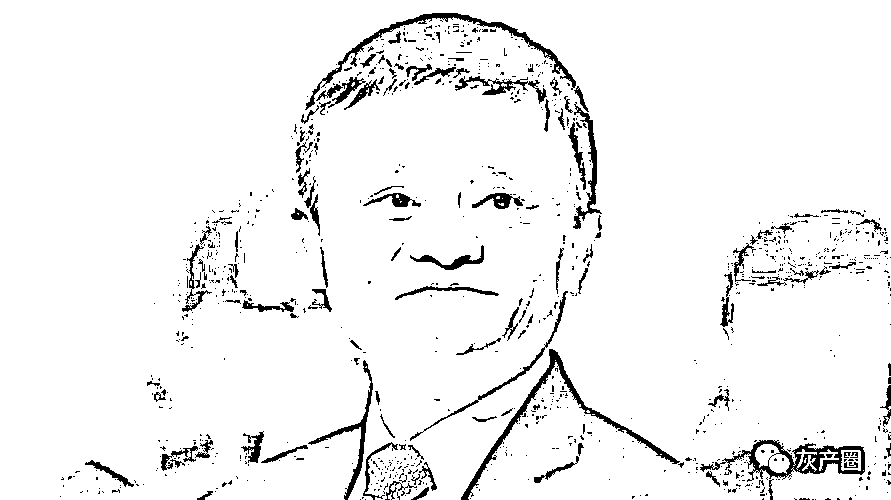
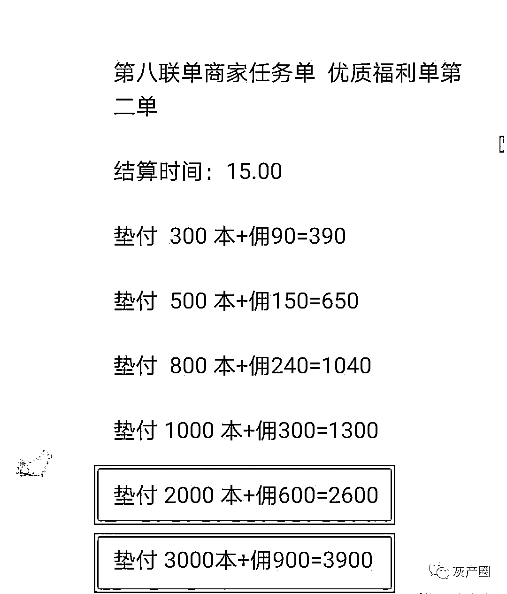

# 马云刷单，该判几年？

> 原文：[`mp.weixin.qq.com/s?__biz=MzIyMDYwMTk0Mw==&mid=2247527788&idx=2&sn=c93fdc6fd8573d719c7b6d4dec955632&chksm=97cba654a0bc2f42b7781add79345c5bb9324c1ce9c75f7ed5d13ae00a7713f317bb2e34f682&scene=27#wechat_redirect`](http://mp.weixin.qq.com/s?__biz=MzIyMDYwMTk0Mw==&mid=2247527788&idx=2&sn=c93fdc6fd8573d719c7b6d4dec955632&chksm=97cba654a0bc2f42b7781add79345c5bb9324c1ce9c75f7ed5d13ae00a7713f317bb2e34f682&scene=27#wechat_redirect)

反诈宣传有句口头禅：刷单就是诈骗。 

这么说其实是不严谨的，但是又是用心良苦的，无外乎不想让你去刷单。 

**因为刷单真的是违法行为。**

01

2013 年 2 月，江苏盐城滨海县的李某某创建了一个“零距网商联盟”网站，利用 YY 语音聊天工具建立刷单炒信平台，开启了他的刷单生意。

只要交 300 元到 400 元不等的钱，淘宝卖家和刷手都可以注册成为他的会员，卖家发布任务，刷手抢单为淘宝店铺刷好评和信誉。

2013 年 2 月至 2014 年 6 月一年多的时间里，李某某通过收取保证金、管理维护费和销售任务点等方式赚了 80 万元。

2017 年 5 月 16 日，江西省宜春市袁州区人民法院作出刑事判决，李某某被以非法经营罪和侵犯公民个人信息罪判处有期徒刑五年九个月，并处罚金人民币九十二万元。

自此揭开了刷单入刑的序幕，越来越多的刷单平台甚至刷手被判刑。

刷单炒信造成的不正当竞争，形成了劣币驱逐良币的效应，对淘宝电商生态造成了严重的影响。

淘宝为了打击刷单炒信行为可谓下足了功夫。2016 年 7 月，淘宝发现李某的网店存在刷单行为，向法院提起了诉讼，索赔 1 元钱。

为了这 1 元钱赔偿，淘宝组织了强大的法律团队，并投入了 700 多个日日夜夜，才取得了最终的胜利。

其起诉的费用与获得的赔偿达到了近乎无穷大的比值，你说淘宝傻吗？淘宝肯定不傻，马云更不傻。

别看只是象征性的 1 元钱，它更大的意义在于给行业树立了一个标准，等于告诉广大刷单的店家，我有权向你索赔，可能是 1 元钱，当然也可能是 1 万元、10 万元……

意思很明确：别刷单，不然你就要赔钱，可能还要吃牢饭。 

马云“老师”不愧是“**只许州官放火，不许百姓点灯**”的角儿，唱得一首好双簧。要知道，马大师可是刷单的祖师爷！

2016 年 315 之前，马云就向媒体承认了自己和十几个创始人的刷单行为，淘宝创建之初，由于没人用，网店销量惨淡，马云和十几个创始人就自己开网店，还互相之间买来买去，刷销量。

马大师在说起这段往事的时候，还是很引以为傲的，完全没有现在对淘宝刷单的那种咬牙切齿的感觉。

这不是典型的刷单是什么？还是有组织的刷单行为。

按理说咱刷单团伙应该像敬奉财神爷或者关二爷那样，把咱们马大师供起来，既能保生意兴隆，又能保不被抓。 

咱认祖归宗了，总不能抓自己人吧！

02

以马大师在阿里的地位，有理由相信，马云就是这个刷单团伙的组织者和首脑，我们一般叫做主犯。

至于刷了多少，马云没说，咱也不知道，但是肯定少不了。因为后来有其他人入驻淘宝开店后，为了留住用户，马云他们自己掏钱买这些店铺的东西，都堆满了两个房间。

非法经营罪主要有 4 种情形：

*一是违反国家专卖、专营物品管理规定；二是违反特殊经营许可证和其他批准文件管理规定；三是违法金融类业务管理规定；四是其他行为。*

对于专业炒信平台或者刷单公司的行为应该可以认定为非法经营类型中的第四种。

《刑法》规定，非法经营罪情节严重的，处五年以下有期徒刑或者拘役，并处或者单处违法所得一倍以上五倍以下罚金；情节特别严重的，处五年以上有期徒刑，并处违法所得一倍以上五倍以下罚金或者没收财产。

马云组织刷单案的案值，可以调取淘宝最初的销售记录，还是可以查得清的。但是他获取的非法利益就难以计算了。

他刷单是不收钱的，免费刷单。但是肯定是扰乱了市场秩序，也获取了非法利益的。

一方面虚构了很多用户欺骗了网店店主，另一方面又以虚高的销量欺骗了买家，大抵也进行了虚假评论误导了消费者，这都是扰乱市场秩序的行为。

至于其非法获利，是很难计算的。有多少人是因为其虚构的销量和评论购买了淘宝网上的商品，而在这些交易中淘宝网赚了多少钱，是不清楚的。

不知道万能的网友们有没有好的办法？算不出非法获利来，是很难认定情节特别严重的。

所以我认为马云等人的刷单行为可以适用非法经营罪的第一条比较合适，也就是说处五年以下有期徒刑或者拘役，并处或者单处违法所得一倍以上五倍以下罚金。 

到这里，只怕有人马上就要去报警把马云抓起来了。别急，先等我说完。

**虽然说刷单是违法犯罪行为没错，但是马云的刷单行为却已经过了追诉时效。**

什么是追诉时效？追诉时效是指按照刑法的规定追究犯罪或者侵权行为的有效期限。举报犯罪行为的时间已经超过法律规定的追诉时效期限的，不再追究其法律责任。

追诉时效怎么算呢？刑事案件追诉时效的期限是根据各种犯罪法定刑的轻重，分别规定长短不一的追诉时效期限：

*1．法定最高刑为不满 5 年有期徒刑的，追诉时效的期限为 5 年；*

*2．法定最高刑为 5 年以上不满 10 年有期徒刑的，追诉时效期限为 10 年；*

*3．法定最高刑为 10 年以上有期徒刑的，追诉时效的期限为 15 年；*

*4．法定最高刑为无期徒刑、死刑的，追诉时效的期限为 20 年。如果 20 年以后认为必须追诉的，报请最高人民检察院核准后，仍然可以追诉。*

淘宝网是 2003 年 5 月成立的，到现在已经有了 19 年的时间了，除非符合第 4 条最高刑为无期徒刑、死刑的。

很显然，刷单的刑期是达不到无期徒刑、死刑的，所以，马云及淘宝网创始人的刷单行为无疑已经过了追诉时效。举报也没用。

你看，他笑了！

03

从淘宝建立之初，马云就亲手打开了刷单的潘多拉魔盒，淘宝与刷单产业相伴相生，形成了错综复杂的寄生关系。

迄今为止，淘宝约有 1000 万商户，消费者要购买商品时，都要先进行搜索，于是搜索的排名对商户来说实在太重要了，简直就是商户的命。

淘宝网总是将销量、好评率高的产品优先展示在消费者的面前，搜索结果 6、7 页之后的商户基本很少能够获得曝光量，大多数人不会翻那么深。

于是，商户陷入一种**“不刷等死、刷单必死”**的尴尬境地。不刷单就没有销量，只能看着店铺慢性死亡。

刷单呢，一旦被淘宝发现，轻则扣分，搜索的权重进一步下降，重则像李某某一样被抓起来坐牢。

所以，很多时候，刷单成了商户的无奈之举。也造成了刷单产业的兴旺发达。

想用“刷单就是诈骗”一句话就让人不要刷单，是过于理想主义的。 

“不经他人苦，莫劝他人善。”在你看来是贪图蝇头小利，在他看来却可能是学费、生活费、看病钱……

2020 年疫情刚起之初，一个刷单被骗的大学生跟我说，她们学校大多数学生都刷单赚钱。之前她在某个公司兼职，也在别的平台刷单赚钱交学费，一直没出过问题，每年的学杂费都是自己解决的。

疫情开始后，兼职公司把她辞了，面临开学，学杂费马上就成了她当下最要命的问题。于是，她再去找其他的平台，想多刷点单赚钱，结果就被骗了。

你说那些参与刷单的人不知道刷单是非法行为吗？不见得。我们看刷单的广告语就知道了。

 

这样一条信息，不是繁体字就是别字，有时候数字还用字母替代，60 写成 6o，傻子才不知道这个是非法的！ 

写成这样，一方面是逃避运营商对关键词的筛选，另一个重要的用途，也是他们对大众的筛选。

看到这样的信息，仍然想去赚这个非法、灰色收入的人，才是他们行骗的目标。

除此之外，免费送榴莲、空气炸锅、电吹风、电饭煲，免费约啪……也是为了把这类贪图小利、容易被骗的群体筛选出来，再实施多对一的诈骗。

04

**实际上，刷单诈骗与刷单是有很大区别的，很容易辨别。**

最大的差别在于，刷单诈骗里是不在平台上付款的，而是将钱转给私人账号。而刷单的目的，是在店铺的销量里增加一单，而且还要写好评，必须在平台上付款，销量上的数字才会+1。

另外，刷单对刷手的入门门槛极高，以淘宝为例，包括实名认证、注册时间等，还要求达到一定的信用等级。

淘宝账户注册时间必须超过两个月，支付宝注册时间必须超过六个月，信誉必须达到二星级;注册时间太短，但最近的购买量太大，都无法通过审核。

小号是不能参与刷单的，很容易被平台发现。系统稽查 80%都是查小号，通过小号查出宝贝是否违规，通过计算违规的程度决定是扣分还是降权。我们来着重剖析一下小号：

*A、支付宝监控是否是异常账号和作弊嫌疑，比如：曾经有过频繁交易往来的、很多小号都是你的支付宝账号好友的等等;*

*B、小号登录时长：一个正常的用户不可能每天 24 小时都在线，也不可能一直不在线但只要在线就狂买的;*

*C、交易记录：一个正常的用户不可能没有明显的购物习惯的，如果一个小号连系统都判定不了标签究竟是男是女那肯定有问题;*

*D、购买频率：相信这一点不用解释了吧，你不可能一天 24 小时都疯狂买，从月初一直狂飙买到月底....*

*E、买家等级占比：这是占到商家的角度说的，不可能过来买你东西的都是黄钻用户，或都是刚注册的小白用户，所有淘宝数据还是很牛逼的;*

所以，真正刷单的时候，为了逃避平台的监测，是有很多禁忌的，要绝对地模仿一个正常消费者的购物行为。

而且不同的店铺对刷手还会有更详细的要求。

像刷单诈骗那样上来就给你一个商品的链接是不可能的，那不是等于告诉平台我在刷单了吗。

正确的做法，是要模仿一个消费者，通过搜索某个关键词，找到与要刷单商品同类的一些商品，还要先浏览其他商品一定的时间，再找到这个刷单的商品。

这时还不能直接下单，而是要仔细浏览商品的详细内容多长时间，与同类商品对比参数和价格，有的还要求与客服聊天咨询多长时间，最后才下单。这些在派单时都有具体要求。

刷单的时间也是有明确的要求的，尽量不要在清晨等用户下单较少的时间刷单，也不能频繁刷单。

具体来说就是一周不要超过 5 单，一个月不能超过了 15 单。也可以理解为周好评不过 5 个宝贝，月不过 15 个宝贝。

一般一个单可以赚个几块钱，多了也就十来块钱，一个账号一周也就赚个几十块，这么看来刷单的钱也并不是那么好赚的呢。

理解了这些，我们就会知道那些无入门门槛、刷单时间无限制、对刷单流程没有要求、只要转钱就行，就是诈骗无疑了。

这个规则不仅适用于淘宝，也适用于其他电商平台、短视频平台、直播平台等。

像那种无限刷单，还 3 联单、5 联单甚至 20 联单的，更是诈骗分子为你量身定制的陷阱。

诈骗分子会先通过刷小单让你放松警惕，待你为赚大钱刷大单投入资金后，以超时、备注错误、联单等理由，利用人们的拒绝沉没心理诈骗更多的钱财。

山东一财务人员就是掉入刷单陷阱，因为不舍得前面投入的钱，不惜挪用公款，直至被骗了 600 万元，报警的同时直接就自首了。

**你永远赚不到你认知之外的钱，偶尔赚到了，也会很快还回去。**

**钱并没有那么好赚，辛苦赚来的钱别再被骗了！**

来源：阻击诈骗

← 向右滑动与灰产圈互动交流 →

