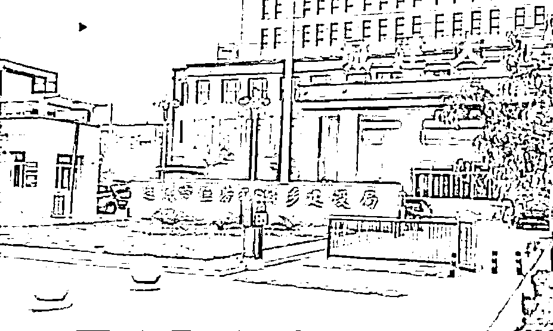
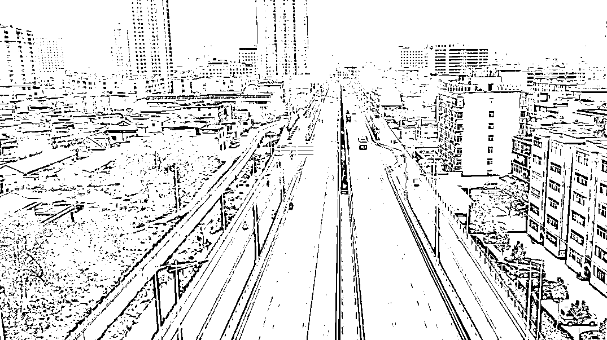

# 打赏主播、高档消费，山西一住建局职工套公款近 1200 万获刑

> 原文：[`mp.weixin.qq.com/s?__biz=MzIyMDYwMTk0Mw==&mid=2247527788&idx=3&sn=7b81c59c7fac2a6c5a11b8bffab5c2c6&chksm=97cba654a0bc2f42ad1e7a173ed520f1dfe784313f10e17292a27a071cb75a031142421db4ff&scene=27#wechat_redirect`](http://mp.weixin.qq.com/s?__biz=MzIyMDYwMTk0Mw==&mid=2247527788&idx=3&sn=7b81c59c7fac2a6c5a11b8bffab5c2c6&chksm=97cba654a0bc2f42ad1e7a173ed520f1dfe784313f10e17292a27a071cb75a031142421db4ff&scene=27#wechat_redirect)

法院表示，被告人刘某海因贪污行为违法所得的一切财物，应当予以没收，上缴国库。尚未追缴到案的违法所得，应当继续追缴。

**山西运城住建局职工刘某海利用职务之便，采取虚构拆迁户、虚构拆迁户退房、多报及重复上报拆迁补偿项目等方式，套取征收补偿款近 1400 万元，个人实际获得赃款近 1200 万元，用于打赏网络主播、个人高档消费等。** 

 **[`v.qq.com/iframe/preview.html?width=500&height=375&auto=0&vid=e3318yjj3rv`](https://v.qq.com/iframe/preview.html?width=500&height=375&auto=0&vid=e3318yjj3rv)** 

**▲山西运城“套取公款打赏主播”住建局职工获刑 15 年半 曾冒领超千万拆迁款。新京报我们视频出品（ID：wevideo）**

**2022 年 1 月 14 日，新京报记者获悉，山西省夏县人民法院近日对此案作出一审判决，被告人刘某海犯贪污罪、诈骗罪，被判处有期徒刑十五年零六个月，并处罚金 101 万元。**

****套取拆迁补偿款、伪造公文诈骗，****

******非法所得用于打赏主播及高档消费******

******2020 年 12 月 9 日，山西运城住建局职工刘某海被曝“冒领巨额拆迁款，部分款项给女主播打赏”。对此，运城市住建局办公室主任张麦龙向新京报记者证实，刘某海私刻两枚公章，又制造出一份虚假的拆迁户名单，将拆迁补偿资金贪污。同年 11 月 21 日，刘某海被当地警方控制。******

************

******▲运城市住建局。来源：新京报我们视频截图******

******据了解，刘某海系运城市改善人居环境发展中心职工，上述单位为运城市住建局下属单位。2015 年 5 月，刘某海被借调至运城市河东西街延长线项目部，任办公室负责人。******

************

******▲运城市河东西街延长线路段。新京报记者 张建斌 摄******

******判决书显示，2015 年 5 月至 2020 年 8 月，被告人刘某海被借调期间，利用职务便利，单独或伙同山西金汇丰房地产评估有限公司驻运城市河东西街延长线建设项目指挥部征收评估工作项目负责人吉某(另案处理)、山西河达圆建筑工程有限公司实际负责人周某(另案处理)，采取虚构拆迁户、虚构差旅费、虚构拆迁户退房、多报和重复上报拆迁补偿项目等方式，共套取征收补偿款 1398.401 万元，个人实际获得赃款 1171.0988 万元。犯罪所得钱款用于打赏网络主播、个人高档消费等。******

******其中，经法院查明，刘某海曾虚构赵某、王某峰、史某博等数名拆迁户的身份伪造相关材料多次套取拆迁补偿款共计 799.6986 万元。而他所使用的拆迁户信息，有以“别人欠款不方便转入自己银行卡”为由拿到的他人身份证复印件和银行卡号，还有他母亲的身份证复印件和银行卡。******

******其间，仅利用虚构的拆迁户王某峰的身份，刘某海就八次套取拆迁补偿款共计 519 万余元。******

******此外，法院经查明发现，2020 年 7 月份，刘某海私自以河东西街延长线项目部名义与运城市一家商贸有限公司签订协议，通过伪造运城市住建局发文、运城市住房和城乡建设局会议纪要、河东西街延长线建设项目指挥部文件等手段，骗取被害人曲某 15.1 万元，所骗钱财用于某短视频平台主播打赏。******

********贪污罪、诈骗罪，********

**********被告人获刑十五年零六个月并处罚金 101 万元**********

********因涉嫌贪污，刘某海于 2021 年 3 月 10 日被运城市监察委员会采取留置措施。同年 6 月 15 日，山西省夏县人民检察院依法以涉嫌贪污罪、诈骗罪对刘某海提起公诉。********

********2021 年 9 月 7 日，山西省夏县人民法院对该起案件进行了公开审理。2022 年 1 月 14 日，新京报记者获悉，山西省夏县人民法院近日对此案作出一审判决。********

********法院认为，被告人刘某海身为国家工作人员，在担任运城市河东西街延长线项目部办公室负责人期间，利用职务之便，伙同他人虚构拆迁户套取拆迁补偿款、以劳务差旅费等名义套取项目资金，数额特别巨大，其行为构成贪污罪，同时被告人刘某海以非法占有为目的，伪造材料骗取他人钱财，其行为构成诈骗罪。********

********法院表示，被告人刘某海因贪污行为违法所得的一切财物，应当予以没收，被告人刘某海骗取受害人曲某的钱款，应当责令退赔。尚未追缴到案的违法所得，应当继续追缴。********

********法院判决，被告人刘某海犯贪污罪，判处有期徒刑十二年，并处罚金人民币 100 万元；犯诈骗罪，判处有期徒刑四年零三个月，并处罚金人民币 1 万元，数罪并罚，合并执行有期徒刑十六年零三个月，并处罚金人民币 101 万元，决定执行有期徒刑十五年零六个月，并处罚金人民币 101 万元。********

********同时，法院表示，被告人刘某海因贪污的违法所得 1171.0988 万元，予以没收，上缴国库。责令被告人刘某海退赔受害人曲某损失 15.1 万元。********

********来源：新京报********

****************

********← 向右滑动与灰产圈互动交流 →********

****************