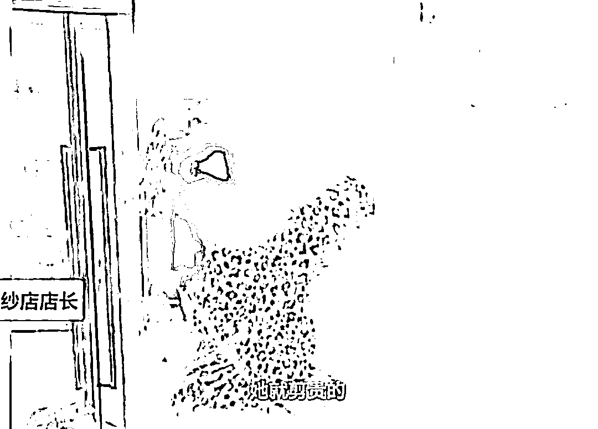
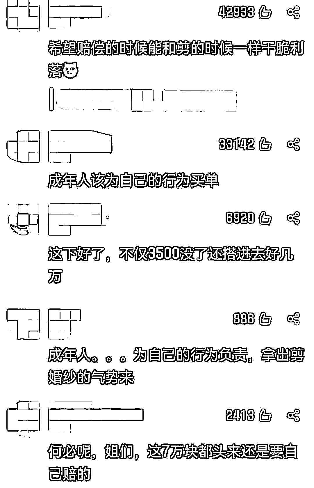

# 孕妇怒剪 32 件婚纱：赔就是了！

> 原文：[`mp.weixin.qq.com/s?__biz=MzIyMDYwMTk0Mw==&mid=2247527788&idx=4&sn=553043c24d63cd656bef53c03baa7002&chksm=97cba654a0bc2f42cbf98ae30bb50b6f001cf219a9a94dc22298107926caf562ecc8830921a2&scene=27#wechat_redirect`](http://mp.weixin.qq.com/s?__biz=MzIyMDYwMTk0Mw==&mid=2247527788&idx=4&sn=553043c24d63cd656bef53c03baa7002&chksm=97cba654a0bc2f42cbf98ae30bb50b6f001cf219a9a94dc22298107926caf562ecc8830921a2&scene=27#wechat_redirect)

近日，一段剪婚纱的视频在网上引来围观：重庆一女子疑与婚纱店员发生争执，怒拿剪刀剪坏几十套婚纱，婚纱店员工一直拿手机录像并制止，“你想清楚”“赔得多哦，一套婚纱几千（几万），想清楚哦”，女子则回答称“几千几万都可以”“报警啥赔啥、赔就是了”。

[`v.qq.com/iframe/preview.html?width=500&height=375&auto=0&vid=h33181f97qd`](https://v.qq.com/iframe/preview.html?width=500&height=375&auto=0&vid=h33181f97qd)

据报道，1 月 9 日，重庆江津区一名孕妇与婚庆店店员因定金问题发生争执，手持剪刀剪坏婚庆店共计 32 件婚纱礼服。

该女子于去年 4 月份在店里预定了价值 8000 元的婚庆套餐，并交付了 3500 元的定金。但后因怀孕不办婚礼了，要求退掉定金。1 月 9 日下午 3 点半，女子前来协商，在未协商成功的情况下，气急剪破了店内 20 件婚纱和 12 件秀禾服。婚庆店店主陈女士统计，这次事件给店内造成了近 7 万块钱的直接经济损失。事后，女子给婚庆店道歉，表示特别后悔，是因为孕期导致不理智地行为。

对此，网友们都表示，“成年人该为自己的行为买单”。

1 月 13 日，当事婚纱店老板陈女士表示，当事人和派出所到店内协商，但赔偿金额仍未谈妥，对方只愿意赔偿 3 万，而婚庆店要求赔偿 5 万。陈女士说，自己能够理解当事人作为孕妇的情绪波动，只要赔偿到位不会追究对方法律责任。

来源：成都商报综合极目新闻、红星视频、南风窗

← 向右滑动与灰产圈互动交流 →

