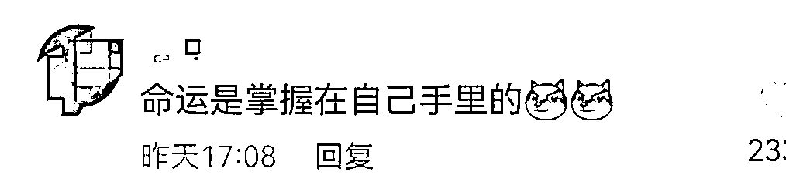

# 男子偷 3 万元后自查刑法，吓得赶紧还了 2.7 万，然而……

> 原文：[`mp.weixin.qq.com/s?__biz=MzIyMDYwMTk0Mw==&mid=2247527788&idx=6&sn=f3dcde28e4b672440729e7b92c6bda04&chksm=97cba654a0bc2f428454992336921cf86081ad0797b34c0c59dd83d312a94a1fdb8a07793b2d&scene=27#wechat_redirect`](http://mp.weixin.qq.com/s?__biz=MzIyMDYwMTk0Mw==&mid=2247527788&idx=6&sn=f3dcde28e4b672440729e7b92c6bda04&chksm=97cba654a0bc2f428454992336921cf86081ad0797b34c0c59dd83d312a94a1fdb8a07793b2d&scene=27#wechat_redirect)

1 月 13 日，临沂公安发布“山东临沂一男子偷了 3 万现金后，当场用手机查阅刑法送回 2.7 万”的视频引起网友关注。2021 年 10 月 31 日晚，山东临沂的犯罪嫌疑人俞某拉开私家车车门，盗走 3 万元现金后想起自己前科累累，当场用手机查阅《刑法》发现盗窃 3 万元属“数额巨大”可能面临从重处罚，于是又送回去 2.7 万元。网友直呼“神操作”“我命由我不由天”。目前该男子已经被批准逮捕。

2021 年 10 月 31 日晚，兰山区王先生匆匆来到公安机关报案，称放在汽车扶手箱里的 3 万元现金只剩下了 2.7 万元，还有 4 包香烟被盗。兰山公安分局便衣侦查大队四中队民警调查发现，王先生头一天晚上 9 点多将车停在小区停车场，没有拉车门检查就回家了。

2021 年 10 月 31 日凌晨 3 点多，一个鬼鬼祟祟的身影出现在停车场。此人身穿黑色上衣和白色裤子，背着小包，逐辆车试拉车门，结果顺利拉开了王先生车的副驾驶门，实施盗窃后匆匆离去。可令人奇怪的是，嫌疑人不长时间后又返回，再次窜进王老板的车内。

经过数日调查，民警最终掌握到嫌疑人是江苏省连云港市海州区的俞某。就在民警准备对嫌疑人展开抓捕时，嫌疑人居然再次作案。2021 年 12 月 14 日凌晨，兰山区再次发生拉车门盗窃案，5 名粗心车主因忘锁车门，共被盗财物数千元。民警发现，嫌疑人还是俞某，而此时，俞某刚刚逃到郯城，正转乘一辆客车逃往江苏省东海县。

便衣民警立即转战郯城，加大油门火速追击嫌疑人乘坐的客车。半个小时后，在东海县境内发现了这辆客车，民警迅速截停客车，亮明身份后上车搜查。而此时的嫌疑人由于深夜作案太多，正躺在客车后排的座位上呼呼大睡，被民警牢牢擒获，当天夜里盗窃来的大量财物也被现场缴获。

经讯问，嫌疑人俞某今年 33 岁，因流窜盗窃先后被连云港市、宿迁市、新沂市人民法院判刑 3 次，2021 年 10 月初刑满释放。出狱后，在老家无所事事的俞某嫌打工赚钱太辛苦，决定继续重操旧业。他思来想去，总结了此前在江苏连续被抓的“教训”，认为跨省流窜到临沂盗窃较为保险。2021 年 10 月 31 日凌晨，俞某拉开王先生的车门后，在扶手箱里翻到了 3 万元现金和 4 包香烟，收获颇丰的俞某快步逃离现场。惊喜之余，他突然意识到，盗窃 3 万余元财物是一笔不小的数目，可能要面临从重处罚。

他当场掏出手机搜阅《刑法》，得知盗窃公私财物价值 1000 元至 3000 元以上属于“数额较大”，3 万元至 10 万元以上属于“数额巨大”。而 3000 元正是个不轻不重的“坎”，恰恰自己又是前科累累的惯犯，一旦被抓后果非常严重。他万般不舍地返回王先生车内，数出 2.7 万元现金放进了扶手箱里。事后，俞某还结合《刑法》给自己“量刑”，即使出事也是个轻罪。

俞某交代，他喜欢进娱乐场所挥霍，但是自己好逸恶劳，所以靠盗窃敛财。可他怎么也没想到，就这 3000 元现金，还是被兰山公安分局便衣侦查大队的民警给盯上了，就在他再次流窜兰山区盗窃时，被一路追击的民警抓获。2021 年 12 月 24 日，俞某被检察机关批准逮捕，又将迎来第 4 次入狱生涯。

1 月 13 日，临沂公安在短视频平台发布该案例后引起广大网友的关注。网友评论，“还是知道自己犯法，不想犯法就全部送回去”“精打细算，严格控制犯罪成本，达到利益最大化”“这种人才不请到局里踩几年缝纫机真是可惜了”。还有网友调侃，“神操作”“命运掌握在自己手里的”“懂法多么重要”“我命由我不由天”“只是改变命运”“肯定看过罗翔的视频”。

来源：潇湘晨报，红网

← 向右滑动与灰产圈互动交流 →

