# 纪录片曝光中情局曾秘密人体实验，对象为 311 名丹麦儿童

> 原文：[`mp.weixin.qq.com/s?__biz=MzIyMDYwMTk0Mw==&mid=2247527853&idx=1&sn=cebe5750a5f739b9cc982fae0fb18d5f&chksm=97cba695a0bc2f83a17dc06cc6f95b3688d24f559860e205d298f60f766463364b91f5272623&scene=27#wechat_redirect`](http://mp.weixin.qq.com/s?__biz=MzIyMDYwMTk0Mw==&mid=2247527853&idx=1&sn=cebe5750a5f739b9cc982fae0fb18d5f&chksm=97cba695a0bc2f83a17dc06cc6f95b3688d24f559860e205d298f60f766463364b91f5272623&scene=27#wechat_redirect)

[`mp.weixin.qq.com/mp/readtemplate?t=pages/video_player_tmpl&action=mpvideo&auto=0&vid=wxv_2224882359030595585`](https://mp.weixin.qq.com/mp/readtemplate?t=pages/video_player_tmpl&action=mpvideo&auto=0&vid=wxv_2224882359030595585)

丹麦广播公司近日播出的一部名叫《寻找自我》的丹麦纪录片，披露了美国中央情报局涉嫌资助 20 世纪 60 年代对 311 名丹麦儿童进行的一场秘密人体实验。这些儿童大多是被人领养或来自孤儿院，始终没有被告知实验的具体目的。

 **纪录片揭露中情局秘密资助人体实验**

报道称，这项实验在哥本哈根市立医院的地下室秘密进行。纪录片导演、实验亲历者之一佩尔·温尼克说，在 11 岁的时候，他参加了一系列人体实验，其中包括测试儿童是否存在“精神变态”迹象的实验。

在这项实验中，温尼克被要求坐在椅子上，身上绑着电极，被迫聆听响亮刺耳的噪音。虽然项目由美国一些医疗机构和“人类生态基金会”出资，但温尼克说，“人类生态基金会”项目提供的大量资金，幕后来源正是美国中情局。

 **中情局开展残忍人体实验研究“洗脑”**

丹麦的儿童实验，不过是美国中情局人体实验的冰山一角。从 20 世纪 50 年代到 70 年代，美国中情局曾经开展过一项思想控制计划，通过种种惨无人道的手段，试图实现“洗脑”。

[`mp.weixin.qq.com/mp/readtemplate?t=pages/video_player_tmpl&action=mpvideo&auto=0&vid=wxv_2224883583280824321`](https://mp.weixin.qq.com/mp/readtemplate?t=pages/video_player_tmpl&action=mpvideo&auto=0&vid=wxv_2224883583280824321)

美国《纽约时报》前驻外记者、布朗大学沃森国际和公共事务研究所高级研究员 斯蒂芬·金泽：中情局在政治宣传中发明了“洗脑”这个词，这个词是一个为中情局工作的人想出来的，他想说服美国人“苏联试图对美国洗脑”，而中情局沉浸在了自己的这个幻想中。时任中情局局长艾伦·杜勒斯就认为思想控制是掌控全世界的关键。

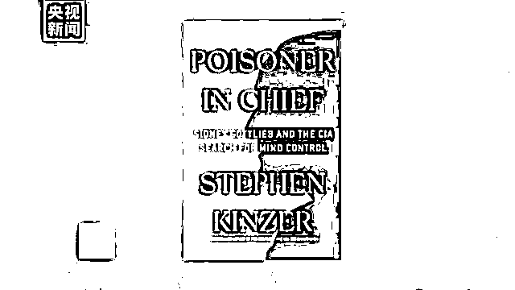

金泽撰写的《首席毒师》一书深入揭露了美国中央情报局的这项思想控制计划。20 世纪 50 年代，中情局聘用化学家西德尼·戈特利布作为项目负责人，金泽评价他“愿意忽略其他人都遵守的道德标准”。而德国纳粹医生及其日本同行也被聘请加入，其中甚至包括臭名昭著的 731 部队战犯。

 美国《纽约时报》前驻外记者、布朗大学沃森国际和公共事务研究所高级研究员 斯蒂芬·金泽：中情局没有处决那些人，而是雇佣了他们，他们成了美国思想控制计划的基础。

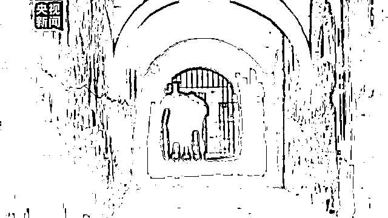

该项目拥有美国政府特许的、类似“杀人许可证”的权力，不仅在美国国内有权使用囚犯或抓捕平民进行实验，还在其他国家肆意折磨战俘以及无亲无故的难民。

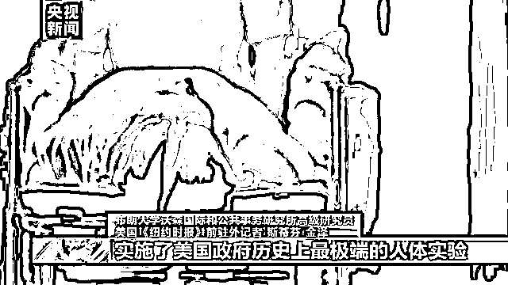

美国《纽约时报》前驻外记者、布朗大学沃森国际和公共事务研究所高级研究员 斯蒂芬·金泽：他们通过实验折磨致死的那些人，被他们称为“消耗品”，西德尼·戈特利布和他的同事在这些人身上实施了美国政府历史上最极端的人体实验，目标就是寻找摧毁一个人思想的方法。在一组实验中，主要思路是用药物让实验对象陷入昏迷，再投入大量兴奋剂，当实验对象处于从昏迷到过度兴奋的转换过程时对他实施电击，并且让他处于极度的冷热交替中，来看是否能摧毁一个人的思想。

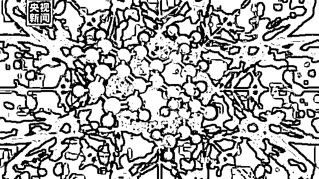

众多实验的结果表明，药物是摧毁人思想的有效手段，于是 LSD——一种强效致幻剂成了中情局思想控制计划的核心。而过量使用这种药物会造成严重的精神混乱和肉体痛苦，目前在世界各国都普遍被认为是一种危害甚大的毒品而加以严厉查禁。

 美国《纽约时报》前驻外记者、布朗大学沃森国际和公共事务研究所高级研究员 斯蒂芬·金泽：在肯塔基州的一个联邦监狱里，跟西德尼·戈特利布合作的一名医生挑出 7 名非裔美国人囚犯，每天让他们服用 3 次 LSD，实验持续了 77 天，并且没有告知他们服用的药品是什么，服用的后果是什么。

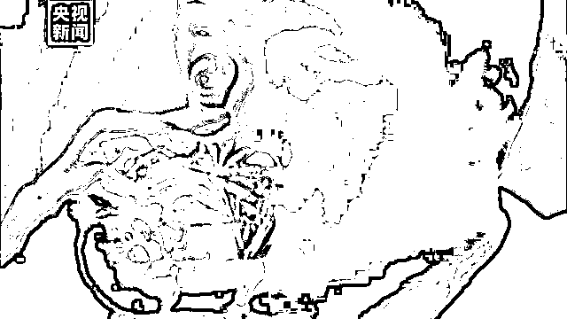

为了更广泛地验证实验效果，他们甚至在对方不知情的情况下，让中情局的其他同事和随机的普通民众服下 LSD，并观察其反应。

 但事实证明，这些残忍的实验仅仅能够摧毁一个人现有的意识，很难把新的意识植入其中，从而实现所谓的“洗脑”。很多实验对象精神紊乱、失忆或者成了植物人。

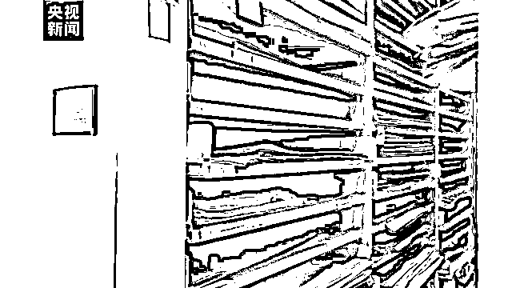

美国《纽约时报》前驻外记者、布朗大学沃森国际和公共事务研究所高级研究员 斯蒂芬·金泽：他花费整整十年摧毁了那么多生命，都是徒劳的。

 20 世纪 70 年代，这项惨无人道的计划被曝光后终止。但相关人员从未受到全面正式的调查和惩罚，并且中情局销毁了绝大部分原始文件，究竟有多少人遭到折磨、多少人丧命，均已无从确认。

 **受害者：那是濒死的感觉**

美国中情局的“洗脑”实验分布在全球多地，其中就包括邻国加拿大。他们将无辜的患者送往一家位于蒙特利尔的研究所，表面上是给他们治病，实际上是在进行秘密“洗脑”实验。近些年，有部分受害者和他们的家属站出来，讲述那些年的不幸遭遇。

[`mp.weixin.qq.com/mp/readtemplate?t=pages/video_player_tmpl&action=mpvideo&auto=0&vid=wxv_2224884071011270659`](https://mp.weixin.qq.com/mp/readtemplate?t=pages/video_player_tmpl&action=mpvideo&auto=0&vid=wxv_2224884071011270659)

1960 年前后，吉娜曾因抑郁被送往加拿大麦基尔大学艾伦研究所进行治疗。

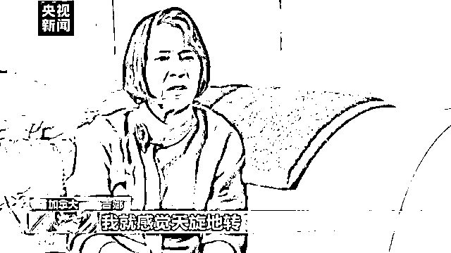

**吉娜：**每当治疗时，我就感觉天旋地转，旋转的速度越来越快，我觉得这就是濒临死亡的感觉，不知道我能不能活下来。

当时，吉娜并不知道她接受的就是“洗脑”实验。

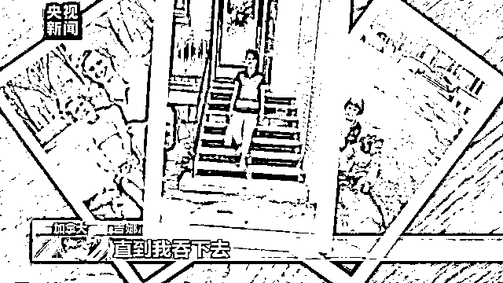

**吉娜：**我不想吃给我的那些药片，根本没法用水服下，他们担心我不咽下去，所以有护士看着我，直到我吞下去。

 研究所负责人埃文·卡梅伦得到中情局资助，曾于 1943 年到 1964 年在艾伦研究所进行“洗脑”实验。

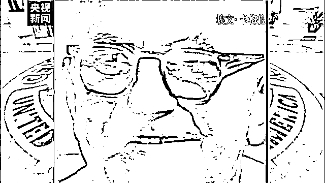

很多和吉娜一样的患者，都因为轻微的精神病症向卡梅伦医生求助，比如抑郁、焦虑等等。然而却在未告知或得到许可的情况下，被当成“小白鼠”，使用药物疗法、电击疗法等等。

 1970 年后，中情局与加拿大政府的肮脏勾当被曝光后，吉娜的丈夫说，他们既吃惊又愤怒。

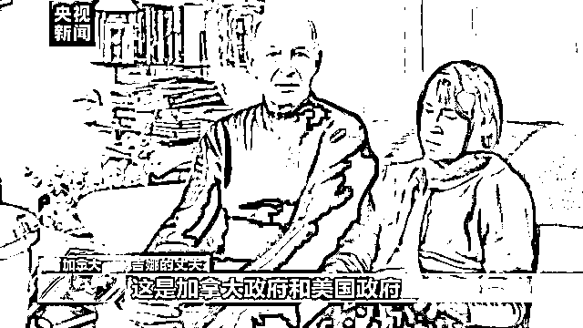

**吉娜的丈夫：**后来我们发现，这是加拿大政府和美国政府以及美国中情局合作完成的项目，是他们纵容这一切的发生。

 吉娜只是其中幸运的一员。很多在艾伦研究所被“洗脑”实验的患者，最终都出现了严重的大脑损伤。

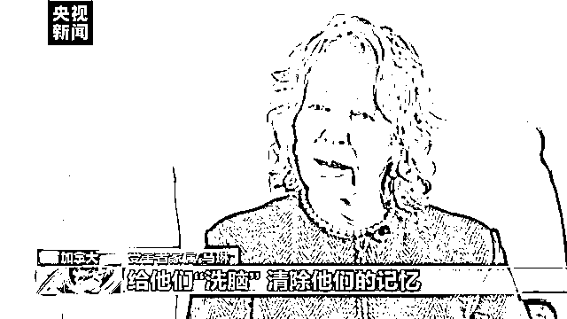

**受害者家属 马琳：**很多人去了那里，以为自己得救了，根本不知道卡梅伦医生的目的是给他们“洗脑”，清除他们的记忆。

 马琳的姑姑也是被送往艾伦研究所接受治疗的一员，当时她只有 19 岁。这份 1945 年的就诊记录显示，马琳的姑姑曾在一个月之内接受了 9 次电击疗法、28 次催眠疗法。

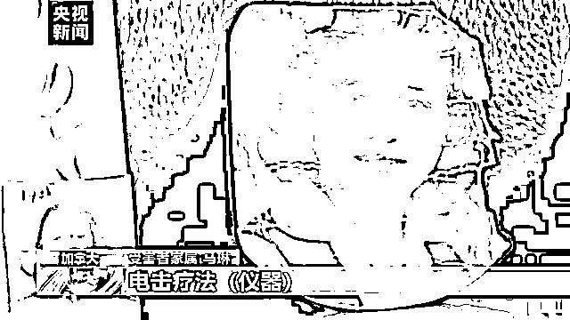

**受害者家属 马琳：**每次我把手放在姑姑的脑袋上，她就会往后退，我一直不理解，后来我才知道，电击疗法（仪器）是要放在她们脑袋上进行的。

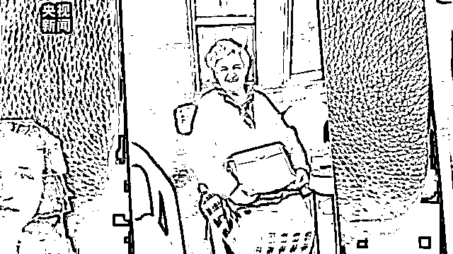

马琳的姑姑从艾伦研究所出来后，身体情况越来越差，60 岁开始就完全丧失了自理能力，甚至没法说话了。

 **受害者家属 马琳：**她没法像正常人一样生活，没法结婚，也没法生孩子，她一生唯一开心的事是吃糖果，行为跟小孩子一样。

 而这只是这场“洗脑”实验的冰山一角。20 世纪 70 年代，当这场秘密实验被曝光在公众面前时，中情局洗脑实验的负责人将所有实验纪录损毁，仅有一小部分被忽略的证据留了下来。

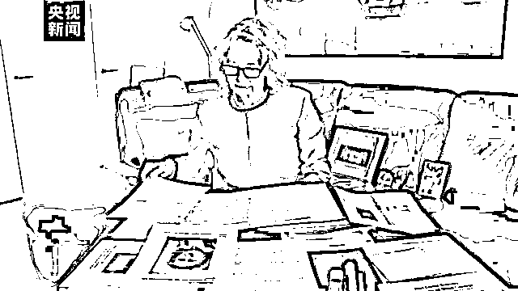

几十年的时间，部分受害者及家属仅靠着这些证据，将中情局和加拿大政府告上法庭，得到了一些赔偿。还有更多的受害者连一份道歉都没有得到。

 **受害者家属 马琳：**这十分可疑，上哪儿去找这些（实验）资料，他们又藏在了哪里。

来源：央视新闻，澎湃新闻

← 向右滑动与灰产圈互动交流 →

