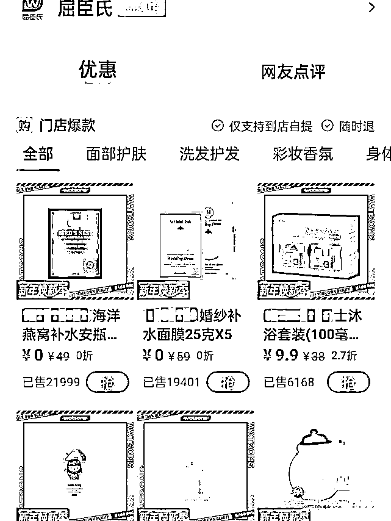
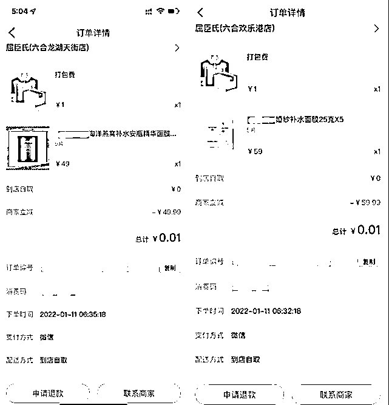
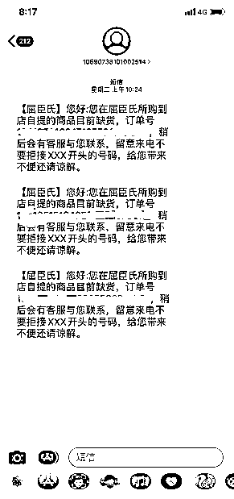

# 直播间辱骂消费者像疯狗 屈臣氏致歉！

> 原文：[`mp.weixin.qq.com/s?__biz=MzIyMDYwMTk0Mw==&mid=2247527853&idx=4&sn=264dec675081e6cefc6466c8e53257de&chksm=97cba695a0bc2f83a77923f18ac37aabecfbbb5c974ceb7eff0d6e365b1b9691374700a09a6a&scene=27#wechat_redirect`](http://mp.weixin.qq.com/s?__biz=MzIyMDYwMTk0Mw==&mid=2247527853&idx=4&sn=264dec675081e6cefc6466c8e53257de&chksm=97cba695a0bc2f83a77923f18ac37aabecfbbb5c974ceb7eff0d6e365b1b9691374700a09a6a&scene=27#wechat_redirect)

1 月 14 日，

有消费者在社交平台发文称，

屈臣氏的主播

在直播间因为面膜优惠活动的事情

公然辱骂消费者。

[`mp.weixin.qq.com/mp/readtemplate?t=pages/video_player_tmpl&action=mpvideo&auto=0&vid=wxv_2224991960505909251`](https://mp.weixin.qq.com/mp/readtemplate?t=pages/video_player_tmpl&action=mpvideo&auto=0&vid=wxv_2224991960505909251)

短短 20 多秒的视频片段中，

该名主播面露不屑，

指责消费者为了 1 分钱的东西，

**没薅到便宜就像疯狗一样咬人，**

还表示：

**我的直播间，**

**我想踢就踢，**

**我不欢迎你，**

**你不用来。**

**我踢了你就高兴。**

另一名幕后工作人员则提高嗓门喊道，

**你薅到便宜吧又不认便宜，**

**没薅到吧还来这咬人。**

随着越来越多的消费者

在社交平台、投诉平台表达不满，

此事上升为一起群体性投诉事件。

1 月 14 日 23:59 分， 

屈臣氏在其官方微博账号上致歉，

**称该主播系第三方机构人员，** 

**将深刻反思并加强** 

**对公司全体人员**

**以及第三方合作人员的培训和监管。**

**玩不起的“1 分钱买面膜”**

1 月 11 日凌晨，

屈臣氏在某平台推出了面膜优惠活动，

消费者用券后，

可以用 0.01 元的价格

买到两个特定品牌的面膜（每人限购 5 盒）。

根据消费者反馈，

下单时显示库存充足，

下单后也收到了

“货已备好，请到店自提”的短信提醒。

后续大部分消费者到店却没有提到货，

他们拨打了 400 电话与客服联系，

客服登记了订单号，

收集了他们的发货地址后

给出了发货的承诺，

**但过几天又改口要求消费者申请退款。**

消费者程女士表示，

自己已下单面膜，

但到店时碰到店员正在把优惠的面膜藏起来。

当她故意提及朋友已经到店成功取货，

**店员则辩称先到先得，**

**程女士下单的数量较多，**

**只能给 2 盒意思一下。** 

**根据《电子商务法》第四十九条的规定，**

**电子商务经营者发布的商品**

**或者服务信息符合要约条件的，**

**用户选择该商品或者服务并提交订单成功，**

**合同成立。**

律师表示，

消费者通过平台进行支付购买，

虽然价格低（0.01 元），

但并非恶意的“薅羊毛”，

不存在过错。

商家应按照约定向消费者发货，

不能以运营失误、

库存不足等理由

拒绝发货

或者以无货为由建议消费者退款。

如果商家拒绝发货则构成违约行为，

消费者可以选择要求商家继续履行合同

或者终止合同选择退款

并要求商家赔偿损失。

**玻璃心的直播间** 

值得关注的是，

有消费者提供截图，

指出屈臣氏不给他们提货，

却在直播中正常出售优惠活动产品。

不给消费者发货已下单的优惠面膜，

却在直播间销售同款面膜，

这引起了消费者的不满，

**部分人进入屈臣氏中国的直播间，**

**在评论区询问“面膜发货问题”，**

**遭到了主播的辱骂和后台工作人员的拉黑。**

除了“疯狗”这个不文明词语外，

也有消费者提到屈臣氏主播

在 1 月 13 号的直播中

**骂参与面膜优惠活动的消费者是“乞丐”，**

**话语让他们相当难受。**

“屈臣氏中国”的抖音后台数据显示，

其蓝 V 认证为

“武汉屈臣氏个人用品商店有限公司”，

在国内拥有超过 4000 家门店，

它们的直播频率大概维持在一天两场。

**小央说**

广大消费者出于对品牌的信赖， 

相信了“1 分钱买面膜”的优惠活动，

结果却被品牌耍得团团转， 

还被品牌方主播公然辱骂嘲讽，

我们不禁想问：

在这场商家对消费者的促销中，

究竟谁才是“上帝”？

这场闹剧中， 

杀伤力最大的

无疑是屈臣氏在致歉信中认证的

“第三方机构人员”——

直播间主播。

**主播借助平台和品牌带来的流量，** 

**天然拥有比用户更大的话语权。**

**这种不对等的关系，**

**冲击了“消费者至上”的准则，**

**让一些主播“飘了”：**

**把直播间视为个人领土，**

**肆意动用“私刑”——** 

**拉黑、踢人。** 

**加之平台****没有成熟的******日常监管体系，****

**一旦商家缺乏诚信守法意识，**

**主播个人修养不够，**

**就会滋生这种粗俗的辱骂闹剧。**

**水能载舟，亦能覆舟。**

**消费者才是企业一切经营活动的核心，**

**无论是主播还是品牌，**

**背后倚仗的都是消费者的选择。**

****做生意，最讲究诚信，****

****如果一开始，****

****屈臣氏及时给予消费者正面回应****

****和解决方案，****

****不会有后面的一地鸡毛；****

****如果主播足够自律，****

****平台有成熟的规制，**** 

****也不会如此覆水难收。****

**相关阅读：**

**来源：央视网综合消费者报道、@屈臣氏中国、@财经网、潇湘晨报、中国新闻网**

****

**← 向右滑动与灰产圈互动交流 →**

****