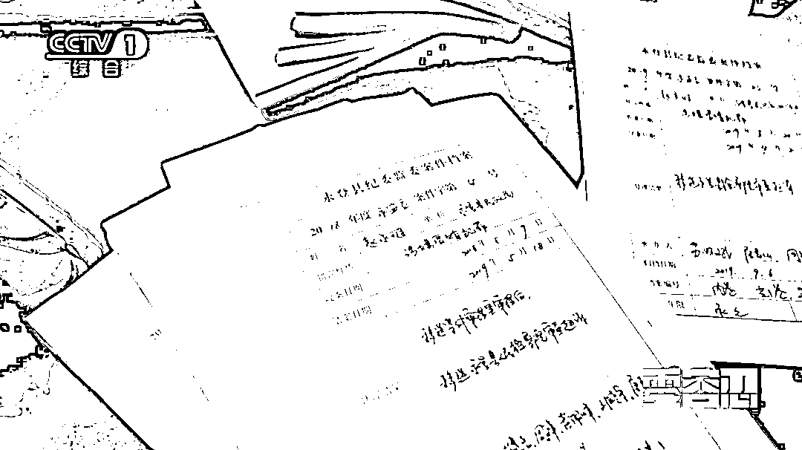

# 骨癌女孩的救命钱，低保办主任贪了一多半

> 原文：[`mp.weixin.qq.com/s?__biz=MzIyMDYwMTk0Mw==&mid=2247527918&idx=2&sn=008676de401e536096e059c7bff54e53&chksm=97cba6d6a0bc2fc0df8000135f4f0086cd59e37b997862cff97ea44d69252280f3ee0abc7514&scene=27#wechat_redirect`](http://mp.weixin.qq.com/s?__biz=MzIyMDYwMTk0Mw==&mid=2247527918&idx=2&sn=008676de401e536096e059c7bff54e53&chksm=97cba6d6a0bc2fc0df8000135f4f0086cd59e37b997862cff97ea44d69252280f3ee0abc7514&scene=27#wechat_redirect)

## **16 日晚，由中央纪委国家监委宣传部与中央广播电视总台央视联合摄制的五集电视专题片《零容忍》第二集《打虎拍蝇》在总台央视综合频道播出。片中曝光了甘肃省永登县低保办原主任赵永琏严重侵害困难群众利益的典型案件。**

[`mp.weixin.qq.com/mp/readtemplate?t=pages/video_player_tmpl&action=mpvideo&auto=0&vid=wxv_2226980203829002241`](https://mp.weixin.qq.com/mp/readtemplate?t=pages/video_player_tmpl&action=mpvideo&auto=0&vid=wxv_2226980203829002241)

在永登县纪委监委信访窗口，工作人员注意到，一段时间以来，陆续有多名群众来实名举报甘肃省永登县低保办主任赵永琏。

这些举报大部分都涉及到扶贫领域，如**大病救助、养殖资金、廉租房等方面的问题线索**，且最终都被查证属实。

**骨癌女孩 7 万 3 救助款******赵永琏贪了 4 万 5****

****汪子强是受害人之一，2016 年时女儿汪涛身患骨癌，先后住院 17 次，做了膝关节置换手术，积蓄花光了，还欠下了债，女儿继续化疗还需要花钱，汪子强那段时间心力交瘁。****

********

****有人告诉汪子强，他的情况可以申请大病救助，汪子强当即到民政局申请办理。这正是赵永琏的职权范围，她却骗汪子强说，办这事儿得找人，得花钱。****

********

*   ******甘晟名（甘肃省永登县纪委监委工作人员）：**她有审批权，（汪子强）找到她，**本来她可以通过正当合法的途径去给他办，但是她还是把手伸向了这一户困难的群体。******

****赵永琏对汪子强说，可以给他想办法报下来 7 万多元，但需要先给她 3 万 5 千元去打点关系。汪子强无奈之下，东拼西凑借够了钱交给赵永琏。救助款最终报下来了 7 万 3 千元，赵永琏又向汪子强索要了 1 万元。****

********

*   ******汪子强（永登县居民）：****7 万 3 里面她拿掉了 4 万 5，我最后剩了 2 万 8。******

********

*   ******甘晟名（甘肃省永登县纪委监委工作人员）：**取证是在他们家，女儿因为骨癌，常年卧床，家里面生活也很拮据。如果像这样的群体，（赵永琏）还继续伸黑手的话，我真的想不通。****

******骗走别人全部救命钱**************沉溺赌瘾无法自拔********

******魏玉朝和苏继平夫妇是又一户受害人，赵永琏欺骗他们的名目又花样翻新。苏继平 2018 年头部摔伤，做了开颅手术，医院一度下达了病危通知书。******

************

******村里帮助他们申报大病救助，报下来 7 万多元，这本是一笔雪中送炭的救命钱。不承想，申请是赵永琏经手审批的，她知道这家人刚领到了救助金，就主动打去电话，声称还能帮他们申请廉租房。******

************

******申请廉租房其实并不在赵永琏职权范围内，**她利用困难家庭需要钱的心理，谎称能找熟人帮他们办，诱使他们把刚拿到的救助金拿出来。********

******在赵永琏不断欺骗诱导下，夫妻俩不仅把 7 万多大病救助款全拿给了她，还找兄弟借了 7 万，总共给了她 14 万多元。过了一段时间“廉租房”毫无消息，魏玉朝才意识到可能受了骗。******

************

******赵永琏骗取的这些钱，正是全扔在了麻将桌上。自从染上了赌博恶习，她输多赢少，越是想翻本，就输得越多，沉溺在赌瘾中无法自拔。******

********赵永琏被判处有期徒刑******************三年六个月********** 

********不少困难户都曾接到赵永琏的电话，说需要立即转钱，好请关键人物吃饭，他们万万想不到，电话那端的赵永琏其实是坐在牌桌上。********

****************

********经查实，赵永琏从 13 名受害人手里，共计非法索取 55 万多元，**2019 年 11 月，赵永琏被判处有期徒刑三年六个月，并处罚金 10 万元。**********

**************** 

*   **********苏怀斌（甘肃省永登县纪委常委 监委委员）：**她有时候钱输了，没有钱了，就讲你马上打过来 1 万。有时候在晚上，人家农户找到钱给她，有些是从银行卡上转到她的卡上，有的是从微信上转到她的微信上。********

**************** 

*   **********赵永琏（甘肃省永登县民政局低保办原主任）**：那些人看着可怜得很，再一次说声对不起，我现在在监狱就好好改造。********

****************

*   **********甘晟名（甘肃省永登县纪委监委工作人员）：**县纪委监委也是以此案为契机，在全县范围内对农村低保、大病救助，还有廉租房等领域的资金运转情况，**还有人员的履职情况，进行了系统排查和梳理，坚决杜绝此类问题的发生。**********

********来源：央视网********

****************

********← 向右滑动与灰产圈互动交流 →********

****************