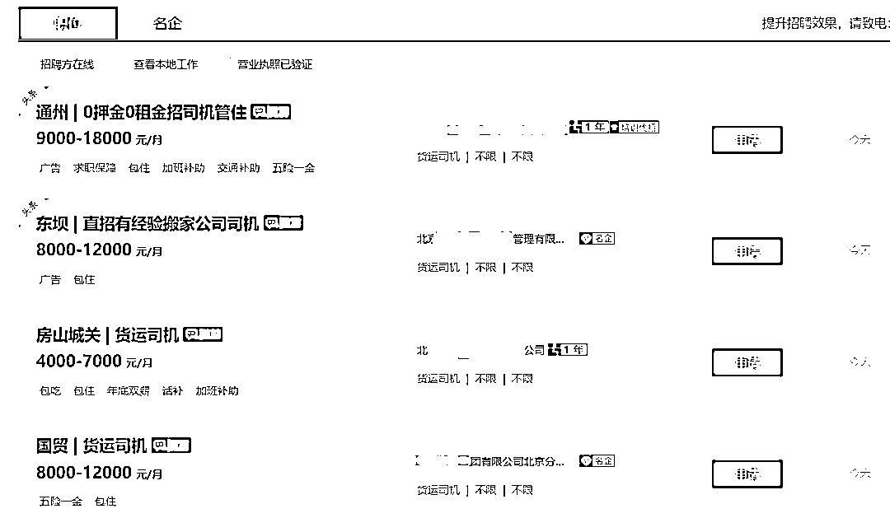
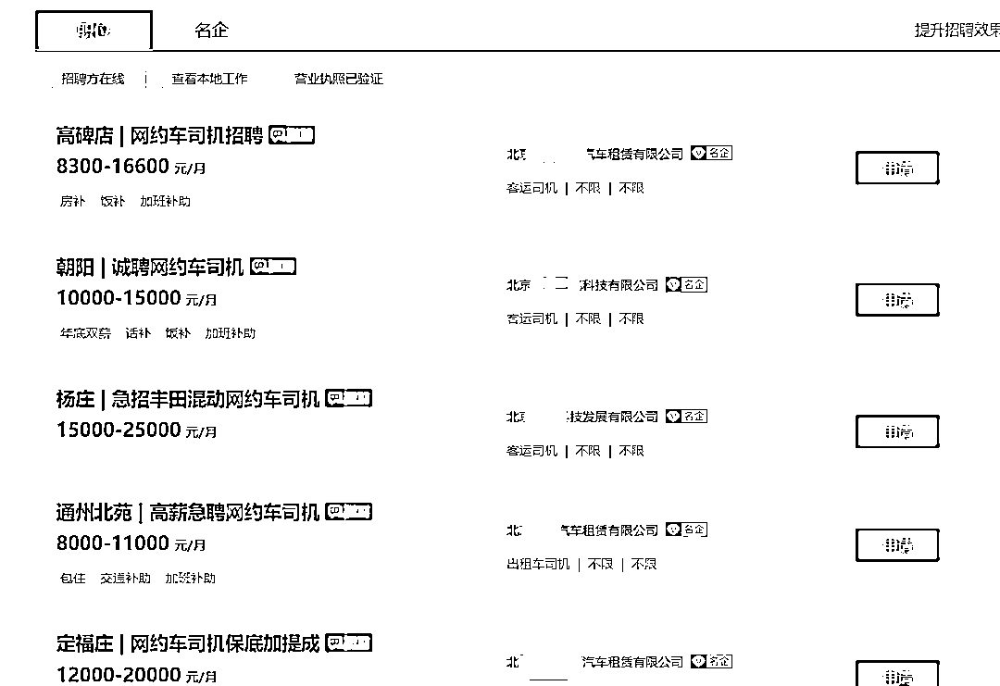

# 58 同坑，今儿你跳了吗？

> 原文：[`mp.weixin.qq.com/s?__biz=MzIyMDYwMTk0Mw==&mid=2247527918&idx=4&sn=b980dd109e782de2e20828ccb12ce68f&chksm=97cba6d6a0bc2fc01b89753f0060291220b375e3d8e65a5295b4502bc82156b10c17560a1474&scene=27#wechat_redirect`](http://mp.weixin.qq.com/s?__biz=MzIyMDYwMTk0Mw==&mid=2247527918&idx=4&sn=b980dd109e782de2e20828ccb12ce68f&chksm=97cba6d6a0bc2fc01b89753f0060291220b375e3d8e65a5295b4502bc82156b10c17560a1474&scene=27#wechat_redirect)

**你认为人性最大的恶是什么？**

时隔百度搜索魏则西事件过去 7 年，58 同城招聘正以作死的速度追赶百度搜索？！

1

从河北来北京打工的司机王师傅，2021 年 8 月在 58 同城求职货运司机。

身上几乎没有什么积蓄的王师傅，浏览了数个货运司机招募帖子，发现大多货运公司可提供车辆，只要身体健康有驾照就可以应聘。 

王师傅最终在 58 同城选择了一家丰台的货运公司，就线下了解，该公司提供全新厢式货车奥铃，只要 1 万元押金，并保证每日至少提供 3 趟货物运输，每趟不低于 350 元，并每月向公司还款 4213 元，3 年后车辆所有权归王师傅所有。

王师傅算了笔账，去了加油成本，每日如果能保障千八百元的收入，自己辛苦几年不但可以还清车贷，收入还比较可观，于是向亲朋好友东拼西凑借了 1 万元，与该公司签订了用车就业合同。

刚开始了第一周，第二周，像货运公司说的那样，每天是提供 2~3 趟的货运任务，自第三周开始，变成了每周 2~3 趟的货运任务。

噩梦自第二个月开始开始，货运公司几乎没有任何派单，王师傅也身感无力偿还车贷。于是向货运公司理论，要求解除合同。 

公司声称，解除合同可以，需要补缴车辆折旧费用及违约费用，共计 5 万元。 

老王一听傻了，本来想着北京来赚点钱补贴本不富裕的家庭，结果钱没赚几个，硬生生被坑去了 5 万块钱。到现在房租交不起，还要跟家里四处借钱凑齐 5 万块。

同样，在王师傅的货运司机群里，被坑的司机不占少数，大家无处伸冤，只得认栽叫苦。

**事件剖析：**

**这是一起变相卖车的欺诈行为，神父了解到，王师傅这款货车原价 13 万元左右，在王师傅与货运公司签订了合同之后，公司仅给了他 10 万元的购车发票，算上押金及 3 年的车贷，车款超过 16 万元。**

**其中的猫腻，货运公司赚的盆满钵满，却坑苦了不知所以的苦逼司机。**

**58 同城作为信息发布平台，任由这种公司搞事情，交了保护费就可以置顶，对于发布信息的公司情况审核不力，是否有连带责任？！**

2

河南专科刚刚毕业小杨，也报有大城市打拼的梦想，心想自己没什么特长，车还算开的不错，之前借朋友车跑了几天网约车，去除了油费，每天能有 300~500 元收入，努力勤奋一些，月入过万也不是什么难事儿。2021 年 7 月在 58 同城浏览网约车招募信息。 

公司提供车辆，押金 7000~10000 元不等，根据车型每月缴纳 3000~6000 元车份儿钱，小杨最终选择了昌平一家公司，缴纳了 9000 元押金（在车辆无重大事故及违章情况下，押金可随时退），每月 5500 份子钱，租了一辆纯电动车。

2021 年 9 月，小杨家里亲人突发重病，需要回老家照顾，于是跟用车公司协商，归还车辆，退押金。 

起初公司以车辆需要检查，需要等 1 个月后确保车辆无违章后退还小杨车辆押金。着急回家照顾亲人的小杨也没多想，就急奔老家处理事情。 

2021 年 10 月，小杨致电租车公司协商，答曰需要再等等... 

2021 年 11 月，小杨多次致电无果，9000 元来说对于一个农村家庭来说并不是小数，气愤之下小杨只身赶往北京昌平这家汽车租赁公司理论，该公司负责人摆出一付流氓相，表示想退押金，没门！爱哪告哪告去！ 

同样，在小杨的网约车司机群里，被坑的司机不占少数。外地来打工的孩子，拧不过当地汽车租赁的地头蛇玩横的，你告我，大不了我关门，换个公司名继续坑。 

**事件剖析：**

**大多数汽车租赁公司以克扣押金方式盈利，租车的时候说的天花乱坠，退车的时候百般刁难。** 

**而在 58 同城，甚至 boss 直聘，不仅北京，各个城市的汽车租赁公司几乎无一例外的，打着招聘网约车司机的幌子，如果你租了车，退车时至少把租赁押金坑去 70%~100%才肯放你走。** 

年轻的魏则西去世了，他在死前将自己被百度公司、被部队医院和医生欺骗，视为人性中最大的恶。媒体质疑百度竞价广告的操作不合规、披露部队医院被莆田系承包的种种弊端，也是然并卵。

但是，你可以帮助自己和家人朋友自保。

首先，凡事不要问百度，凡事不要问百度，凡事不要问百度。

原因不再解释。

**如果说一个人的死，才能唤起百度搜索竞价的良知**，那么像老王，小杨这样勤恳老实的苦逼打工人被无情的坑蒙，被流氓公司无底线的欺诈，泯灭他们大城市打拼的梦想。 

**58 同城，你何时会有良知？**

来源：漂移神父

← 向右滑动与灰产圈互动交流 →

