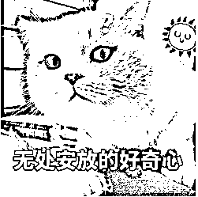
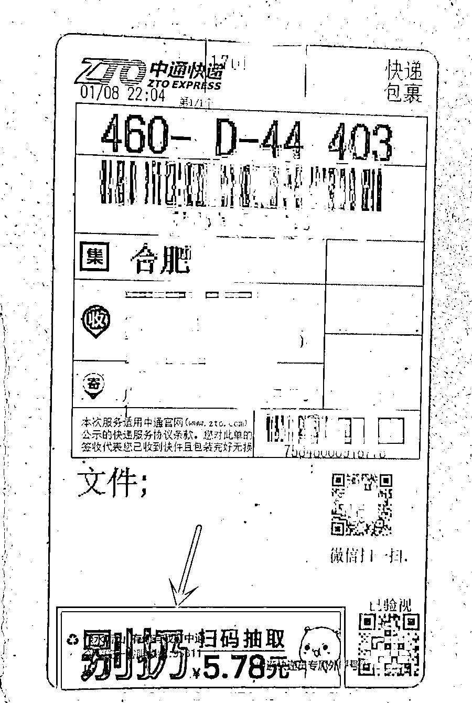
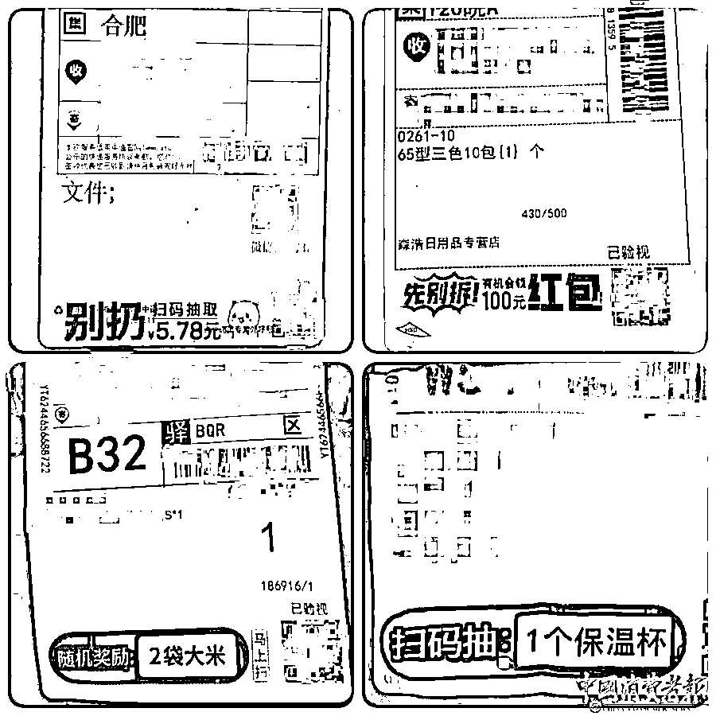
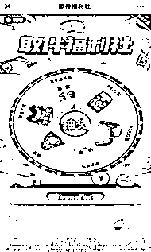

# 警惕！别扫码！

> 原文：[`mp.weixin.qq.com/s?__biz=MzIyMDYwMTk0Mw==&mid=2247527918&idx=5&sn=9bc2fc51f08c5872712d0c4141d9b43f&chksm=97cba6d6a0bc2fc08bee4e1d6937b486c316240356cf97af7f2a2c2a9bd65f118977672bcf1c&scene=27#wechat_redirect`](http://mp.weixin.qq.com/s?__biz=MzIyMDYwMTk0Mw==&mid=2247527918&idx=5&sn=9bc2fc51f08c5872712d0c4141d9b43f&chksm=97cba6d6a0bc2fc08bee4e1d6937b486c316240356cf97af7f2a2c2a9bd65f118977672bcf1c&scene=27#wechat_redirect)

喜欢网购的朋友有没有发现

最近不少

快递单上出现了

许多二维码小广告

类似↓

别扔！扫码抽取 5.87 元

1 元抽 iPhone、免费抽 1 箱方便面

免费抽 3 双保暖袜

……

扫码后真能领到免费“福利”吗

近日

安徽省消保委发布

快递面单抽奖广告调查报告

指出这种“福利”

**并不能确保真实性和安全性**

**可能还会获取个人信息**

领福利小广告数量惊人

忽悠消费者扫码 

有的涉嫌欺诈

近期，安徽省消保委对 1111 份快递单样本进行测试、统计和分析发现，674 个样本中含有二维码小广告，**占比高达 60.67%。**

其中，出现**最多的广告是某平台的****“天天领现金打款秒到账”****活动**，占比 39.32%。

**测试后发现的真相****👇**

此类领现金活动需要**不断邀请好友助力**，获取抽奖机会，然后通过抽取金币、幸运值等不断地积累、兑换，环环相扣，以达到凑足提现金额的目的。

调查发现，有人邀请近 20 位好友助力后，依然没能提现，其他参与人员也没人最终提现，但都下载了 APP，免费为活动进行了推广。

一个名为“取件福利社”的大转盘抽奖活动占比 22.11%。其宣传广告语有“抽华为手机”“待抽取 2 瓶洗手液”“别扔！扫码抽取 5.87 元”“抽取保温杯×1”“免费抽 3 双保暖袜”“待抽取 1 个电水壶”等。

**测试后发现的真相****👇**

调查人员在测试过程**从未抽中过以上广告语中的任何一个奖项**，而且所谓的奖项都带有明确的推广目的，并没有什么奖项真正是广告宣传文字中提到的“免费”，很多广告抽奖前都要**先填写详细的个人信息**，甚至还有推广内容**因涉嫌欺诈被“暂停服务”**。比如：

**小广告☞**“电信 960G 超大流量卡”

**真相****☞**要获取消费者详细的个人信息，且须办理新的电信卡，月租 19 元。

**小广告☞**“茅台镇最美酱香酒 10 瓶+满天星手表+中国茗茶礼盒”

**真相****☞**需要填写姓名、手机、住址等个人信息，且货到付款，费用 298 元。

**小广告☞**“鹧鸪优选电商小程序 200 元购物补贴”

**真相☞** 实际上“购物补贴”一直都有，是否中奖都一样，目前该小程序已经因涉嫌欺诈被“暂停服务”。

《消费者权益保护法》规定，经营者提供的信息应当真实、全面，不得作虚假或者引人误解的宣传。快递面单上发布虚假二维码广告，**诱导消费者扫码，侵犯消费者的知情权和选择权，其行为已涉嫌欺诈**；诱导消费者填写个人信息的，侵犯了消费者个人信息依法受保护的权利，主管部门可对其处罚。

快递公司客服回应

不是快递公司发布的

无法为消费者解决

调查发现，**申通、圆通、中通、百世、韵达**的快递面单中都有很多“取件福利社”大转盘抽奖活动广告。当调查人员以“抽中奖项、页面收集完个人信息后便无任何反馈”为由，**向快递公司寻求解决时，都没有得到有效解决办法**。

各快递公司几乎都认为广告只要不是自己发布的，就不需要为此负责。在咨询中，**部分快递公司客服表示，因为这些广告不是快递公司的广告，也不是快递公司发布的，所以即便消费者遇到了问题，快递公司方面也无法为其解决。**　

《广告法》规定，快递面单上发布的广告以虚假或者引人误解的内容欺骗、误导消费者的，监管部门可**对广告主、广告发布者、广告经营者**予以行政处罚，使消费者的合法权益受到损害的，由广告主依法承担民事责任，快递公司也要承担连带责任。

快递公司有义务对内容审核

消费者要谨慎扫码

针对本次调查发现的问题，安徽省消保委建议：快递单广告发布者应停止以“福利”为噱头忽悠消费者，快递公司有义务和责任对自己“阵地”上的内容进行审核，确保快递单上印制的内容不侵犯消费者合法权益，否则就要承担相应的法律责任。

来源：潇湘晨报

← 向右滑动与灰产圈互动交流 →

