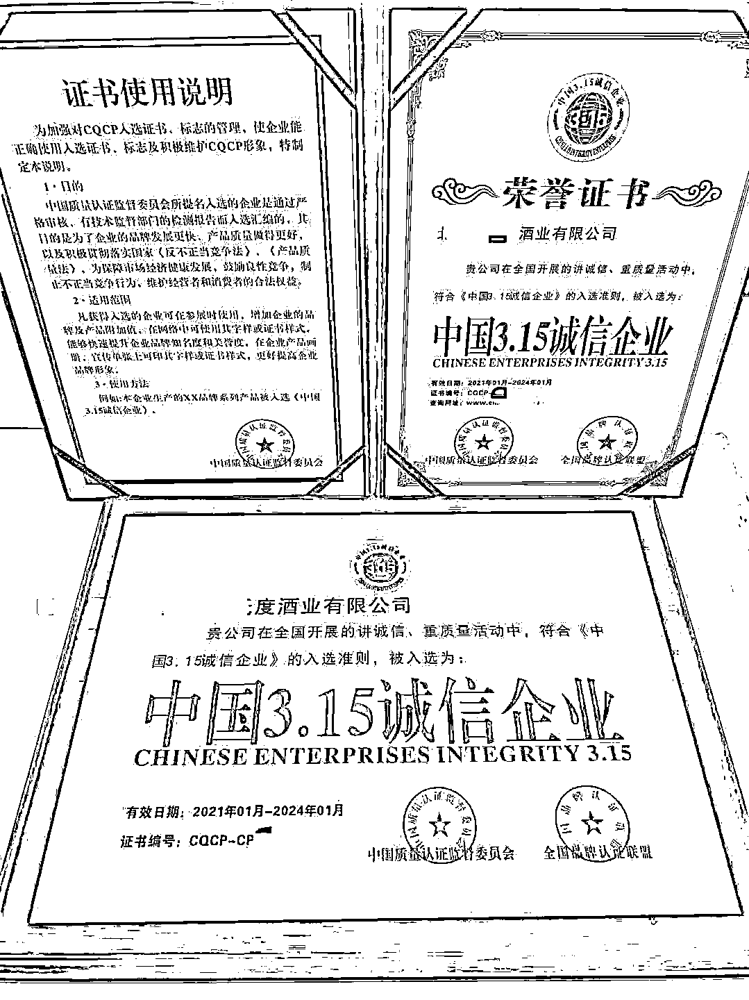
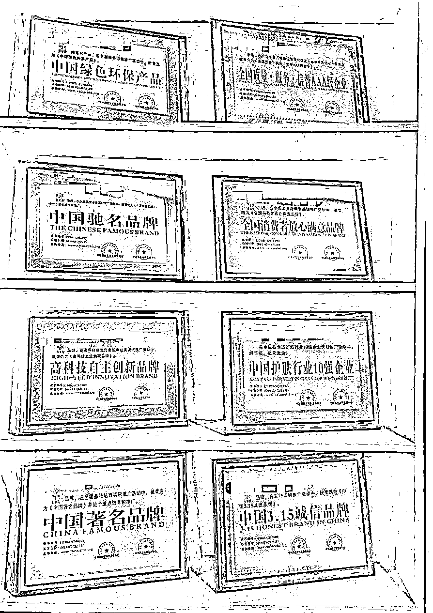
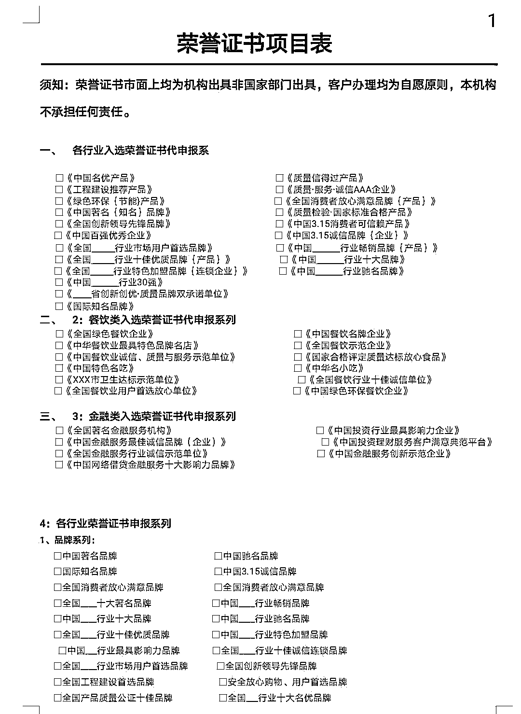
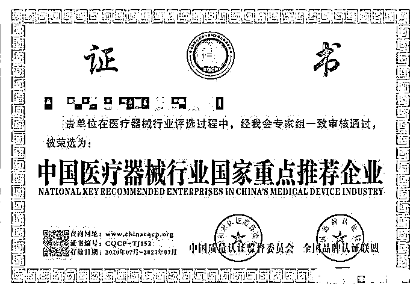

# 花 300 元就能办理“中国 3.15 诚信企业”？

> 原文：[`mp.weixin.qq.com/s?__biz=MzIyMDYwMTk0Mw==&mid=2247527918&idx=6&sn=9e5fc2b2c40b67177e1416aabea19e52&chksm=97cba6d6a0bc2fc026b7f9a7d811f0697a2882c43a3e34e4786a738a775df05b826ad7058504&scene=27#wechat_redirect`](http://mp.weixin.qq.com/s?__biz=MzIyMDYwMTk0Mw==&mid=2247527918&idx=6&sn=9e5fc2b2c40b67177e1416aabea19e52&chksm=97cba6d6a0bc2fc026b7f9a7d811f0697a2882c43a3e34e4786a738a775df05b826ad7058504&scene=27#wechat_redirect)

**前言：**在互联网项目骗局之中，很多刚成立的公司有各种奖牌与证书，这些东西是哪里来的的呢？请看真相：

“**中国 3.15 诚信企业”、“全国消费者放心满意品牌”、“政府采购优秀供应商**”……颁发上述荣誉的**中国质量认证监督委员会**，近日被民政部曝光涉嫌非法社会组织。该机构因何涉嫌非法？是谁在运作？记者调查发现，其背后隐藏着一条企业荣誉认证的灰色产业链。

有企业成立未满半月就被认证为“中国 3.15 诚信企业”

中国质量认证监督委员会宣称在**香港注册**，是经国家有关部门批准设立的专业认证机构，认证客户数量居全国首位，在国内外共设有**45 家分支机构**。

“中国质量认证监督委员会”和“全国品牌认证联盟”证书。来源：某办证代理

但记者据**香港特别行政区合法社团名单和中国社会组织政务服务平台**，均无法查询到其注册备案信息。

与一些非法社会组织不同，该委员会在公开资料中未见任何个人以负责人身份出现，不举办活动，没有办公地址与有效联系方式，其宣称的 45 家分支机构也未查询到实体。但与此同时，网络中却可以查询到大量该委员会认证的荣誉证书被企业用来宣传。

据网络资料不完全统计，至少 200 家以上企业拥有其荣誉证书。记者还发现有企业成立未满半月就被其认证为“中国 3.15 诚信企业”。

无主体出面的该委员会，如何开展活动？一位业内人士透露，只需建立一个所谓官方网站，供办理荣誉证书的企业在网络上可查询，“伪装成权威机构认证的样子”。目前，该机构受民政部曝光影响，网站已无法打开。

中消协：未授权任何单位使用“3·15”商标

是谁在帮企业办荣誉证书？多位企业负责人反馈，通过“代理”办理。

记者网络查询到多个办证代理联系方式，并以办证为由咨询，一证书一牌匾，不同代理报价在 300 至 4000 元不等。多位代理均以“网上可查”来强调其权威性，办理要求只需线上提供营业执照和企业 Logo。记者质疑为何如此简单时，有代理表示“靠关系什么都能出”。

值得注意的是，去年 7 月中消协曾声明，“除地方各级消协用于公益活动外，从未授权任何单位使用‘3·15’商标（包括 3·15 数字及地球人型组合图）。”

记者注意到，与消协“3·15”商标不同，这些证书使用的是“3.15”，这“一点”之差，既碰瓷了正品又误导了消费者。此外，在消协地球人型图 Logo 使用上也做了改动。

记者调查发现，办理该类荣誉证书的企业遍布各行各业，某医疗企业获得认证的“**中国医疗器械行业国家重点推荐企业**”，但据企查查显示该公司**关联司法案件 42 起，法人被限制高消费。**

某公司荣誉证书展示。来源：某办证代理

某代理：市面上荣誉证书都是假的

某办证代理商透露，落款为“中国质量认证监督委员会”的证书和牌匾，均由公司总部提供，他们对证书上组织的真伪并不知情。

记者注意到，某办证代理曾发布《中国 3.15 诚信品牌怎么办理》一文拉业务，其中提到企业办理荣誉证书的好处：“吸引经销商代理商加盟”、“吸引消费者取得信赖”等。

一位江苏办证代理在记者质疑证书颁发机构真伪时坦言，他们不是发证单位，只是合作关系，客户办理均为自愿原则。

某代理提供荣誉证书项目表部分截图。

他认为，“市面上这种公司、店面挂的类似荣誉，都是这种性质。好点的给个网站可以查，没网站可查的更假，打印店几十块钱就做了。”

这位代理提供办理荣誉证书的组织为“**中国质量信用管理中心**”和“**中国企业信用评估中心**”。关于上述两机构的网站，他表示，不是什么权威网站，就是机构自己做的网站。

他还透露，90%的客户做荣誉证书时就知道不正规，“几百块钱做的东西，能有多正规？”

“打一枪换一个网站”的非法社会组织

此前，民政部副部长詹成付在国新办新闻发布会上回答封面新闻提问时介绍，非法社会组织地点不固定，甚至打一枪换一个地方。记者调查发现，中国质量认证监督委员会背后主体的运作方式正是如此。

据调查，早在 2015 年，该委员会就已频繁出现。其认证的荣誉证书中，通常落款两个组织。据公开资料不完全统计，该委员会 6 年至少 4 换“搭档”。分别为：**中国品牌管理评价中心、中国中小企业发展促进委员会、中国企业信用评估中心、全国品牌认证联盟**。

2015 年，该委员会最早出现时搭档“中国品牌管理评价中心”，同年更换为“中国中小企业发展促进委员会”。2016 年 6 月，民政部公布第七批“离岸社团”“山寨社团”名单中出现“中国中小企业发展促进会”后，该委员会将搭档改为“中国企业信用评估中心”，2018 年，再次与新搭档“全国品牌认证联盟”出现。

6 年里，为躲避监管和取缔，中国质量认证监督委员会还将域名中各别字母改动后反复更换，分别为：**chinacqpc.org、chinacqcs.org、chinacqcp.org**。

值得注意的是，2016 年“**中国质量认证监督委员会**”的搭档**“中国企业信用评估中心**”，还开始搭档“中国质量认证监督管理中心”出现在各种荣誉证书上至今。

据中国质量认证监督管理中心官网介绍，其协办单位除中国企业信用评估中心，还有中国企业发展促进委员会。但 2016 年 3 月，民政部就曝光过一家“中国企业发展促进会”。

经查，上述组织均未在民政部登记注册，网站也未在工信部门备案，网站服务器也在境外。

这些组织有何关联？为何与中国质量认证监督委员会一起开展认证？

背后主体浮出水面

记者在专家协助下，通过上述组织网站域名注册信息、IP 地址、历史网页快照、历史备案等调查发现，中国质量认证监督委员与中国质量认证监督管理中心曾共用“chinacqcs.org”域名，该中心后又将域名改为“chinacqcs.net”，沿用至今。

经查，上述组织背后主体疑为广州鸿标信息科技有限公司、高德资信评估（广东）有限公司、广州抖戈网络科技有限公司，而这三家公司相关黄姓人员往来密切。

上述公司一名黄经理，此前在记者咨询业务时自称中国质量认证监督管理中心与中国企业信用评估中心华南办事处人员，但在记者亮明身份后，他又进行了否认，表示只是一家咨询公司。

“有客户发了这种证书图片给我们，我们才去找这种机构去做，赚点中介费。”黄经理说。但上述机构的网站注册域名联系人却显示为黄经理所在公司。

此前记者咨询时，黄经理还介绍，“我们就是专门做这种荣誉证书的”，并强调很多公司都在办，一次办理三五个、十个都有，这些证书还可以申请在中国招标网上公示。但中国招标网一名工作人员告诉记者，招标过程中若查出企业提交非法组织认证的证书将被拉入黑名单。

企查查显示，广州鸿标信息科技有限公司 2013 年成立，今年 1 月因“决议解散”提交注销备案。去年成立的广州抖戈网络科技有限公司，今年 2 月因“住所或经营场所无法联系”被广州市南沙区市场监管局列入经营异常名录。

这三家公司官网称其可办理各类荣誉证书、资质证书、体系认证、建筑资质证书等，其中成立最早的广州鸿标信息科技有限公司此前网站域名，打开却为广州抖戈网络科技有限公司网站，这三家公司开展业务的主要联系人均有“黄经理”。

记者注意到，广州鸿标信息科技有限公司去年曾发布设计员招聘信息，要求懂 PS 软件。业内人士透露，“办理荣誉认证没有审核流程，只需将证书 PS 好上传到自己做的网站让企业可以查就行。”

上述黄经理在接受采访后再次来电，“谢谢你的提醒，我以后不做这类业务。”截至发稿，上述组织网站仍能打开。

某医疗器械行业公司获得“中国质量认证监督委员会”认证“中国医疗器械行业国家重点推荐企业”。网络资料

非法社会组织逃避监管的文字游戏

网络流传的“中国 3.15 诚信企业”证书中，还有一些其他类似组织，且名称难以分辨。

比如“中国产品质量认证监督管理中心”，比“中国质量认证监督管理中心”多了“产品”二字。该管理中心网站域名注册商为江苏邦宁科技有限公司。今年 2 月，该公司因违法违规网站数量高达 72 家在省内排名第一，被江苏通信管理局通报批评。

上述公司还有一个域名“chinaqscc.org”，2019 年还是“国家质量监督管理中心”网站，2020 年却变成了“中国名企质量监督中心”网站。

还有“中国企业质量认证监督中心”（chinaqcsc.org），其网站介绍拥有两个协办单位：“**中国企业信用评价中心”、“全国企业发展促进委员会”**。但相关荣誉证书显示，该中心还与“**中国企业信用评估认证中心**”一同出现。值得注意的是，其官网所示办公地址，记者探访后发现实为**国务院发展研究中心**，这种假借国家权威机构办公地址也成为行骗手法之一。

据查，2017 年，国家质检总局发文要求协查“**中国产品质量检验检疫中心”和“中国品牌发展培育协会**”后，随即又出现了“中国产品质量检验监督中心”和“中国品牌认证发展工作委员会”，纵观其域名：chinacqcc.org；chinacqic.org；chinacbdc.org，也大同小异。今年 4 月，北京民政部门取缔“中国质量认证监督检验中心”，名称与上述组织也难以区分。

民政部：已排查非法社会组织线索 216 家

“非法社会组织，是指没有经过登记，擅自以社会组织名义开展活动的组织。许多冠以全国性名称，比如‘中国 XX’‘中华 XX’‘全国 XX’。骗钱敛财、扰乱经济社会秩序是共同特征，民政部对非法社会组织是零容忍态度。”民政部副部长詹成付此前在回答封面新闻提问时说。

今年 3 月，民政部、工信部、公安部、市场监管总局等 22 部门发文，要求全方位铲除非法社会组织滋生土壤，净化社会组织生态空间。

5 月 8 日，民政部社会组织管理局副局长黄茹在发布会上透露，目前已排查非法社会组织线索共计 216 家。她介绍，民政部提供两个查询平台，中国社会组织政务服务平台和中国社会组织动态政务微信。“一旦输入名称，系统呈现出来，就是真的，**如果没有显示结果，就涉嫌非法社会组织**。”

来源：封面新闻，利箭在行动

← 向右滑动与灰产圈互动交流 →

