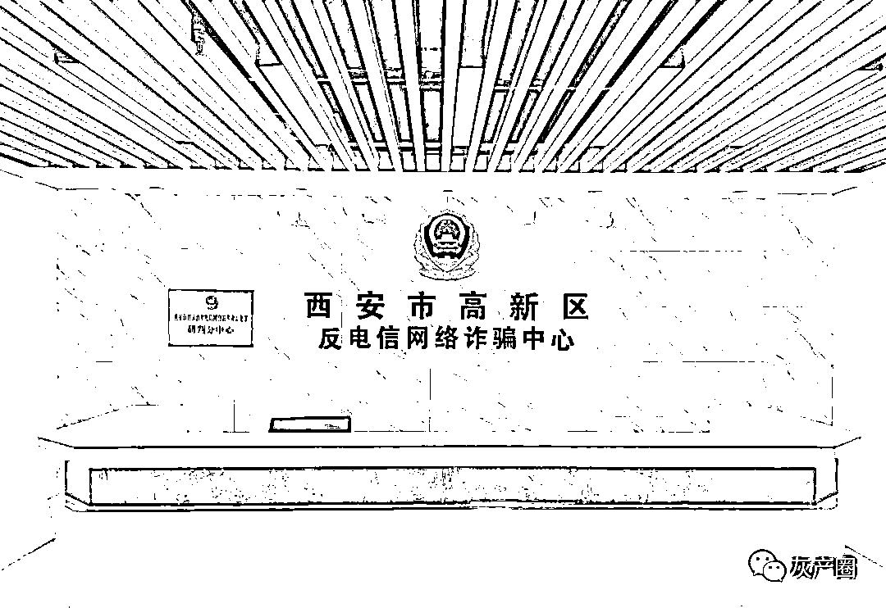
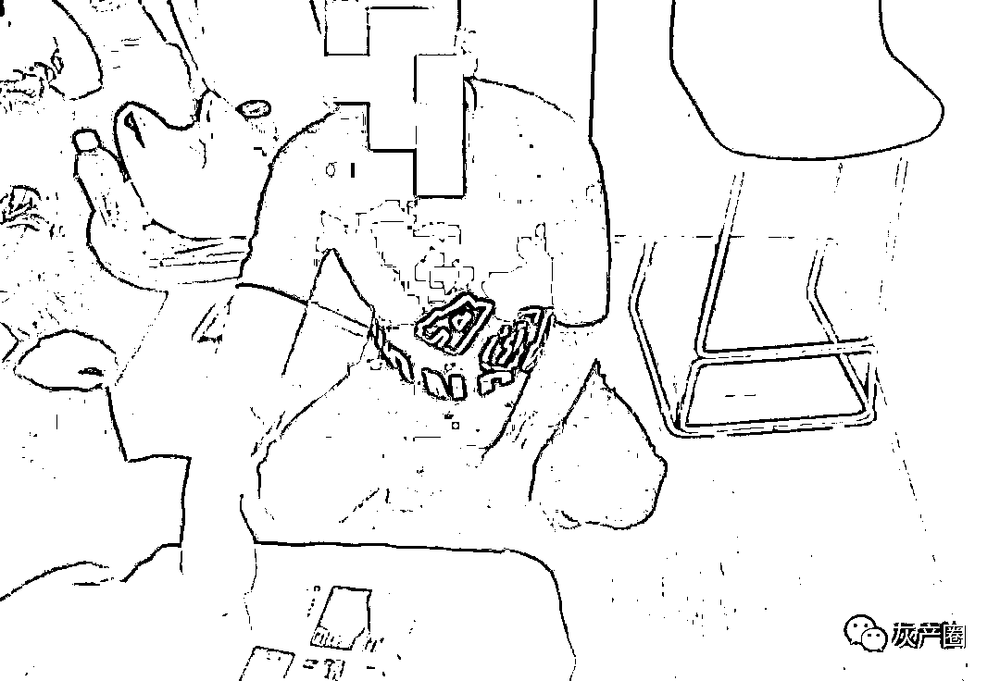
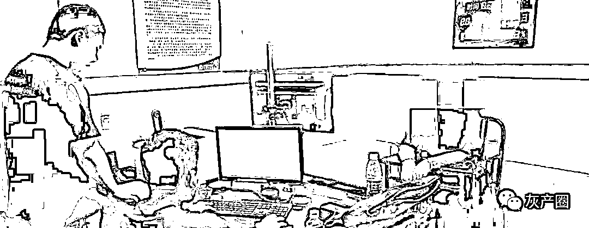

# “情迷”虚拟币

> 原文：[`mp.weixin.qq.com/s?__biz=MzIyMDYwMTk0Mw==&mid=2247527918&idx=7&sn=a380e01910f476ee3208e0c4276893b6&chksm=97cba6d6a0bc2fc0976e805e77b72ccbd6c355a104108740a231aab2739cf29c96a779f22a52&scene=27#wechat_redirect`](http://mp.weixin.qq.com/s?__biz=MzIyMDYwMTk0Mw==&mid=2247527918&idx=7&sn=a380e01910f476ee3208e0c4276893b6&chksm=97cba6d6a0bc2fc0976e805e77b72ccbd6c355a104108740a231aab2739cf29c96a779f22a52&scene=27#wechat_redirect)

黎夏早就想离婚，最近越发觉得忍不住了。

黎夏结婚时就有点不愿意，对方并不是自己心目中的另一半，只是当初碰不到合适的，就这么不温不火的谈着，时间一长就有点骑虎难下，心里并不愿意，可又不舍得这些年的投入，加上一家人都认为对方相貌端正、谦和有礼、开着大货车收入又高，最重要的还舍得给黎家人花钱，除了个子低点没啥不好。就这样黎夏就在家里的轮番“轰炸”中败下阵来，嫁给了自己的丈夫。

别别扭扭的结了婚，时间一长黎夏才明白，自己当年不愿意的潜意识原因——丈夫这个人太假！几年下来，原来表现出的优点，都被时间打磨掉了伪装，忠厚实诚的外表下不过是一个斤斤计较、谎话连篇的小人，没有多大本事却整天吹着天大的牛，见不得别人好，总爱搬弄是非，被人揭穿了却梗着脖子死不承认;

原来对黎家的舍得，也随着时间越来越缩水，再加上年纪一大，不高的个子却顶着一个硕大的肚子，每每看着横在沙发的那一摊肉，黎夏就觉得恶心，怎么能跟这个货就过了这么多年？娘家人劝她能忍则忍，怎么不都是一辈子？可时间越长黎夏就越忍不了，“眼看着就 40 了，再忍下去自己的青春还有几年？”

丈夫的运输生意一直做的很好，可不好的消息也一直能听到，酗酒、赌博，还和几个女人不清不楚，不管告诉她的人出于什么目的，她都受不了那些复杂的眼神，怜悯、兴奋、猎奇、愤怒……不管是什么，她都不想再承受了，凭什么自己要忍？要这样窝囊的度过自己的下半生？

既然有了想法，就得做好准备，丈夫的“证据”得收集，自己和孩子离婚后需要资金度日，自己的感情更得找个好地方安放。收集“证据”很简单，丈夫的丑事除了她之外并不避讳外人，资金得慢慢的转移，大笔的支出肯定会被发现，只有感情归宿最麻烦，临时也抓不到一个合适的，黎夏就给自己在婚恋网站上注册了一个账号。

黎夏在婚恋网站上还是挺抢手的，不光收入稳定，个子还高，人又长得漂亮，稍微一打扮根本显不出快 40 岁的年纪，怎么看都是 30 岁刚出头的小媳妇，唯一称得上缺点的就是离了一回婚还带着孩子。刚上线不久，黎夏就收到了不少的好友申请，年龄从 60 到 25，可以说涵盖面极广。

东西多了好挑，人多了好选，2020 年初黎夏就从一群人中选中了一个，开始试着交往，这个人网名叫“知心”。年龄合适、个子合适、相貌合适、经历合适……反正就是怎么看都顺眼，几句话聊下来，黎夏又给“知心”贴上了儒雅、幽默的标签。

手机增加了交流的频率，也拉近了人与人之间的距离，“知心”好像随时都在身边，每天的嘘寒问暖、谈笑低语，每一句话黎夏都觉得是在身边响起，仿佛他就在身后搂着她，在耳边发出呢喃，世上怎么能有这么好的男人！？

黎夏沉醉在这种感觉里。几十岁的人了，字典里早就没了一见钟情四个字，不过黎夏那颗早已不年轻的心脏还是像被小鹿撞了几下，不争气地跳动了，砰砰有声，刚刚几天，每天和“知心”的交流就成了黎夏每天最重要的事。

风花雪月说的多了难免词穷，交流最多的还是各自的生活，“知心”知道了黎夏的现状，关心她的生活，关心她的孩子，关心她的工作，更鼓励她勇敢走出旧有的生活阴霾，在离婚的问题上更是出了不少的主意，“你把钱这样转移都有痕迹的！”“知心”温柔的对黎夏说，“转给别人容易被发现，投资股票、基金之类，也容易离婚的时候分割财产，我这有个好的项目，你不妨试试……”

“知心”给黎夏介绍的是一款名叫“汇风合资”的手机 APP，主要的业务就是炒“虚拟币”，按照“知心”的说法，虚拟币除了本人外其他人根本没法动用，不仅法院没法确定它的价值，而且还有巨大的升值空间，“知心”给黎夏看了他近期的收益，只见一路斜着向右上方的红线，看的黎夏目瞪口呆;

要是真的能有这么好的前景，不仅离婚后和孩子的生活不用再愁，发家致富都不成问题，更可以和“知心”双宿双飞，想想以后幸福的生活，黎夏的脸红了半天。

可这种投资毕竟没有见过，虚拟币的安全性，黎夏还是把握不住，“知心”就带着她在网上“实习”，看“知心”操作，短短的几天，本金就差点翻了番，黎夏动心了。

虽说有“知心”的指导下，黎夏在“汇风合资”APP 上注册了账号，可投钱的时候，她还是没有盲目下注，只是试探性的投了两万元。时间不长，两万元就变成了 25000，在“知心”的“帮助”下，她还全额取了出来。

不过就是这样，黎夏也没有贸然大量投入，而是又试探了几次，不到一个月，收益的纯利润达到了 55000 元，而且都能足额的拿到手里，黎夏终于下定决心，加大投资量。

手里的钱、家里的钱、从娘家借来的钱、从朋友那儿借来的钱，一共 136 万，就被黎夏轰轰烈烈的投入到了账号中。看着账户里每天上涨的金额，回忆着“知心”在聊天时说的让她面红耳赤的话，梦想着今后自由舒心的生活，黎夏晚上睡觉都能笑醒，看着眼前晃动着的，丈夫那令她作呕的身躯，她产生了极大的报复快感，“你等着吧！等我的钱一挣到手，让你哭都没有眼泪！”

2020 年 2 月，黎夏突然发现 APP 登录不上了！连忙联系软件里安排的“投资经理”，可一直没有回复，就连整天通过手机耳鬓厮磨的“知心”也联系不上了！想着是不是都恰巧同时有事，黎夏还又等了半天，等拨打的电话被停机了，黎夏这才反应过来，连忙到西安市公安局高新分局刑侦大队报了警。

听了黎夏的叙述，高新分局反诈中心的民警金宏军就明确告诉她，“你被骗了！这是一起典型的利用感情做诱饵的电信诈骗案件……”

婚姻不幸，遇人不淑，有外遇还上当受骗，重要的是 136 万还不见了，更重要的是这事除了警察，还没法跟任何人解释，黎夏欲哭无泪。

民警金宏军等人，按照黎夏提供的线索，辗转找到了这个 APP 的开发和维护商家，嫌疑人戴某联合其他 8 人，在厦门成立了工作室，专门承接开发和维护电信诈骗用的 APP 的业务，按照电信诈骗团伙的要求，设计不同的风格，有股票投资的、有外卖刷单的、有婚恋交友的……短短两年时间，就成交了 30 多个 APP。

现戴某等人因帮助信息网络犯罪活动罪，被判入狱，黎夏的钱追回了一部分，可对于 136 万来说，只不过是九牛一毛。

警方提示：

1、网络交友需谨慎，特别是对那些没见过面的人，尤其在涉及金钱往来时一定要提高警惕。

2、遇到涉及钱财的问题，与身边亲朋好友多沟通、多询问，必要时可向警方求助，防止落入圈套。

3、尽早注册安装“国家反诈中心“APP，可自动阻断诈骗来电、短信、APP，避免上当受骗！

4、如果被骗，请及时报警！

来源:西安市局新闻中心杜鹏，巴蜀反诈

← 向右滑动与灰产圈互动交流 →

